# 💧备战金九银十-Java面试题


# JDK、JRE、JVM 三者之间的关系？
- **JDK（ java development kit）：java开发工具包，用来开发Java程序的，针对java开发者。**
- **JRE（java runtime environment）：java运行时环境，针对java用户。**
- **JVM（java virtual machine）：java虚拟机用来解释执行字节码文件(class文件)的。**

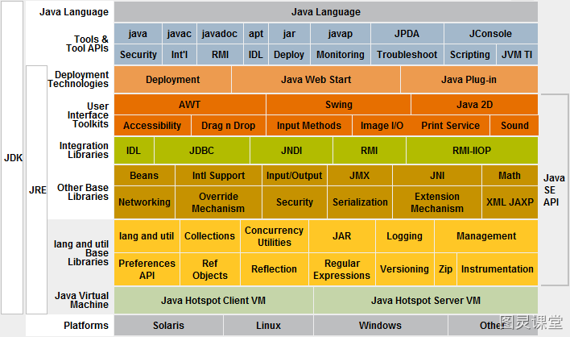

# Java 中创建对象的几种方式？
**使用 new 关键字：最常见的方式，这种方式我们还可以调用任意的构造器（无参的和有参的）。**
**使用Class.newInstance：通过 Class类的newInstance创建对象，必须有public的无参构造器才行。**
**使用Constructor.newInstance：通过 java.lang.relect.Constructor类中的newInstance方法调用有参数的和私有的构造函数。**
**使用Clone：通过对象的 clone() 方法创建一个对象的副本。需要对象实现Cloneable接口并重写 clone()方法。**
**使用反序列化：通过将对象转换为字节流并保存到文件或传输到网络，然后再从字节流中重新创建对象。需要对象实现Serializable**
```java
package polo;

import java.io.Serializable;

/**
 * 1.使用clone创建对象时，需实现Cloneable接口并重写clone方法
 *        访问权限由protected改写为public，并且返回值写为person
 *
 * 2.使用反序列化创建对象时，需实现Serializable接口
 */
public class User implements Cloneable, Serializable {
    private static final long serialVersionUID = -303793456610254190L;
    
    private int id;
    private String username;
    private String email;

    public User() {
    }

    public User(int id, String username, String email) {
        this.id = id;
        this.username = username;
        this.email = email;
    }
    
    // Getters and Setters
    public int getId() {
        return id;
    }

    public void setId(int id) {
        this.id = id;
    }

    public String getUsername() {
        return username;
    }

    public void setUsername(String username) {
        this.username = username;
    }

    public String getEmail() {
        return email;
    }

    public void setEmail(String email) {
        this.email = email;
    }
    
    // toString() method
    @Override
    public String toString() {
        return "User [id=" + id + ", username=" + username + ", email=" + email + "]";
    }

    /**
     * 访问权限由protected改写为public，并且返回值写为User
     * @return
     * @throws CloneNotSupportedException
     */
    @Override
    public User clone() throws CloneNotSupportedException {
        return (User)super.clone();
    }
}
```
```java
import org.junit.Test;
import org.springframework.util.SerializationUtils;
import polo.User;

import java.lang.reflect.Constructor;

/**
 * @author 百里
 */
public class BaiLiDemo {

    /**
     * 使用 new 关键字
     */
    @Test
    public void createDemo1() {
        User user = new User();
        User user1 = new User(1, "baili", "baili.com");
        System.out.println(user);
        System.out.println(user1);
    }

    /**
     * 使用Class.newInstance
     *
     * @throws Exception
     */
    @Test
    public void createDemo2() throws Exception {
        User user = User.class.newInstance();
        System.out.println(user);//User [id=0, username=null, email=null]
    }

    /**
     * 使用Constructor.newInstance
     *
     * @throws Exception
     */
    @Test
    public void createDemo3() throws Exception {
        // 包括public的和非public的，当然也包括private的
        Constructor<?>[] declaredClasses = User.class.getDeclaredConstructors();

        // 只返回public的~~~~~~(返回结果是上面的子集)
        Constructor<?>[] constructors = User.class.getConstructors();

        Constructor<?> noArgsConstructor = declaredClasses[0];
        Constructor<?> haveArgsConstructor = declaredClasses[1];

        noArgsConstructor.setAccessible(true); // 非public的构造必须设置true才能用于创建实例
        Object o = noArgsConstructor.newInstance();
        Object o1 = haveArgsConstructor.newInstance(1, "baili", "baili.com");

        System.out.println(o);
        System.out.println(o1);
    }

    /**
     * 使用Clone
     *
     * @throws CloneNotSupportedException
     */
     @Test
    public void createDemo4() throws CloneNotSupportedException {
        User user = new User(1, "baili", "baili.com");
        User clone = user.clone();

        System.out.println(user);
        System.out.println(clone);
        System.out.println(user == clone);
    }

    /**
     * 使用反序列化
     */
    @Test
    public void createDemo5() {
        User user = new User(1, "baili", "baili.com");
        byte[] bytes = SerializationUtils.serialize(user);

        // 字节数组：可以来自网络、可以来自文件（本处直接本地模拟）
        Object deserialize = SerializationUtils.deserialize(bytes);
        System.out.println(user);
        System.out.println(deserialize);
        System.out.println(user == deserialize);
    }
}
```

# final、finally、finalize 的区别

- **final 关键字：用于修饰类、方法、变量、入参和对象**
      - **应用于类时，表示该类是最终类，不能被其他类继承。**
      - **应用于方法时，表示该方法是最终方法，不能被子类重写。**
      - **应用于变量时，表示该变量是一个常量，只能赋值一次。**
      - **应用于入参时，表示该入参在方法内无法被修改。**
      - **应用于对象时，该对象的引用不能被修改，但对象本身的状态是可变的。**
- **finally 关键字：异常处理机制中的一部分，用于定义在 try-catch-finally 块中的 finally 块**
      - **不论是否发生异常，finally 块中的代码都会执行。**
      - **主要用于释放资源、关闭连接等必须确保执行的操作。**
- **finalize 方法：是一个对象的方法，定义在 Object 类中**
      - **在垃圾回收器将对象回收之前调用。**
      - **可以重写 finalize 方法，在其中编写对象在被回收前需要进行的清理操作，如释放资源等。**
      - **请注意，不推荐使用 finalize 方法进行内存资源的释放，因为它没有被及时执行的保证，也可能导致性能问题**
```java
import org.junit.Test;

/**
 * @author 百里
 */
public final class BaiLiTest {
    final int a = 0;  //final修饰变量

    /**
     * finally 与try-catch配合使用
     * final 修饰入参
     * @param num1
     * @param num2
     */
    public void divideNumbers(int num1, final int num2) {
        try {
            int result = num1 / num2;
            System.out.println("Result: " + result);
        } catch (ArithmeticException e) {
            System.out.println("Divide by zero exception!");
        } finally {
            System.out.println("Finally block executed.");
        }
    }

    /**
     * finally测试方法
     * 利用final修饰的变量
     */
    public void finallyTest() {
        //a = 1; //无法重新赋值，会提示异常。
        divideNumbers(10, a);
        System.out.println("-----可以进行修改数据------------------------");
        divideNumbers(10, a + 1);
    }

    @Override
    protected void finalize() throws Throwable {
        //TODO:释放资源，等其他操作
        super.finalize();
        System.out.println("调用finalize方法在执行垃圾回收");
    }

    /**
     * finalize用法
     */
    public void finalizedTest() {
        BaiLiTest baiLiTest = new BaiLiTest();
        baiLiTest = null;
        System.gc();
    }
}


//final修饰的类无法被子类继承
// public class BaiLiTest2 extends BaiLiTest {
    
// }
```

# == 和 equals 的区别？

- **==：如果作用于基本数据类型的变量，则直接比较其存储的值是否相等；**

**    如果作用于引用类型的变量，则比较的是所指向的对象的地址是否相等。**

- **equals：比较是否是同一个对象。equals()方法存在于Object类中，而Object类是所有类的直接或间接父类，在没有重写equals()方法的类中，和==一样比较引用类型变量所指向的对象地址是否相等。重写equals方法就看各个类重写后的逻辑，比如String类，虽然是引用类型，但是String类中重写了equals方法，方法内部比较的是字符串中的各个字符是否全部相等。**
```java
public void compareDemo1 () {
    int x = 10;
    int y = 10;
    //比较值相等，true
    System.out.println(x == y); // true

    String str1 = new String("baili");
    String str2 = new String("baili");
    //比较对象内存地址不相同，false
    System.out.println(str1 == str2); // false
    //比较字符相同，true
    System.out.println(str1.equals(str2)); // true

    String str3 = "abc";
    String str4 = "abc";
    //比较对象内存地址相同，true
    System.out.println(str3 == str4); // true
}
```

# 两个对象的 hashCode() 相同，则 equals() 也一定为 true 吗？

- **两个对象的hashCode()相同，equals()不一定为true；**
- **两个对象的equals为true，则两个对象的hashcode一定为true；**

**案例：**
```java
@Test
public void hashDemo() {
    String str1 = "Ma";
    String str2 = "NB";
    System.out.println("hash1: " + str1.hashCode());
    System.out.println("hash2: " + str2.hashCode());
    System.out.println(str1.equals(str2));
}
```
**原因：我们看下hashcode的计算方法：hashcode其实就是对一个对象中的每个元素进行一次运算生成的结果值，两个不同的对象是有可能出现同一个hash值的。**
```java
public int hashCode() {
    int h = hash;
    if (h == 0 && value.length > 0) {
        char val[] = value;
        for (int i = 0; i < value.length; i++) {
            h = 31 * h + val[i];
        }
        hash = h;
    }
    return h;
}
```
**虽然两个Ma和NB两个字符串不同，但是他们有相同的hashcode值2484。**
**所以在创建实体类的时候如果要使用hashCode方法或equals方法时需要在实体类中重写，以User类为例：**
```java
@Override
public boolean equals(Object o) {
    if (this == o) return true;
    if (o == null || getClass() != o.getClass()) return false;
    User user = (User) o;
    return id == user.id && Objects.equals(username, user.username) && Objects.equals(email, user.email);
}

@Override
public int hashCode() {
    return Objects.hash(id, username, email);
}
```

# & 和 && 、||和|的区别？
**&&：短路与；  &：逻辑与**
**&&和&都可以表示逻辑与，但他们是有区别的。**

- **共同点：他们两边的条件都成立的时候最终结果才是true；**
- **不同点：&&只要第一个条件不成立，后面的条件就不再判断，而&判断的是所有条件**
```java
@Test
public void withNonDemo() {
    int i = 5;
    int j = 8;
    //if ((i == j) && (80 / 0 == 0)) {  //不会报错
    if ((i == j) & (80 / 0 == 0)) {   //出现 java.lang.ArithmeticException: / by zero
        System.out.println("1");
    } else {
        System.out.println("没有报错");
    }
}
```
**使用&&：不会出现错误。因为第一个条件不满足时，直接返回false。如果第一个条件满足才会判断第二个条件。**
**使用&：出现错误。判断所有条件才会返回。**
**||：短路或    |：逻辑或**

- **共同点：只要两个判断条件其中有一个成立最终的结果就是true。**
- **不同点：||只要满足第一个条件，后面的条件就不再判断，而|要对所有的条件进行判断。**
```java
@Test
public void withNonDemo1() {
    int i = 5;
    int j = 5;
    if ((i == j) || (100 / 0 == 0)) {
    //if ((i == j) | (80 / 0 == 0)) {
        System.out.println("1");
    } else {
        System.out.println("没有报错");
    }
}
```
**使用||：不会出现错误，第一个条件满足直接返回。**
**使用|：出现错误，所有条件都会进行判断。**

# Java 中的参数传递时传值呢？还是传引用？
**在 Java 中，方法参数传递是按值传递的。这意味着在方法调用时，实际上是将参数的值进行拷贝并传递给方法内部使用，而不是直接传递参数本身的引用。**

- **对于基本数据类型（如整数、浮点数等）：传递的是其值的拷贝。任何对参数值的修改都不会影响原始变量。**
- **对于引用类型（如对象、数组等）：传递的是引用的值的拷贝，也就是说方法内部的参数和原始变量将引用同一个对象。虽然我们可以通过方法内部的参数修改对象的状态，但是对于引用本身的修改是不会影响原始变量的。**
```java
@Test
public void passValueDemo() {
    int baiLiValue = 5;
    modifyValue(baiLiValue);
    System.out.println("modifyValue after:" + baiLiValue);
    System.out.println("-----------------------------");
    User user = new User(1,"baili","baili.com");
    modifyUser(user);
    System.out.println("modifyUser after:" + user);
}

public void modifyValue(int number) {
    number = 10;
    System.out.println("modifyValue:" + number);
}

public void modifyUser(User user) {
//        user = new User();  //直接修改user本身，不影响原user属性
    user.setUsername("BAILI");//直接修改name属性，会影响原user属性
    System.out.println("modifyUser:" + user);
}
```
**上面的案例，其中baiLiValue是基本类型，所以传递的是值的拷贝，修改后不会影响原值。**
**而User对象传递是引用的值的拷贝，我们可以修改其内部属性。但直接修改User本身时，是不会影响原User的。**

# 什么是 Java 的序列化，如何实现 Java 的序列化？
**定义：序列化是指将一个对象转换为字节流，以便在网络上传输或保存到文件中。序列化过程还可以通过反序列化将字节流重新转换为对象。**
**实现方式：通过实现 java.io.Serializable 接口。该接口是一个标记接口，没有任何方法定义，只要一个类实现了Serializable接口，就表示该类的对象可以被序列化。Java序列化机制会根据对象的类结构自动进行序列化和反序列化操作。**
**示例代码：**
```java
@Test
public void serializableDemo() throws IOException, ClassNotFoundException {
    // 序列化
    User user = new User(1,"baili","baili.com");
    ObjectOutputStream output = new ObjectOutputStream(Files.newOutputStream(new File("D:\\BaiLi\\user.txt").toPath()));
    output.writeObject(user);
    output.close();
    System.out.println("序列化成功：" + user);

    // 反序列化
    ObjectInputStream input = new ObjectInputStream(Files.newInputStream(new File("D:\\BaiLi\\user.txt").toPath()));
    User user1 = (User) input.readObject();
    input.close();
    System.out.println("反序列化成功：" + user1);
}
```
**TIPS1：如果去掉User类实现的Serializable接口，会出现以下报错：**
```java
java.io.NotSerializableException: polo.User

	at java.io.ObjectOutputStream.writeObject0(ObjectOutputStream.java:1184)
	at java.io.ObjectOutputStream.writeObject(ObjectOutputStream.java:348)
	at BaiLiTest.serializableDemo(BaiLiTest.java:151)
	at sun.reflect.NativeMethodAccessorImpl.invoke0(Native Method)
	at sun.reflect.NativeMethodAccessorImpl.invoke(NativeMethodAccessorImpl.java:62)
	at sun.reflect.DelegatingMethodAccessorImpl.invoke(DelegatingMethodAccessorImpl.java:43)
	at java.lang.reflect.Method.invoke(Method.java:498)
```
**TIPS2：serialVersionUID有什么作用？简单来说就是序列化的一个“密码”，序列化与反序列化“密码”需保持一致，否则会抛出异常：**

- **原User类中的serialVersionUID属性**
```java
private static final long serialVersionUID = -303793456610254190L;
```

- **序列化生成user.txt文件，包含serialVersionUID**
```java
@Test
public void serializableDemo() throws IOException, ClassNotFoundException {
    // 序列化
    User user = new User(1,"baili","baili.com");
    ObjectOutputStream output = new ObjectOutputStream(Files.newOutputStream(new File("D:\\BaiLi\\user.txt").toPath()));
    output.writeObject(user);
    output.close();
    System.out.println("序列化成功：" + user);
}
```

- **注释或修改User类中的serialVersionUID属性值，然后再反序列化文件出现异常**
```java
@Test
public void serializableDemo() throws IOException, ClassNotFoundException {
	// 反序列化
    ObjectInputStream input = new ObjectInputStream(Files.newInputStream(new File("D:\\BaiLi\\user.txt").toPath()));
    User user1 = (User) input.readObject();
    input.close();
    System.out.println("反序列化成功：" + user1);
}
```
```java
java.io.InvalidClassException: polo.User; local class incompatible: stream classdesc serialVersionUID = -303793456610254190, local class serialVersionUID = 252382001504705380
	at java.io.ObjectStreamClass.initNonProxy(ObjectStreamClass.java:616)
	at java.io.ObjectInputStream.readNonProxyDesc(ObjectInputStream.java:1630)
	at java.io.ObjectInputStream.readClassDesc(ObjectInputStream.java:1521)
	at java.io.ObjectInputStream.readOrdinaryObject(ObjectInputStream.java:1781)
	at java.io.ObjectInputStream.readObject0(ObjectInputStream.java:1353)
	at java.io.ObjectInputStream.readObject(ObjectInputStream.java:373)
	at BaiLiTest.serializableDemo(BaiLiTest.java:157)
```
**使用场景：所有可在网络上传输的对象都必须是可序列化的，比如RMI（远程方法调用），传入的参数或返回的对象都是可序列化的，否则会出错；所有需要保存到磁盘的java对象都必须是可序列化的。**
**通常建议：程序创建的每个JavaBean类都实现Serializeable接口。**

# Java 中的反射是什么意思？
**什么是Java反射？**
**官方给出的解释：Java的反射机制是指在运行状态中，对于任意一个类都能够知道这个类所有的属性和方法； 并且对于任意一个对象，都能够调用它的任意一个方法；这种动态获取信息以及动态调用对象方法的功能成为Java语言的反射机制。**
**简单的说：在运行时动态地获取、操作和修改类或对象的属性、方法、构造函数等信息的能力，而不需要在编译时预先知道类的具体信息。**
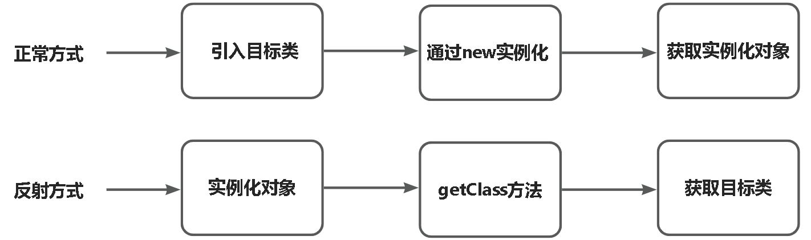
**如何利用反射机制获取class对象？**
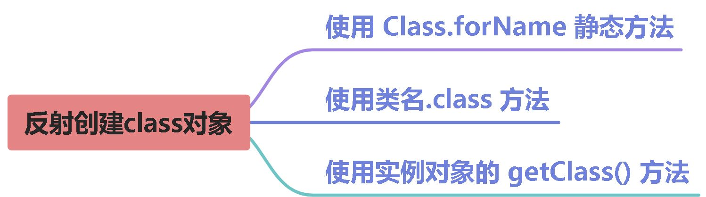

- **使用 Class.forName 静态方法**

**在使用Class.forName获取Class对象时，需要提供完整的类名（包括包名）。如果User类不在默认包中，还需要加上包名，如Class.forName("polo.User")。**

- **使用类名.class 方法**
```java
@Test
public void classDemo1() {
    // 使用类的.class获取Class对象
	Class<?> userClass = User.class;
    System.out.println(userClass);
}
```

- **使用实例对象的 getClass() 方法**
```java
@Test
public void classDemo1() throws ClassNotFoundException {
    // 使用实例获取Class对象
    User user = new User();
    Class<?> userClass = user.getClass();
}
```
**利用反射创造对象**
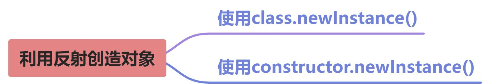
```java
//方式一
Class class = Class.forName("polo.User");
User user = (User) class.newInstance();
System.out.println(user);

//方式二
Constructor constructor = class.getConstructor();
User user1 = (User) constructor.newInstance();
System.out.println(user1);
```
**利用反射获取方法**

```java
//方法一
Class class1 = Class.forName("polo.User");
Method[] declaredMethods = class1.getMethods();
System.out.println(Arrays.toString(declaredMethods));
```
**利用反射成员变量**

```java
Class class1 = Class.forName("polo.User");
Field email = class1.getDeclaredField("email");
System.out.println(email);
Field username = class1.getDeclaredField("username");
System.out.println(username);
```
**利用反射获取类构造器**

```java
Class class1 = Class.forName("polo.User");
//Class<?>[] parameterTypes = null; //调用无参构造器，也可以直接不传任何参数
Class<?>[] parameterTypes = {int.class, String.class, String.class}
Constructor<? extends User> constructor1 = Class.getConstructor(parameterTypes);
System.out.println(constructor1);
//constructor1.newInstance();
constructor1.newInstance(1,"baili","baili.com");
```

# 反射的应用场景有哪些？反射有什么优缺点？
**应用场景**
**反射是Java框架的灵魂技术，很多框架都使用了反射技术，如spring，Mybatis，Hibernate等。**
**JDBC 的数据库的连接**
**在JDBC连接数据库中，一般包括加载驱动，获得数据库连接等步骤。而加载驱动，就是引入相关Jar包后，通过Class.forName()加载数据库的驱动程序。**
```java
Class.forName("com.mysql.cj.jdbc.Driver");
```
**xml或properties等配置文件加载**
**Spring 通过 XML 配置模式装载 Bean，也是反射的一个典型例子。**
**装载过程：**

- **将程序内XML 配置文件加载入内存中**
- **Java类解析xml或者properties里面的内容，得到对应实体类的字节码字符串以及相关的属性信息**
- **使用反射机制，得到Class实例**
- **动态配置实例的属性**

**这样做当然是有好处的不用每次都去new实例了，并且可以修改配置文件，比较灵活。**
**反射的优点：**
**动态性：反射提供了在运行时动态地探索和操作类的能力。它允许我们在运行时获取类的信息、创建对象、调用方法和修改字段的值，从而使程序更加灵活、可扩展和动态。**
**适应复杂环境：：反射可以应对一些复杂的场景，如在插件化系统中根据配置文件加载类、动态代理、识别和处理注解等。**
**反射的缺点：**
**性能问题：由于反射涉及到动态解析和调用，所以它通常比直接调用代码性能较低。反射需要进行额外的检查和处理，可能会导致性能下降。**
**安全问题：反射可以绕过访问控制限制，例如访问私有方法和字段。这可能会导致安全隐患，因此在使用反射时需要小心处理，并确保只在必要情况下使用**

# 怎么实现动态代理？
**代理模式是一种设计模式，提供了对目标对象额外的访问方式，即通过代理对象访问目标对象，这样可以在不修改原目标对象的前提下，提供额外的功能操作，扩展目标对象的功能。**
**举个例子：**
**在租房的时候，有的人会通过房东直租，有的人会通过中介租房。中介一般是不是会提供一些额外的服务，这里的中介就相当于代理。**
**动态代理实现方式：**
**JDK实现：JDK Proxy基于
**第三方类实现：CGLIB基于ASM（一个 Java 字节码操作框架）**
**如何实现动态代理：**

- **基于接口的JDK动态代理**
   - **定义目标类，即被代理的类。**
   - **通过实现InvocationHandler接口来自定义自己的InvocationHandler；重写invoke方法，在此方法中定义增强逻辑。**
   - **通过Proxy.newProxyInstance方法获得代理对象。**
   - **通过代理对象调用目标方法；**
```java
/**
 * @author 百里
 */
public interface UserService {
    void readBook();
}

/**
 * @author 百里
 */
public class UserServiceImpl implements UserService {
    @Override
    public void readBook() {
        System.out.println("阅读三国演义！！！");
    }
}

/**
 * @author 百里
 */
public class UserProxy implements InvocationHandler {

    private final Object object;

    public UserProxy(Object object){
        this.object = object;
    }

    @Override
    public Object invoke(Object proxy, Method method, Object[] args) throws Throwable {
        System.out.println("前置处理");
        Object invoke = method.invoke(object, args);
        System.out.println("后置处理");
        return invoke;
    }
}

/**
 * JDK Proxy
 */
@Test
public void proxyDemo(){
    UserService userService = (UserService) Proxy.newProxyInstance(  //创建代理对象
            UserServiceImpl.class.getClassLoader(),     // 加载接口的类加载器
            UserServiceImpl.class.getInterfaces(),     // 接口
            new UserProxy(new UserServiceImpl()));  // 代理类，传入需要被代理类的实现类
    userService.rentingHouse();
}
```

- **基于类的CGLIB动态代理**
   - **引入CGLIB的相关依赖。**
   - **定义目标类，即被代理的类。**
   - **创建代理类实现CGLIB的MethodInterceptor接口，并重写intercept方法，在此方法中定义增强逻辑。**
   - **使用Enhancer类创建代理对象，设置目标类、回调对象等参数。**
   - **调用代理对象的方法，实现代理行为。**
```java
<dependency>
    <groupId>cglib</groupId>
    <artifactId>cglib</artifactId>
    <version>3.3.0</version>
</dependency>
<dependency>
    <groupId>org.ow2.asm</groupId>
    <artifactId>asm</artifactId>
    <version>9.1</version>
</dependency>
```
```java
/**
 * @author 百里
 */
public class UserCgLibProxy implements MethodInterceptor {
    private final Objec object;

    public UserCgLibProxy(Object object){
        this.object = object;
    }

    public Object createProxy() {
        // 通过CGLIB动态代理获取代理对象的过程
        Enhancer enhancer = new Enhancer();
        // 设置enhancer对象的父类
        enhancer.setSuperclass(object.getClass());
        // 设置enhancer的回调对象
        enhancer.setCallback(new UserCgLibProxy(object.getClass()));
        // 返回代理对象
        return enhancer.create();
    }

    @Override
    public Object intercept(Object o, Method method, Object[] objects, MethodProxy methodProxy) throws Throwable {
        System.out.println("前置处理");
        Object invoke = methodProxy.invokeSuper(o, objects);
        System.out.println("后置处理");
        return invoke;
    }
}

/**
 * CGLIB
 */
@Test
public void cglibProxyDemo(){
    UserCgLibProxy userCgLibProxy = new UserCgLibProxy(new UserServiceImpl());
    UserServiceImpl proxy = (UserServiceImpl)userCgLibProxy.createProxy();
    proxy.rentingHouse();
}
```
**JDK Proxy与CGLIB的区别：**

- **基于接口 vs. 基于类：**
   - **JDK Proxy 只能代理接口类型，它通过实现指定接口并生成代理对象来实现代理功能。**
   - **CGLIB 可以代理普通的类，它通过继承目标类，并在子类中重写方法来实现代理。**
- **实现方式：**
   - **JDK Proxy 是基于反射机制实现的，它利用 Java 的反射 API 动态生成代理对象。**
   - **CGLIB 使用了字节码生成库，直接操作字节码生成代理类。相比于 JDK 代理的反射调用，CGLIB 的方法调用更快速。**
- **性能：**
   - **由于 CGLIB 是直接对字节码进行操作，所以在创建和执行代理对象时通常比 JDK 代理更快速。**
   - **JDK Proxy 的性能略低，因为它涉及到反射调用的开销。JDK8 版本已经优化，性能与 CGLIB 差不多。**
- **库依赖：**
   - **JDK Proxy 是 Java 标准库的一部分，无需额外的依赖。**
   - **CGLIB 需要引入相关的第三方库。**

# String 为什么要设计为不可变类？
**不可变怎么理解？**
```java
@Test
public void stringDemo() {
    String str = "baili";
    str = "BAILI";
}
```
**String值储存在常量池中。将字符串"baili"，如果改变值成"BAILI"，不是在原内存地址上修改数据，而是在常量池中查找或生成这个新值，再把引用指向新值的地址。如下图：**
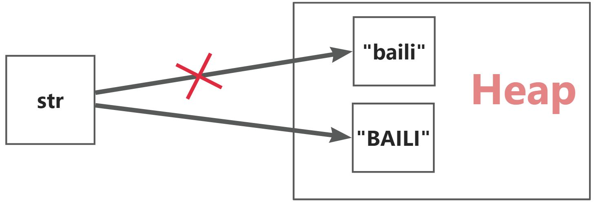
**为什么不可变?**

- **String 类本身是final的，不可以被继承。**
- **String类内部通过private final char value[]实现，从而保证了引用的不可变和对外的不可见。**
- **String内部通过良好的封装，不去改变value数组的值。**

**为什么要设计成不可变?**

- **字符串池优化：不可变性允许字符串共享和重用，节省内存空间和提高性能。**
- **线程安全性：不可变类天然具备线程安全的特性，无需额外同步措施。**
- **缓存哈希值：不可变性使得字符串的哈希值可以被缓存，提高相关数据结构的性能。**
- **安全性和可靠性：不可变性确保实例状态不会被修改，适用于处理敏感信息等安全场景。**
- **方便共享和重用：不可变类的实例可以自由共享和重用，提升性能效率。**

**TIPS**
**可以用反射来改变String中value的值，所以严格意义上说不一定不可变。**

# String、StringBuilder、StringBuffer 的区别？
**可变性：**

- **String 类是不可变类，一旦创建就无法改变其内容。对于每次修改操作（例如拼接字符串），都会创建一个新的字符串对象，旧对象则成为垃圾数据，需要等待垃圾回收。**
- **StringBuilder 和 StringBuffer 类是可变的，它们可以直接在原始对象上进行修改而不创建新的对象。这种特性使得在频繁拼接或修改字符串时更高效。**


**线程安全性：**

- **String 类是线程安全的，因为它的不可变性保证了多个线程同时访问同一个字符串对象时的安全性。**
- **StringBuilder 类是非线程安全的，它的方法没有进行同步处理。如果在多线程环境下使用 StringBuilder，需要额外采取措施保证线程安全。**
- **StringBuffer 类是线程安全的，它的方法进行了同步处理，因此可以在多线程环境下使用。**

**性能：**

- **在单线程环境下，StringBuilder 的性能通常优于 StringBuffer，因为 StringBuilder 不进行同步处理，省去了同步的开销。**
- **在多线程环境下，由于 StringBuffer 进行了同步处理，可能会带来额外的性能开销。但当线程同步是必需的时候，StringBuffer 是一个可靠的选择。**
- **String 类由于不可变性，每次修改都要创建新的对象，性能相对较差。但由于字符串常量池的优化，字符串的比较和共享等操作依然高效**
| 
 | **String** | **StringBuffer** | **StringBuilder** |
| --- | --- | --- | --- |
| **可变性** | **不可变** | **可变** | **可变** |
| **效率** | **最差** | **其次** | **最高** |
| **线程安全** | **线程安全** | **线程安全** | **线程不安全** |
| **使用场景** | **少量字符串操作** | **多线程大量操作** | **单线程大量操作** |


# String str = "i" 与 String str = new String("i") 一样吗？
**不一样**
**因为内存的分配方式不一样。String str="i"的方式，JVM会将其分配到常量池中；而 String str=new String(“i”)方式，则会被分到堆内存中。**
```java
@Test
public void stringDemo1() {
    String str1 = "i";
    String str2 = "i";
    String str3 = new String("i");
    System.out.println(str1 == str2);//true
    System.out.println(str2 == str3);//false
}
```
**String str="i" **
**Java 虚拟机会将其分配到常量池中：常量池不会重复创建对象。**

- **在String str1="i"中，把i值存在常量池，地址赋给str1。**
- **String str2=“i”，则会把i的地址赋给str2，但是i对象不会重新创建，他们引用的是同一个地址值，共享同一个i内存。**

**String str = new String(“i”)**
**Java 虚拟机会将其分到堆内存中：堆内存会创建新的对象。**

- **String str3=new String(“i”)，会创建一个新的i对象，然后将新对象的地址值赋给str3。虽然str3和str1的值相同但是地址值不同。**

# 接口和抽象类有什么区别？
**抽象类和接口是面向对象编程中两种常见的抽象概念，它们有以下几个区别：**

## 定义关键字不同
**接口使用关键字 interface 来定义。 抽象类使用关键字 abstract 来定义。**

## 继承或实现的关键字不同
**接口使用 implements 关键字定义其具体实现。 抽象类使用 extends 关键字实现继承。**

## 子类扩展的数量不同

- **接口的实现类可以有多个**

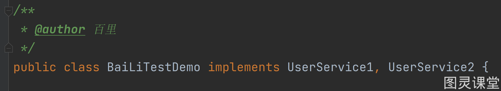

- **抽象类的子类，只能继承一个抽象类，抽象类的子类，只能继承一个抽象类**

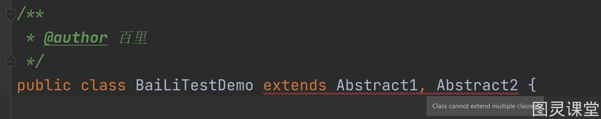
**在 Java 语言中，一个类只能继承一个父类（单继承），但可以实现多个接口。**

## 属性访问控制符不同，方法控制符不同

- **接口中属性的访问控制符只能是public（接口中的属性默认是 public static final 修饰的）**

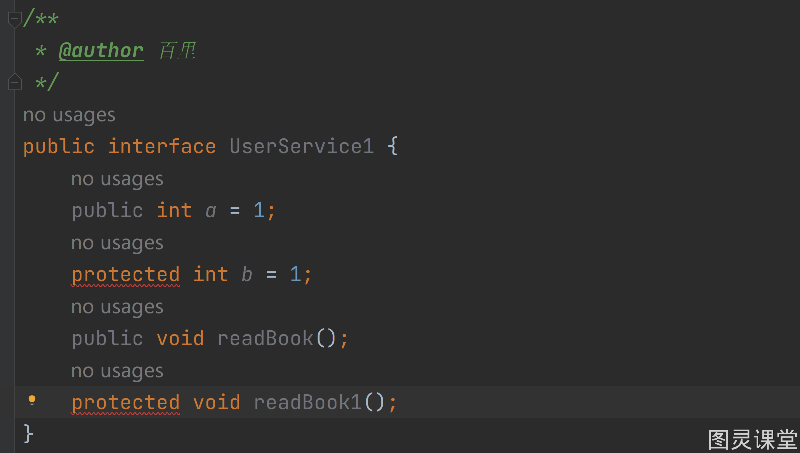

- **抽象类中的属性访问控制符无限制，可为任意控制符。**


# **什么是浅拷贝和深拷贝？**

- **浅拷贝：只复制指向某个对象的指针，而不复制对象本身，新旧对象共享一块内存； **
- **深拷贝：复制并创建一个一摸一样的对象，不共享内存，修改新对象，旧对象保持不变；**

**浅拷贝**拷贝对象和原始对象的引用类型引用同一个对象。**
```java
@Test
public void copyDemo1(){
    User user1 = new User(1,"baili", "baili.com");
    User user2 = user1; // 浅拷贝

    System.out.println("User 1: " + user1);
    System.out.println("User 2: " + user2);

    // 分别修改user对象的属性
    user1.setUsername("百里");
    user2.setEmail("百里.com");

    // 输出修改后的结果
    System.out.println("User 1: " + user1);
    System.out.println("User 2: " + user2);
}
```
**深拷贝**拷贝对象和原始对象的引用类型引用不同对象。**
```java
package polo;

import java.util.ArrayList;
import java.util.List;

/**
 * @author 百里
 */
public class Person implements Cloneable {
    private String name;
    private int age;
    private List<String> hobbies;

    public Person(String name, int age, List<String> hobbies) {
        this.name = name;
        this.age = age;
        this.hobbies = hobbies;
    }

    // Getters and setters

    public String getName() {
        return name;
    }

    public void setName(String name) {
        this.name = name;
    }

    public int getAge() {
        return age;
    }

    public void setAge(int age) {
        this.age = age;
    }

    public List<String> getHobbies() {
        return hobbies;
    }

    public void setHobbies(List<String> hobbies) {
        this.hobbies = hobbies;
    }
    
    @Override
    public Person clone() throws CloneNotSupportedException {
        // 浅拷贝对象
        Person clonedPerson = (Person) super.clone();
        // 深拷贝 List
        clonedPerson.setHobbies(new ArrayList<>(hobbies));
        
        return clonedPerson;
    }

    @Override
    public String toString() {
        return "Person [name=" + name + ", age=" + age + ", hobbies=" + hobbies + "]";
    }
}

@Test
public void copyDemo2(){
    List<String> hobbies = new ArrayList<>();
    hobbies.add("Reading");
    hobbies.add("Gardening");
    Person person1 = new Person("baili", 30, hobbies);

    try {
        Person person2 = person1.clone(); // 深拷贝

        System.out.println("Person 1: " + person1);
        System.out.println("Person 2: " + person2);

        // 修改 person2 的属性
        person2.setName("百里");
        person2.setAge(25);
        person2.getHobbies().add("Cooking");

        // 输出修改后的结果
        System.out.println("Person 1: " + person1);
        System.out.println("Person 2: " + person2);
    } catch (CloneNotSupportedException e) {
        e.printStackTrace();
    }
}
```
**使用 clone() 方法来拷贝一个对象即复杂又有风险，它会抛出异常，并且还需要类型转换。Effective Java 书上讲到，最好不要去使用 clone()，可以使用拷贝构造函数或者拷贝工厂来拷贝一个对象。**
**使用拷贝构造函数：**
```java
class Person {
    private String name;
    private int age;

    public Person(String name, int age) {
        this.name = name;
        this.age = age;
    }

    // 拷贝构造函数
    public Person(Person other) {
        this.name = other.name;
        this.age = other.age;
    }

    // Getters and setters
    public String getName() {
        return name;
    }

    public void setName(String name) {
        this.name = name;
    }

    public int getAge() {
        return age;
    }

    public void setAge(int age) {
        this.age = age;
    }

    @Override
    public String toString() {
        return "Person [name=" + name + ", age=" + age + "]";
    }
}

public class Main {
    public static void main(String[] args) {
        Person person1 = new Person("baili", 30);

        // 使用拷贝构造函数创建 person2 对象
        Person person2 = new Person(person1);

        System.out.println("Person 1: " + person1);
        System.out.println("Person 2: " + person2);

        // 修改 person2 的属性
        person2.setName("BAILI");
        person2.setAge(25);

        // 输出修改后的结果
        System.out.println("Person 1: " + person1);
        System.out.println("Person 2: " + person2);
    }
}
```
**使用拷贝工厂：**
```java
class Person {
    private String name;
    private int age;

    public Person(String name, int age) {
        this.name = name;
        this.age = age;
    }

    // Getters and setters

    public String getName() {
        return name;
    }

    public void setName(String name) {
        this.name = name;
    }

    public int getAge() {
        return age;
    }

    public void setAge(int age) {
        this.age = age;
    }

    @Override
    public String toString() {
        return "Person [name=" + name + ", age=" + age + "]";
    }
}

class PersonFactory {
    public static Person createCopy(Person original) {
        // 使用拷贝构造函数创建新的对象
        return new Person(original.getName(), original.getAge());
    }
}

public class Main {
    public static void main(String[] args) {
        Person person1 = new Person("bali", 30);

        // 使用拷贝工厂创建 person2 对象
        Person person2 = PersonFactory.createCopy(person1);

        System.out.println("Person 1: " + person1);
        System.out.println("Person 2: " + person2);

        // 修改 person2 的属性
        person2.setName("BAILI");
        person2.setAge(25);

        // 输出修改后的结果
        System.out.println("Person 1: " + person1);
        System.out.println("Person 2: " + person2);
    }
}
```

# **Overload、Override、Overwrite的区别?**
**在面向对象编程中，有三个概念经常用到：Overload（重载）、Override（重写）和Overwrite（覆盖）,这些概念描述了不同的方法或函数之间的关系。**
**重载（Overload）：**
**定义：在同一个类中，可以定义多个具有相同名称但参数列表不同的方法，它们被称为方法的重载。**
**特点：**

   - **方法名相同，参数列表不同。**
   - **重载方法可以有不同的返回类型。**
   - **重载方法必须在同一个类中。**
   - **重载方法的区分依据是参数的个数、类型或者顺序。**

**示例：**
```java
public class Calculator {
    public int add(int a, int b) {
        return a + b;
    }

    public double add(double a, double b) {
        return a + b;
    }
}
```
**重写（Override）：**
**定义：子类继承自父类时，可以对父类的方法进行重新实现，这被称为方法的重写。**
**特点：**

   - **子类中的方法与父类中的方法具有相同的名称、参数列表和返回类型。**
   - **子类中的方法不能比父类的方法访问性更严格。**
   - **子类方法抛出的异常不能比父类方法抛出的异常更多。**
   - **子类方法可以覆盖父类方法的实现，提供自己的实现逻辑。**

**示例：**
```java
class Animal {
    public void eat() {
        System.out.println("Animal is eating.");
    }
}

class Cat extends Animal {
    @Override
    public void eat() {
        System.out.println("Cat is eating.");
    }
}
```
**覆盖（Overwrite）：**
**定义：在文件操作中，覆盖（Overwrite）通常指的是将已有的文件内容替换为新的内容。**
**特点：**

   - **覆盖通常发生在文件写入时，用新的内容覆盖原有的内容，使其被替代。**
   - **覆盖可能会导致原文件的内容丢失，因此在进行覆盖操作时要小心。**

**示例：**
**假设有一个文件 "data.txt"，通过覆盖操作可以将该文件的内容替换为新的内容。**
**总结：**

   - **重载（Overload）指的是在同一个类中定义多个具有相同名称但参数列表不同的方法。**
   - **重写（Override）指的是子类继承父类并重新实现父类中的方法。**
   - **覆盖（Overwrite）通常指的是在文件操作中，将文件内容替换为新的内容。**

# Exception和Error有什么区别 ?
**在Java中，Exception和Error是两个不同的类，它们都继承自Throwable类。下面是它们之间的区别：**
**Exception（异常）：**

   - **Exception表示在程序执行过程中可能出现的可处理的异常情况。它一般由代码逻辑错误、外部条件变化等原因引起，可以通过适当的处理措施来恢复正常的程序执行。Exception分为两种类型：**
      - **受检异常（Checked Exception）：编译器要求必须在代码中显式地处理受检异常，否则代码无法通过编译。常见的受检异常包括IOException、SQLException等。**
      - **非受检异常（Unchecked Exception）：编译器对非受检异常不强制要求进行处理，但可以选择处理或者将其抛给上层调用者处理。常见的非受检异常包括NullPointerException、ArrayIndexOutOfBoundsException等。**
- **示例：**
```java
@Test
public void exceptionDemo() {
    int dividend = 10;
    int divisor = 0;
    int result;
    try {
        // 除零操作，会抛出ArithmeticException异常
        result = dividend / divisor;
        System.out.println("Result: " + result);
    } catch (ArithmeticException e) {
        System.out.println("Exception caught: " + e.getMessage());
    }
}
```
**Error（错误）：**

   - **Error是指应用程序通常无法处理或恢复的严重问题。**
   - **Error通常表示虚拟机（JVM）的错误状态或系统级错误，例如OutOfMemoryError、StackOverflowError等。**
   - **Error通常意味着应用程序处于不可恢复的状态，因此一般不被捕获和处理。**
   - **与异常不同，Error没有规定要求应用程序处理或捕获它们。**
- **示例：	**
```java
public static void recursiveMethod(int i) {
    if (i == 0) {
    	return;
	}
	// 递归调用自身，会导致栈溢出错误(StackOverflowError)
	recursiveMethod(i + 1);
}

@Test
public void errorDemo(){
    try {
        recursiveMethod(1);
    } catch (StackOverflowError e) {
        System.out.println("Error occurred: " + e.getMessage());
    }
}
```
**总结：**
**Exception是预期的、可以被捕获和处理的异常，而Error是不可恢复的严重问题，通常由虚拟机或系统级错误引起。在实际编程中，我们应该根据情况选择适当的异常处理和错误处理机制，以确保程序的稳定性和可靠性。**

# Java中的IO流的分类？说出几个你熟悉的实现类？
**在Java中，IO流可以根据其功能和作用进行分类。主要分为四种类型：字节流、字符流、缓冲流和对象流。**
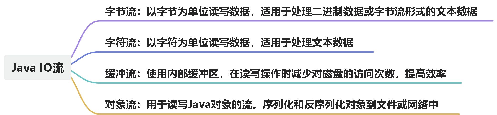

- **字节流（Byte Stream）：以字节为单位进行读写操作的流。字节流通常用于处理二进制数据或字节流形式的文本数据。**
   - **InputStream：字节输入流的抽象基类，是所有字节输入流的超类。**
   - **OutputStream：字节输出流的抽象基类，是所有字节输出流的超类。**
   - **一些实现类包括：FileInputStream、FileOutputStream、ByteArrayInputStream、ByteArrayOutputStream等。**
- **字符流（Character Stream）：以字符为单位进行读写操作的流。字符流通常用于处理字符数据，支持Unicode编码。**
   - **Reader：字符输入流的抽象基类，是所有字符输入流的超类。**
   - **Writer：字符输出流的抽象基类，是所有字符输出流的超类。**
   - **一些实现类包括：FileReader、FileWriter、BufferedReader、PrintWriter等。**
- **缓冲流（Buffered Stream）：提供了缓冲功能，可以减少实际IO操作的次数，提高读写效率。**
   - **BufferedInputStream：字节缓冲输入流，装饰器模式实现。**
   - **BufferedOutputStream：字节缓冲输出流，装饰器模式实现。**
   - **BufferedReader：字符缓冲输入流，装饰器模式实现。**
   - **BufferedWriter：字符缓冲输出流，装饰器模式实现。**
- **对象流（Object Stream）：用于读写Java对象的流。可以方便地将对象序列化和反序列化到文件或网络中。**
   - **ObjectInputStream：对象输入流，用于从流中读取对象。**
   - **ObjectOutputStream：对象输出流，用于将对象写入流。**

**除了以上列举的实现类以外，还有很多其他的IO流实现类，如DataInputStream、DataOutputStream、PrintStream等，它们提供了不同的功能和特性。**

- **总结：日常使用根据需要选择合适的流类型进行数据的读取和写入操作。**
   - **字节流适合处理二进制数据。**
   - **字符流适合处理文本数据。**
   - **通过缓冲流可以提高读写效率，减少对底层资源的访问次数。**

# 常见的异常类有哪些？
**在Java中，有一些常见的异常类，可以根据其特性和使用场景进行分类。以下是一些常见的异常类：**
**RuntimeException（运行时异常）：**

   - **NullPointerException：空指针异常，当对一个对象引用调用方法或访问属性时，对象引用为空。**
   - **ArrayIndexOutOfBoundsException：数组下标越界异常，当尝试访问数组的不存在的索引时抛出。**
   - **IllegalArgumentException：非法参数异常，当传递给方法的参数不合法时抛出。**
   - **取或**

**IOException（输入输出异常）：**

   - **FileNotFoundException：文件未找到异常，当尝试打开或读取不存在的文件时抛出。**
   - **EOFException：文件结束异常，当从数据流读取数据时到达文件末尾时，而你还在试图读取更多的数据抛出。**
   - **SocketException：套接字异常，当与套接字相关的操作失败时抛出。**

**SQLException（数据库异常）：**

   - **SQLSyntaxErrorException：SQL语法错误异常，当执行SQL语句时遇到语法错误时抛出。**
   - **DataAccessException：数据访问异常，当访问数据库或数据存储出现问题时抛出。**

**ClassNotFoundException：**

   - **类未找到异常，当尝试加载不存在的类时抛出。**

**实际上在Java中还有很多其他的异常类，了解这些异常类可以帮助我们更好地进行异常处理和错误处理，提高程序的可靠性和可维护性。**

# 说下对JVM内存模型的理解
**JVM 内存区域最粗略的划分可以分为堆和栈，当然，按照虚拟机规范，可以划分为以下几个区域：**
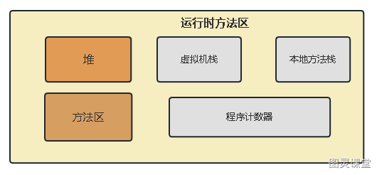
**JVM 内存分为线程私有区和线程共享区，其中方法区和堆是线程共享区，虚拟机栈、本地方法栈和程序计数器是线程隔离的数据区。**
**1）程序计数器**
**程序计数器是一块较小的内存区域，它是线程私有的。在多线程环境中，每个线程都有一个独立的程序计数器，用于指示当前线程执行的字节码指令地址。**
**2）Java 虚拟机栈**
**每个线程在运行时都会创建一个对应的虚拟机栈。每个方法在执行的同时都会创建一个栈帧，栈帧中保存了局部变量表、操作数栈、动态链接、方法出口等信息。栈帧随着方法的调用和返回而入栈和出栈。**
**3）本地方法栈**
**本地方法栈与虚拟机栈所发挥的作用是非常相似的，其区别是虚拟机栈为虚拟机执行 Java 方法（也就是字节码）服务，而本地方法栈则是为虚拟机使用到的本地（Native）方法服务。**
**4）Java 堆**
**堆是Java虚拟机管理的最大的一块内存区域。所有通过new关键字创建的对象都会被分配到堆中。堆是被所有线程共享的，在虚拟机启动时被创建。堆被划分为新生代和老年代两个区域。**

- **新生代：新创建的对象首先被分配到新生代的Eden区，当Eden区满时触发Minor GC，并且根据分代收集理论，将存活的对象复制到Survivor区。经过多次Minor GC后仍然存活的对象会被移动到老年代。**
- **老年代：大部分存活时间较长的对象会被分配到老年代。当老年代满时触发Major GC（也称为Full GC），并且进行完整的垃圾回收操作。**

**5）方法区**
**方法区是比较特别的一块区域，和堆类似，它也是各个线程共享的内存区域，用于存储已被虚拟机加载的类型信息、常量、静态变量、即时编译器编译后的代码缓存等数据。**

# 对象创建的过程了解吗？
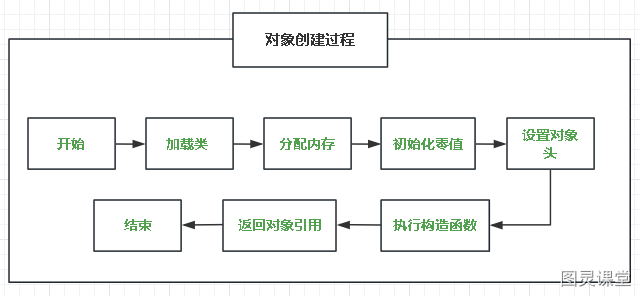
**在Java中，对象的创建主要包括以下几个步骤：**

- **类加载：首先，JVM会从类路径中加载需要创建的对象的类。如果类还没有被加载，JVM会根据类的全限定名找到对应的字节码文件，并加载到内存中。**
- **分配内存：一旦类被加载，JVM会在堆中分配内存来存储对象的实例数据。在堆中生成的内存地址将作为对象的引用。**
- **初始化零值：在分配内存后，JVM会对分配的内存进行初始化。基本数据类型的字段会被初始化为默认值（例如，int类型初始化为0），而引用类型的字段会被初始化为null。**
- **设置对象头：在对象的实例数据之前，JVM会设置对象头，用于存储对象的元信息，如哈希码、GC信息等。对象头的大小由JVM的实现决定。**
- **执行构造函数：一旦对象的内存空间准备好，并且对象头设置完毕，JVM就会调用对象的构造函数来完成对象的初始化过程。构造函数会对对象的实例字段进行初始化，可以执行其他必要的操作。**
- **返回对象引用：当构造函数执行完毕后，对象的状态就被完全初始化了。此时，JVM会返回对象的引用，可以将该引用赋值给变量，以便后续使用对象。**

# 什么是指针碰撞和空闲列表？
**指针碰撞（Pointer Bumping）和空闲列表（Free List）分别是内存分配策略和内存管理策略，常用于描述动态内存分配的过程。**
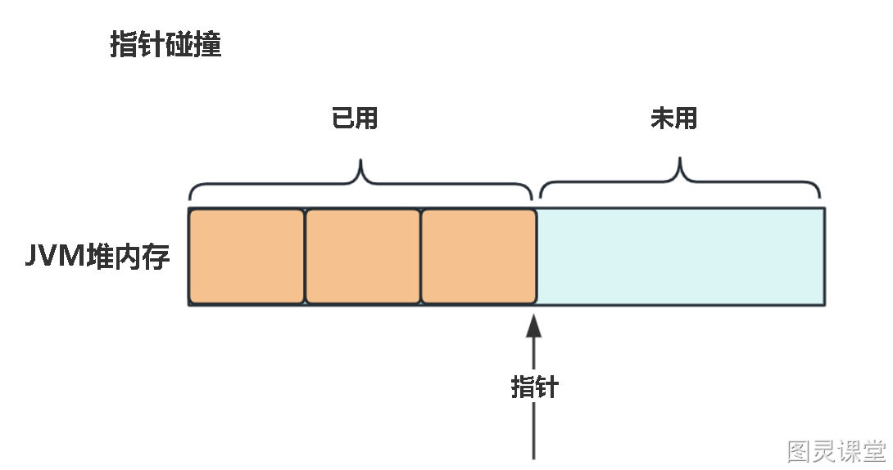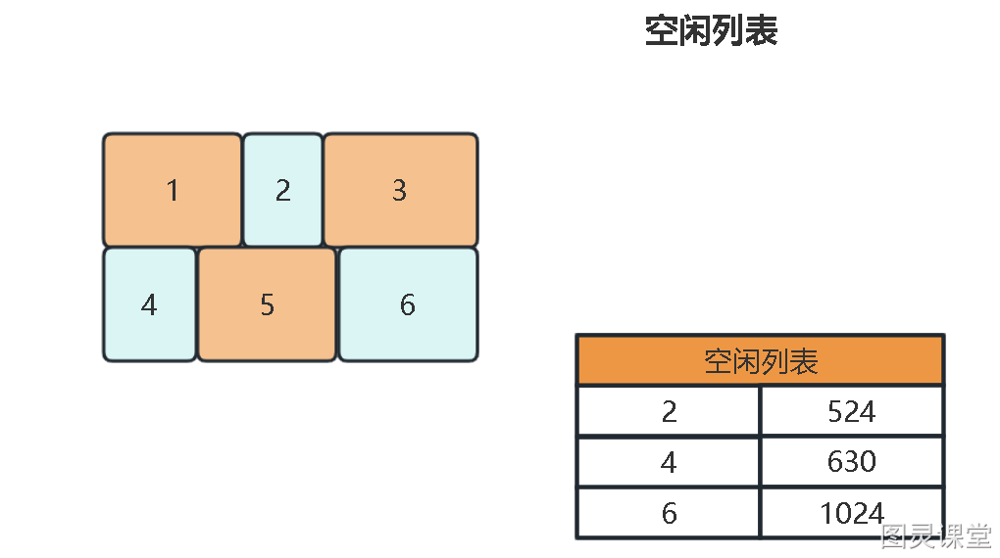

1. **指针碰撞（Pointer Bumping）：指针碰撞是一种内存分配策略，通常用于实现固定大小的对象的分配。**
   1. **在指针碰撞中，内存被看作是一个连续的块，分配器使用一个指针来表示当前可用的内存位置，**
   2. **当有新的对象需要分配时，分配器会将指针向前移动对应的字节大小，在移动指针的同时，也会更新可用内存的位置信息。**
   3. **这种策略要求内存空间是连续的，并且必须按照相同的大小进行分配，因此主要适用于静态或固定大小的内存分配场景。**
2. **空闲列表（Free List）：空闲列表是一种内存管理策略，通常用于实现可变大小的对象的分配。**
   1. **在空闲列表中，内存被划分为多个块，每个块都有一个头部信息来记录其状态（分配或空闲）和大小。**
   2. **当有新的对象需要分配时，分配器会遍历空闲列表，寻找能够容纳该对象大小的空闲块，并进行分配。**
   3. **分配后，该块会从空闲列表中移除或进行相应的更新。**
   4. **当对象被释放时，分配器将其对应的内存块标记为空闲，并将其添加到空闲列表中，以便后续的分配操作使用。**
   5. **这种策略可以更灵活地处理可变大小的内存分配需求。**

# JVM创建对象时，堆会发生抢占吗？
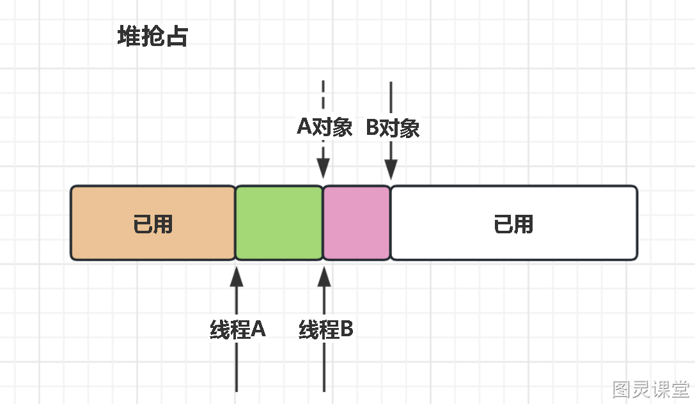
**
**在JVM中，当多个线程同时执行new操作创建对象时，理论上是存在可能发生堆的抢占情况的。具体是否发生抢占取决于JVM的实现和操作系统的调度策略。**
**一般情况下，JVM使用了各种机制来确保堆的线程安全性，以避免对堆内存的抢占问题。比如在对象分配的过程中，JVM会为每个线程分配独立的堆内存区域，线程间不会争夺同一块内存区域。这样，在多线程环境中，不同线程可以并行地创建对象，而互不干扰。**
**然而，如果在某些特殊情况下，多个线程同时请求分配较大内存的对象，而可用的堆内存又非常有限，那么就有可能出现堆内存不足的情况，从而导致线程之间发生竞争和抢占。当堆内存不足时，JVM可能会触发垃圾回收来释放一些不再使用的对象，以腾出足够的内存空间给新的对象分配。**
**总之，虽然理论上存在堆的抢占可能性，但在正常情况下，JVM的设计和实现通常会通过分配独立的内存区域、使用适当的同步机制等来保证堆的线程安全性，以避免抢占问题的发生。**

- **采用 CAS 分配重试的方式来保证更新操作的原子性**
- **每个线程在 Java 堆中预先分配一小块内存，也就是本地线程分配缓冲（Thread Local AllocationBuffer，TLAB），要分配内存的线程，先在本地缓冲区中分配，只有本地缓冲区用完了，分配新的缓存区时才需要同步锁定。**

# 能说一下对象的内存布局吗？
**在 HotSpot 虚拟机里，对象在堆内存中的存储布局可以划分为三个部分：对象头（Header）、实例数据（Instance Data）和对齐填充（Padding）。**
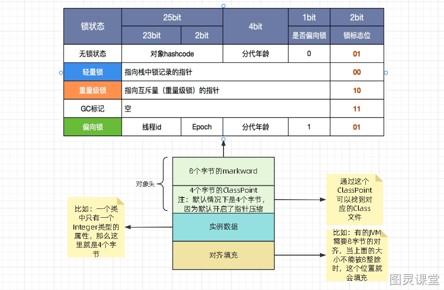**** 对象头主要由两部分组成：**

- **第一部分存储对象自身的运行时数据：锁状态标志、哈希码、GC 分代年龄、线程持有的锁、偏向线程 ID、偏向时间戳等，官方称它为 Mark Word，它是个动态的结构，随着对象状态变化。**
- **第二部分是类型指针，指向对象的类元数据类型（即对象代表哪个类）。**
- **此外，如果对象是一个 Java 数组，那还应该有一块用于记录数组长度的数据。**

**实例数据用来存储对象真正的有效信息，也就是我们在程序代码里所定义的各种类型的字段内容，无论是从父类继承的，还是自己定义的。**
**对齐填充不是必须的，没有特别含义，仅仅起着占位符的作用。**

# 如何判断对象仍然存活？
**常见的判断对象是否存活的方法有两种：**

- **引用计数法：该方法通过对对象进行引用计数，即记录对象被引用的次数。当引用计数为0时，表示对象没有被引用，可以被回收。但是引用计数法无法解决循环引用的问题，导致内存泄漏。**


- **可达性分析法：常见的垃圾回收算法中，主要采用的是可达性分析算法。该算法从一组称为"根"的特定对象（如全局变量、活动线程等）开始，通过追踪对象之间的引用关系形成引用图，然后检查哪些对象可以从"根"对象访问到。如果一个对象可以从"根"对象访问到，那么它就被认为是存活的。而对于无法从"根"对象访问到的对象，则被判定为不再存活，垃圾回收器将对其进行回收。**

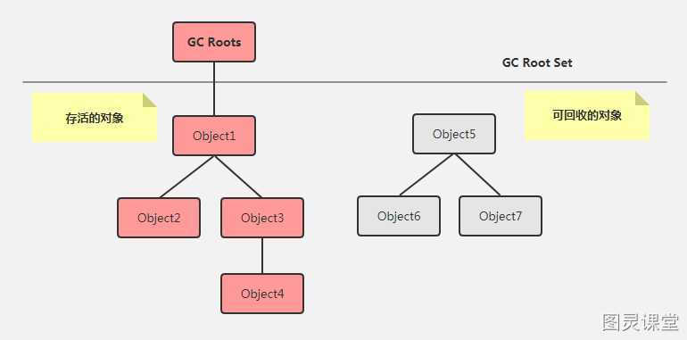

# 垃圾收集算法了解吗？
**垃圾收集算法是指用于确定哪些内存对象是垃圾并将其回收的技术。**
**常见的垃圾收集算法包括以下几种：**

- **标记-清除算法：该算法通过标记对象的可达性来确定存活对象，然后清除未被标记的对象。这种算法简单且灵活，但可能会产生内存碎片。**

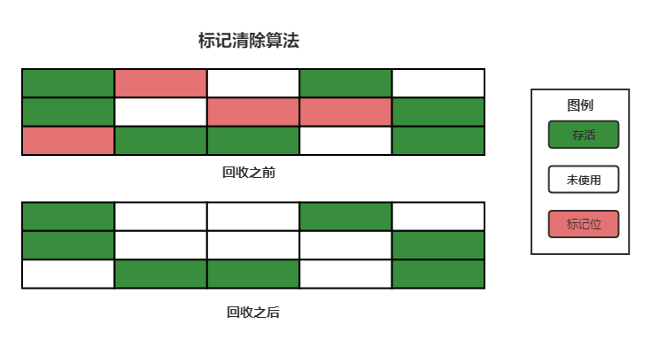

   - **优点：**
      - **简单且灵活，适用于大型和复杂的内存结构。 **
   - **缺点：**
      - **可能会产生内存碎片，导致内存利用率降低。**
      - **算法执行过程中会引入停顿时间，影响程序的响应性能。**
- **标记-复制算法：该算法将内存分为两个区域，每次只使用其中一个区域。当发生垃圾回收时，将存活对象从一个区域复制到另一个区域，然后清除当前使用的区域。这种算法避免了内存碎片的问题，但需要额外的内存空间。**

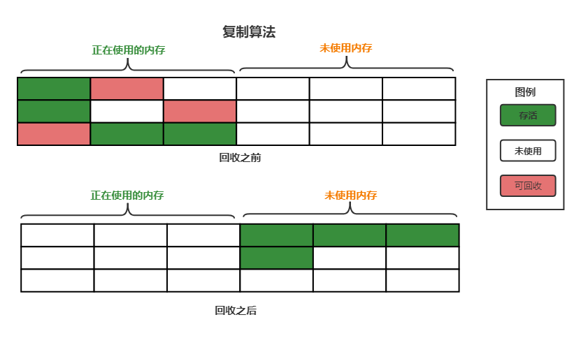

   - **优点：**
      - **消除了内存碎片问题，内存利用率高。**
      - **回收效率高，不需要遍历整个堆。**
   - ** 缺点：**
      - **需要额外的内存空间来保存复制对象。**
      - **与其他算法相比，有一定的内存浪费。**
- **标记-整理算法：该算法首先标记存活对象，然后将它们紧凑地移动到内存的一端，清除未被标记的对象。这样可以消除内存碎片，但也需要移动对象的操作。**


   - **优点：**
      - **消除了内存碎片问题，内存利用率高。**
      - **相对于复制算法，减少了内存的占用。**
   - ** 缺点：**
      - **需要移动对象的操作，可能会增加垃圾回收的时间消耗。**
      - **不适用于存活对象较多且分散的情况，因为需要大量的对象移动。**
- **分代回收算法：该算法根据对象的生命周期将内存划分为不同的代。通常情况下，新创建的对象被分配到新生代，经过多次回收仍然存活的对象会晋升到老年代。不同代使用不同的垃圾收集策略，以提高回收效率。**
      - **新生代：每次都有大量对象消亡，因为有老年代作为内存担保，通常采取复制算法。**
      - **老年代：对象存活时间长，可采用标记整理、标记清除算法。**

# 能详细说一下 CMS 收集器的垃圾收集过程吗？
**CMS收集器是一种旨在减少垃圾回收停顿时间的垃圾收集器。它主要针对响应时间敏感的应用程序，通过并发执行大部分垃圾收集工作来减少停顿时间。**
**CMS收集器的垃圾收集过程主要分五个阶段：**
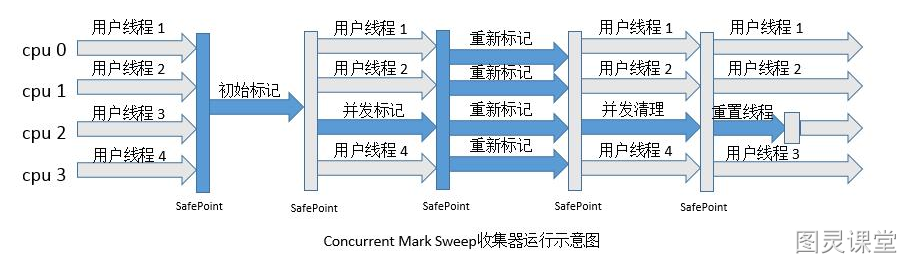

1. **初始标记阶段：**
   - **在此阶段，CMS收集器会标记所有从根对象直接可达的对象，标记这些对象的标记位。**
   - **标记过程需要停止应用程序的线程，因此会产生短暂的停顿。**
2. **并发标记阶段：**
   - **在初始标记阶段之后，CMS收集器会启动并发标记阶段，恢复应用程序的执行。**
   - **在并发标记阶段，CMS收集器会遍历堆中的对象，并标记那些在垃圾回收过程中变得不可达的对象。标记过程与应用程序的执行并发进行。**
3. **重新标记阶段：**
   - **在应用程序继续执行的同时，CMS收集器会暂时停止应用程序的线程，进行重新标记阶段。**
   - **重新标记阶段的目的是标记在并发标记期间发生变化的对象。**
   - **该阶段通常比初始标记阶段稍长。**
4. **并发清理阶段：**
   - **在重新标记阶段之后，CMS收集器会启动并发清理阶段，恢复应用程序的执行。**
   - **在并发清理阶段，CMS收集器会清理那些被标记为垃圾的对象。清理过程与应用程序的执行并发进行。**
5. **并发重置阶段：**
   - **最后一个阶段是并发重置阶段。在此阶段，CMS收集器完成垃圾回收过程的最后一些清理工作。**
   - **该阶段通常很快，并在其中释放额外的内存空间。**

**值得注意的是，CMS收集器的并发标记和清理过程与应用程序的执行是同时进行的，因此它可以显著减少垃圾回收引起的停顿时间。然而，CMS收集器的缺点之一是其在执行垃圾收集时会消耗一定的CPU资源，并且在堆内存使用率高或产生大量垃圾时，可能会导致更频繁的Full GC操作。**

# G1 垃圾收集器了解吗？
**G1垃圾收集器的设计目标是在停顿时间可控的情况下，最大化系统吞吐量，它旨在提供更可控、更高效的垃圾回收性能。**
**以下是G1垃圾收集器的一些特点和工作原理：**

1. **区域化内存布局：G1收集器将堆内存划分为多个大小相等的区域（Region）。每个区域可以是Eden区、Survivor区或Old区。这种内存布局有助于提高垃圾收集的效率。**


2. **并行与并发：G1收集器使用并行和并发的方式执行垃圾回收操作。它通过并行处理来加快标记和复制阶段的速度，同时利用并发处理来减少垃圾回收对应用程序的停顿时间。**
3. **垃圾优先策略：G1收集器使用Garbage-First策略来确定优先处理哪些区域中的垃圾。它会根据区域中的垃圾数量、回收成本等因素来选择下一个要回收的区域，以最大程度地提高垃圾回收的效率。**
4. **混合回收：G1收集器执行混合回收，即同时处理新生代和老年代的垃圾回收。相比于传统的分代式回收，它可以均衡地处理整个堆内存，避免长时间的Full GC暂停。**
5. **可预测的停顿时间：G1收集器使用一种叫做"停顿预测模型"的机制，通过控制每次垃圾回收的时间目标来实现可预测的停顿时间。开发人员可以通过设置最大停顿时间来控制G1收集器的行为。**

**工作原理：**
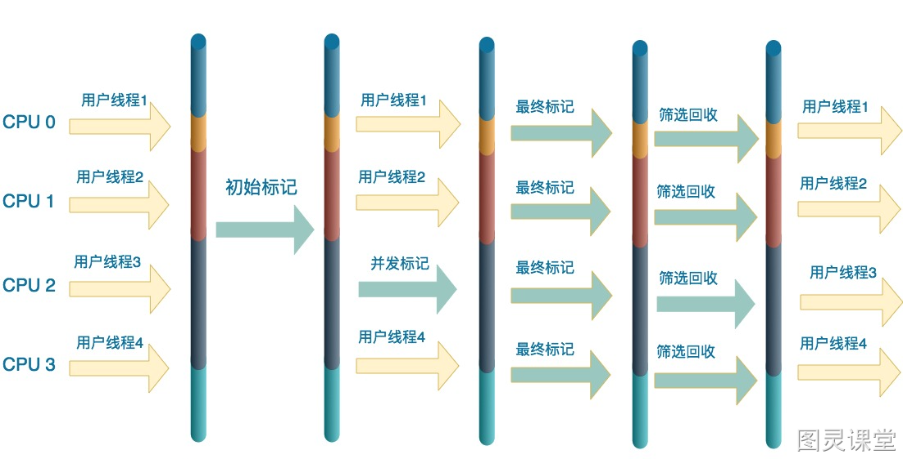

- **初始标记：停顿所有的应用程序线程，识别出GC Roots直接关联的对象，并标记这些对象。**
- **并发标记：从第一步得到的标记点继续向下遍历对象图，标记所有被引用的存活对象，此步骤与应用程序并发运行。**
- **最终标记：在并发标记完成后，再次停顿所有的应用程序线程，重新标记被改变的对象和整理存活对象的布局。**
- **筛选回收：根据用户设定的回收目标，选取一个或多个Region进行垃圾回收，将这些Region中的存活对象（还有其他Region中被引用的对象）复制到新的Region中，即称为筛选回收。**

**G1垃圾收集器适用于具有大内存需求和低暂停时间要求的应用程序。但需要注意的是，G1收集器也有一些局限性，比如在处理大量临时垃圾对象或存在大量跨区域引用时可能会导致性能下降。**
**总的来说，G1垃圾收集器在Java应用程序中的使用越来越广泛，特别适合那些对停顿时间敏感的大型服务端应用程序。**

# 对象一定分配在堆中吗？
**
**在编译期间，JIT 编译器对代码做了很多优化，其中有一部分就是针对内存堆分配进行优化，其实也就是逃逸分析技术。**
**什么是逃逸分析？**
**逃逸分析是指分析指针动态范围的方法，它同编译器优化原理的指针分析和外形分析相关联。当变量（或者对象）在方法中分配后，其指针有可能被返回或者被全局引用，这样就会被其他方法或者线程所引用，这种现象称作指针（或者引用）的逃逸(Escape)。**
**通俗点讲，当一个对象被 new 出来之后，它可能被外部所调用，如果是作为参数传递到外部了，就称之为方法逃逸。**
```java
public class Main {
    private static Object globalObj;

    public static void main(String[] args) {
        escapeMethod();
        System.out.println(globalObj.toString());
    }

    public static void escapeMethod() {
        Object localObj = new Object(); // 一个对象被创建

        globalObj = localObj; // 对象的引用被传递到外部的全局变量

        // 这里可以有其他代码逻辑
    }
}

```
****给可以在其它线程中访问的实例变量，这种就被称为线程逃逸。**
```java
public class Main {
    private static Object sharedObj;

    public static void main(String[] args) throws InterruptedException {
        Thread thread = new Thread(new Runnable() {
            @Override
            public void run() {
                sharedObj = new Object(); // 一个对象被创建并赋值给共享变量
            }
        });

        thread.start();

        thread.join(); // 等待线程执行结束

        System.out.println(sharedObj.toString());
    }
}
```
**逃逸分析的好处：**

- **栈上分配**

**如果对象不逃逸，则可以通过在栈上分配和销毁对象来避免频繁的堆内存分配和垃圾回收操作，进而提高程序的执行效率。**

- **同步消除**

**线程同步本身是一个相对耗时的过程，如果逃逸分析能够确定一个变量不会逃逸出线程，无法被其他线程访问，那么这个变量的读写肯定就不会有竞争， 对这个变量实施的同步措施也就可以安全地消除掉。**

- **标量替换**

**如果一个数据是基本数据类型，不可拆分，它就被称之为标量。**
**把一个 Java 对象拆散，将其用到的成员变量恢复为原始类型来访问，这个过程就称为标量替换。**
**假如逃逸分析能够证明一个对象不会被方法外部访问，并且这个对象可以被拆散，那么可以不创建对象，直接用创建若干个成员变量代替，可以让对象的成员变量在栈上分配和读写。**

# 说说有哪些常见集合？
**集合相关类和接口都在java.util中，主要分为3种：List（列表）、Map（映射）、Set(集)。**
**其中Collection是集合List、Set的父接口，它主要有两个子接口：**

- **List：存储的元素有序，可重复。**
- **Set：存储的元素不无序，不可重复。**

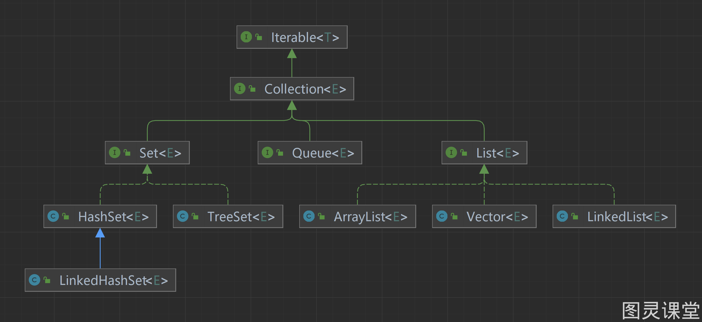
**Map是另外的接口，是键值对映射结构的集合。**
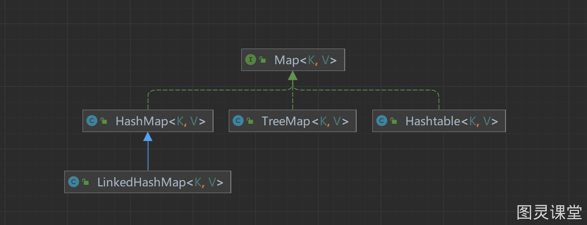

# ArrayList和LinkedList有什么区别？
**ArrayList和LinkedList都是Java中常用的集合类，但它们有不同的数据结构和性能特点，因此适用于不同的使用场景。以下是它们的主要区别：**

1. **数据结构：**
   - **ArrayList是基于数组实现的动态数组。它内部使用数组来存储元素，当数组空间不足时，会自动扩展容量。**
   - **LinkedList是基于双向链表实现的。每个元素都包含一个指向前一个元素和后一个元素的引用。这种结构允许在任何位置高效地插入和删除元素。**

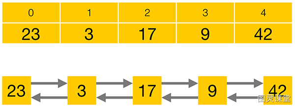

2. **随机访问：**
   - **ArrayList支持高效的随机访问，因为它可以通过索引直接访问数组中的元素，时间复杂度为O(1)。**
   - **LinkedList不支持高效的随机访问，因为要访问特定位置的元素需要从链表头或尾开始遍历，时间复杂度为O(n)，其中n是要访问的元素位置到链表头或尾的距离。**
3. **插入和删除操作：**
   - **ArrayList在中间或开头插入或删除元素时，需要移动元素来维护数组的连续性，因此这些操作可能较慢，时间复杂度为O(n)。**
   - **LinkedList在任何位置插入或删除元素都非常高效，时间复杂度为O(1)，因为只需要修改相关节点的引用。**
4. **内存占用：**
   - **ArrayList通常在元素数量不断增加时需要定期扩展数组容量，可能导致内存浪费。但是，它不需要额外的空间来存储节点引用。**
   - **LinkedList每个元素都需要额外的内存来存储前后节点的引用，因此可能占用更多的内存空间，特别是在大量元素的情况下。**

# ArrayList的扩容机制了解吗？
**ArrayList是基于数组的集合，数组的容量是在定义的时候确定的，如果数组满了，再插入就会数组溢出。所以在插入时候，会先检查是否需要扩容，如果当前容量+1超过数组长度，就会进行扩容。**
**ArrayList的扩容是创建一个1.5倍的新数组，然后把原数组的值拷贝过去。**
```java
public boolean add(E var1) {
    // 确保内部数组容量足够来容纳新元素
    this.ensureCapacityInternal(this.size + 1);
    
    // 将新元素添加到数组，并更新size
    this.elementData[this.size++] = var1;
    
    // 返回true表示添加成功
    return true;
}

private void ensureCapacityInternal(int var1) {
    // 如果内部数组是默认空数组，将容量设置为10或var1中的较大值
    if (this.elementData == DEFAULTCAPACITY_EMPTY_ELEMENTDATA) {
        var1 = Math.max(10, var1);
    }

    // 确保容量足够来容纳var1个元素
    this.ensureExplicitCapacity(var1);
}

private void ensureExplicitCapacity(int var1) {
    // 增加修改次数计数，用于在迭代时检测并发修改
    ++this.modCount;
    
    // 如果需要的容量大于当前数组长度，执行扩容操作
    if (var1 - this.elementData.length > 0) {
        this.grow(var1);
    }
}

private void grow(int var1) {
    // 获取当前数组长度
    int var2 = this.elementData.length;
    
    // 计算新的容量，通常为旧容量的1.5倍
    int var3 = var2 + (var2 >> 1);
    
    // 如果新容量仍然不足以容纳var1个元素，则将容量设置为var1
    if (var3 - var1 < 0) {
        var3 = var1;
    }
    
    // 如果新容量超出了ArrayList的最大容量限制，调用hugeCapacity方法来确定新容量
    if (var3 - 2147483639 > 0) {
        var3 = hugeCapacity(var1);
    }
    
    // 使用Arrays.copyOf方法将数组扩容为新容量
    this.elementData = Arrays.copyOf(this.elementData, var3);
}
```

# ArrayList中为什么用transient修饰数组？
**ArrayList 中使用 transient 关键字修饰数组 elementData 是为了控制对象的序列化过程以提高性能和节省存储空间。**

- **性能和效率：elementData 数组是 ArrayList 的内部数据结构，它可能会非常大，但实际上只有一部分用于存储元素。如果不使用 transient 修饰符，整个 elementData 数组将会被序列化，包括未使用的部分，降低了序列化效率。**
- **节省内存： 序列化整个 elementData 数组可能会占用大量的内存空间，尤其是当 ArrayList 很大时。使用 transient 可以避免序列化未使用的数组部分，从而节省内存。**
- **隐藏内部实现细节：ArrayList 的设计目标之一是封装其内部实现细节，以防止直接访问和依赖于内部数据结构。使用 transient 可以确保 elementData 不会被序列化，从而保护了 ArrayList 的封装性。**

**如何序列化 ArrayList？**
**ArrayList通过两个方法readObject、writeObject自定义序列化和反序列化策略，实际直接使用两个流ObjectOutputStream和ObjectInputStream来进行序列化和反序列化。**
```java
private void writeObject(ObjectOutputStream var1) throws IOException {
    // 保存当前 modCount 的值，用于后续检查
    int var2 = this.modCount;
    
    // 执行默认对象序列化，保存除 elementData 数组以外的状态
    var1.defaultWriteObject();
    
    // 写入 ArrayList 的大小（元素数量）
    var1.writeInt(this.size);

    // 遍历 elementData 数组，并逐个写入元素
    for(int var3 = 0; var3 < this.size; ++var3) {
        var1.writeObject(this.elementData[var3]);
    }

    // 检查 modCount 是否发生了变化，如果变化了，抛出异常
    if (this.modCount != var2) {
        throw new ConcurrentModificationException();
    }
}

private void readObject(ObjectInputStream var1) throws IOException, ClassNotFoundException {
    // 将 elementData 初始化为空数组
    this.elementData = EMPTY_ELEMENTDATA;
    
    // 执行默认对象反序列化，还原除 elementData 数组以外的状态
    var1.defaultReadObject();
    
    // 读取 ArrayList 的大小（元素数量），但未使用此值
    var1.readInt();
    
    // 如果 ArrayList 的大小大于 0，执行以下操作
    if (this.size > 0) {
        // 确保 elementData 数组具有足够的容量来容纳元素
        this.ensureCapacityInternal(this.size);
        
        // 获取 elementData 数组的引用
        Object[] var2 = this.elementData;

        // 从输入流中逐个读取元素并存储到 elementData 数组中
        for(int var3 = 0; var3 < this.size; ++var3) {
            var2[var3] = var1.readObject();
        }
    }
}
```

# 什么是快速失败(fail-fast)和安全失败(fail-safe)？
**快速失败 (Fail-Fast) 和安全失败 (Fail-Safe) 是两种处理并发集合操作的不同策略。**

1. **快速失败 (Fail-Fast)：**
   - **在快速失败策略下，如果一个集合在迭代过程中被修改（增加、删除、修改等），迭代器会立即抛出 ConcurrentModificationException 异常，以防止并发修改导致不一致或不可预测的行为。**
   - **快速失败迭代器迅速检测到并发修改，因此它能够尽早发现问题，但也可能导致某些操作失败。**
```java
import java.util.ArrayList;
import java.util.Iterator;
import java.util.ConcurrentModificationException;

public class FailFastDemo {
    public static void main(String[] args) {
        ArrayList<String> list = new ArrayList<>();

        list.add("Item 1");
        list.add("Item 2");
        list.add("Item 3");

        Iterator<String> iterator = list.iterator();

        while (iterator.hasNext()) {
            String item = iterator.next();
            System.out.println(item);
            
            // 在迭代过程中尝试添加新元素，触发 ConcurrentModificationException 异常
            list.add("New Item");
        }
    }
}
```

2. **安全失败 (Fail-Safe)：**
   - **在安全失败策略下，集合允许在迭代过程中进行修改，但不会抛出 ConcurrentModificationException 异常。相反，迭代器会访问集合的一个快照或复制品，以确保不受并发修改的影响。**
   - **安全失败迭代器不会阻止并发修改，但可能会在某些情况下返回不一致的数据视图。这允许更多的灵活性，但可能需要额外的开销来维护副本或快照。**
```java
import java.util.concurrent.CopyOnWriteArrayList;
import java.util.Iterator;

public class FailSafeDemo {
    public static void main(String[] args) {
        CopyOnWriteArrayList<String> list = new CopyOnWriteArrayList<>();

        list.add("Item 1");
        list.add("Item 2");
        list.add("Item 3");

        Iterator<String> iterator = list.iterator();

        while (iterator.hasNext()) {
            String item = iterator.next();
            System.out.println(item);

            // 在迭代过程中添加新元素，不会触发异常
            list.add("New Item");
        }
        
        // 迭代结束后，集合已经包含了新添加的元素
        System.out.println("Updated List: " + list);
    }
}
```
**通常情况下，Java 集合框架中的大多数集合类都采用了快速失败策略，例如 ArrayList、HashMap 等。这意味着如果在迭代集合时发生并发修改，会立即抛出异常。**
**一些并发集合类，如 ConcurrentHashMap 和 CopyOnWriteArrayList，采用了安全失败策略。它们允许在迭代过程中进行修改，但不会抛出异常。这对于某些特定的并发应用场景可能更合适。**
**选择快速失败或安全失败策略取决于应用程序的需求和性能要求。如果并发修改很少发生，或者需要尽早检测到问题，那么快速失败策略可能更适合。如果需要更高的并发性和灵活性，并且可以容忍一些不一致性，那么安全失败策略可能更合适。**

# 怎么保证 ArrayList线程安全？
**在 Java 中，保证 ArrayList线程安全的方法如下：**

- **使用 Collections.synchronizedList 方法： 通过 Collections 工具类的 synchronizedList 方法，可以将一个普通的 ArrayList 包装成线程安全的列表。例如：**
```java
List<String> synchronizedList = Collections.synchronizedList(new ArrayList<>());
```

- **使用 CopyOnWriteArrayList：CopyOnWriteArrayList 是 Java 并发包中的一种线程安全列表实现。它通过在写入时复制底层数组来实现线程安全，允许多个线程同时访问列表而不会出现并发修改问题。示例：**
```java
List<String> threadSafeList = new CopyOnWriteArrayList<>();
```

- **使用线程安全的替代类： 除了 ArrayList，Java 还提供了其他线程安全的列表实现，如 Vector 和 Stack。这些类本身是线程安全的，但性能可能不如 CopyOnWriteArrayList。**
- **使用并发集合： Java 并发包提供了一系列线程安全的集合类，如 ConcurrentHashMap 和 ConcurrentLinkedQueue，这些集合适用于并发环境，可以替代 ArrayList。**
- **使用自定义同步机制： 使用同步机制，如 synchronized 块或锁，来手动保护 ArrayList 的访问，以确保线程安全。这通常需要更多的编程工作，但可以提供更大的灵活性。**

# CopyOnWriteArrayList 了解多少？
**CopyOnWriteArrayList 是 Java 并发包（java.util.concurrent）中的一种线程安全的列表实现。它的主要特点是在进行写操作（添加、修改、删除元素）时，不会直接在原有数据上进行操作，而是创建一个新的副本，然后在副本上执行写操作。这意味着读操作不会被阻塞，可以在读操作和写操作同时进行。**
```java
/**
* Appends the specified element to the end of this list.
*
* @param e element to be appended to this list
* @return {@code true} (as specified by {@link Collection#add})
*/
public boolean add(E e) {
    final ReentrantLock lock = this.lock;//重入锁
    lock.lock();//加锁啦
    try {
        Object[] elements = getArray();
        int len = elements.length;
        Object[] newElements = Arrays.copyOf(elements, len + 1);//拷贝新数组
        newElements[len] = e;
        setArray(newElements);//将引用指向新数组
        return true;
    } finally {
        lock.unlock();//解锁啦
    }
}
```
**以下是一些 CopyOnWriteArrayList 的关键特点和用法：**

- **线程安全：CopyOnWriteArrayList 是线程安全的，可以安全地在多个线程中同时读取和修改集合，而不需要额外的同步措施。这对于需要高度并发访问的情况非常有用。**
- **写时复制： 当进行写操作时（如添加、修改、删除元素），CopyOnWriteArrayList 不会直接修改原始集合，而是创建一个新的副本，进行修改操作，然后将新的副本替换原始集合。这确保了读操作不会受到写操作的影响，因为读操作仍然访问原始集合。**
- **迭代器安全： 由于写操作不会影响正在进行的迭代器，因此 CopyOnWriteArrayList 提供了安全的迭代器，不会抛出 ConcurrentModificationException 异常。**
- **适用场景：CopyOnWriteArrayList 适用于读多写少的场景，因为写操作需要复制整个数组，因此写操作的性能开销较大。如果应用程序的主要操作是读取元素，而写入操作相对较少，那么 CopyOnWriteArrayList 可能是一个合适的选择。**
- **不适用于实时数据： 由于写操作需要复制整个数组，因此 CopyOnWriteArrayList 不适用于需要实时更新和立即反映写操作的场景。适用于读操作频繁，写操作相对较少并且不需要实时性的情况。**

**总的来说，CopyOnWriteArrayList 提供了一种线程安全的列表实现，适用于特定的并发读写需求。在合适的场景下，它可以提供高度的并发性和线程安全性，但需要注意写操作的性能开销。**

# 说一下HashMap的数据结构
**在 Java 8 中，HashMap 的内部实现使用了哈希表和链表结合的方式，称为“链-桶”(separate chaining)方法或“链式哈希”。**
**具体来说，HashMap 内部维护了一个存储链表的数组，称为“桶数组”。当添加元素时，HashMap 会根据元素的哈希值决定该元素应该放在哪个桶里。如果多个元素的哈希值相同，这些元素就会被放到同一个桶里，并形成一个链表。**
**为了提高查询效率，Java 8 在 HashMap 中引入了红黑树。当一个桶中的链表长度超过了阈值，默认为 8，且当前 HashMap 的大小大于等于 64(即元素个数大于等于 64 * 0.75 = 48)时，该链表将被转化为红黑树。红黑树节点个数小于 6 转为链表。**
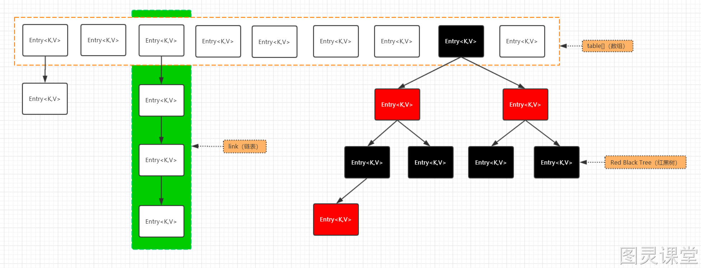

- **哈希值计算：HashMap 使用键的哈希码来计算哈希值，以确定在哪个桶中存储元素。**
- **存储桶： 哈希值用于确定键-值对在数组的哪个位置（桶）存储。每个桶可以包含多个键-值对。**
- **链表和红黑树： 当多个键具有相同的哈希值时，它们被存储在同一个桶中的链表或红黑树中。在 Java 8 中，如果链表长度超过了阈值，且当前 HashMap 的大小大于等于 64，链表会被转化为红黑树以提高性能。**

# 说下你对红黑树的理解？为什么不用二叉树/平衡树呢？
**红黑树本质上是一种二叉查找树，在二叉查找树的基础上引入了额外的规则，以保持平衡。这些规则包括：**

- **每个节点要么是红色，要么是黑色。**
- **根节点永远是黑色的。**
- **所有叶子节点都是黑色的。**
- **每个红色节点的两个子节点一定都是黑色。**
- **从任一节点到其子树中每个叶子节点的路径都包含相同数量的黑色节点。**

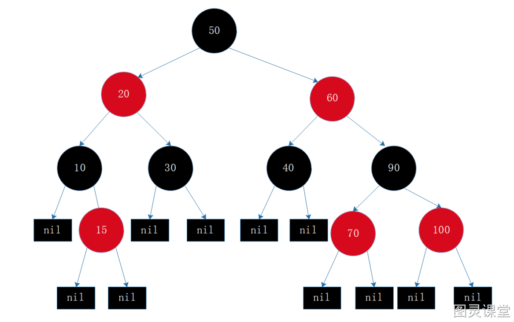
**这些规则确保了树的平衡性，从而保持了查找、插入和删除操作的可预测性和高效性。**

- **为什么不使用普通的二叉树？**

**红黑树具有平衡性，使得最坏情况下的时间复杂度为 O(log n)，相较于普通二叉树的最坏情况下的 O(n)，性能更可靠。**

- **为什么不使用平衡二叉树？**

**平衡二叉树是更严格的平衡树，维护平衡的代价更高，因为它需要更多的旋转操作来确保平衡。相对而言，红黑树在保持平衡方面效率更高，因此插入和删除操作的性能更好。**
**综上所述，红黑树在平衡性和性能之间取得了良好的平衡，因此它被广泛用于实际编程中，特别适用于需要高效查找、插入和删除操作的应用。**

# 红黑树怎么保持平衡的？
**红黑树通过旋转和节点染色这两种方式来保持平衡，这些操作是红黑树维护平衡的关键部分。**

- **旋转操作： 旋转操作是红黑树维持平衡的主要手段之一。它包括左旋和右旋两种基本操作。旋转操作通常在插入和删除操作中使用，以确保树的性质得以维护。**
   - **左旋将一个节点的右子树提升为其父节点，**
   - **右旋则将一个节点的左子树提升为其父节点，以保持树的平衡。**

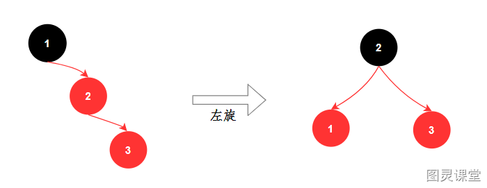
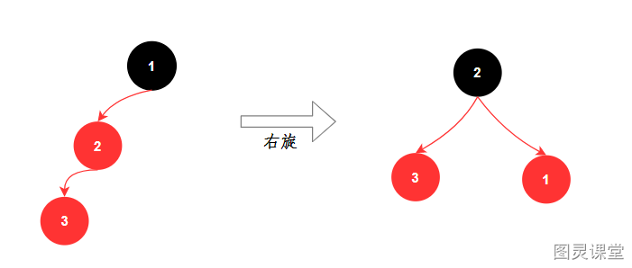

- **节点染色操作： 红黑树中的节点颜色有红色和黑色两种。**
   - **节点染色操作包括将节点着为红色或黑色，通常根据插入和删除操作的需要来改变节点的颜色。**
   - **染色操作用于满足红黑树的规则，例如，保证相邻节点不同时为红色，以维持平衡。**

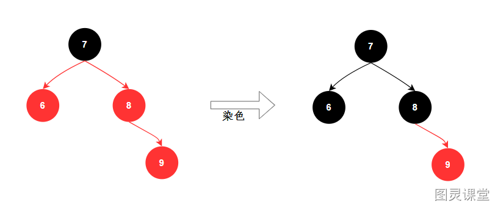
**这两种操作相互配合，以保持树的平衡。当进行插入和删除操作时，红黑树会根据规则进行旋转和染色，以确保树的高度保持相对较小，且所有红黑树的性质得以满足。这些操作使得红黑树能够高效地处理插入、删除和查找等操作，保持性能稳定。**

# HashMap的put 实现是怎样的？
**HashMap 的 put 方法实现了向哈希表中添加键值对的功能。以下是 HashMap 的 put 方法的主要实现步骤：**
```java
public V put(K key, V value) {
    return putVal(hash(key), key, value, false, true);
}

// 第四个参数 onlyIfAbsent 如果是 true，那么只有在不存在该 key 时才会进行 put 操作
// 第五个参数 evict 我们这里不关心
final V putVal(int hash, K key, V value, boolean onlyIfAbsent,
               boolean evict) {
    Node<K,V>[] tab; Node<K,V> p; int n, i;

    // 如果哈希表为空或长度为0，进行初始化或扩容
    if ((tab = table) == null || (n = tab.length) == 0)
        n = (tab = resize()).length;

    // 根据哈希值计算索引
    if ((p = tab[i = (n - 1) & hash]) == null)
        // 如果桶为空，直接将新节点放入桶中
        tab[i] = newNode(hash, key, value, null);
    else {
        Node<K,V> e; K k;

        // 如果当前节点的哈希值和键与要插入的相等，找到匹配的节点
        if (p.hash == hash &&
            ((k = p.key) == key || (key != null && key.equals(k)))
            e = p;
        else if (p instanceof TreeNode)
            // 如果当前节点是树节点，调用树节点的 putTreeVal 方法
            e = ((TreeNode<K,V>)p).putTreeVal(this, tab, hash, key, value);
        else {
            for (int binCount = 0; ; ++binCount) {
                if ((e = p.next) == null) {
                    // 遍历链表，如果到达链表末尾，创建新节点并添加到链表中
                    p.next = newNode(hash, key, value, null);
                    if (binCount >= TREEIFY_THRESHOLD - 1) // -1 for 1st
                        treeifyBin(tab, hash);
                    break;
                }
                if (e.hash == hash &&
                    ((k = e.key) == key || (key != null && key.equals(k)))
                    // 如果找到匹配的节点，跳出循环
                    break;
                p = e; // 继续遍历链表
            }
        }
        if (e != null) { // 存在相同键的映射
            V oldValue = e.value;
            if (!onlyIfAbsent || oldValue == null)
                // 如果不仅仅是插入或旧值为null，更新节点的值
                e.value = value;
            afterNodeAccess(e);
            return oldValue;
        }
    }
    ++modCount; // 更新修改计数器
    if (++size > threshold)
        // 如果元素数量超过阈值，进行扩容
        resize();
    afterNodeInsertion(evict);
    return null; // 返回 null 表示没有旧值
}
```
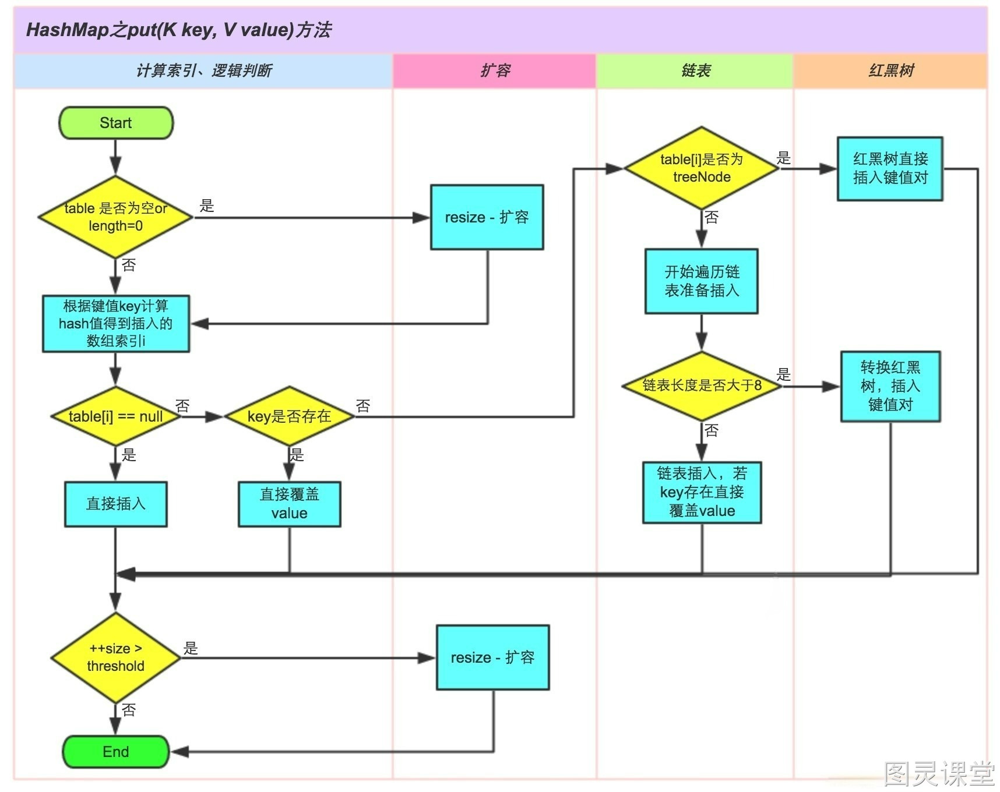
**这段代码展示了 HashMap 的 put 方法的实现，包括计算哈希值、定位桶、处理哈希冲突、插入节点、扩容等关键步骤。该方法确保了键值对能够正确插入到哈希表中，并在需要时进行扩容以维护性能。**

# 为什么哈希/扰动函数能降低 hash碰撞?
**扰动函数本质上是一种用于降低哈希碰撞的技术。扰动函数通常将原始哈希值进行二次哈希或其他变换，使得相同的原始哈希值在经过扰动函数处理后得到的哈希值尽可能地不同。这样，即使有不同的键值产生了相同的原始哈希值，经过扰动函数处理后仍然能够得到不同的哈希值，从而减少哈希碰撞的概率。**
**假如 HashMap 数组的初始大小才 16，就需要用之前需要对数组的长度取模运算，得到的余数才能用来访问数组下标。**
**源码中模运算就是把散列值和数组长度 - 1 做一个 "与&" 操作，位运算比取余 % 运算要快。**
```java
& 全为1才为1
^ 相同为0，不同为1

i = (n - 1) & hash
hash = ((h = key.hashCode()) ^ (h >>> 16))
                       
16    0000 0000 0000 0000 0000 0000 0001 0000
15    0000 0000 0000 0000 0000 0000 0000 1111
hash  0000 0000 0000 0000 0000 0000 0000 0110
&     0000 0000 0000 0000 0000 0000 0000 0110
                                    0000-1111

32    0000 0000 0000 0000 0000 0000 0010 0000
31    0000 0000 0000 0000 0000 0000 0001 1111
hash  0000 0000 0000 0000 0000 0000 0001 0110
&     0000 0000 0000 0000 0000 0000 0001 0110

31    0000 0000 0000 0000 0000 0000 0001 1111
hash  0000 0000 0000 0000 0000 0000 0000 0110
&     0000 0000 0000 0000 0000 0000 0000 0110
									00000-11111
```

# HashMap 的 get 实现？
**相对于 put 来说，get 比较简单：**

- **计算 key 的 hash 值，根据 hash 值找到对应数组下标: hash & (length-1)**
- **判断数组该位置处的元素是否刚好就是我们要找的，如果不是，走第三步**
- **判断该元素类型是否是 TreeNode，如果是，用红黑树的方法取数据，如果不是，走第四步**
- **遍历链表，直到找到相等(==或equals)的 key**
```java
public V get(Object key) {
    Node<K,V> e;
    return (e = getNode(hash(key), key)) == null ? null : e.value;
}

final Node<K,V> getNode(int hash, Object key) {
    Node<K,V>[] tab; // 哈希表数组
    Node<K,V> first, e; // first 表示桶中的第一个节点，e 用于遍历链表或树中的节点
    int n; // 哈希表容量
    K k; // 键对象

    // 检查哈希表非空，容量大于0，以及哈希值所在桶不为空
    if ((tab = table) != null && (n = tab.length) > 0 &&
        (first = tab[(n - 1) & hash]) != null) {
        // 检查第一个节点是否匹配，一般在桶的第一个节点开始查找
        if (first.hash == hash && // 始终检查第一个节点
            ((k = first.key) == key || (key != null && key.equals(k))))
            return first;

        // 如果有多个节点在同一个桶中，需要遍历链表或树
        if ((e = first.next) != null) {
            // 如果第一个节点是树节点，使用树节点的查找方法
            if (first instanceof TreeNode)
                return ((TreeNode<K,V>)first).getTreeNode(hash, key);

            // 遍历链表中的节点
            do {
                if (e.hash == hash &&
                    ((k = e.key) == key || (key != null && key.equals(k))))
                    return e;
            } while ((e = e.next) != null);
        }
    }
    
    // 如果未找到匹配的键值对，返回 null
    return null;
}
```

# 解决哈希冲突有哪些方法呢？
**什么是哈希冲突？**
**当两个不同的数经过哈希函数计算后得到了同一个结果，即他们会被映射到哈希表的同一个位置时，即称为发生了哈希冲突。简单来说就是哈希函数算出来的地址被别的元素占用了。**
**如何解决哈希冲突？**

- **链地址法：这是一种常见的解决哈希冲突的方法，它使用一个数组来存储链表，每个哈希值的冲突元素都存储在链表中。链地址法不需要额外的空间来处理冲突，但需要遍历链表来查找元素。**
- **线性探测：在线性探测中，当发生哈希冲突时，通过顺序查找哈希表中的下一个槽位，直到找到一个空闲的槽位来存储数据。这种方法可以形成一个线性探测序列。**

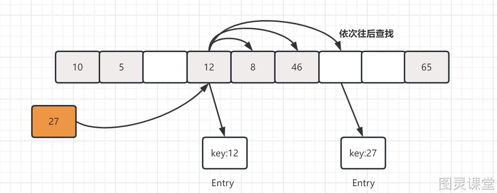

- **双重哈希：双重散列是一种使用两个哈希函数的方法。当发生哈希冲突时，首先使用第一个哈希函数找到一个位置，如果该位置已被占用，就使用第二个哈希函数来查找下一个位置。这种方法通常能够更好地分散数据。**
- **建立公共溢出区：建立公共溢出区是一种简单的解决哈希冲突的方法。当发生哈希冲突时，将冲突的元素存储在一个公共溢出区中，每个桶只存放一个元素。在查找时，如果对应的桶为空，则说明要查找的元素不存在；如果对应的桶中存放了元素，则在公共溢出区中查找对应的元素。**

# HashMap 是线程安全的吗？多线程下会有什么问题？
**HashMap 不是线程安全的，它是非同步的数据结构。在多线程环境下，使用 HashMap 可能会出现以下问题：**

- **扩容死循环：在 JDK 1.7 中，HashMap 使用头插法插入元素，当多个线程同时进行扩容操作时，可能会导致环形链表的形成，从而陷入死循环。为了解决这个问题，在 JDK 1.8 中采用了尾插法插入元素，保持了链表元素的顺序，避免了死循环的问题。**
- **元素丢失：当多个线程同时执行 put 操作时，如果它们计算出的索引位置相同，就会造成前一个 key 被后一个 key 覆盖的情况，从而导致元素的丢失。**
- **get 为 null：当一个线程执行 put 操作导致扩容时，而另一个线程同时执行 get 操作，有可能会导致 get 返回 null 的情况。这是因为在扩容过程中，HashMap 的结构发生了变化，get 操作可能会在旧的结构中查找元素而导致找不到。**

**为了在多线程环境下使用安全的 HashMap，可以采取以下措施：**

1. **使用线程安全的替代品：使用线程安全的集合类，如 ConcurrentHashMap，它是专门设计用于多线程环境的哈希表，提供了高效的并发性能。**
```java
import java.util.concurrent.ConcurrentHashMap;

public class ConcurrentHashMapExample {
    public static void main(String[] args) {
        ConcurrentHashMap<String, Integer> concurrentMap = new ConcurrentHashMap<>();

        concurrentMap.put("A", 1);
        concurrentMap.put("B", 2);

        // 多个线程同时访问 ConcurrentHashMap 是安全的
        Runnable runnable = () -> {
            String key = "A";
            int value = concurrentMap.get(key);
            System.out.println("Thread: " + Thread.currentThread().getId() + " - Value: " + value);
        };

        Thread thread1 = new Thread(runnable);
        Thread thread2 = new Thread(runnable);

        thread1.start();
        thread2.start();
    }
}
```

2. **显式同步：如果必须使用普通的 HashMap，确保在访问和修改 HashMap 时进行适当的同步，使用 synchronized 关键字或其他同步机制来保护共享资源。**
```java
import java.util.HashMap;
import java.util.Map;

public class SynchronizedHashMapExample {
    public static void main(String[] args) {
        Map<String, Integer> synchronizedMap = new HashMap<>();

        synchronizedMap.put("A", 1);
        synchronizedMap.put("B", 2);

        // 多个线程使用显式同步确保线程安全
        Runnable runnable = () -> {
            synchronized (synchronizedMap) {
                String key = "A";
                int value = synchronizedMap.get(key);
                System.out.println("Thread: " + Thread.currentThread().getId() + " - Value: " + value);
            }
        };

        Thread thread1 = new Thread(runnable);
        Thread thread2 = new Thread(runnable);

        thread1.start();
        thread2.start();
    }
}
```

3. **使用线程局部变量：为每个线程维护一个独立的 HashMap 实例，以避免线程间竞争。**
```java
import java.util.HashMap;
import java.util.Map;

public class ThreadLocalHashMapExample {
    public static void main(String[] args) {
        // 使用线程局部变量来维护独立的 HashMap 实例
        ThreadLocal<Map<String, Integer>> threadLocalMap = ThreadLocal.withInitial(HashMap::new);

        // 创建多个线程，每个线程都有独立的 HashMap 实例
        Runnable runnable = () -> {
            Map<String, Integer> localMap = threadLocalMap.get();
            localMap.put("A", 1);
            localMap.put("B", 2);

            String key = "A";
            int value = localMap.get(key);
            System.out.println("Thread: " + Thread.currentThread().getId() + " - Value: " + value);
        };

        Thread thread1 = new Thread(runnable);
        Thread thread2 = new Thread(runnable);

        thread1.start();
        thread2.start();
    }
}
```
**总之，在多线程环境下，应谨慎使用 HashMap，并根据具体情况选择合适的线程安全机制，以确保数据的一致性和线程安全。**

# 数据库表的连接方式？
**在关系型数据库中，表之间可以通过连接（JOIN）来进行关联查询。常见的连接方式有以下几种：**

1. **内连接（INNER JOIN）：内连接是最常用的连接方式，它返回两个表中匹配的行。在内连接中，只有当左表和右表中都存在匹配的行时才会返回结果。**
```plsql
SELECT *
FROM table1
INNER JOIN table2
ON table1.column = table2.column;
```

2. **左连接（LEFT JOIN）：左连接返回左表中的所有行，以及与右表匹配的行。如果右表中没有匹配的行，则返回 NULL 值。**
```plsql
SELECT *
FROM table1
LEFT JOIN table2
ON table1.column = table2.column;
```

3. **右连接（RIGHT JOIN）：右连接返回右表中的所有行，以及与左表匹配的行。如果左表中没有匹配的行，则返回 NULL 值。**
```plsql
SELECT *
FROM table1
RIGHT JOIN table2
ON table1.column = table2.column;
```

4. **全连接（FULL OUTER JOIN）：全连接返回左表和右表中的所有行，如果某个表中没有匹配的行，则返回 NULL 值。**
```plsql
SELECT *
FROM table1
FULL OUTER JOIN table2
ON table1.column = table2.column;
```

5. **自连接（SELF JOIN）：自连接是指在同一个表中进行连接操作，可以用于查找表中某些数据的关联信息。**
```plsql
SELECT *
FROM table1 t1
INNER JOIN table1 t2
ON t1.column = t2.column;
```
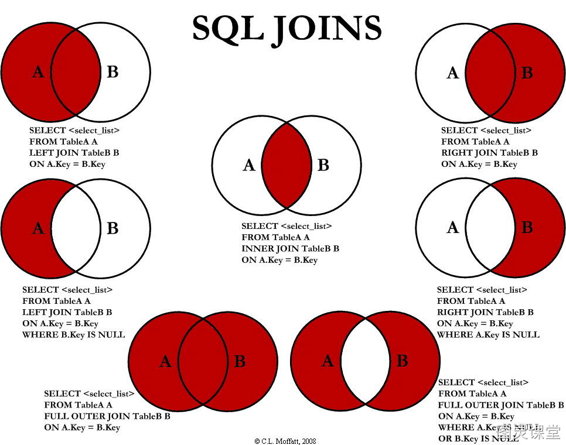
**以上是常见的数据库表连接方式，不同的连接方式可以根据实际需求选择使用。**

# 数据库三大范式是什么？
**三大范式是 Mysql 数据库设计表结构所遵循的规范和指导方法，目的是为了减少冗余，建立结构合理的数据库，从而提高数据存储和使用的性能。**
**三大范式之间是具有依赖关系的，比如第二范式是在第一范式的基础上建设的、第三范式是在第二范式的基础上建设的。**

1. **第一范式（1NF） ：第一范式是指数据库表中的每个列都必须是原子性的，也就是说，每个列中的值都不能再分解成更小的数据项。同时，每个表必须有一个主键，用于唯一标识每条记录。**

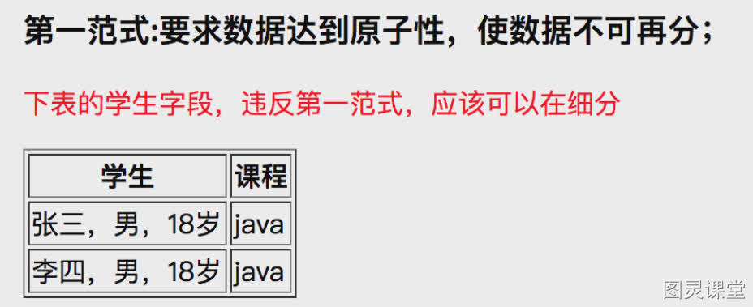

2. **第二范式（2NF） ：第二范式是指表中的非主键列必须完全依赖于主键，而不是依赖于主键的一部分。如果有非主键列依赖于主键的一部分，那么就需要将这些列拆分到另一个表中。**

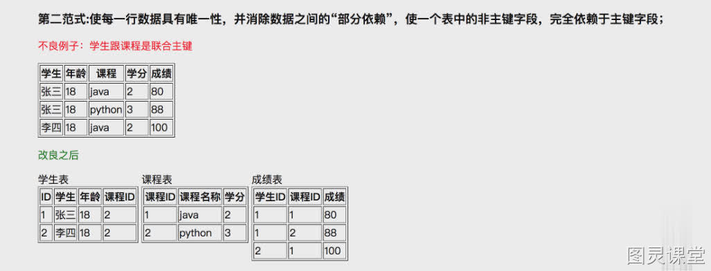

3. **第三范式（3NF） ：第三范式是指表中的非主键列之间不能存在传递依赖关系。也就是说，如果A列依赖于B列，B列依赖于C列，那么A列就不能直接依赖于C列，而是应该将A列拆分到另一个表中。**

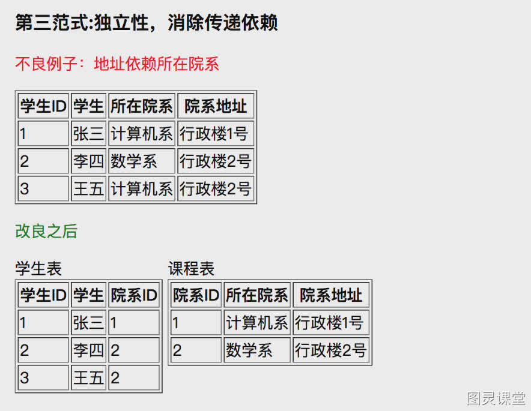
**当然 Mysql 数据库的范式不止三大范式，除了三大范式，还有巴斯-科德范式（BCNF）、第四范式(4NF）、第五范式（5NF，又称“完美范式"）。**
**还需要注意实际上，互联网公司的设计一般都是反范式的，通过冗余一些数据，避免跨表跨库，利用空间换时间，提高性能。**

# varchar 与 char 的区别？
**在关系型数据库中，CHAR和VARCHAR是两种常用的字符串数据类型。它们的区别主要在于存储方式、存储效率和使用场景等方面。**

1. **存储方式：**
   - **CHAR（定长字符型）：CHAR类型的列存储固定长度**，如果存储的字符串长度小于指定长度，则会使用空格进行填充。**
   - **VARCHAR（可变长度字符型）：VARCHAR类型的列可以存储可变长度的字符串，它只占用实际存储的字符串长度加上额外的字节用于记录长度信息。**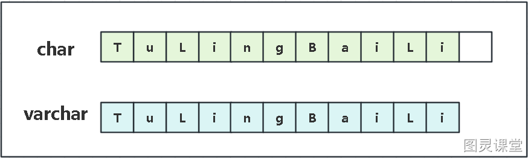
2. **
   - **CHAR：CHAR类型需要占用固定的存储空间，无论实际存储的字符串长度是多少，它的存储效率相对较低。当存储的字符串长度变化较小或基本保持一致时，CHAR类型可能会浪费一些存储空间。**
   - **VARCHAR：VARCHAR类型只占用实际存储的字符串所需的空间，它的存储效率相对较高。当存储的字符串长度变化较大或不确定时，VARCHAR类型可以更有效地利用存储空间。**
3. **查询效率：**
   - **CHAR类型的列在搜索和排序等操作上可能略微快于VARCHAR类型的列，因为它是定长的，无需考虑变长的情况。**
4. **使用场景：**
   - **CHAR适合存储长度固定的字符串，如国家代码、性别等。由于存储空间是固定的，对于长度一致的数据，CHAR可能更高效。**
   - **VARCHAR适合存储长度可变的字符串，如用户输入的文本、评论等。它可以灵活地根据实际需要调整存储空间。**

**总结：**
**如果字符串长度不确定或变化较大，一般建议使用VARCHAR类型；**
**如果字符串长度固定且一致，可以考虑使用CHAR类型以节省存储空间。**
**同时，需要注意CHAR类型在存储空间上的浪费，以及VARCHAR类型在查询效率上的劣势。**

# DATETIME 和 TIMESTAMP 的异同
**MySQL 中常用的两种时间储存类型分别是datetime和 timestamp。如何在它们之间选择是建表时必要的考虑。下面就谈谈他们的区别和怎么选择：**
**相同点：**

      1. **两个数据类型存储时间的表现格式一致。均为 YYYY-MM-DD HH:MM:SS**
   1. **两个数据类型都包含「日期」和「时间」部分。**

**不同点：**

   1. **日期范围：**
         - **DATETIME 的日期范围是 1000-01-01 00:00:00.000000 到 9999-12-31 23:59:59.999999；**
         - **TIMESTAMP 的时间范围是1970-01-01 00:00:01.000000 UTC 到 ``2038-01-09 03:14:07.999999 UTC，会遇到千禧年问题**
   2. **存储空间：DATETIME 的存储空间为 8 字节；TIMESTAMP 的存储空间为 4 字节**
   3. **时区相关：DATETIME 存储时间与时区无关；TIMESTAMP 存储时间与时区有关，显示的值也依赖于时区**
   4. **默认值：DATETIME 的默认值为 null；TIMESTAMP 的字段默认不为空(not null)，默认值为当前时间(CURRENT_TIMESTAMP)**

**选择DATETIME还是TIMESTAMP时，可以考虑以下因素：**

- **功能需求：如果你需要存储不受时区影响的日期和时间信息，使用DATETIME类型更为合适。**

**如果需要存储与时区相关的信息，并希望自动进行时区转换和更新，使用TIMESTAMP类型更为适合。**

- **存储空间：TIMESTAMP类型通常占用较少的存储空间，因为它只存储从'1970-01-01 00:00:01'以来的秒数。而DATETIME类型存储了一个固定长度的日期和时间字符串。**

# MySQL 中 in 和 exists 的区别？
**在 MySQL 中，IN关键字用于在一个字段中匹配多个值。它的语法如下：**
```plsql
SELECT column_name(s)
FROM table_name
WHERE column_name IN (value1, value2, ...);
```
**EXISTS关键字用于检查子查询的结果是否为空。它的语法如下：**
```plsql
SELECT column_name(s)
FROM table_name
WHERE EXISTS (subquery);
```
**区别：**
**MySQL 中的 in 语句是把外表和内表作 hash 连接，而 exists 语句是对外表作 loop 循环，每次 loop 循环再对内表进行查询。**
**单纯的理解 exists 比 in 语句的效率要高的说法其实是不准确的，要区分情景：**

1. **如果查询的两个表大小相当，那么用 in 和 exists 差别不大。**
2. **如果两个表中一个较小，一个是大表，则子查询表大的用 exists，子查询表小的用 in。**
3. **
   - **如果查询语句使用了 not in，那么内外表都进行全表扫描，没有用到索引；**
   - **而 not extsts 的子查询依然能用到表上的索引。所以无论那个表大，用 not exists 都比 not in 要快。**

# 简述索引的基本原理
**索引是数据库中用于加速数据访问的一种数据结构，其基本原理是通过创建额外的数据结构来使得对数据的访问更加快速和高效。**
**在关系型数据库中，通常使用B-Tree或哈希表等索引结构。**

- **B-Tree索引是一种平衡树，可以高效地支持范围查找和顺序查找，适合于有序数据的存储；**
- **而哈希表索引则可以实现O(1)的查找效率，但对于范围查询较为困难。**

**在建立索引时，需要考虑索引的选择性，即不同索引值数量与总记录数之比。选择性高(区分度高)的索引更有利于提高查询效率，因为它可以减少需要扫描的数据量。但同时也需要注意索引的存储空间和更新代价等问题，过多的索引会导致资源浪费和维护成本增加。**
**此外，索引还需要注意合理地使用索引覆盖，即尽可能地使用索引列来完成查询操作，避免对底层数据进行额外的读取，从而提高查询效率。**

# 为什么Mysql使用B+树索引？
**B树是一种自平衡的多路搜索树。**

- **每个节点可以包含多个关键字和对应的指针，即B树的每个节点都会存储数据。**
- **B树的叶子节点之间是无指针相连接的。**

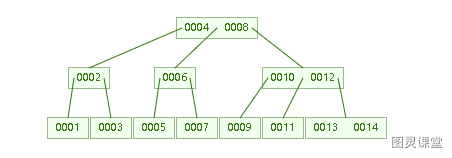
**B+树也是一种自平衡的多路搜索树。**

- **与B树类似，但在B+树中，所有关键字都存储在叶子节点上，非叶子节点只存储索引列和指向子节点的指针。**
- **叶子节点通过指针连接起来，形成一个有序的链表，可以支持顺序访问和范围查询。**

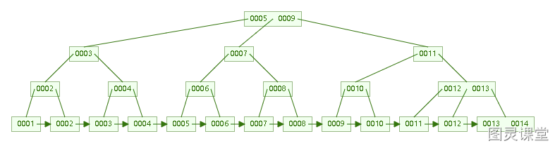
**Mysql使用B+树作为其索引结构的主要原因有以下几点：**

- **范围查询效率高：由于B+树的叶子节点形成有序链表，支持范围查询非常高效。对于数据库查询来说，范围查询是非常常见的操作，因此B+树可以更好地满足这种需求。**
- **顺序访问性能好：B+树的叶子节点形成有序链表，在连续的数据查询中，B+树可以利用磁盘预读**，提高数据的顺序访问性能，减少磁盘I/O次数。**
- **更少的磁盘I/O：B+树的非叶子节点只存储关键字和指针，相比于B树，每个节点可以存储更多的关键字，减少了磁盘I/O次数，提高了数据访问效率。**
- **内存友好：B+树索引的内部节点只包含键值，相对于B树来说更加紧凑，可以节省内存空间。在数据库系统中，索引通常需要缓存在内存中以提高查询性能，因此B+树索引更适合。**

# 最左前缀原则是什么？
**最左前缀原则是数据库索引设计中的一个重要原则，当联合索引包含多个列时，查询语句可以利用从左到右的顺序使用索引，但只能连续使用最左侧的列来进行索引扫描。也就是说，如果一个查询只使用了联合索引中的部分列作为查询条件，那么只有从索引的最左侧列开始连续使用时，索引才会有效。**
**例如，假设有一个联合索引 (a, b, c)，那么查询条件中包含 a 和 b 的查询可以利用该索引，而只包含 b 或者只包含 c 的查询则无法使用该索引。**
```plsql
select * from test where a = 'a' and b = 'b';  --走索引
select * from test where b = 'b' and c = 'c';  --不走索引
select * from test where b = 'b';  --不走索引
select * from test where c = 'c';  --不走索引
```
**最左前缀原则的目的是使索引具有更高的选择性，提高查询效率。由于数据库索引是按照索引列的顺序构建的，选择性高的列放在最左侧可以减少需要检查的索引块数量，从而提高查询性能。**
**需要注意的是，最左前缀原则并不限制查询条件的顺序，只要满足从左到右连续使用索引列即可。此外，如果查询条件不符合最左前缀原则，数据库仍然可以通过全表扫描等方式执行查询，但这种方式通常效率较低。**
**综上所述，最左前缀原则是指在联合索引中只有从最左侧列开始连续使用时，索引才能被有效利用，这有助于提高查询性能和选择性。**
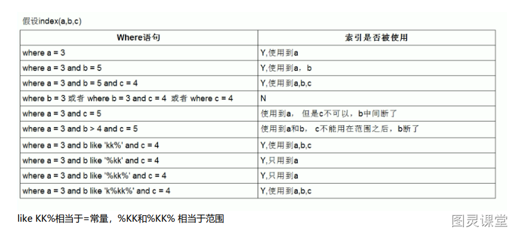

# 索引覆盖是什么
**索引覆盖是一种查询优化技术，在查询过程中只使用索引而不需要回表到数据页来获取查询结果。**
**简单来说，当一个查询需要返回的数据列都包含在一个或多个索引中时，就可以利用索引覆盖来避免额外的磁盘读取操作，从而提高查询性能。**
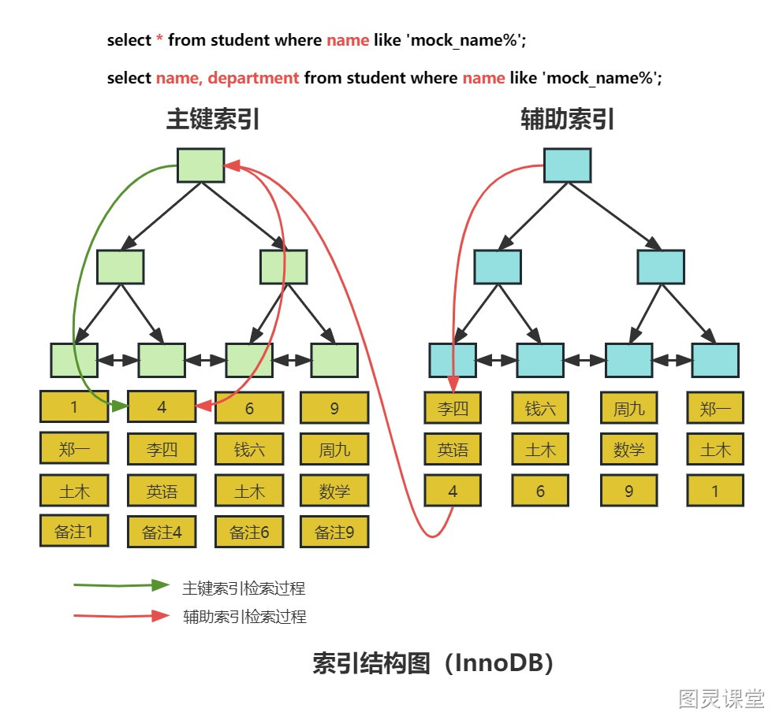
**通常，当一个查询需要访问大量数据行时，如果没有索引覆盖，数据库引擎需要在磁盘上读取相应的数据页，并检索出满足查询条件的数据行。然后，再根据查询需要返回的数据列，将所需数据从内存中筛选出来。这个过程会导致磁盘I/O的开销，并且可能会有大量的数据需要从磁盘读取到内存中，影响查询的性能。**
**而当查询的数据列都包含在索引中时，可以利用索引覆盖来优化查询过程。数据库引擎只需要通过索引进行数据检索，并直接从索引中获取所需的数据列，而不需要再回表到数据页。这样可以大大减少磁盘I/O操作和数据传输，提高查询性能。**
**索引覆盖的好处主要体现在以下几个方面：**

- **减少磁盘I/O操作：由于只需要读取索引页而不是数据页，节省了从磁盘读取数据的开销，提高了查询的速度。**
- **减少数据传输：由于只需要从索引中获取所需的数据列，减少了从磁盘到内存的数据传输量，降低了网络开销。**
- **提高查询性能：索引覆盖可以减少查询所需的操作和资源消耗，加快查询的执行速度，提高系统的响应性能。**

**需要注意的是，索引覆盖并不是适用于所有情况的优化技术。如果查询需要返回大量的数据列或者查询条件较复杂，索引覆盖可能无法满足要求。此外，索引覆盖还需要权衡索引的维护成本和查询性能之间的平衡，因为覆盖索引可能会增加索引的大小和维护的复杂性。**

# MySql聚簇和非聚簇索引的区别
**MySQL中的聚簇索引也被称为主键索引，它是一种特殊类型的索引，用于存储表中的数据记录。与聚簇索引不同，非聚簇索引用于存储对表中数据记录的引用地址。**
 
**下面是聚簇索引和非聚簇索引的区别：**

- **存储方式不同：聚簇索引存储数据记录，非聚簇索引存储对数据记录的引用地址。**
- **查询速度不同：由于聚簇索引存储了整个数据记录，因此在查询时可以直接从聚簇索引中读取数据，从而提高查询速度和性能。而非聚簇索引需要先查找索引，再通过引用地址到数据页中查找相关数据记录，所以查询速度相对较慢。**
- **内存占用不同：由于聚簇索引存储了整个数据记录，因此需要更多的内存。而非聚簇索引只需要存储对数据记录的引用地址，因此需要的内存较少。**
- **索引更新速度不同：由于聚簇索引存储的是数据记录，因此当数据记录发生变化时，需要重构整个索引，从而导致索引更新速度较慢。而非聚簇索引只需要修改对数据记录的引用地址，因此更新速度较快。**

**在实际应用中，聚簇索引通常用于主键或唯一约束列，因为这些列的值是唯一的，可以作为查找数据的入口。而非聚簇索引则适用于其他需要查找的列，如外键和非唯一列等。**
**需要注意的是，MySQL中的InnoDB存储引擎将表的主键定义为聚簇索引，如果没有显式地定义主键，则使用第一个非空的唯一索引作为聚簇索引。同时，对于每个表，只能有一个聚簇索引，但可以有多个非聚簇索引。**

# Mysql数据库中，什么情况下设置了索引但无法使用？
**在MySQL数据库中，虽然设置了索引，但有时候查询执行计划并不会使用索引，导致查询性能无法得到提升。以下是一些常见的原因：**

- **不满足最左前缀原则：MySQL的联合索引遵循最左前缀原则，即只有在查询条件中使用了索引最左边的列，索引才能生效。如果查询条件没有按照索引的最左边列开始，并不会使用索引。**
```plsql
CREATE TABLE IndexValidation (
  id INT AUTO_INCREMENT PRIMARY KEY,
  name VARCHAR(50),
  age INT,
  email VARCHAR(100),
  created_at TIMESTAMP
);

INSERT INTO IndexValidation (name, age, email, created_at) VALUES
    ('Alice', 25, 'alice@example.com', NOW()),
    ('Bob', 30, 'bob@example.com', NOW()),
    ('Charlie', 35, 'charlie@example.com', NOW());
```
```plsql
CREATE INDEX idx_name_age ON IndexValidation (name, age);

EXPLAIN SELECT * FROM IndexValidation WHERE age = 25;
```

- **使用函数或表达式：当查询条件中使用了函数或表达式时，索引可能无法生效。因为索引只能在使用了相同的函数或表达式后才能发挥作用。例如，在WHERE子句中使用了函数操作或进行了类型转换。**
```plsql
CREATE INDEX idx_created_at ON IndexValidation (created_at);

EXPLAIN SELECT * FROM IndexValidation WHERE YEAR(created_at) = 2023;
```

- **隐式类型转换：如果在查询条件中将列与一个不同类型的值比较，MySQL可能会进行隐式类型转换。这可能会导致索引失效，因为MySQL无法使用索引来处理隐式类型转换后的值。**
```plsql
CREATE INDEX idx_age ON IndexValidation (age);

EXPLAIN SELECT * FROM IndexValidation WHERE  age = '25';
```

- **LIKE操作符以通配符开头：当使用LIKE操作符进行模糊匹配时，如果通配符（%）出现在搜索字符串的开头，索引也会失效。因为通配符的位置决定了索引的可用性。**
```plsql
EXPLAIN SELECT * FROM IndexValidation WHERE name LIKE '%A';
```

- **使用OR操作符：当查询条件中包含OR操作符时，如果其中一个条件无法利用索引，整个查询可能会导致索引失效。对于这种情况，可以考虑使用UNION或重写查询来避免使用OR操作符。**
```plsql
EXPLAIN SELECT * FROM IndexValidation WHERE name = 'Alice' OR age = 30;
```

- **数据量太小：对于非常小的数据表，使用索引可能不会带来性能提升，甚至可能导致性能下降。在这种情况下，MySQL可能会选择不使用索引。**
- **数据分布不均匀：如果查询的列值分布不均匀，例如只有少数几个值出现的频率很高，索引的选择性就会降低，从而导致索引失效。**

# **索引的设计原则**
**在设计索引时，需要考虑以下六个原则来提高查询性能和降低数据库负载：**
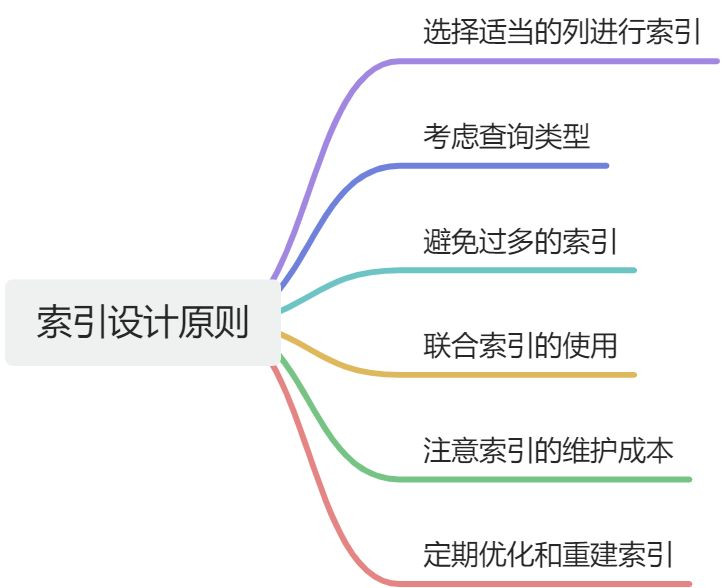

1. **选择适当的列进行索引：选择那些经常被用于查询条件、连接操作和排序的列进行索引。通常来说，选择具有高选择性（即数据分布较均匀）的列作为索引列可以提高索引的效率。**
2. **考虑查询类型：根据常见的查询模式和性能需求，选择合适的索引类型。例如，对于范围查询，B树索引可能更适合；对于全文搜索，全文索引可能更合适。**
3. **避免过多的索引：过多的索引会增加写操作的开销，并占用更多的存储空间。因此，需要权衡索引的数量和性能需求，避免过度索引。**


4. **注意索引的维护成本：索引的创建和维护会带来额外的开销，包括磁盘空间、CPU和内存资源的消耗。因此，需要综合考虑索引的性能收益和维护成本，避免过度索引。**
5. **联合索引的使用：联合索引可以包含多个列，通过多个列的组合来创建索引。在创建联合索引时，需要根据查询的频率和顺序选择合适的列顺序。将最常用的列放在前面可以提高索引的效果。**


6. **定期优化和重建索引：随着数据的变化，索引的效果可能会下降。因此，需要定期对索引进行优化和重建，以保持索引的最佳状态。**

**请注意，这些原则是一般性的指导方针，具体的索引设计还需要根据应用程序的需求、数据库引擎的特性和数据的特点来进行。在实际设计中，可以使用数据库性能监控工具来评估索引的效果，并根据结果进行相应的优化和调整。**

# Mysql慢查询该如何优化
**要优化MySQL的慢查询，可以采取以下一些方法：**

1. **使用合适的索引：通过分析查询语句和数据表结构，确定是否存在需要创建或调整的索引。索引可以加速查询过程，提高查询性能。确保索引覆盖尽可能多的查询条件，避免全表扫描。**
2. **优化查询语句：检查查询语句，确保它们是最优的。避免不必要的关联操作（JOIN），使用合适的连接类型代替（INNER JOIN、LEFT JOIN等）；避免使用子查询、OR操作符、不等于等。**
3. **数据库表优化：对于频繁查询的表，可以考虑进行分库或分表操作，将数据分散存储，提高查询效率。**
4. **优化数据库配置：根据服务器的硬件资源和应用需求，调整MySQL的配置参数，例如缓冲区大小、并发连接数、查询缓存等。**
5. **使用缓存技术：对于一些相对稳定的查询结果，可以考虑使用缓存技术，如Redis、Memcached等，减少对数据库的访问，提高读取性能。**

# 事务的基本特性和隔离级别
**事务4大特性(ACID)：原子性、一致性、隔离性、持久性 **

- **原子性（Atomicity）：事务是不可分割的工作单元，要么全部执行成功，要么全部失败。如果事务中的任何一个操作失败，整个事务会被回滚，以确保数据的一致性。原子性保证了事务的完整性。**
- **一致性（Consistency）：事务在执行前和执行后，数据库必须保持一致状态。这意味着事务将数据库从一个一致状态转变为另一个一致状态。如果一个事务执行过程中发生错误，数据库将被回滚到事务开始前的状态。**
- **隔离性（Isolation）：隔离性确保多个事务可以并发执行，而不会相互干扰。每个事务都应该感觉就像它是唯一运行的，即使在多个事务并发执行的情况下。隔离级别控制了不同事务之间的可见性。**
- **持久性（Durability）：一旦事务提交，其对数据库所做的更改应该是永久性的，即使系统崩溃或重启，更改也不应丢失。数据库系统通常将事务的更改记录到持久性存储介质，如磁盘，以确保持久性。**

**隔离级别是事务隔离性的四种级别，从低到高，依次为：**

- **读未提交（Read Uncommitted）：允许一个事务可以读取另一个事务未提交的数据。这是最低级别的隔离，可能会导致脏读、不可重复读和幻读。**
```plsql
DROP TABLE test;
CREATE TABLE test (id INT PRIMARY KEY, name VARCHAR(20), balance INT);
INSERT INTO test VALUES (1, 'Alice', 1000);
```

- 事务A修改balance并且不提交事务，事务B读取balance值为900；
- 如果此时事务A回滚数据，事务B读取balance值为1000（脏读）；
```plsql
# 事务A
set tx_isolation = 'read-uncommitted';
BEGIN;
UPDATE test SET balance = balance - 100 WHERE id = 1;
SELECT balance FROM test WHERE id = 1;

# @1
rollback
COMMIT;

# 事务B
set tx_isolation = 'read-uncommitted';
BEGIN;
SELECT balance FROM test WHERE id = 1;

# @1:rollback后
SELECT balance FROM test WHERE id = 1;
commit;
```

- **读已提交（Read Committed）：一个事务只能读取已经提交的数据。这可以避免脏读，但仍然允许不可重复读和幻读。**
- 事务A修改balance并且不提交事务，事务B读取balance为1000；当事务A提交后，事务B读取balance值为900；
- 再重新开启事务A修改balance并提交事务，事务B中在读取balance值为800(整个过程事务B都不提交)（不可重复读）；
```plsql
update test set balance = 1000 where id = 1;
# 事务A
set tx_isolation = 'read-committed';
BEGIN;
UPDATE test SET balance = balance - 100 WHERE id = 1;
SELECT balance FROM test WHERE id = 1;
COMMIT;

# @2：再次修改balance并提交事务
BEGIN;
UPDATE test SET balance = balance - 100 WHERE id = 1;
SELECT balance FROM test WHERE id = 1;
COMMIT;

# 事务B
set tx_isolation = 'read-committed';
BEGIN;
# 事务A提交前
SELECT balance FROM test WHERE id = 1;

# 事务A提交后
SELECT balance FROM test WHERE id = 1;

# @2：再次查询balance
SELECT balance FROM test WHERE id = 1;
commit;
```

- **可重复读（Repeatable Read）：一个事务在其生命周期内看到的数据保持一致。这可以避免脏读和不可重复读，但仍然允许幻读。**
- 事务A修改balance并且不提交事务，事务B读取balance为1000；当事务A提交后，事务B读取balance值为1000；
- 开启事务A修改balance并提交事务，事务B中在读取balance值为1000（可重复读）(整个过程事务B都不提交)；
- 开启事务A插入为2的记录，事务B无法读取到2的记录，此时修改id为2balance+1000，可以修改成功，重新读取为2的记录balance为3000（幻读）(整个过程事务B都不提交)
```plsql
update test set balance = 1000 where id = 1;
# 事务A
set tx_isolation = 'repeatable-read';
BEGIN;
UPDATE test SET balance = balance - 100 WHERE id = 1;
SELECT balance FROM test WHERE id = 1;
COMMIT;

# @1:再次修改balance
BEGIN;
UPDATE test SET balance = balance - 100 WHERE id = 1;
SELECT balance FROM test WHERE id = 1;
COMMIT;

# @2:插入id:2记录
BEGIN;
INSERT INTO test VALUES (2, 'Alice2', 2000);
COMMIT;

# 事务B
set tx_isolation = 'repeatable-read';
BEGIN;
# 事务A提交前
SELECT balance FROM test WHERE id = 1;

# 事务A提交后
SELECT balance FROM test WHERE id = 1;

# @1:再次查询balance
SELECT balance FROM test WHERE id = 1;

# @2:查询id:2的记录
SELECT balance FROM test WHERE id = 2;

# 修改id:2的balance，修改成功
update test set balance = balance + 1000 where id = 2;

# 查询id:2的记录
SELECT balance FROM test WHERE id = 2;
commit;
```

- **串行化（Serializable）：最高级别的隔离，要求事务按顺序运行，彼此不会相互干扰。这可以避免脏读、不可重复读和幻读，但可能会导致性能下降，因为事务必须按顺序执行。**
```plsql
update test set balance = 1000 where id = 1;
# 事务A
set tx_isolation = 'serializable';
BEGIN;
UPDATE test SET balance = balance - 100 WHERE id = 1;
COMMIT;

# 事务B
set tx_isolation = 'serializable';
BEGIN;
SELECT balance FROM test WHERE id = 1;
commit;
```

# 什么是脏读、幻读、不可重复读？
**脏读、幻读和不可重复读是数据库事务隔离级别中的三种常见问题。**

- **脏读（Dirty Reads）：事务A读取到了事务B已经修改但尚未提交的数据。**
- **不可重读（Non-Repeatable Reads）：事务A内部的相同查询语句在不同时刻读出的结果不一致。**
- **幻读（Phantom Reads）：事务A读取到了事务B提交的新增数据。**
| **id** | **age** |
| --- | --- |
| **1** | **18** |

| **隔离级别
 | **并发问题
 | **适用场景
 | **隔离级别从上往下，由低到高。**隔离级别越高，事务的并发性能就越低。
 |
| --- | --- | --- | --- |
| **读未提交（read-uncommitted）
 | **可能会导致脏读、幻读或不可重复读 
 | **并发性要求不高
 |  |
| **读已提交（read-committed）
 | **可能会导致幻读或不可重复读 
 | **并发性要求较高
 |  |
| **可重复读（repeatable-read）
 | **可能会导致幻读 
 | **数据一致性要求较高
 |  |
| **可串行化（serializable）
 | **不会产生干扰
 | **数据一致性要求非常高
 |  |


# MySQL的行级锁锁的是什么？
**MySQL 中行级锁可以根据锁粒度的不同分成三种：**

- **针对单个数据行进行加锁，称为记录锁。**
- **针对数据行的间隙进行加锁，称为间隙锁。**
- **记录锁和间隙锁的结合，锁定当前记录行与下一条记录行之间的间隙，称为临健锁。**

**拓展：**
```plsql
drop TABLE orders;
CREATE TABLE orders (
    order_id INT NOT NULL PRIMARY KEY,
    product_name VARCHAR(50) NOT NULL,
    quantity INT NOT NULL
)  ENGINE=InnoDB DEFAULT CHARSET=utf8;

INSERT INTO orders (
	order_id,
	product_name,
	quantity
)
VALUES
	(1, 'iPhone', 2),
	(2, 'iPad', 1),
	(3, 'MacBook', 3),
	(7, 'AirPods', 7),
	(10, 'Apple Watch', 10);
```

- **记录锁（Record Lock）：记录锁是针对单个数据行进行加锁，防止其他事务修改。**

**当一个事务获取了某一行的记录锁后，其他事务无法同时获取该行的记录锁，记录锁只会影响到正在操作的行，不会阻塞其他事务对其他行的写操作。**
**例如：SELECT * FROM orders WHERE order_id = 2 FOR UPDATE; **
**order_id = 2 的这条记录会进行加锁，防止其他事务针对该记录进行删改。**
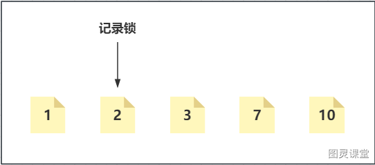

- **间隙锁（Gap Lock）：间隙锁是用于保护一个数据范围的锁机制，它会在索引范围内的间隙（两个索引值之间）上设置锁。**

**当一个事务获取了间隙锁后，其他事务无法在该区间内插入新的数据行，主要用于防止幻读（Phantom Read）的情况发生。**
**例如：SELECT * FROM orders WHERE order_id = 8 FOR UPDATE; **
**由于 orders 表中不存在 order_id = 8 的记录，会将区间 (7,10) 进行加锁，防止其他事务在这个区间进行增删改。**
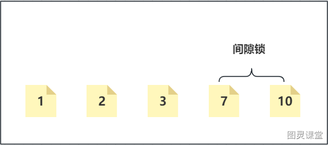

- **临健锁（Next-Key Lock）：临健锁是结合了记录锁和间隙锁的特性，用于保护一个数据范围的间隙和索引上的数据行。**

**它会在索引范围内的间隙和索引上的数据行上设置锁，解决了幻读和间隙插入的问题。**
**例如：SELECT * FROM orders WHERE order_id >= 3 and order_id < 7 FOR UPDATE;**
**该 SQL 将锁定 [3,7) 这个区间，防止其他事务针对该记录进行增删改。**
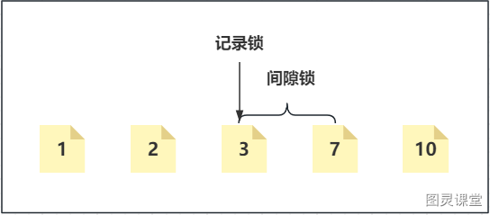
**需要注意间隙锁与临健锁，只在 InnoDb 的 RR 隔离级别下生效。**

# 什么是意向锁？
**在 MySQL 中获取一个公共资源时，会先对该资源进行加锁操作，如果多个事务都是直接获取资源锁，就很可能出现互相阻塞问题，甚至是出现死锁问题。**
**比如说事务 A 针对 Test 表中的某行记录进行了加锁，此时该条记录只能读取不能修改。**
**如果同时事务 B 需要对 Test 表添加表级锁，那么就需要遍历 Test 表中的所有数据看是否存在事务已经针对该表记录添加了行级锁，逐行遍历就比较浪费资源，因此 MySQL 就针对该问题引入了意向锁机制。**
**当一个事物获取行级锁或表级锁时，MySQL 会自动获取相应表的意向锁，我们可以简单理解在表上有一个标志位，标志着是否已经有行级锁或者是表级锁了。**
**这样其他事务也想针对该表进行操作时，只需要先判断意向锁即可，就无需逐行遍历。**
**同时意向锁也分意向共享锁与意向排他锁。**

- **意向共享锁（IS）：在一个事务需要对表中某些行加共享锁（S锁）时，事务首先需要获得表的意向共享锁（IS锁）。**
- **意向排他锁（IX）：指的是在一个事务需要对表中某些行加排它锁（X锁）时，事务首先需要获得表的意向排它锁（IX锁）。**

**需要注意意向锁是一种辅助性的锁，用于协调表级锁和行级锁之间的关系，它并不直接加在数据记录上，而是加在表级别或页面级别上，用于指示事务接下来可能会对数据行进行何种类型的锁定操作。**

# MySQL 加索引会锁表吗？
**在 MySQL 5.6 版本之前，添加索引时需要添加排它锁，也就是说添加索引时阻塞其他所有的读写操作。**
**如果是大表，这可能会导致该表会长时间阻塞，影响真实业务处理，这也就是为什么以前都是凌晨进行更新操作。**
**在 MySQL 5.6 版本引入了 online dll 的技术优化该问题，online dll  允许在不阻塞其他事务的情况下创建或者删除索引。**
**同时 online dll 对不同的 ddl 操作支持也不同，大家可以看看官网提供的文档：**[**官网online dll支持描述**](https://dev.mysql.com/doc/refman/5.7/en/innodb-online-ddl-operations.html)

**虽然 online dll 针对锁表进行了优化，但是在执行的过程中还是会进行锁表的。只是 online dll 的锁表时间大大的减少了。**
**因此我们在线上执行 ddl 语句时，还是应当避免在业务高峰期执行，以避免影响正常业务处理。**
**详细的讲解大家可以看看这边文章：**[**《添加索引真的不会锁表吗》**](https://www.yuque.com/tulingzhouyu/sfx8p0/cwhdopx7y13t3kl9?singleDoc#%20%E3%80%8A%E6%B7%BB%E5%8A%A0%E7%B4%A2%E5%BC%95%E7%9C%9F%E7%9A%84%E4%B8%8D%E4%BC%9A%E9%94%81%E8%A1%A8%E5%90%97%EF%BC%9F%E3%80%8B)


# 什么是排他锁和共享锁？
**排他锁（Exclusive Lock）和共享锁（Shared Lock）是两种常见的数据库锁机制，用于控制对数据的并发访问。**

1. **排他锁（Exclusive Lock）：**
   - **排他锁是一种独占锁，也称为写锁。当一个事务获取了排他锁后，其他事务无法再获取该数据项的任何锁，包括共享锁和排他锁。**
   - **排他锁适用于需要修改数据的操作，它确保在事务修改数据时，其他事务无法读取或修改相同的数据，从而保证了数据的一致性。**

**用法：SELECT ······ FOR UPDATE;**
**在查询语句后面添加 FOR UPDATE 语句，MySQL 会对该 SQL 结果集记录添加排它锁，这里边涉及到锁升级情况，如果结果集中无索引，则在表级别添加锁也就是表锁，如果存在索引，则添加行级锁。**

2. **共享锁（Shared Lock）：**
   - **共享锁是一种共享访问锁，也称为读锁。多个事务可以同时获取相同数据项的共享锁，彼此之间不会互斥。**
   - **共享锁适用于只读操作，它允许多个事务同时读取相同的数据，提高了并发性能。**

**用法：SELECT ······ LOCK IN SHARE MODE;**
**在查询语句后面添加 LOCK IN SHARE MODE 语句，MySQL 会对该 SQL 结果集记录添加共享锁，允许其他事务同时读取这些记录。如果其他事务是添加排他锁，则需要等待共享读锁释放后才能继续进行。**
**排他锁和共享锁之间存在互斥关系，即当一个事务持有排他锁时，其他事务无法获取该数据项的共享锁；同样地，当一个事务持有共享锁时，其他事务无法获取该数据项的排他锁。**
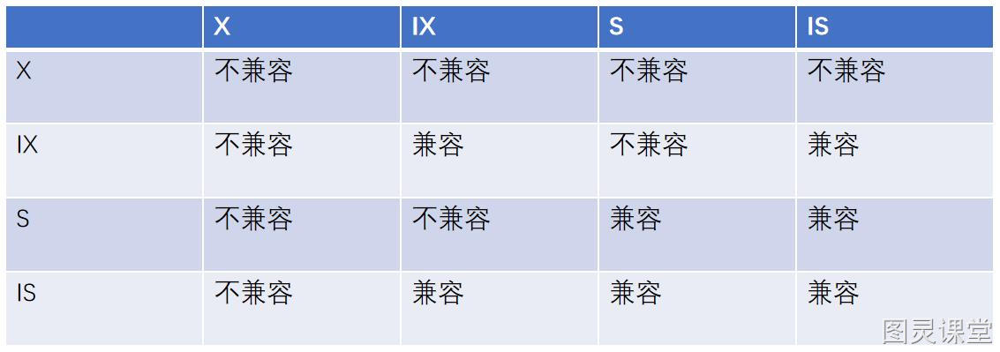
**X：共享锁；IX：意向共享锁；S：排他锁；IS：意向排他锁；**

# 什么是MySQL的字典锁？
**MySQL的字典锁，也称为元数据锁（MDL，MetaData Lock），是一种为了保护数据库对象的元数据而设计的锁机制。**
**在 MySQL 5.5.3 之前有个 bug#989 ，大概得操作流程如下：**
```plsql
事务A
BEGIN;
	INSERT INTO t ... ;
COMMIT; 

事务B
DROP TABLE t;
```
**最终的在 binlog 中记录的是先删除表在插入数据，这样备份库在同步数据时就被中断了。为了解决这个问题，MySQL5.5.3 版本引入了 MDL 锁保护表的元数据信息，用于解决或者保证DDL操作与DML操作之间的一致性。**
**MDL是表级锁，是在server层加的，适用于所有存储引擎。所有的dml操作都会在表上加一个MDL读锁；所有的ddl操作都会在表上加一个MDL写锁。**
**读锁和写锁的阻塞关系如下：**

- **读锁和写锁之间相互阻塞，即同一个表上的dml和ddl之间互相阻塞。**
- **写锁和写锁之间互相阻塞，即两个session不能对表同时做表定义变更，需要串行操作。**
- **读锁和读锁之间不会产生阻塞。也就是增删改查不会因为MDL 锁产生阻塞，可以并发执行，日常工作中大家看到的dml之间的锁等待是innodb行锁引起的，和MDL 锁无关。**

**熟悉innodb行锁的同学这里可能有点困惑，因为行锁分类和MDL锁很类似，也主要分为读锁和写锁，或者叫共享锁和排他锁，读写锁之间阻塞关系也一致。二者最重要的区别一个是表锁，一个是行锁，且行锁中的读写操作对应在 MDL 锁中都属于读锁。**

# 什么是 Spring 的 IOC
**Spring 的 IOC，全称 Inversion of Control，翻译过来就是控制反转的意思，它是 Spring 框架的核心概念之一。**
**什么是控制反转？简单理解，某个事物的控制权发生了反转，什么控制权？对象控制权。**
**没有使用 IOC 时，应用程序通常负责对象的创建和管理。这会导致高耦合度，难以维护和测试。**
**使用 IOC 后，Spring 的 IoC 通过容器管理对象的生命周期和依赖关系，降低了组件之间的耦合度，提高了灵活性和可维护性。**
**IOC将控制流反转，使得应用程序更专注于业务逻辑，而不是对象的创建和管理。**
```plsql
// 没有使用IoC的情况
public class MyService {}

public class MyApp {
    public static void main(String[] args) {
        MyService myService = new MyService();
        myService.dosomething();
    }
}

// 使用IoC的情况
@Component
public class MyService {}

public class MyApp {
    @Autowired
    private MyService myService;

    public void run() {
        myService.dosomething();
    }
}
```
**使用 IOC 的好处：**

1. **降低耦合度： 降低了组件之间的耦合度，使得对象之间的关系更加灵活。**
   1. **在上述例子中，MyApp 不直接创建 MyService，而是通过IoC容器注入，减少了组件之间的直接依赖，提高了代码的灵活性和可维护性。**
   2. **如果将来需要更改或替换 MyService，只需更新IoC容器中的配置，而无需修改 MyApp 的代码。**
2. **提高可维护性： 通过容器管理对象的生命周期，使得代码更易于维护和理解。**
   1. **IoC将对象的创建和管理交给容器，减轻了开发者的负担，同时使代码更清晰，易于理解。**
   2. **通过集中管理对象的生命周期，开发者可以更轻松地进行代码维护，例如在需要修改对象实例化方式或更新依赖关系时，只需修改IoC容器的配置，而不是在整个代码中进行修改。**
3. **增强可测试性： 支持依赖注入，使得单元测试更容易实现，提高了代码的可测试性。**
   1. **通过依赖注入，可以轻松地替换对象的依赖项，使单元测试更加简单和可靠。**
   2. **这样，开发者可以更方便地编写测试用例，验证代码的各个部分的功能，提高了代码的可测试性和质量。**
4. **提高灵活性：容器管理对象的创建和依赖关系，使得应用程序更容易适应变化。**
   1. **当应用程序需要调整对象的创建方式或修改依赖关系时，通过更新IoC容器的配置，而不是直接修改代码，可以更快速地适应变化，提高了应用程序的灵活性。**

# 什么是 Spring 的 AOP
**Spring 的 AOP，全称 Aspect-Oriented Programming，面向切面编程的意思，是 Spring 框架的另一个核心概念。**
**简单来说，将一些跟业务没有关联性的逻辑剥离出来进行统一处理。**
**确切地说，Spring AOP通过切面（Aspects）将横切关注点从业务逻辑中分离，提高了代码的模块性。**
**这允许对一些横跨多个业务对象的非业务逻辑（如日志、事务、安全性等）进行统一处理，使代码更清晰易懂，同时避免了重复性代码。 **
**AOP通过划分关注点和横切关注点的方式提高了代码的可维护性和可重用性。**
```plsql
没有使用AOP的代码：
public class UserService {
    public void addUser() {
        // 业务逻辑
        Logger.log("User added"); // 重复的日志代码
    }

    public void updateUser() {
        // 业务逻辑
        Logger.log("User update"); // 重复的日志代码
    }
}

使用AOP的代码：
@Aspect
public class LoggingAspect {
    @Before("execution(* com.example.UserService.*(..))")
    public void logBefore() {
        Logger.log("User added");
    }

    @AfterReturning("execution(* com.example.UserService.*(..))")
    public void logAfterReturning() {
        Logger.log("After user operation");
    }
}

public class UserService {
    public void addUser() {
        // 业务逻辑
    }
}
```
**Spring AOP涉及以下核心概念：**

1. **切面（Aspect）： 横切关注点的模块化单元，它定义了在何处以及如何应用横切关注点。**
2. **连接点（Join Point）： 在应用程序执行过程中，切面可以插入的点，如方法执行的时候。**
3. **通知（Advice）： 切面在连接点上执行的具体操作，包括"前置通知"、"后置通知"、"环绕通知"等。**
4. **切入点（Pointcut）： 定义一组连接点的表达式，指定切面在何处执行。**
5. **引入（Introduction）： 允许切面为现有的类添加新方法或属性。**
6. **目标对象（Target Object）： 切面所影响的原始对象。**
7. **代理（Proxy）： 由AOP框架生成的对象，用于将横切逻辑应用到目标对象上。**

# Spring 事务传播机制
**Spring事务传播机制定义了事务方法如何与已经存在的事务进行交互，简单的理解就是多个事务方法相互调用时，事务如何在这些方法间传播。**
**在繁琐的业务场景中，多个事务方法间的调用可能引起事务不一致，如数据丢失、重复提交等。**
**在 Spring 中主要有七种事务传播级别：**

1. **REQUIRED（默认）： 如果当前存在事务，则加入该事务；如果当前没有事务，则新建一个事务。这是最常见的传播行为。**
2. **SUPPORTS： 如果当前存在事务，则加入该事务；如果当前没有事务，则以非事务状态执行。适用于不希望事务干扰的只读操作。**
3. **NOT_SUPPORTED： 总是以非事务状态执行操作。如果当前存在事务，则挂起当前事务。**
4. **REQUIRES_NEW： 总是开启一个新的事务。如果当前存在事务，则挂起当前事务，并创建一个新的事务。适用于需要独立事务执行的操作。**
5. **NESTED： 如果当前存在事务，则在嵌套事务中执行；如果当前没有事务，则行为类似于 REQUIRED。但是，嵌套事务可以独立于外部事务进行提交或回滚。**
6. **MANDATORY： 必须在事务中执行，如果当前没有事务，则抛出异常。适用于需要强制在事务中执行的操作。**
7. **NEVER： 总是以非事务状态执行操作。如果当前存在事务，则抛出异常。**
```java
package com.Baili.aspect;

import org.aspectj.lang.JoinPoint;
import org.aspectj.lang.annotation.Aspect;
import org.aspectj.lang.annotation.Before;
import org.springframework.stereotype.Component;

@Aspect
@Component
public class BailiAspect {

	@Before("execution(public void com.Baili.service.UserService.test())")
	public void BailiBefore(JoinPoint joinPoint) {
		System.out.println("BailiBefore");
	}
    
}
```
```java
package com.Baili.service;

import org.springframework.beans.factory.annotation.Autowired;
import org.springframework.jdbc.core.JdbcTemplate;
import org.springframework.stereotype.Component;
import org.springframework.transaction.annotation.Propagation;
import org.springframework.transaction.annotation.Transactional;

@Component
public class UserService  {

	@Autowired
	UserService userService;
	@Autowired
	JdbcTemplate jdbcTemplate;

	@Transactional
	public void test(){
		jdbcTemplate.execute("INSERT INTO `test`.`employees` (`name`, `age`, `position`, `hire_time`, `remark`) VALUES ('徐庶', 20, 'shanghai', '2023-06-11 20:51:35', '测试3');\n");
		userService.test2();  //代理对象调用，事务不失效，由于是NEVER级别，存在事务出现异常插入失败
        test2(); //直接调用，事务失效，由于是NEVER级别，反而可以成功插入
	}

	@Transactional(propagation = Propagation.NEVER)
	public void test2(){
		jdbcTemplate.execute("INSERT INTO `test`.`employees` (`name`, `age`, `position`, `hire_time`, `remark`) VALUES ('诸葛', 20, 'shanghai', '2023-06-11 20:51:35', '测试3');\n");
	}
}
```

# Autowired 和 Resource 的区别
**@Autowired和@Resource都是用于依赖注入的注解，用于将其他组件或资源自动注入到目标对象中。比如说：**
```java
@Autowired
private Bean A;

@Resource
private Bean B;
```
**但是它们在使用方式和功能上有一些区别：**

1. **@Autowired：在获取 Bean 时，先通过类型进行匹配，在根据名称进行匹配。示例如下：**
```java
@Component
class ABean implements Bean {}
@Component
class BBean implements Bean {}

@Service
class Test {

    //自动装配失败，按照类型找到两个 Bean：ABean 与 BBean，在根据名称 bean 未找到目标Bean， 装配失败。
    @Autowired
    private Bean bean;

    //自动装配成功，按照类型找到两个 Bean：ABean 与 BBean，在根据名称 ABean 找到目标Bean，装配成功。
    @Autowired
    @Qualifier("ABean")
    private Bean bean;

    //自动装配成功，按照类型找到两个 Bean：ABean 与 BBean，在根据名称 BBean 找到目标Bean，装配成功。
    @Autowired
    private Bean BBean;  
}
```

- **是Spring框架的注解，基于类型进行依赖注入。**
- **支持通过@Qualifier注解指定具体的Bean名称进行注入。**
- **可以用于构造器、字段、方法或者参数上。**
2. **@Resource：在获取 Bean 时，先通过名称进行匹配，在根据类型进行匹配。示例如下：**
```java
@Component
class ABean implements Bean {}
@Component
class BBean implements Bean {}

@Service
class Test {

    //自动装配失败，按照名称未找到目标Bean，在根据类型找到两个 Bean：ABean 与 BBean ，装配失败。
    @Resource
    private Bean bean;

    //自动装配成功，按照名称找到目标Bean，装配成功。
    @Resource(name = "ABean")
    private Bean bean;  
    
    //自动装配成功，按照名称找到目标Bean，装配成功。
    @Resource
    private Bean BBean;
}
```

- **是Java EE规范中定义的注解，在Java 6及以上版本中可用。**
- **默认按照属性名称进行查找，也可以通过name属性指定具体的Bean名称进行注入。**
- **只能用于字段、setter方法或者参数上。**


> 原文: <https://www.yuque.com/tulingzhouyu/db22bv/ecg9nv4gqlb5uwck>