# 🚛 超详细Redis7.X 安装以及快速入门加常见面试题讲解


# Redis简介

## 1.1 什么是Redis
Redis是一个基于内存的键值存储数据库，它通过在内存中存储键值对数据来实现快速的读写访问，并且提供了非常丰富的数据结构，同时还支持非常丰富的功能特性。

## 1.2 Redis的数据结构

- **字符串（Strings）：** 存储字符串类型的值。
- **哈希表（Hashes）：** 存储字段和对应值的映射。
- **列表（Lists）：** 存储有序的字符串列表。
- **集合（Sets）：** 存储不重复的字符串集合。
- **有序集合（Sorted Sets）：** 类似集合，但每个元素都关联一个分数，可以按分数排序。

## 1.3 Redis的功能特性

- **安全性**：
   - 密码保护：通过设置密码保护访问。
   - ACL：用户访问控制列表。
- **多种数据结构**：十大数据结构。
- **发布订阅：**支持发布订阅模式，用于消息队列等场景。
- **事务**：支持将多个命令打包执行，保持原子性。
- **支持持久化：**可以将数据持久化到磁盘，保证数据安全。
- **复制**：支持主从复制，实现数据的冗余和读取扩展。
- **哨兵系统**：用于监控主服务器的状态，自动进行故障转移。
- **集群**：通过Redis Cluster实现数据分片和高可用性。
- **性能监控**：提供多种监控工具和命令，用于跟踪性能和状态。
- **数据过期**：可以为数据设置生存时间（TTL），自动过期。
- **Lua脚本**：支持在Redis服务器上执行Lua脚本。
- **慢查询日志**：记录执行时间超过指定阈值的查询。

# Redis 安装
本教程将演示在 linux 环境下安装 Redis7，给大家最简单，最快捷的安装方式，其中包括单机部署、主从部署、哨兵部署、集群部署的安装以及相应的架构介绍。

## 单机部署

### 检查安装 gcc 环境
Redis是由C语言编写的，它的运行需要C环境，因此我们需要先安装gcc。
```shell
-- 关闭防火墙
systemctl stop firewalld.service
-- 状态
firewall-cmd --state
-- 卸载防火墙
yum remove firewalld

-- 检查版本
gcc --version
-- 安装 gcc
yum install gcc
```


### 下载安装 Redis
```shell
-- 安装应用养成良好习惯，文件归类
mkdir -p /opt/software/redis

-- 进入redis文件夹，使用wget下载
cd /opt/software/redis
wget https://download.redis.io/redis-stable.tar.gz

-- 解压下载的redis包
tar -xzf redis-stable.tar.gz

-- 进入redis-stable目录，然后使用make install 编译并安装，安装完成后 /usr/local/bin 会生成相应的服务
cd redis-stable
make install

-- 检查是否成功生成
ll /usr/local/bin
```
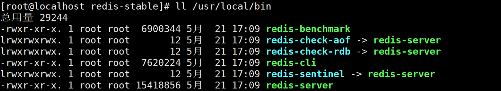
文件介绍：redis-benchmark：性能测试工具
redis-check-aof：修复有问题的 aof 文件
redis-check-rdb：修复有问题的rdb文件
redis-sentinel：Redis集群使用
redis-server：Redis服务器启动命令
redis-cli：客户端，操作入口

### 启动 Redis
到这里其实我们可以在使用 /opt/software/redis/redis-stable/src 或者 /usr/local/bin 目录下的 redis-server 启动 Redis 服务了。
```shell
Redis 源码路径下启动
./src/redis-server

使用usr/local/bin 路径下启动（该目录下）
redis-server
```
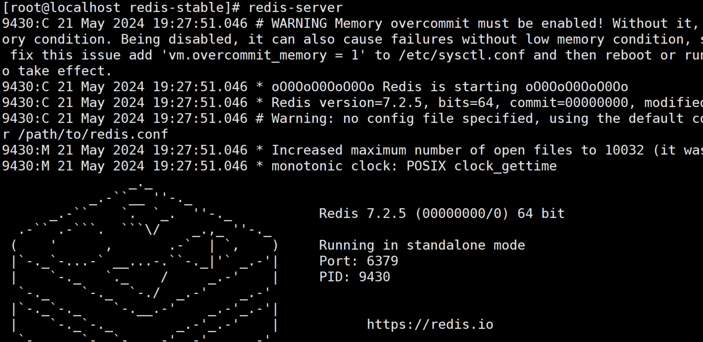

### 配置Redis
前面的启动方式无法再后台运行，退出之后直接关闭了 Redis 服务，所以我们还需要针对 Redis 做一些设置。
```shell
-- 修改当前Redis目录下的 Reids.conf 文件
vim redis.conf
```
需要修改的内容如下：如果大家使用 vim 打开后没有行号，可以在打开 vim 后输入：“：set number”。
```shell
bind * -::*                         #87行，修改bind 项，* -::* 支持远程连接
daemonize yes                       #309行，开启守护进程，后台运行
logfile /opt/software/redis/redis-stable/redis.log     #355行，指定日志文件目录
dir /opt/software/redis             #510行，指定工作目录
requirepass 1qaz@WSX                #1044行，给默认用户设置密码，主要是使用 redis-cli 连接 redis-server时，需要通过密码校验。自行学习，可以不设置。
protected-mode no                   #111行，允许远程连接       如果不设置密码必须讲此设置关闭。
```
修改完成后，使用配置文件启动 Redis，并使用 redis-cli 连接测试，需要注意由于前面我们配置了安全密码，所以连接后需要先验证密码，否则会报错。
```shell
redis-server redis.conf
redis-cli
auth 1qaz@WSX
```
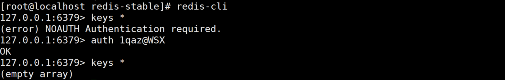

### 退出 OR 关闭 redis
```shell
-- 退出redis
quit

-- 关闭redis
redis-cli shutdown
```

## 主从部署（Master-Slave Replication）
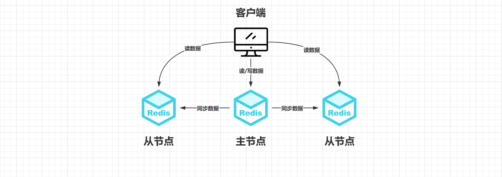
主从复制，是指将一台Redis服务器的数据，复制到其他的Redis服务器。前者称为主节点(Master)，后者称为从节点(Slave)；数据的复制是单向的，只能由主节点到从节点。默认情况下，每台Redis服务器都是主节点；且一个主节点可以有多个从节点(或没有从节点)，但一个从节点只能有一个主节点。

### 主从复制的作用
a）数据冗余：主从复制实现了数据的热备份，是持久化之外的一种数据冗余方式。
b）故障恢复：当主节点出现问题时，可以由从节点提供服务，实现快速的故障恢复；实际上是一种服务的冗余。
c）负载均衡：在主从复制的基础上，配合读写分离，可以由主节点提供写服务，由从节点提供读服务（即写Redis数据时应用连接主节点，读Redis数据时应用连接从节点），分担服务器负载；尤其是在写少读多的场景下，通过多个从节点分担读负载，可以大大提高Redis服务器的并发量。
d）高可用基石：除了上述作用以外，主从复制还是哨兵和集群能够实施的基础，因此说主从复制是Redis高可用的基础。

### 主从复制部署
整体架构图
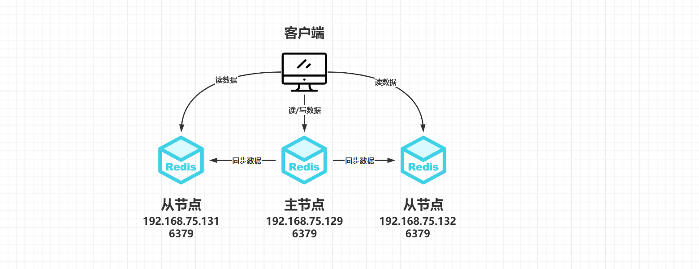
主节点不需要做任何改变，从节点都需要修改配置加上主节点信息，配置完成后，可以再主库检查从节点信息
```shell
# 添加主节点信息
replicaof 192.168.75.129 6379 
```
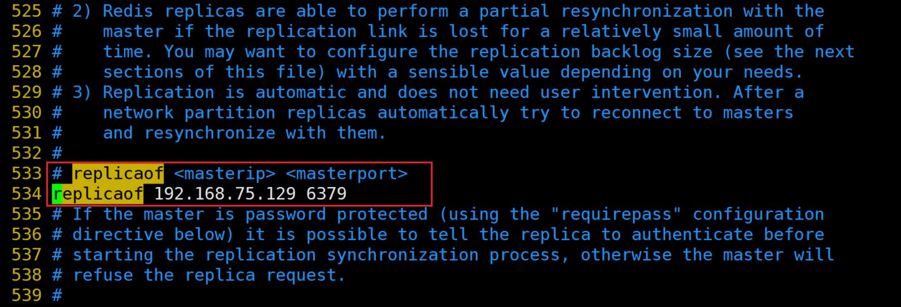
```shell
-- 主节点查看从节点信息
info Replication
```
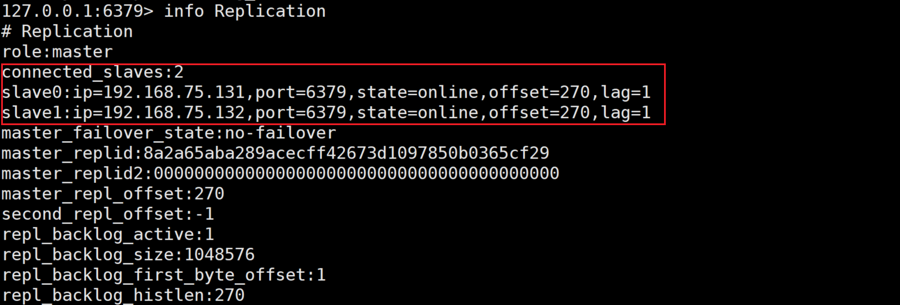

### 主从复制缺点

- 复制延时，信号衰减

由于所有的写操作都是现在master上操作，然后同步更新到slave上，所以从master同步到slave机器上有一定的延迟，当系统很繁忙的时候，延迟问题会更加严重，slave机器数量的增加也会使这个问题更加严重。

- master挂了如何办？

默认情况下，不会在slave节点中自动重选一个master，每次都要人工干预。

## 哨兵部署（Sentinel）
Redis的主从复制主要用于实现数据的冗余备份和读分担，并不是为了提供高可用性。因此在系统高可用方面，单纯的主从架构无法很好的保证整个系统高可用

### 哨兵模式的原理
Redis哨兵模式是通过在独立的哨兵节点上运行特定的哨兵进程来实现的。这些哨兵进程监控主从节点的状态，并在发现故障时自动完成故障发现和转移，并通知应用方，实现高可用性。
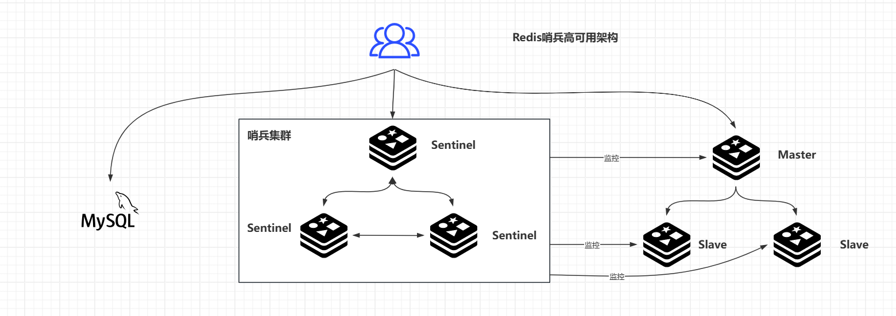

### 哨兵
在启动时，每个哨兵节点会执行选举过程，其中一个哨兵节点被选为领导者（leader），负责协调其他哨兵节点。

- **选举过程：**

每个在线的哨兵节点都可以成为领导者，每个哨兵节点会向其它哨兵发is-master-down-by-addr命令，征求判断并要求将自己设置为领导者；
当其它哨兵收到此命令时，可以同意或者拒绝它成为领导者；
如果哨兵发现自己在选举的票数大于等于num(sentinels)/2+1时，将成为领导者，如果没有超过，继续选举。

- **监控主从节点：**

哨兵节点通过发送命令周期性地检查主从节点的健康状态，包括主节点是否在线、从节点是否同步等。如果哨兵节点发现主节点不可用，它会触发一次故障转移。

- **故障转移：**
    	一旦主节点被判定为不可用，哨兵节点会执行故障转移操作。它会从当前的从节点中选出一个新的主节点，并将其他从节点切换到新的主节点。这样，系统可以继续提供服务而无需人工介入。
- **故障转移过程：**
	由Sentinel节点定期监控发现主节点是否出现了故障： sentinel会向master发送心跳PING来确认master是否存活，如果master在“一定时间范围”内不回应PONG 或者是回复了一个错误消息，那么这个sentinel会主观地(单方面地)认为这个master已经不可用了。
- **确认主节点：**
   - 过滤掉不健康的（下线或断线），没有回复过哨兵ping响应的从节点
   - 选择从节点优先级最高的
   - 选择复制偏移量最大，此指复制最完整的从节点
   - 当主节点出现故障， 由领导者负责处理主节点的故障转移。
- **客户端重定向：**
	哨兵节点会通知客户端新的主节点的位置，使其能够与新的主节点建立连接并发送请求。这确保了客户端可以无缝切换到新的主节点，继续进行操作。

此外，哨兵节点还负责监控从节点的状态。如果从节点出现故障，哨兵节点可以将其下线，并在从节点恢复正常后重新将其加入集群。

### 客观下线
当主观下线的节点是主节点时，此时该哨兵3节点会通过指令sentinel is-masterdown-by-addr寻求其它哨兵节点对主节点的判断，当超过quorum（选举）个数，此时哨兵节点则认为该主节点确实有问题，这样就客观下线了，大部分哨兵节点都同意下线操作，也就说是客观下线。

### 哨兵模式部署
整体架构图
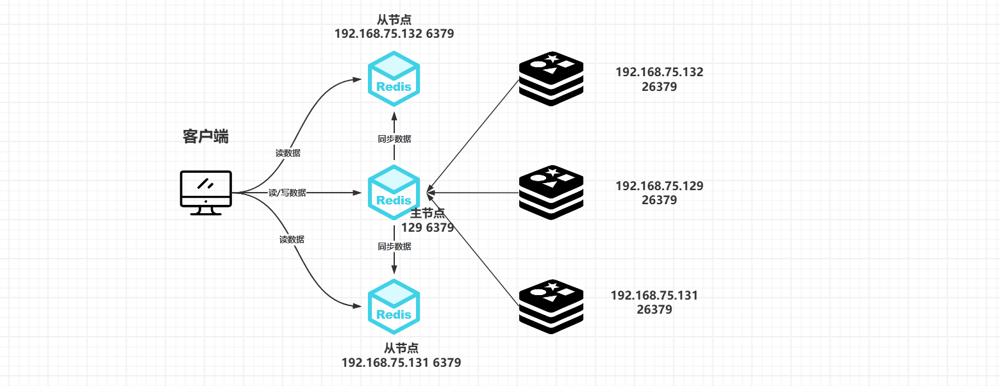
3 个机器都需要修改 sentinel.conf 配置，配置完成之后先从主节点开始启动哨兵。
```shell
protected-mode no                                #6行，关闭保护模式
daemonize yes                                    #15行，指定sentinel为后台启动
logfile /opt/software/redis/redis-stable/sentinel.log                 #34行，指定日志存放路径
dir /opt/software/redis                          #73行，指定数据库存放路径
sentinel monitor mymaster 192.168.75.129 6379 2  #93行，修改 指定该哨兵节点监控20.0.0.20:6379这个主节点，该主节点的名称是mymaster，最后的2的含义与主节点的故障判定有关：至少需要2个哨兵节点同意，才能判定主节点故障并进行故障转移
sentinel down-after-milliseconds mymaster 30000  #134行，判定服务器down掉的时间周期，默认30000毫秒（30秒）
sentinel failover-timeout mymaster 180000        #234行，故障节点的最大超时时间为180000（180秒）
```
启动后检查哨兵状态：
```shell
redis-cli -p 26379 info sentinel
```
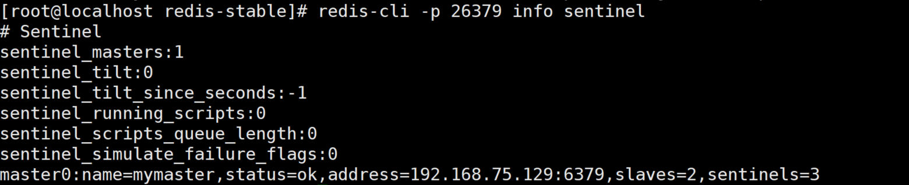
故障模拟
```shell
-- 可以杀掉主节点的进程，也可以直接停掉主节点服务
ps aux | grep redis
redis-cli shutdown

-- 观察哨兵日志，129 主节点下线，重新选举131为主节点
tail -f sentinel.log

--重新启动 129 服务 并观察日志，129加入主从，此时主节点为131服务
redis-server redis.conf
tail -f sentinel.log
redis-cli -p 26379 info sentinel
-- 观察哨兵日志
tail -f sentinel.log

-- 停止哨兵
redis-cli -p 26379 shutdown
```
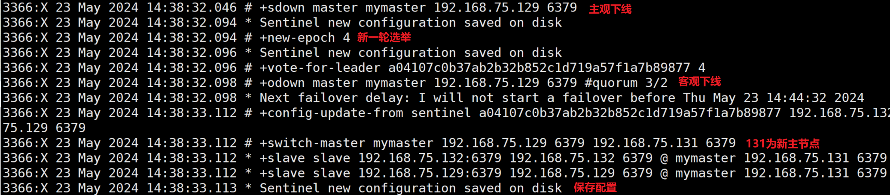
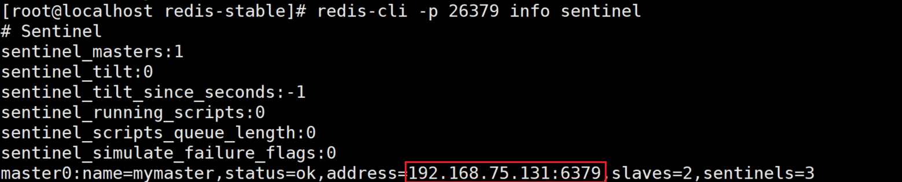
```shell
-- 切换到131服务，已经为主节点。
redis-cli info replication
```
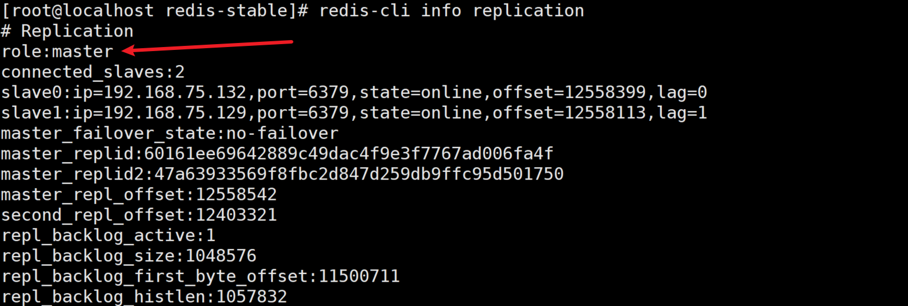
当触发了哨兵选举之后，会再后台更改 redis.conf 与 sentinel.conf，可以检查每台机器的文件末尾的数据
```shell
cat redis.conf
cat sentinel.conf
```


### 哨兵使用建议

- 哨兵节点的数量应为多个，哨兵本身应该集群，保证高可用
- 哨兵节点数应该是奇数
- 各个哨兵结点的配置应一致
- 如果哨兵节点部署在Docker等容器里面，尤其要注意端口号的正确映射

### 哨兵模式：并不能保证数据零丢失

1. **复制延迟**：
   - 在主从复制中，从节点的数据是异步复制自主节点的。这意味着在主节点故障时，从节点可能还没有完全同步最新的数据，从而导致数据丢失。
2. **故障检测和转移时间**：
   - Sentinel 检测到主节点故障并执行故障转移需要一定的时间。在这段时间内，主节点可能已经接收了一些写操作，但这些操作尚未被复制到从节点。
3. **网络分区**：
   - 在发生网络分区（网络分裂）的情况下，一部分节点可能与主节点失去联系。如果此时主节点继续处理写操作，那么在网络恢复之前，这些操作可能不会被复制到从节点。
4. **多个从节点同时故障**：
   - 如果所有的从节点同时故障或在故障转移之前与主节点失联，那么在主节点故障时，将没有可用的从节点来提升为主节点。

## 集群部署（Cluster）
Redis 集群是 Redis 的一种分布式运行模式，它通过分片（sharding）来提供数据的自动分区和管理，从而实现数据的高可用性和可扩展性。
在集群模式下，数据被分割成多个部分（称为槽或slots），分布在多个 Redis 节点上。
集群中的节点分为主节点和从节点：**主节点**负责读写请求和集群信息的维护；**从节点**只进行主节点数据和状态信息的复制。

### Redis集群的作用
**数据分区：**数据分区(或称数据分片)是集群最核心的功能。 集群将数据分散到多个节点，一方面突破了Redis单机内存大小的限制，存储容量大大增加；
另一方面每个主节点都可以对外提供读服务和写服务，大大提高了集群的响应能力。 Redis单机内存大小受限问题，在介绍持久化和主从复制时都有提及；
例如，如果单机内存太大，bgsave和bgrewriteaof的fork操作可能导致主进程阻塞，主从环境下主机切换时可能导致从节点长时间无法提供服务，全量复制阶段主节点的复制缓冲区可能溢出。
**高可用：**集群支持主从复制和主节点的自动故障转移（与哨兵类似）；当任一节点发生故障时，集群仍然可以对外提供服务。

### Redis集群的数据分片
Redis集群引入了哈希槽的概念 Redis集群有16384个哈希槽（编号0-16383） 集群的每个节点负责一部分哈希槽 每个Key通过CRC16校验后对16384取余来决定放置哪个哈希槽，
通过这个值，去找到对应的插槽所对应的节点，然后直接自动跳转到这个对应的节点上进行存取操作

- 以3个节点组成的集群为例： 节点A包含0到5460号哈希槽 节点B包含5461到10922号哈希槽 节点C包含10923到16383号哈希槽
- Redis集群的主从复制模型 集群中具有A、B、C三个节点，如果节点B失败了，整个集群就会因缺少5461-10922这个范围的槽而不可以用。

为每个节点添加一个从节点A1、B1、C1整个集群便有三个Master节点和三个slave节点组成，在节点B失败后，集群选举B1位为的主节点继续服务。当B和B1都失败后，集群将不可用

### Reids 集群部署
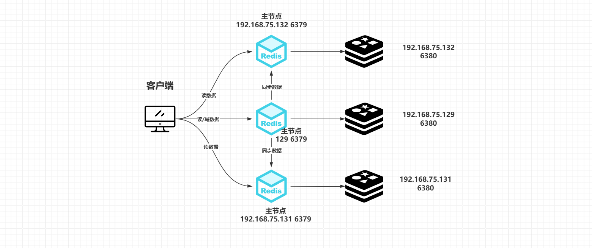

#### redis 环境简述
Redis Cluster被配置为三主三从模式。这意味着每台服务器上的两个Redis节点中，一个节点作为主库（master），另一个作为从库（slave）。

#### redis 集群配置准备
```shell
-- 创建集群配置文件夹，将下面的配置复制过去，另外两个机器重复这个过程
mkdir -p /opt/software/redis/redis-stable/cluster
mkdir -p /opt/software/redis/cluster
vim ./cluster/redis_6379.conf
vim ./cluster/redis_6380.conf

-- 配置文件准备完成之后，启动所有redis服务，用cluster配置文件
redis-server ./cluster/redis_6379.conf
redis-server ./cluster/redis_6380.conf

-- 检查服务
ps aux | grep redis

-- 创建三主三从集群模式，每一个主节点带一个从节点
redis-cli --cluster create --cluster-replicas 1 192.168.75.129:6379 192.168.75.129:6380 192.168.75.131:6379 192.168.75.131:6380 192.168.75.132:6379 192.168.75.132:6380

-- 查看集群信息
redis-cli cluster info

-- 查看单个节点信息
redis-cli info replication

-- 查看集群节点身份信息
redis-cli cluster nodes

-- 停止redis服务
redis-cli -p 6379 shutdown
redis-cli -p 6380 shutdown
```
```shell
# 允许所有的IP地址
bind * -::*  
# 后台运行
daemonize yes  
# 允许远程连接
protected-mode no  
# 开启集群模式
cluster-enabled yes
# 集群节点超时时间
cluster-node-timeout 5000
# 配置数据存储目录
dir "/opt/software/redis/cluster"
# 开启AOF持久化
appendonly yes 

# 端口
port 6379  
# log日志
logfile "/opt/software/redis/redis-stable/cluster/redis6379.log"  
# 集群配置文件
cluster-config-file nodes-6379.conf 
# AOF文件名
appendfilename "appendonly6379.aof"  
# RBD文件名
dbfilename "dump6379.rdb" 
```
```shell
# 允许所有的IP地址
bind * -::*  
# 后台运行
daemonize yes  
# 允许远程连接
protected-mode no  
# 开启集群模式
cluster-enabled yes
# 集群节点超时时间
cluster-node-timeout 5000
# 配置数据存储目录
dir "/opt/software/redis/cluster"
# 开启AOF持久化
appendonly yes 

# 端口
port 6380
# log日志
logfile "/opt/software/redis/redis-stable/cluster/redis6380.log"  
# 集群配置文件
cluster-config-file nodes-6380.conf 
# AOF文件名
appendfilename "appendonly6380.aof"  
# RBD文件名
dbfilename "dump6380.rdb" 
```
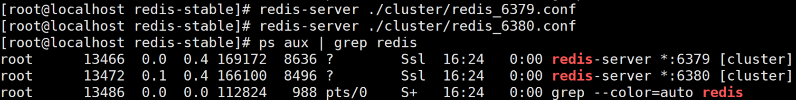
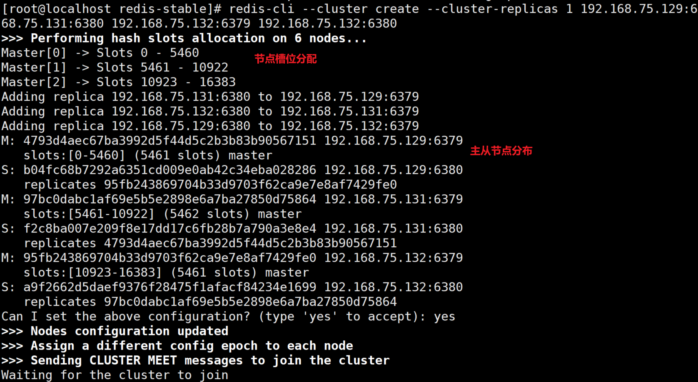

#### Redis 集群数据读写
```shell
-- 连接一个主节点进行写数据
redis-cli info replication
-- 直接连接读写可能会出现以下问题，是因为不同的节点的槽位不同，图中就是提示我们去132:6379进行写入数据
```
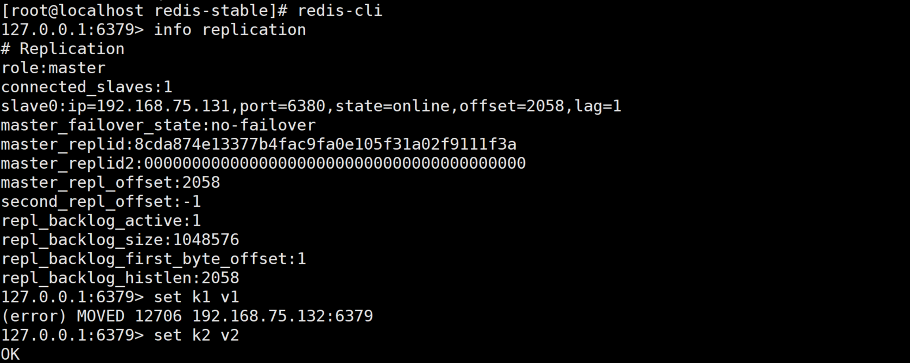
```shell
-- 不过我们也可以开启路由规则 -c，进行处理
redis-cli -c
-- 重新写入数据，恢复正常。 
set k1 b1
```
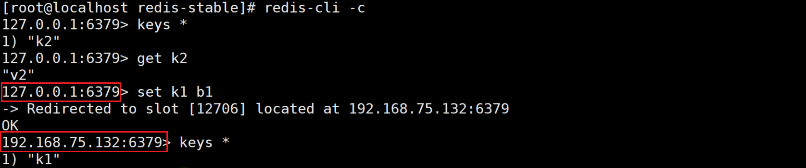

#### 模拟故障转移
```shell
-- 注意机器ip的区分
-- 将129机器的主节点给干掉(129的6379服务)
redis-cli -p 6379 shutdown
-- 查看129机器从节点工作日志(131的6380日志)
cat redis6380.log
-- 在切换到132机器上查看当前集群节点信息，131:6380已经升为主节点
redis-cli cluster nodes
```
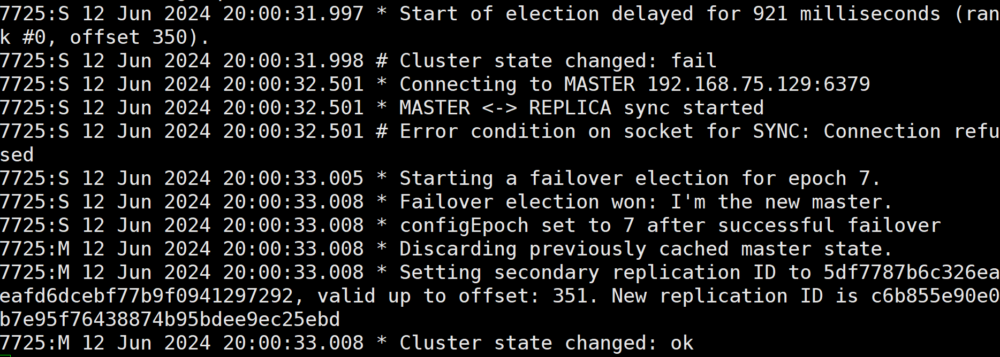
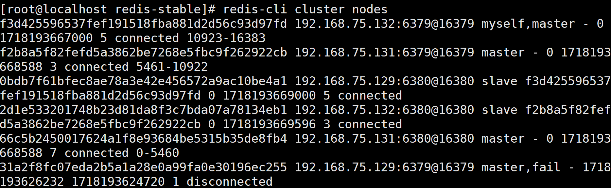
```shell
-- 在重新启动129.6379服务
redis-server ./cluster/redis_6379.conf
-- 查看129.6379的节点信息，主节点变为从节点
redis-cli -p 6379 info replication
-- 观察131.6380日志，129.6379 重新加入集群
```
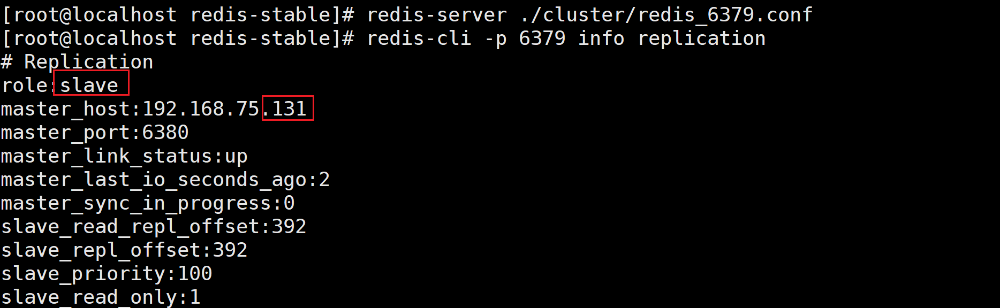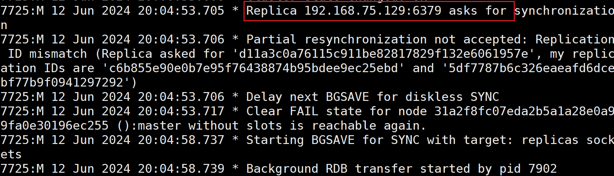
至此 Redis 部署篇章结束，完结撒花~~~~~

# 客户端连接 Redis

## 使用官方 Redis Insight
Redis Insight 是 Redis 官方推荐的客户端工具，功能非常的齐全，不过不支持中文
下载地址：[https://redis.io/insight/](https://redis.io/insight/)  进入之后划到网页最下方，然后填入一些信息(不会检查其真实性)，然后点击 download。
安装完成之后，默认会添加本地 Redis 服务
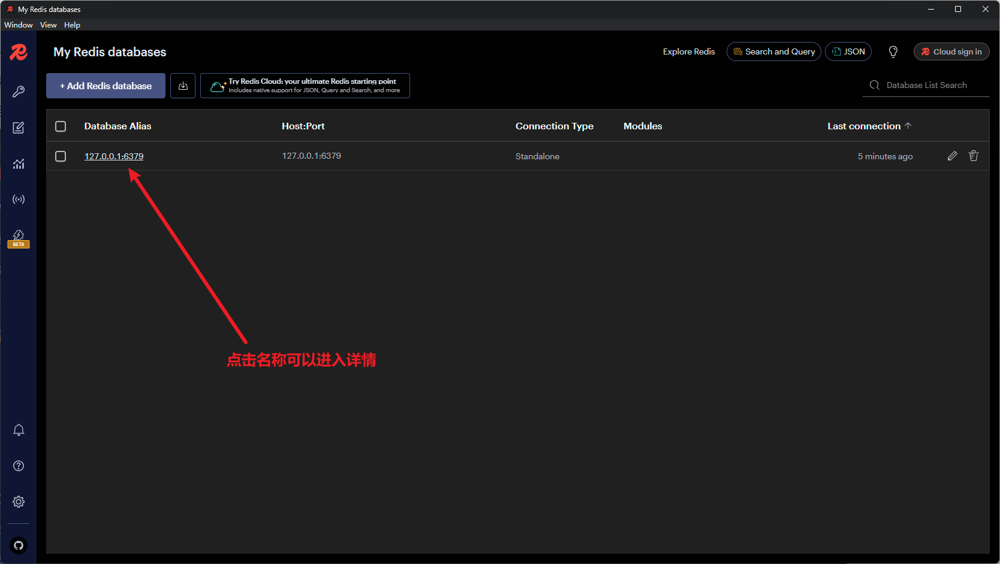
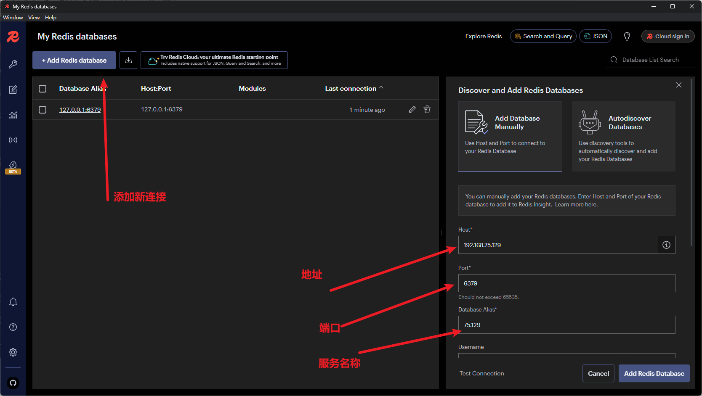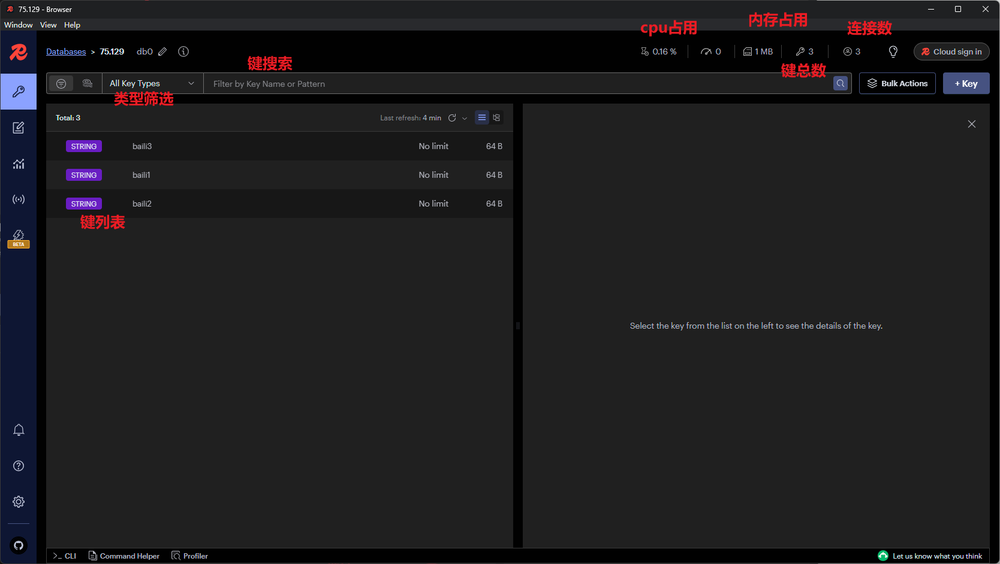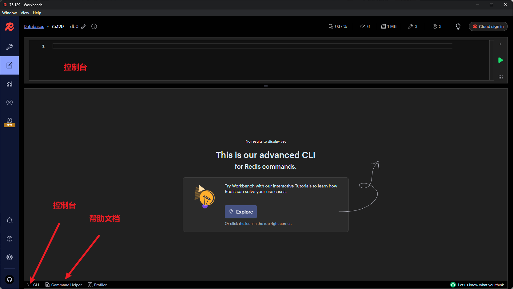

### tips

#### Redis 数据库
Redis 支持多个数据库，默认情况下有 16 个数据库（编号从 0 到 15），可以使用 SELECT 命令切换不同的数据库。
**每个数据库之间是相互隔离的**，可以在不同数据库中存储不同的数据。
```shell
SELECT 0  # 切换到数据库 0
SET key1 value1  # 在数据库 0 中设置键值对
```

## 使用第三方工具连接 Redis
强烈推荐大家使用** Tiny RDM，**UI 很好看，支持中文，还丧心病狂的支持字体设置，没错它还支持字体设置。。。
官网地址：[https://redis.tinycraft.cc/zh/](https://redis.tinycraft.cc/zh/)
基友网地址：[https://github.com/tiny-craft/tiny-rdm/tree/main](https://github.com/tiny-craft/tiny-rdm/tree/main)
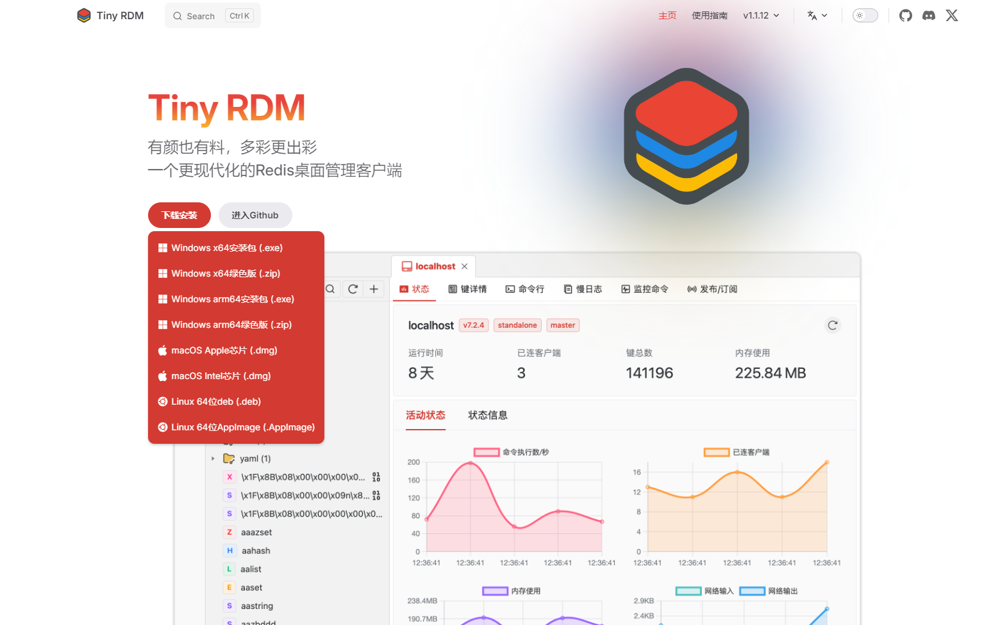
我这边使用 windows 绿色版，打开之后，然后添加新链接，然后里面的功能很 nice，大家可以自行摸索下了。
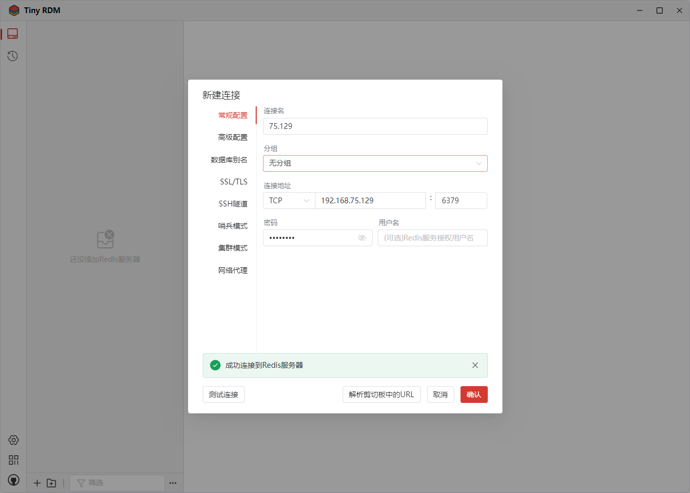
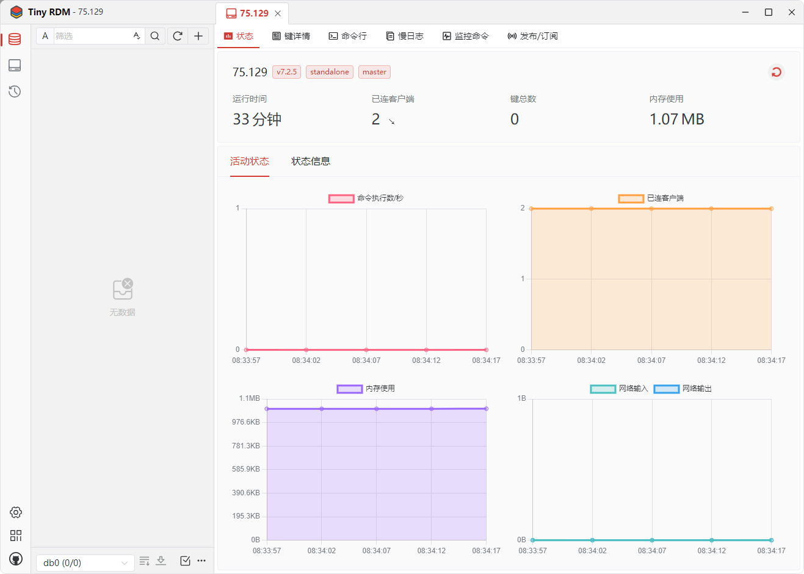

## Java 客户端连接 Redis
在 SpringBoot 中想要连接 Redis 服务很简单，当我们创建好一个 SpringBoot 项目后。

### 在 pom 中添加 SpringDateRedis 依赖 与 Json 序列化依赖
```xml
<!-- Redis依赖 -->
<dependency>
  <groupId>org.springframework.boot</groupId>
  <artifactId>spring-boot-starter-data-redis</artifactId>
</dependency>

<!-- Json序列化依赖 -->
<dependency>
    <groupId>com.fasterxml.jackson.datatype</groupId>
    <artifactId>jackson-datatype-jsr310</artifactId>
    <version>2.13.0</version>
</dependency>
```

### 在 application 配置文件中添加 Redis 相关设置，示例使用的 yml 配置方式
```yaml
spring:
  data:
    redis:
#      host: 192.168.75.129    # Redis服务器地址
#      port: 6379              # Redis服务器连接端口
#      password:               # Redis服务器连接密码（默认为空）
      database: 0              # Redis数据库索引（默认为0）
      url: redis://192.168.75.129:6379     # Redis服务器的连接URL,在Spring中相当于是password+ip+port,格式为：redis://[password@]host:port[/database]
      timeout: 60s             # 连接空闲超过N(s秒、ms毫秒，不加单位时使用毫秒)后关闭，0为禁用，这里配置值和tcp-keepalive值一致
      # Lettuce连接池配置
      lettuce:
        pool:
          max-active: 10       # 允许最大连接数，默认8（负值表示没有限制），推荐值：大于cpu * 2，通常为(cpu * 2) + 2
          max-idle: 8          # 最大空闲连接数，默认8，推荐值：cpu * 2
          min-idle: 0          # 最小空闲连接数，默认0
          max-wait: 5s         # 连接用完时，新的请求等待时间(s秒、ms毫秒)，超过该时间抛出异常，默认-1（负值表示没有限制）
```

### 将 RedisTemplate 注入
```java
/**
 * Redis相关Bean配置
 */
@Configuration
public class RedisConfig {
    @Bean
    public RedisTemplate<String, Object> redisTemplate(RedisConnectionFactory redisConnectionFactory) {
        RedisTemplate<String, Object> redisTemplate = new RedisTemplate<>();
        redisTemplate.setConnectionFactory(redisConnectionFactory);

        // 设置键序列化器为 StringRedisSerializer，所有的键都会被序列化为字符串
        redisTemplate.setKeySerializer(new StringRedisSerializer());
        // 设置值序列化器为 GenericJackson2JsonRedisSerializer，所有的值都会被序列化为 JSON 格式
        redisTemplate.setValueSerializer(new GenericJackson2JsonRedisSerializer());

        redisTemplate.setHashKeySerializer(new StringRedisSerializer());
        redisTemplate.setHashValueSerializer(new GenericJackson2JsonRedisSerializer());
        redisTemplate.afterPropertiesSet();
        return redisTemplate;
    }
}
```

### 测试
```java
package com.baili.springbootredis;

import org.junit.jupiter.api.Test;
import org.springframework.beans.factory.annotation.Autowired;
import org.springframework.boot.test.context.SpringBootTest;
import org.springframework.data.redis.core.RedisTemplate;
import org.springframework.data.redis.core.StringRedisTemplate;

@SpringBootTest
class SpringBootRedisApplicationTests {

    // 当我们将value值序列化为Json格式时，由于 Redis 客户端set的key值不是Json，获取key值需要使用stringRedisTemplate获取。
    @Autowired
    StringRedisTemplate stringRedisTemplate;

    @Autowired
    RedisTemplate redisTemplate;

    @Test
    void clientTest(){
        redisTemplate.opsForValue().set("K99","V99");
        
        stringRedisTemplate.opsForValue().get("k2"); // 演示安装教程时，客户端set的数据。
    }   
}
```

### Redis 工具类
给大家提供一个工具，每个方法都添加了注释，方便大家使用，缺少的也可以自行补充。
```java
package com.baili.springbootredis.util;

import org.springframework.beans.factory.annotation.Autowired;
import org.springframework.data.redis.core.RedisTemplate;
import org.springframework.stereotype.Component;

import java.util.List;
import java.util.Map;
import java.util.Set;
import java.util.concurrent.TimeUnit;

@Component
public class RedisUtil {

    @Autowired
    private RedisTemplate redisTemplate;

    /**
     * 给一个指定的 key 值附加过期时间
     *
     * @param key
     * @param time
     * @return
     */
    public boolean expire(String key, long time) {
        return redisTemplate.expire(key, time, TimeUnit.SECONDS);
    }

    /**
     * 根据key 获取过期时间
     *
     * @param key
     * @return
     */
    public long getTime(String key) {
        return redisTemplate.getExpire(key, TimeUnit.SECONDS);
    }

    /**
     * 检查key 是否存在
     *
     * @param key
     * @return
     */
    public boolean hasKey(String key) {
        return redisTemplate.hasKey(key);
    }

    /**
     * 移除指定key 的过期时间
     *
     * @param key
     * @return
     */
    public boolean persist(String key) {
        return redisTemplate.boundValueOps(key).persist();
    }

    //- - - - - - - - - - - - - - - - - - - - -  String类型 - - - - - - - - - - - - - - - - - - - -

    /**
     * 根据key获取值
     *
     * @param key 键
     * @return 值
     */
    public Object get(String key) {
        return key == null ? null : redisTemplate.opsForValue().get(key);
    }

    /**
     * 将值放入缓存
     *
     * @param key   键
     * @param value 值
     * @return true成功 false 失败
     */
    public void set(String key, String value) {
        redisTemplate.opsForValue().set(key, value);
    }

    /**
     * 将数值放入缓存
     *
     * @param key   键
     * @param value 值
     * @return true成功 false 失败
     */
    public void setNumberKey(String key, Integer value) {
        redisTemplate.opsForValue().set(key, value);
    }

    /**
     * 将值放入缓存并设置时间
     *
     * @param key   键
     * @param value 值
     * @param time  时间(秒) -1为无期限
     * @return true成功 false 失败
     */
    public void set(String key, String value, long time) {
        if (time > 0) {
            redisTemplate.opsForValue().set(key, value, time, TimeUnit.SECONDS);
        } else {
            redisTemplate.opsForValue().set(key, value);
        }
    }

    /**
     * 批量添加 key (重复的键会覆盖)
     *
     * @param keyAndValue
     */
    public void batchSet(Map<String, String> keyAndValue) {
        redisTemplate.opsForValue().multiSet(keyAndValue);
    }

    /**
     * 批量添加 key-value 只有在键不存在时,才添加
     * map 中只要有一个key存在,则全部不添加
     *
     * @param keyAndValue
     */
    public void batchSetIfAbsent(Map<String, String> keyAndValue) {
        redisTemplate.opsForValue().multiSetIfAbsent(keyAndValue);
    }

    /**
     * 对一个 key-value 的值进行加减操作,
     * 如果该 key 不存在 将创建一个key 并赋值该 number
     * 如果 key 存在,但 value 不是长整型 ,将报错
     *
     * @param key
     * @param number
     */
    public long increment(String key, long number) {
        return redisTemplate.opsForValue().increment(key, number);
    }

    /**
     * 对一个 key-value 的值进行加减操作,
     * 如果该 key 不存在 将创建一个key 并赋值该 number
     * 如果 key 存在,但 value 不是 纯数字 ,将报错
     *
     * @param key
     * @param number
     */
    public long decrement(String key, long number) {
        return redisTemplate.opsForValue().decrement(key, number);
    }

    //- - - - - - - - - - - - - - - - - - - - -  set类型 - - - - - - - - - - - - - - - - - - - -

    /**
     * 将数据放入set缓存
     *
     * @param key 键
     * @return
     */
    public void sSet(String key, String value) {
        redisTemplate.opsForSet().add(key, value);
    }

    /**
     * 获取变量中的值
     *
     * @param key 键
     * @return
     */
    public Set<Object> members(String key) {
        return redisTemplate.opsForSet().members(key);
    }

    /**
     * 随机获取变量中指定个数的元素
     *
     * @param key   键
     * @param count 值
     * @return
     */
    public void randomMembers(String key, long count) {
        redisTemplate.opsForSet().randomMembers(key, count);
    }

    /**
     * 随机获取变量中的元素
     *
     * @param key 键
     * @return
     */
    public Object randomMember(String key) {
        return redisTemplate.opsForSet().randomMember(key);
    }

    /**
     * 弹出变量中的元素
     *
     * @param key 键
     * @return
     */
    public Object pop(String key) {
        return redisTemplate.opsForSet().pop(key);
    }

    /**
     * 获取变量中值的长度
     *
     * @param key 键
     * @return
     */
    public long size(String key) {
        return redisTemplate.opsForSet().size(key);
    }

    /**
     * 根据value从一个set中查询,是否存在
     *
     * @param key   键
     * @param value 值
     * @return true 存在 false不存在
     */
    public boolean sHasKey(String key, Object value) {
        return redisTemplate.opsForSet().isMember(key, value);
    }

    /**
     * 检查给定的元素是否在变量中。
     *
     * @param key 键
     * @param obj 元素对象
     * @return
     */
    public boolean isMember(String key, Object obj) {
        return redisTemplate.opsForSet().isMember(key, obj);
    }

    /**
     * 转移变量的元素值到目的变量。
     *
     * @param key     键
     * @param value   元素对象
     * @param destKey 元素对象
     * @return
     */
    public boolean move(String key, String value, String destKey) {
        return redisTemplate.opsForSet().move(key, value, destKey);
    }

    /**
     * 批量移除set缓存中元素
     *
     * @param key    键
     * @param values 值
     * @return
     */
    public void remove(String key, Object... values) {
        redisTemplate.opsForSet().remove(key, values);
    }

    /**
     * 通过给定的key求2个set变量的差值
     *
     * @param key     键
     * @param destKey 键
     * @return
     */
    public Set<Set> difference(String key, String destKey) {
        return redisTemplate.opsForSet().difference(key, destKey);
    }


    //- - - - - - - - - - - - - - - - - - - - -  hash类型 - - - - - - - - - - - - - - - - - - - -

    /**
     * 加入缓存
     *
     * @param key 键
     * @param map 键
     * @return
     */
    public void add(String key, Map<String, String> map) {
        redisTemplate.opsForHash().putAll(key, map);
    }

    /**
     * 获取 key 下的 所有  hashkey 和 value
     *
     * @param key 键
     * @return
     */
    public Map<Object, Object> getHashEntries(String key) {
        return redisTemplate.opsForHash().entries(key);
    }

    /**
     * 验证指定 key 下 有没有指定的 hashkey
     *
     * @param key
     * @param hashKey
     * @return
     */
    public boolean hashKey(String key, String hashKey) {
        return redisTemplate.opsForHash().hasKey(key, hashKey);
    }

    /**
     * 获取指定key的值string
     *
     * @param key  键
     * @param key2 键
     * @return
     */
    public String getMapString(String key, String key2) {
        return redisTemplate.opsForHash().get("map1", "key1").toString();
    }

    /**
     * 获取指定的值Int
     *
     * @param key  键
     * @param key2 键
     * @return
     */
    public Integer getMapInt(String key, String key2) {
        return (Integer) redisTemplate.opsForHash().get("map1", "key1");
    }

    /**
     * 弹出元素并删除
     *
     * @param key 键
     * @return
     */
    public String popValue(String key) {
        return redisTemplate.opsForSet().pop(key).toString();
    }

    /**
     * 删除指定 hash 的 HashKey
     *
     * @param key
     * @param hashKeys
     * @return 删除成功的 数量
     */
    public Long delete(String key, String... hashKeys) {
        return redisTemplate.opsForHash().delete(key, hashKeys);
    }

    /**
     * 给指定 hash 的 hashkey 做增减操作
     *
     * @param key
     * @param hashKey
     * @param number
     * @return
     */
    public Long increment(String key, String hashKey, long number) {
        return redisTemplate.opsForHash().increment(key, hashKey, number);
    }

    /**
     * 给指定 hash 的 hashkey 做增减操作
     *
     * @param key
     * @param hashKey
     * @param number
     * @return
     */
    public Double increment(String key, String hashKey, Double number) {
        return redisTemplate.opsForHash().increment(key, hashKey, number);
    }

    /**
     * 获取 key 下的 所有 hashkey 字段
     *
     * @param key
     * @return
     */
    public Set<Object> hashKeys(String key) {
        return redisTemplate.opsForHash().keys(key);
    }

    /**
     * 获取指定 hash 下面的 键值对 数量
     *
     * @param key
     * @return
     */
    public Long hashSize(String key) {
        return redisTemplate.opsForHash().size(key);
    }

    //- - - - - - - - - - - - - - - - - - - - -  list类型 - - - - - - - - - - - - - - - - - - - -

    /**
     * 在变量左边添加元素值
     *
     * @param key
     * @param value
     * @return
     */
    public void leftPush(String key, Object value) {
        redisTemplate.opsForList().leftPush(key, value);
    }

    /**
     * 获取集合指定位置的值。
     *
     * @param key
     * @param index
     * @return
     */
    public Object index(String key, long index) {
        return redisTemplate.opsForList().index("list", 1);
    }

    /**
     * 获取指定区间的值。
     *
     * @param key
     * @param start
     * @param end
     * @return
     */
    public List<Object> range(String key, long start, long end) {
        return redisTemplate.opsForList().range(key, start, end);
    }

    /**
     * 把最后一个参数值放到指定集合的第一个出现中间参数的前面，
     * 如果中间参数值存在的话。
     *
     * @param key
     * @param pivot
     * @param value
     * @return
     */
    public void leftPush(String key, String pivot, String value) {
        redisTemplate.opsForList().leftPush(key, pivot, value);
    }

    /**
     * 向左边批量添加参数元素。
     *
     * @param key
     * @param values
     * @return
     */
    public void leftPushAll(String key, String... values) {
        redisTemplate.opsForList().leftPushAll(key, values);
    }

    /**
     * 向集合最右边添加元素。
     *
     * @param key
     * @param value
     * @return
     */
    public void leftPushAll(String key, String value) {
        redisTemplate.opsForList().rightPush(key, value);
    }

    /**
     * 向左边批量添加参数元素。
     *
     * @param key
     * @param values
     * @return
     */
    public void rightPushAll(String key, String... values) {
        //redisTemplate.opsForList().leftPushAll(key,"w","x","y");
        redisTemplate.opsForList().rightPushAll(key, values);
    }

    /**
     * 向已存在的集合中添加元素。
     *
     * @param key
     * @param value
     * @return
     */
    public void rightPushIfPresent(String key, Object value) {
        redisTemplate.opsForList().rightPushIfPresent(key, value);
    }

    /**
     * 向已存在的集合中添加元素。
     *
     * @param key
     * @return
     */
    public long listLength(String key) {
        return redisTemplate.opsForList().size(key);
    }

    /**
     * 移除集合中的左边第一个元素。
     *
     * @param key
     * @return
     */
    public void leftPop(String key) {
        redisTemplate.opsForList().leftPop(key);
    }

    /**
     * 移除集合中左边的元素在等待的时间里，如果超过等待的时间仍没有元素则退出。
     *
     * @param key
     * @return
     */
    public void leftPop(String key, long timeout, TimeUnit unit) {
        redisTemplate.opsForList().leftPop(key, timeout, unit);
    }

    /**
     * 移除集合中右边的元素。
     *
     * @param key
     * @return
     */
    public void rightPop(String key) {
        redisTemplate.opsForList().rightPop(key);
    }

    /**
     * 移除集合中右边的元素在等待的时间里，如果超过等待的时间仍没有元素则退出。
     *
     * @param key
     * @return
     */
    public void rightPop(String key, long timeout, TimeUnit unit) {
        redisTemplate.opsForList().rightPop(key, timeout, unit);
    }
}
```

# 数据结构与操作

## 基本数据结构

### 字符串（String）
String 是 Redis 中最简单同时也是最常用的一个数据结构。它是一种二进制安全的数据结构，可以用来存储任何类型的数据比如字符串、整数、浮点数、图片（图片的 base64 编码或者解码或者图片的路径）、序列化后的对象。

#### 基本操作：
```shell
SET key value：设置指定的key值
GET key：获取指定key的值
EXISTS key：判断指定 key 是否存在
DEL key：删除指定的 key
```

#### 批量设置：
```shell
MSET key value [ key value … ]：同时设置一个或者多个键值对
MGET key1 [ key2 ]：获取所有（一个或多个）给定key的值
```

#### 数值操作：
```shell
INCR key：将 key 中储存的数字值增一
DECR key：将 key 中储存的数字值减一
```

#### 设置过期时间：
```shell
EXPIRE key seconds：给指定 key 设置过期时间
SETNX key seconds value：设置值并设置过期时间
TTL key：查看剩余过期时间
```

#### 应用场景：
```shell
需要存储常规数据的场景
  ● 举例 ：缓存 session、token、图片地址、序列化后的对象(相比较于 Hash 存储更节省内存)。
  ● 相关命令 ： SET、GET。
需要计数的场景
  ● 举例 ：用户单位时间的请求数（简单限流可以用到）、页面单位时间的访问数。
  ● 相关命令 ：SET、GET、 INCR、DECR 。
分布式锁
  ● 利用 SETNX key value 命令可以实现一个最简易的分布式锁（存在一些缺陷，通常不建议这样实现分布式锁）。
```
```shell
● SET key value：设置指定的key值
● GET key：获取指定key的值
● SETNX sey value：只要key不存在时设置key的值
● SETEX key seconds value：将值value关联到key，并将key的过期时间设为seconds（以秒为单位）
● GETSET key value：将给定key的值设为value，并返回key的旧值（old value）
● INCR key：将key中存储的数字值增1
● DECR key：将key存储的数字值减1
● STRLEN key：返回key所存储的字符串的长度
● APPEND key value：如果key已经存在并且是一个字符串，APPEND命令将value追加到key原来的值的末尾
  ---------------------------------------------------分隔线---------------------------------------------------
● GETRANGE key start end：返回key中字符串值的子字符
● GETBIT key offset：对key所存储的字符串值，获取指定偏移量上的位（bit）
● SETBIT key offset value：对key所存储的字符串值，设置或清除指定偏移量上的位（bit）
● MGET key1 [ key2 ]：获取所有（一个或多个）给定key的值
● MSET key value [ key value … ]：同时设置一个或者多个键值对
● SETRANGE key offset value：用value参数覆写给定key所存储的字符串量，从偏移量开始
● PSETEX key milliseconds value：这个命令和SETEX命令相似，但它以毫秒为单位设置key的生存时间，而不是像SETEX命令那样，以秒为单位
● INCRBY key increment：将key所存储的值加上给定的增量值（increment）
● INCRBYFLOAT key increment：将key所存储的值加上给定的浮点增量值（increment）
● DECRBY key decrement：key所存储的值减去给定的减量值
```

### 列表（List）
Redis 的 List 的实现为一个 **双向链表**，支持反向查找和遍历。

#### 基本操作：
```shell
RPUSH key value1 [ value2 ]：在列表中添加一个或者多个值
LPOP key：移出并获取列表的第一个元素
RPOP key：移除并获取列表最后一个元素
LLEN key：获取列表长度
```

#### 范围操作：
```shell
LRANGE key start stop：获取列表指定范围内的元素
```

#### 实现队列 （先进先出）：
```shell
RPUSH key value1 [ value2 ]：在列表中添加一个或者多个值
LPOP key：移出并获取列表的第一个元素
```

#### 实现栈（先进后出）：
```shell
RPUSH key value1 [ value2 ]：在列表中添加一个或者多个值
RPOP key：移除并获取列表最后一个元素
```

#### 应用场景：
```shell
信息流展示
  ● 举例 ：最新文章、最新动态。
  ● 相关命令 ： LPUSH、LRANGE。
```
```shell
● LPUSH key value1 [ value2 ]：将一个或者多个值插入到列表头部
● RPUSH key value1 [ value2 ]：在列表中添加一个或者多个值
● LINDEX key index：通过索引获取列表中的元素
● LLEN key：获取列表长度
● LRANGE key start stop：获取列表指定范围内的元素
● LPOP key：移出并获取列表的第一个元素
● BLPOP key1 [ key2 ] timeout：移出并获得列表的第一个元素，如果列表没有元素会阻塞列表知道等待超时或发现可弹出元素为止
● BRPOP key1 [ key2 ] timeout：移出并获得列表的最后一个元素，如果列表没有元素会阻塞列表知道等待超时或发现可弹出元素为止
 ---------------------------------------------------分隔线---------------------------------------------------
● BRPOPLPUSH source destination timeout：从列表中弹出一个值，将弹出的元素插入到另一个列表中并返回它；如果列表没有元素会阻塞列表直到等待超时或发现可弹出元素为止
● LINSERT key BEFORE|AFTER pivot value：在列表的元素前或者后插入元素
● LPUSHX key value1 [ value2 ]：将一个或者多个值插入到已存在的列表头部
● LREM key count value：移除列表元素
● LSET key index value：通过索引设置列表元素的值
● LTRIM key start stop：对一个列表进行修剪（trim），就是说列表只保留指定区间内的元素，不在指定区间内的元素都将被删除
● RPOP key：移除并获取列表最后一个元素
● RPOPLPUSH source destination：移除列表的最后一个元素，并将该元素添加到另一个列表并返回
● RPUSHX key value：为已存在的列表添加值
```

### 哈希（Hash）
Redis 中的 Hash 是一个 String 类型的 field-value（键值对） 的映射表，特别适合用于存储对象，我们也可以直接修改对象中的某些字段值。

#### 基本操作：
```shell
HSET key field value：将哈希表key中的字段field的值设为value
HMSET key field1 value1 [ field2 value2 ]：同时将多个field-value（域-值）对设置到哈希表key中
HVALS key：获取哈希表中所有的值
HDEL key field2 [ field2 ]：删除一个或者多个哈希表字段
HEXISTS key field：查看哈希表中key，指定的字段是否存在
HGETALL key：获取在哈希表中指定key的所有字段和值
```

#### 应用场景：
```shell
对象数据存储场景
  ● 举例 ：用户信息、商品信息、文章信息、购物车信息。
  ● 相关命令 ：HSET （设置单个字段的值）、HMSET（设置多个字段的值）、HGET（获取单个字段的值）、HMGET（获取多个字段的值）。
```
```shell
● HVALS key：获取哈希表中所有的值
● HSET key field value：将哈希表key中的字段field的值设为value
● HGET key field：获取存储在哈希表中指定字段的值
● HSETNX key field value：只有在字段field不存在时，设置哈希表字段的值
● HDEL key field2 [ field2 ]：删除一个或者多个哈希表字段
● HEXISTS key field：查看哈希表中key，指定的字段是否存在
● HGETALL key：获取在哈希表中指定key的所有字段和值
 ---------------------------------------------------分隔线---------------------------------------------------
● HINCRBY key field increment：为哈希表key中指定字段的整数值添加上增量increment
● HKEYS：获取所有哈希表中的字段
● HLEN key：获取哈希表中字段的数量
● HMGET key field1 [ field2 ]：获取所有给定字段的值
● HMSET key field1 value1 [ field2 value2 ]：同时将多个field-value（域-值）对设置到哈希表key中
● HSCAN key cursor [ MATCH pattem ] [ COUNT count ]：迭代哈希表中的键值对
● HINCRBYFLOAT key field increment：为哈希表key中指定字段的浮点数值添加上增量increment
```

### 集合（Set）
Redis 中的 Set 类型是一种无序集合，集合中的元素没有先后顺序但都唯一，有点类似于 Java 中的 HashSet 。当你需要存储一个列表数据，又不希望出现重复数据时，Set 是一个很好的选择，并且 Set 提供了判断某个元素是否在一个 Set 集合内的重要接口，这个也是 List 所不能提供的。

#### 基本操作
```shell
SADD key member1 [ member2 ]：向集合添加一个或者多个成员
SMEBERS key：返回集合中的所有成员
SISMEMBER key member：判断menber元素是否是集合key的成员
SPOP key：移除并返回集合中的一个随机元素
```

#### 交集
```shell
SINTER key1 [ key2 ]：返回所有给定集合的交集
```

#### 并集
```shell
SUNION key1 [ key2 ]：返回所有给定集合的并集
```

#### 差集
```shell
SDIFF key1 [ key2 ]：返回给定所有集合的差集
```

#### 应用场景
```shell
需要存放的数据不能重复的场景
  ● 举例：网站 UV 统计（数据量巨大的场景还是 HyperLogLog更适合一些）、文章点赞、动态点赞等场景。
  ● 相关命令：SCARD（获取集合数量）
需要获取多个数据源交集、并集和差集的场景
  ● 举例 ：共同好友(交集)、共同粉丝(交集)、共同关注(交集)、好友推荐（差集）、音乐推荐（差集） 、订阅号推荐（差集+交集） 等场景。
  ● 相关命令：SINTER（交集）、SINTERSTORE （交集）、SUNION （并集）、SUNIONSTORE（并集）、SDIFF（交集）、SDIFFSTORE （交集）。
需要随机获取数据源中的元素的场景
  ● 举例 ：抽奖系统、随机。
  ● 相关命令：SPOP（随机获取集合中的元素并移除，适合不允许重复中奖的场景）、SRANDMEMBER（随机获取集合中的元素，适合允许重复中奖的场景）。
```
```shell
● SADD key member1 [ member2 ]：向集合添加一个或者多个成员
● SCARD key：获取集合的成员数
● SMEBERS key：返回集合中的所有成员
● SPOP key：移除并返回集合中的一个随机元素
● SRANDMEMBER key [ count ]：返回集合中一个或者多个随机数
● SREM key member1 [ member2 ]：移除集合中一个或者多个成员
 ---------------------------------------------------分隔线---------------------------------------------------
● SUNION key1 [ key2 ]：返回所有给定集合的并集
● SINTER key1 [ key2 ]：返回所有给定集合的交集
● SDIFF key1 [ key2 ]：返回给定所有集合的差集
● SUNIONSTORE destination key1 [ key2 ]：所有给定集合的并集存储在destination集合中
● SDIFFSTORE destination key1 [ key2 ]：返回给定所有集合的差集并存储在destination中
● SINTERSTORE destination key1 [ key2 ]：返回给定所有集合的交集并存储在destination中
● SISMEMBER key member：判断menber元素是否是集合key的成员
● SMOVE source destination menber：将member元素从source集合移动到destination集合
● SSCAN key cursor [ MATCH pattem ] [ COUNT count ]：迭代集合中的元素
```

### 有序集合（Sorted Set）
Sorted Set 类似于 Set，但和 Set 相比，Sorted Set 增加了一个权重参数 score，使得集合中的元素能够按 score 进行有序排列，还可以通过 score 的范围来获取元素的列表。

#### 基本操作：
```shell
ZADD key score menber1 [ score2 menber2 ]：向有序集合添加一个或者多个成员，或者更新已存在的成员分数
ZCARD key：获取有序集合的元素个数
ZREM key menber [ member ]：移除有序集合中的一个或多个成员
ZSCORE key member：获取指定有序集合中指定元素的 score 值
ZRANGE key start stop：通过索引区间返回有序集合成指定区间内的成员（score 从低到高）
ZREVRANGE key start stop：通过索引区间返回有序集合成指定区间内的成员（score 从高到低）
```

#### 获取指定元素排名：
```shell
ZRANK key menber：返回有序集合中指定成员的索引
```

#### 交集：
```shell
ZINTERSTORE destination numkeys key [ key… ]：计算给定的一个或者多个有序集的交集并将结果集存储在新的有序集合key中
```

#### 并集：
```shell
ZUNIONSTORE destination numkeys key [ key… ]：计算给定的一个或者多个有序集的并集并将结果集存储在新的有序集合key中
```

#### 差集：
```shell
ZDIFF destination numkeys key [ key… ]：计算给定的一个或者多个有序集的差集并将结果集存储在新的有序集合key中
```

#### 应用场景：
```shell
需要随机获取数据源中的元素根据某个权重进行排序的场景
  ● 举例 ：各种排行榜比如直播间送礼物的排行榜、朋友圈的微信步数排行榜、王者荣耀中的段位排行榜、话题热度排行榜等等。
  ● 相关命令 ：ZRANGE (从小到大排序) 、 ZREVRANGE （从大到小排序）、ZREVRANK (指定元素排名)。
需要存储的数据有优先级或者重要程度的场景 比如优先级任务队列。
  ● 举例 ：优先级任务队列。
  ● 相关命令 ：ZRANGE (从小到大排序) 、 ZREVRANGE （从大到小排序）、ZREVRANK (指定元素排名)。
```
```shell
● ZADD key score menber1 [ score2 menber2 ]：向有序集合添加一个或者多个成员，或者更新已存在的成员分数
● ZCARD key：获取有序集合的元素个数
● ZRANGE key start stop [ WITHSCORES ]：通过索引区间返回有序集合成指定区间内的成员
● ZREM key menber [ member ]：移除有序集合中的一个或多个成员
● ZSCORE key member1：获取指定有序集合中指定元素的 score 值
● ZREVRANGE key start end：
 ---------------------------------------------------分隔线---------------------------------------------------
● ZCOUNT key min max：可计算在有序集合中指定区间分数的成员
● ZINCRBY key increment menber：有序集合中对指定成员的分数加上增量increment
● ZINTERSTORE destination numkeys key [ key… ]：计算给定的一个或者多个有序集的交集并将结果集存储在新的有序集合key中
● ZUNIONSTORE destination numkeys key [ key… ]：计算给定的一个或者多个有序集的并集并将结果集存储在新的有序集合key中
● ZDIFF destination numkeys key [ key… ]：计算给定的一个或者多个有序集的差集并将结果集存储在新的有序集合key中
● ZRANGEBYSCORE key min max [ WITHSCORES ] [ LIMIT ]：通过分数返回有序集合指定区间内的成员
● ZLEXCOUNT key min max：在有序集合中计算指定字典区间内成员数量
● ZRANGEBYLEX key min max [ LIMIT offset count ]：通过字典区间返回有序集合的成员
● ZRANK key menber：返回有序集合中指定成员的索引
```

## 高级数据结构

### 位图（Bitmaps）
Bitmap 存储的是连续的二进制数字（0 和 1），通过 Bitmap, 只需要一个 bit 位来表示某个元素对应的值或者状态，key 就是对应元素本身 。我们知道 8 个 bit 可以组成一个 byte，所以 Bitmap 本身会极大的节省储存空间。

#### 基本操作：
```shell
setbit key offset val：给指定key的值的第offset赋值val 时间复杂度：O（1）
getbit key offset：获取指定key的第offset位 时间复杂度：O（1）
bitcount key start end：返回指定key中[ start,end ]中为1的数量 时间复杂度：O（n）
```

#### 应用场景：
```shell
需要保存状态信息（0/1 即可表示）的场景
  ● 举例：用户签到情况、活跃用户情况、用户行为统计（比如是否点赞过某个视频）。
  ● 相关命令：SETBIT、GETBIT、BITCOUNT、BITOP。
```
```shell
● setbit key offset val：给指定key的值的第offset赋值val 时间复杂度：O（1）
● getbit key offset：获取指定key的第offset位 时间复杂度：O（1）
● bitcount key start end：返回指定key中[ start,end ]中为1的数量 时间复杂度：O（n）
● bitop operation destkey key：对不同的二进制存储数据进行运算（AND、OR、NOT、XOR） 时间复杂度：O（1）
```

### 超日志（HyperLogLogs）
HyperLogLog 是一种有名的基数计数概率算法 ，基于 LogLog Counting(LLC)优化改进得来，并不是 Redis 特有的，Redis 只是实现了这个算法并提供了一些开箱即用的 API。
Redis 提供的 HyperLogLog 占用空间非常非常小，只需要 12k 的空间就能存储接近2^64个不同元素，并且Redis 对 HyperLogLog 的存储结构做了优化，采用两种方式计数：

- **稀疏矩阵**：计数较少的时候，占用空间很小。
- **稠密矩阵**：计数达到某个阈值的时候，占用 12k 的空间。

#### 基本操作：
```shell
PFADD key element [ element ]：添加一个或多个元素到 HyperLogLog 中
PFCOUNT key [ key… ]：获取一个或者多个 HyperLogLog 的唯一计数。
PFMERGE destkey sourcekey [ sourcekey… ]：将多个 HyperLogLog 合并到 destkey 中，destkey 会结合多个源，算出对应的唯一计数。
```

#### 应用场景：
```shell
数量量巨大（百万、千万级别以上）的计数场景
● 举例：热门网站每日/每周/每月访问 ip 数统计、热门帖子 uv 统计
● 相关命令：PFADD、PFCOUNT 。
```

### 地理空间（Geospatial）
Geospatial index（地理空间索引，简称 GEO） 主要用于存储地理位置信息，基于 Sorted Set 实现。
通过 GEO 我们可以轻松实现两个位置距离的计算、获取指定位置附近的元素等功能。

#### 基本操作：
```shell
GEOADD key longitude1 latitude1 member1 [longitude latitude member ...]：添加一个或多个元素对应的经纬度信息到 GEO 中
GEOPOS key member [member ...]:返回给定元素的经纬度信息
GEODIST key member1 member2 [m|km|ft|mi]：计算两个位置之间的距离。
```

#### 获取指定位置范围内的其他元素（附近的人）：
```shell
GEORADIUS key longitude latitude radius m|km|ft|mi [WITHCOORD] [WITHDIST] [WITHHASH] [COUNT count] [ASC|DESC] [STORE key] [STOREDIST key]：根据用户给定的经纬度坐标来获取指定范围内的地理位置集合。
```

#### 使用 Zset 命令的操作（GEO 底层为 Sorted Set）：
```shell
ZREM key menber [ member ]：移除有序集合中的一个或多个成员
ZRANGE key start stop [ WITHSCORES ]：通过索引区间返回有序集合成指定区间内的成员
```

#### 应用场景：
```shell
需要管理使用地理空间数据的场景
  ● 举例：附近的人。
  ● 相关命令: GEOADD、GEORADIUS、GEORADIUSBYMEMBER 。
```
```shell
● GEOADD key longitude1 latitude1 member1 [longitude latitude member ...]：添加一个或多个元素对应的经纬度信息到 GEO 中
● GEOPOS key member [member ...]:返回给定元素的经纬度信息
● GEODIST key member1 member2 [m|km|ft|mi]：计算两个位置之间的距离。
● GEOHASH key member [member ...]：返回一个或多个位置对象的 geohash 值。
● GEORADIUS key longitude latitude radius m|km|ft|mi [WITHCOORD] [WITHDIST] [WITHHASH] [COUNT count] [ASC|DESC] [STORE key] [STOREDIST key]：根据用户给定的经纬度坐标来获取指定范围内的地理位置集合。
● GEORADIUSBYMEMBER key member radius m|km|ft|mi [WITHCOORD] [WITHDIST] [WITHHASH] [COUNT count] [ASC|DESC] [STORE key] [STOREDIST key]：根据储存在位置集合里面的某个地点获取指定范围内的地理位置集合。
```

### 发布/订阅（Pub/Sub）
Redis 发布/订阅是一种消息传模式，其中发送者（在Redis术语中称为发布者）发送消息，而接收者（订阅者）接收消息。传递消息的通道称为**channel**。

#### 基本操作：
```shell
SUBSCRIBE：订阅给定的一个或多个频道的信息。
PUBLISH：将信息发送到指定的频道。
PUBSUB：查看订阅与发布系统状态。
```

#### 应用场景：
```shell
简易的实时消息传递场景(无法持久化)：
  ● 聊天系统：用户发送的消息可以通过 Redis 的频道广播给所有订阅者，实现实时聊天功能。
  ● 通知系统：例如在社交媒体平台上，当有新评论或新点赞时，可以通过 Pub/Sub 通知相关用户。
```
```shell
● PSUBSCRIBE：订阅一个或多个符合给定模式的频道。
● PUBSUB：查看订阅与发布系统状态。
● PUBLISH：将信息发送到指定的频道。
● PUNSUBSCRIBE：退订所有给定模式的频道。
● SUBSCRIBE：订阅给定的一个或多个频道的信息。
● UNSUBSCRIBE：指退订给定的频道。
```

### 流（Streams）
Redis Stream 主要用于消息队列（MQ，Message Queue），Redis 本身是有一个 Redis 发布订阅 (pub/sub) 来实现消息队列的功能，但它有个缺点就是消息无法持久化，如果出现网络断开、Redis 宕机等，消息就会被丢弃，而 Redis Stream 提供了消息的持久化和主备复制功能，可以让任何客户端访问任何时刻的数据，并且能记住每一个客户端的访问位置，还能保证消息不丢失。

#### 基本操作：
```shell
XADD key ID field value [field value ...]：添加消息到末尾
XTRIM key MAXLEN [~] count：对流进行修剪，限制长度
XDEL key ID [ID ...]：删除消息
XLEN key：获取流包含的元素数量，即消息长度
XRANGE key start end [COUNT count]：获取消息列表，会自动过滤已经删除的消息
```

#### 应用场景：
```shell
实时日志和事件收集
  ● Redis Streams 非常适合日志和事件数据的收集和处理。例如：
  ● 服务器日志：将不同服务器产生的日志按照时间顺序记录到一个 Stream 中，以便于集中管理和分析。
  ● 用户活动跟踪：记录用户在网站或应用中的操作日志，用于后续分析和行为追踪。
消息队列
  ● Redis Streams 可以用作消息队列，支持发布/订阅模式和消费者组，确保消息能够可靠地传递给多个消费者。例如：
  ● 任务调度系统：不同的生产者将任务发布到 Stream 中，不同的消费者可以并行处理这些任务。
  ● 异步处理：在电商平台中，订单生成后，将其放入 Stream 中进行后续的库存更新、通知发送等异步处理。
```
```shell
● XADD key ID field value [field value ...]：添加消息到末尾
● XTRIM key MAXLEN [~] count：对流进行修剪，限制长度
● XDEL key ID [ID ...]：删除消息
● XLEN key：获取流包含的元素数量，即消息长度
● XRANGE key start end [COUNT count]：获取消息列表，会自动过滤已经删除的消息
● XREVRANGE key end start [COUNT count]：反向获取消息列表，ID 从大到小
● XREAD [COUNT count] [BLOCK milliseconds] STREAMS key [key ...] id [id ...]：以阻塞或非阻塞方式获取消息列表
消费者组相关命令：
● XGROUP [CREATE key groupname id-or-$] [SETID key groupname id-or-$] [DESTROY key groupname] [DELCONSUMER key groupname consumername]：创建消费者组
● XREADGROUP GROUP group consumer [COUNT count] [BLOCK milliseconds] [NOACK] STREAMS key [key ...] ID [ID ...]：读取消费者组中的消息
● XACK <stream> <group> <ID> [ID ...]：将消息标记为"已处理"
● XGROUP SETID <stream> <group> <id>：为消费者组设置新的最后递送消息ID
● XGROUP DELCONSUMER <stream> <group> <consumer>：删除消费者
● XGROUP DESTROY <stream> <group>：删除消费者组
● XPENDING <stream> <group> [start] [end] [count] [consumer]：显示待处理消息的相关信息
● XCLAIM <stream> <group> <consumer> <min-idle-time> <ID> [ID ...] [IDLE <milliseconds>] [TIME <mstime>] [RETRYCOUNT <count>] [FORCE] [JUSTID]：转移消息的归属权
● XINFO <subcommand> <key>：查看流和消费者组的相关信息；
● XINFO GROUPS <stream>：打印消费者组的信息；
● XINFO STREAM <stream>：打印流信息
```

# 常见面试题讲解

## Redis缓存击穿、缓存雪崩、缓存穿透
缓存击穿、缓存雪崩和缓存穿透是我们在日常开发与手撕面试官过程中必须battle的常见问题，下面我会解释它们的含义与解决方案。

### 缓存击穿（Cache Miss） 
什么是缓存击穿？
缓存击穿是指在高并发访问下，一个热点数据失效时，大量请求会直接绕过缓存，直接查询数据库，导致数据库压力剧增。
通常情况下，缓存是为了减轻数据库的负载，提高读取性能而设置的。当某个特定的缓存键（key）失效后，在下一次请求该缓存时，由于缓存中没有对应的数据，因此会去数据库中查询，这就是缓存击穿。
解决方案：
合理的过期时间：设置热点数据永不过期，或者设置较长的过期时间，以免频繁失效。
使用互斥锁：保证同一时间只有一个线程来查询数据库，其他线程等待查询结果。

### 缓存雪崩（Cache Avalanche） 
什么是缓存雪崩？
缓存雪崩是指在大规模缓存失效或者缓存宕机的情况下，大量请求同时涌入数据库，导致数据库负载过大甚至崩溃的情况。
正常情况下，缓存中的数据会根据过期时间进行更新，当大量数据同时失效时，下一次请求就会直接访问数据库，给数据库带来巨大压力。
解决方案：
合理的过期时间：为缓存的过期时间引入随机值，分散缓存过期时间，避免大规模同时失效。或者是粗暴的设置热点数据永不过期
多级缓存：使用多级缓存架构，如本地缓存 + 分布式缓存，提高系统的容错能力。
使用互斥锁：保证同一时间只有一个线程来查询数据库，其他线程等待查询结果。
高可用架构：使用Redis主从复制或者集群来增加缓存的可用性，避免单点故障导致整个系统无法使用。

### 缓存穿透（Cache Penetration） 
什么是缓存穿透？
缓存穿透是指恶意请求查询一个不存在于缓存和数据库中的数据，导致每次请求都直接访问数据库，从而增加数据库的负载。攻击者可以通过故意构造不存在的 Key 来进行缓存穿透攻击。
解决方案：
缓存空对象：对于查询结果为空的情况，也将其缓存起来，但使用较短的过期时间，防止攻击者利用同样的 key 进行频繁攻击。
参数校验：在接收到请求之前进行参数校验，判断请求参数是否合法。
布隆过滤器：判断请求的参数是否存在于缓存或数据库中。

## 数据库和缓存一致性问题

### 问题来源
使用redis做一个缓冲操作，让请求先访问到redis，而不是直接访问MySQL等数据库：
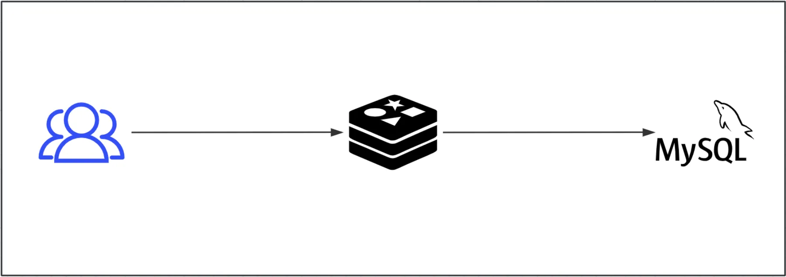
读取缓存步骤一般没有什么问题，但是一旦涉及到数据更新：数据库和缓存更新，就容易出现缓存(Redis)和数据库（MySQL）间的数据一致性问题。
不管是先写MySQL数据库，再删除Redis缓存；还是先删除缓存，再写库，都有可能出现数据不一致的情况。

### 举一个例子：
先更新Mysql，再更新Redis。
如果更新Redis失败，可能仍然不一致
先删除Redis缓存数据，再更新Mysql。
 再次查询的时候在将数据添加到缓存中，这种方案能解决1方案的问题，但是在高并发下性能较低，而且仍然会出现数据不一致的问题，比如线程1删除了Redis缓存数据，正在更新Mysql，此时另外一个查询再查询，那么就会把Mysql中老数据又查到Redis中
因为写和读是并发的，没法保证顺序,就会出现缓存和数据库的数据不一致的问题

### 解决方案：

#### 延时双删
先删除Redis缓存数据，再更新Mysql，延迟几百毫秒再删除Redis缓存数据，这样就算在更新Mysql时，有其他线程读了Mysql，把老数据读到了Redis中，那么也会被删除掉，从而把数据保持一致。

#### 队列 + 重试机制
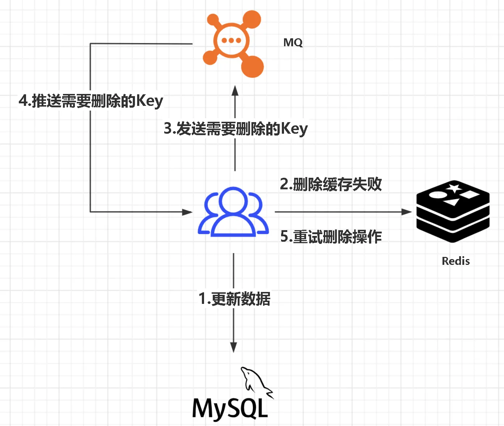
更新数据库数据；

- 缓存因为种种问题删除失败
- 将需要删除的key发送至消息队列
- 自己消费消息，获得需要删除的key
- 继续重试删除操作，直到成功

缺陷
对业务线代码造成大量的侵入。

#### 异步更新缓存(基于订阅binlog的同步机制)

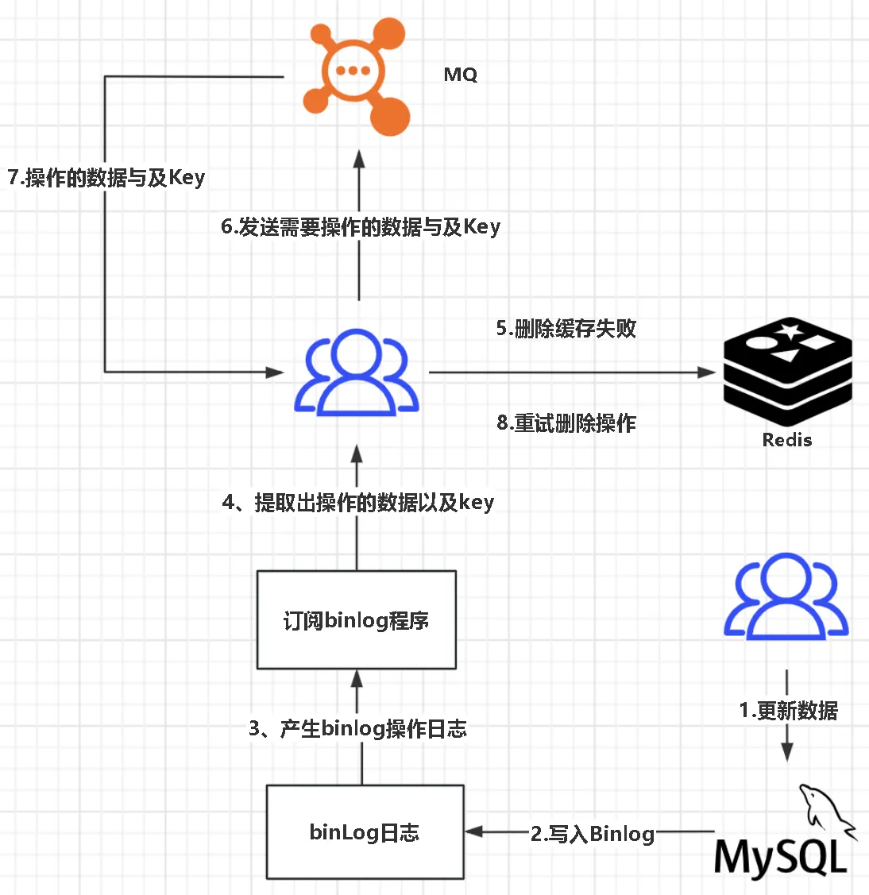
其实这种机制，很类似MySQL的主从备份机制，因为MySQL的主备也是通过binlog来实现的数据一致性。

### 实际应用：
使用阿里的一款开源框架canal，通过该框架可以对MySQL的binlog进行订阅，而canal正是模仿了mysql的slave数据库的备份请求，使得Redis的数据更新达到了相同的效果，
MQ消息中间可以采用RocketMQ来实现推送。

## Redis 事务
Redis 事务是一个用于将多个命令打包在一起执行的功能，它可以保证这些命令按照特定的顺序执行，并且要么全部成功，要么全部失败，即具有原子性。Redis 事务通过使用 MULTI 和 EXEC 命令来实现：

1. **MULTI**：开始一个事务块。当执行到 MULTI 命令时，Redis 会进入事务状态，之后的命令会被缓存起来，但不会立即执行。
2. **命令队列**：在 MULTI 和 EXEC 之间发送的所有命令都不会被立即执行，而是被放入一个队列中。
3. **EXEC**：执行事务块。当执行到 EXEC 命令时，Redis 会顺序执行队列中的所有命令，然后一次性返回所有命令的执行结果。
4. **WATCH/UNWATCH**：在事务中，WATCH 命令可以用来监控一个或多个键，如果在执行 EXEC 之前这些键的值发生了变化，那么事务将不会执行，UNWATCH 命令可以取消所有监控。
5. **DISCARD**：取消事务。如果在执行 EXEC 之前需要放弃事务，可以使用 DISCARD 命令来清空事务队列并退出事务状态。

### Redis 事务的优点

- **原子性**：事务中的命令要么全部执行，要么全部不执行，不会有中间状态。
- **序列化**：在事务执行期间，不会有其他客户端命令插入执行。
- **简单性**：使用简单，易于理解和实现。

### Redis 事务的缺点

- **不支持回滚**：如果 EXEC 命令执行的事务队列中有某个命令失败，Redis 会忽略该失败命令，但会继续执行事务队列中的其他命令。
- **阻塞性**：在执行 EXEC 命令时，如果 Redis 正在执行其他事务，那么新的事务请求将会被阻塞，直到当前事务完成。
- **监控键失效**：如果在事务执行前监控的键被其他客户端改变，整个事务将不会执行。

## Redis 持久化
Redis之所以能够提供高速读写操作是因为数据存储在内存中，但这也带来了一个风险，即在服务器宕机或断电的情况下，内存中的数据会丢失。为了解决这个问题，Redis提供了持久化机制来确保数据的持久性和可靠性。

- RDB(Redis Data Base) ：内存快照
- AOF(Append Only File)： 增量日志
- 混合持久化：RDB + AOF

### RDB持久化
在指定的时间间隔内将内存中的数据集快照写入磁盘，每次都是从Redis中生成一个二进制快照进行数据的全量备份。

#### RDB持久化流程
RDB持久化方案进行备份时，Redis会单独fork一个子进程来进行持久化，会将数据写入一个临时文件中，持久化完成后替换旧的RDB文件。
在整个持久化过程中，主进程（为客户端提供服务的进程）不参与IO操作，这样能确保Redis服务的高性能，RDB持久化机制适合对数据完整性要求不高但追求高效恢复的使用场景。
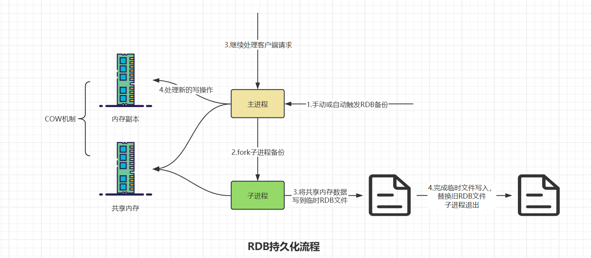

#### RDB触发规则

##### 手动触发

   - save：
	阻塞当前 Redis进程，直到RDB持久化过程完成，如果内存实例比较大会造成长时间阻塞，尽量不要使用这方式
   - bgsave：
	Redis主进程fork创建子进程，由子进程完成持久化，阻塞时间很短（微秒级）

##### 自动触发

   - 配置触发：

在Redis安装目录下的redis.conf配置文件中搜索 /snapshot 即可快速定位，配置文件默认注释了下面三行数据，通过配置规则来触发RDB的持久化，需要开启或者根据自己的需求按照规则来配置。
配置解释save 3600 1 -- 3600 秒内有1个key被修改，触发RDB
save 300 100 -- 300 秒内有100个key被修改，触发RDB
save 60 10000 -- 60 秒内有10000个key被修改，触发RDB
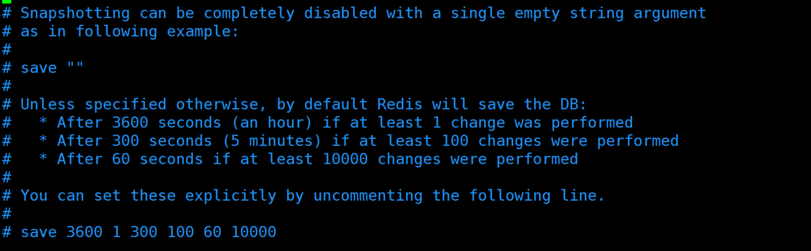

   - shutdown触发

shutdown触发Redis的RDB持久化机制非常简单，我们在客户端执行shutdown即可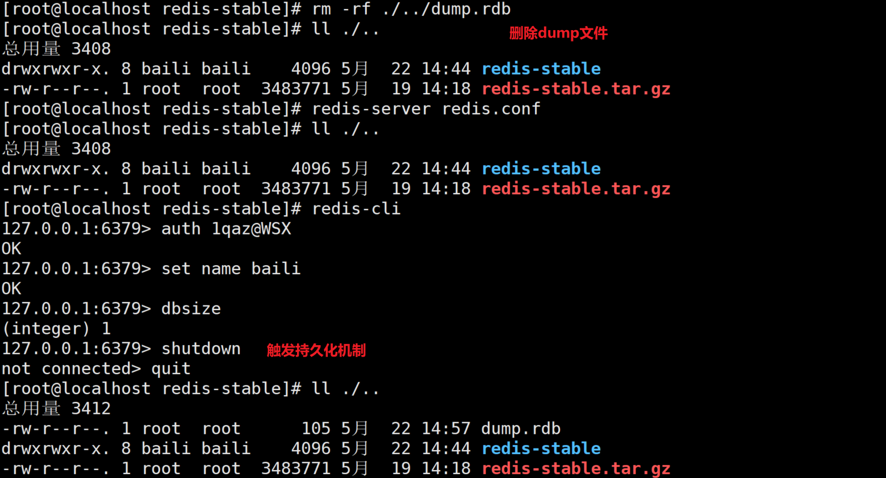

   - flushall触发

flushall清空Redis所有数据库的数据（16个库数据都会被删除）（等同于删库跑路）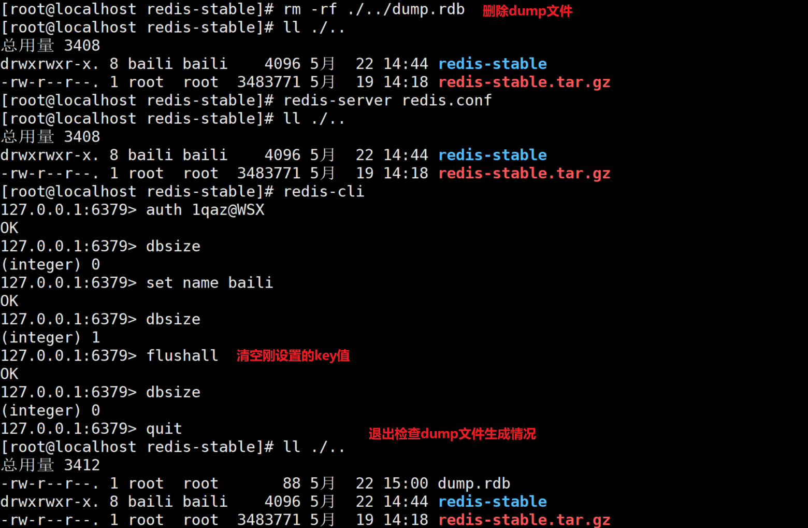

#### 优点
性能高：RDB持久化是通过生成一个快照文件来保存数据，因此在恢复数据时速度非常快。
文件紧凑：RDB文件是二进制格式的数据库文件，相对于AOF文件来说，文件体积较小。

#### 缺点
可能丢失数据：由于RDB是定期生成的快照文件，如果Redis意外宕机，最近一次的修改可能会丢失。

#### TIPS
Redis持久化默认开启为RDB持久化

### AOF持久化
AOF持久化需要手动修改conf配置开启。

#### AOF持久化流程
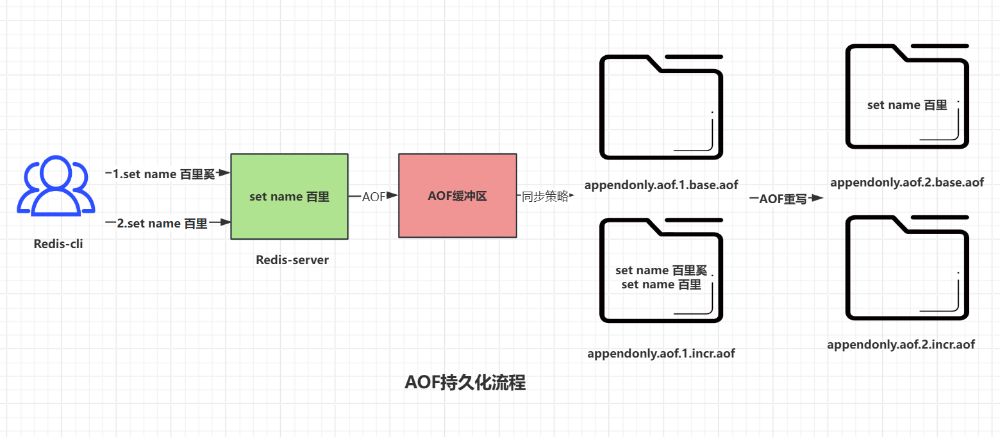
AOF持久化方案进行备AOF持久化方案进行备份时，客户端所有请求的写命令都会被追加到AOF缓冲区中，缓冲区中的数据会根据Redis配置文件中配置的同步策略来同步到磁盘上的AOF文件中，同时当AOF的文件达到重写策略配置的阈值时，Redis会对AOF日志文件进行重写，给AOF日志文件瘦身。Redis服务重启的时候，通过加载AOF日志文件来恢复数据。

#### AOF配置
AOF默认不开启，默认为appendonly no，开启则需要修改为appendonly yes
关闭AOF+RDB混合模式，需要将 aof-use-rdb-preamble 改为 no

#### AOF同步策略

- **appendfsync always：**
每次Redis写操作，都写入AOF日志，非常耗性能的。
- **appendfsync everysec**
每秒刷新一次缓冲区中的数据到AOF文件，这个Redis配置文件中默认的策略，兼容了性能和数据完整性的折中方案，这种配置，理论上丢失的数据在一秒钟左右
- **appendfsync no**
Redis进程不会主动的去刷新缓冲区中的数据到AOF文件中，而是直接交给操作系统去判断，这种操作也是不推荐的，丢失数据的可能性非常大。

#### AOF修复功能
redis 7版本，AOF文件存储在appendonlydir文件下，base是基准文件，incr是追加数据。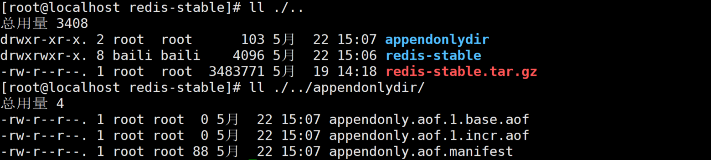
先存入三条数据，然后破坏incr结尾的文件内容，末尾加上baili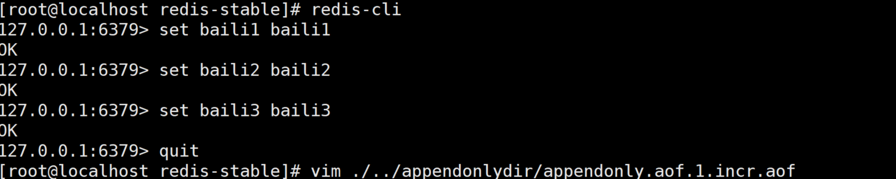
重新启动 Redis 出现异常：

使用redis-check-aof --fix appendonlydir/appendonly.aof.1.incr.aof 对AOF日志文件进行修复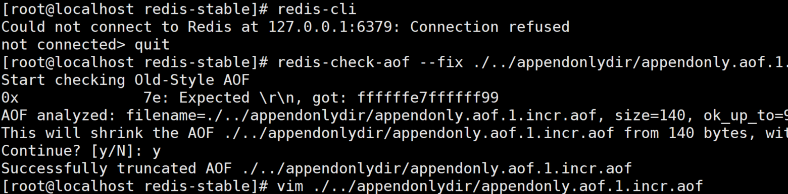
观察数据可以知道，丢失了 baili3 的数据。这种丢失是被允许的。再启动恢复正常。

#### AOF重写
重写其实是针对AOF存储的重复性冗余指令进行整理，比如有些key反复修改，又或者key反复修改后最终被删除，这些过程中的指令都是冗余且不需要存储的。

##### 自动重写
当AOF日志文件达到阈值时会触发自动重写。

- 重写阈值配置：
auto-aof-rewrite-percentage 100：当AOF文件体积达到上次重写之后的体积的100%时，会触发AOF重写。
auto-aof-rewrite-min-size 64mb：当AOF文件体积超过这个阈值时，会触发AOF重写。

当AOF文件的体积达到或超过上次重写之后的比例，并且超过了最小体积阈值时，Redis会自动触发AOF重写操作，生成一个新的AOF文件。

##### 手动重写：bgrewriteaof
正常启动后存在三个文件

连接 redis 之后，针对已存在的 key，重新赋值，然后手动重写：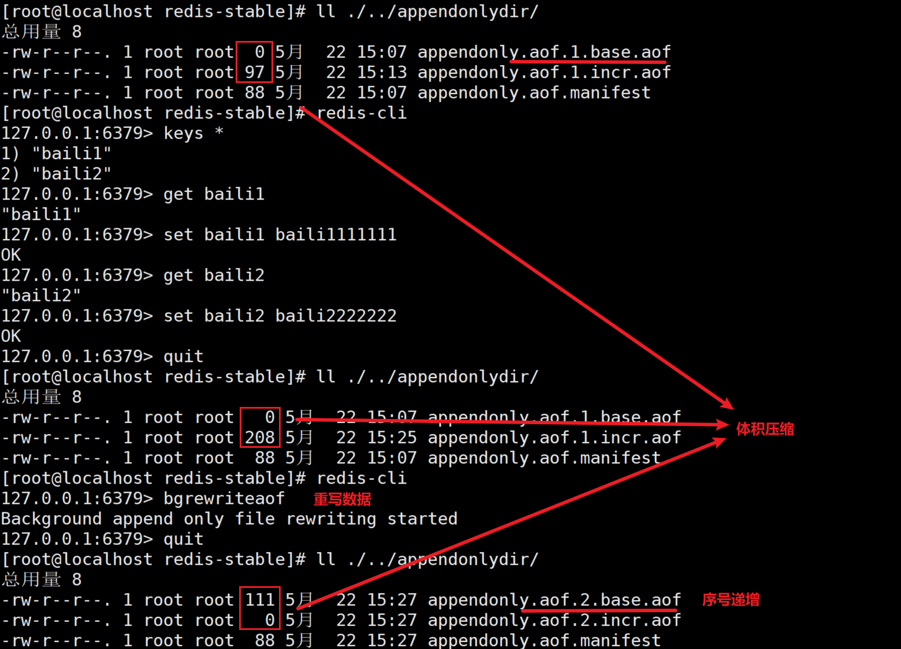
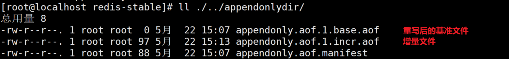

#### 优点

- 数据更加可靠：AOF持久化记录了每个写命令的操作，因此在出现故障时，可以通过重新执行AOF文件来保证数据的完整性。
- 可以保留写命令历史：AOF文件是一个追加日志文件，可以用于回放过去的写操作。

#### 缺点

- 文件较大：由于记录了每个写命令，AOF文件体积通常比RDB文件要大。
- 恢复速度较慢：当AOF文件较大时，Redis重启时需要重新执行整个AOF文件，恢复速度相对较慢。

### 混合持久化
Redis4.0版本开始支持混合持久化，因为RDB虽然加载快但是存在数据丢失，AOF数据安全但是加载缓慢。
混合持久化通过 aof-use-rdb-preamble yes 开启，Redis 4.0以上版本默认开启。
混合持久化会在appendonlydir文件下生成一个rdb文件与一个aof文件。

#### 混合持久化流程
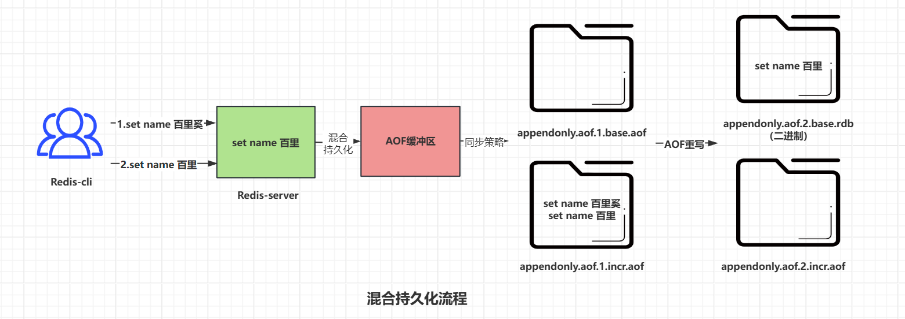
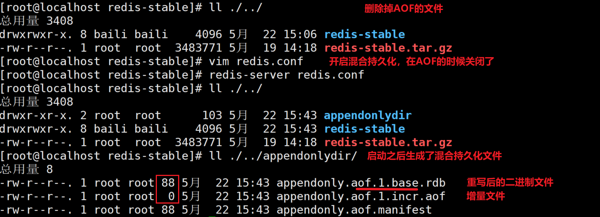

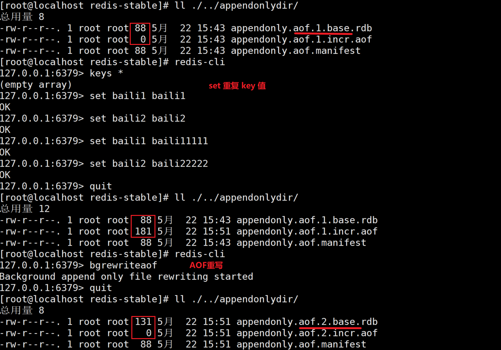

# 完整的文件目录与配置文件与使用过程中的命令

## 文件目录
```shell
/opt/software/redis/   -- Redis应用
/opt/software/redis/redis-stable -- Redis应用根目录
/opt/software/redis/cluster  -- Redis集群应用文件目录(日志，快照等信息)
/opt/software/redis/redis-stable/cluster  -- Redis集群配置文件存放路径
```
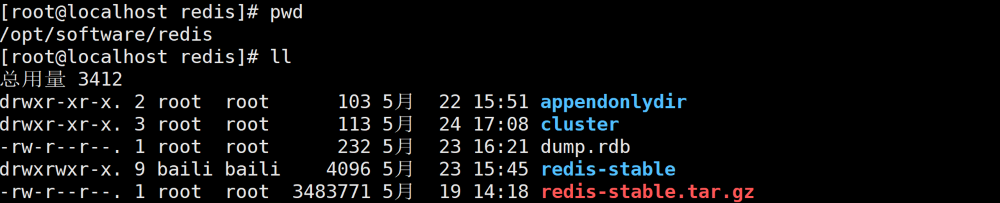

## 配置文件

### 单机Redis配置文件
所在目录：/opt/software/redis/redis-stable
```shell
bind * -::*
protected-mode no
port 6379
tcp-backlog 511
timeout 0
tcp-keepalive 300
daemonize yes
pidfile /var/run/redis_6379.pid
loglevel notice
logfile /opt/software/redis/redis-stable/redis.log
databases 16
always-show-logo no
set-proc-title yes
proc-title-template "{title} {listen-addr} {server-mode}"
locale-collate ""
stop-writes-on-bgsave-error yes
rdbcompression yes
rdbchecksum yes
dbfilename dump.rdb
rdb-del-sync-files no
dir /opt/software/redis
replica-serve-stale-data yes
replica-read-only yes
repl-diskless-sync yes
repl-diskless-sync-delay 5
repl-diskless-sync-max-replicas 0
repl-diskless-load disabled
repl-disable-tcp-nodelay no
replica-priority 100
acllog-max-len 128
lazyfree-lazy-eviction no
lazyfree-lazy-expire no
lazyfree-lazy-server-del no
replica-lazy-flush no
lazyfree-lazy-user-del no
lazyfree-lazy-user-flush no
oom-score-adj no
oom-score-adj-values 0 200 800
disable-thp yes
appendonly no
appendfilename "appendonly.aof"
appenddirname "appendonlydir"
appendfsync everysec
no-appendfsync-on-rewrite no
auto-aof-rewrite-percentage 100
auto-aof-rewrite-min-size 64mb
aof-load-truncated yes
aof-use-rdb-preamble yes
aof-timestamp-enabled no
slowlog-log-slower-than 10000
slowlog-max-len 128
latency-monitor-threshold 0
notify-keyspace-events ""
hash-max-listpack-entries 512
hash-max-listpack-value 64
list-max-listpack-size -2
list-compress-depth 0
set-max-intset-entries 512
set-max-listpack-entries 128
set-max-listpack-value 64
zset-max-listpack-entries 128
zset-max-listpack-value 64
hll-sparse-max-bytes 3000
stream-node-max-bytes 4096
stream-node-max-entries 100
activerehashing yes
client-output-buffer-limit normal 0 0 0
client-output-buffer-limit replica 256mb 64mb 60
client-output-buffer-limit pubsub 32mb 8mb 60
hz 10
dynamic-hz yes
aof-rewrite-incremental-fsync yes
rdb-save-incremental-fsync yes
jemalloc-bg-thread yes
```

### 主从节点配置
所在目录：/opt/software/redis/redis-stable
大家可以将不同服务器的端口设置不同的值，以方便区分。
```shell
与单机主节点配置一样
```
```shell
bind * -::*
protected-mode no
port 6379
tcp-backlog 511
timeout 0
tcp-keepalive 300
daemonize yes
pidfile /var/run/redis_6379.pid
loglevel notice
logfile /opt/software/redis/redis-stable/redis.log
databases 16
always-show-logo no
set-proc-title yes
proc-title-template "{title} {listen-addr} {server-mode}"
locale-collate ""
stop-writes-on-bgsave-error yes
rdbcompression yes
rdbchecksum yes
dbfilename dump.rdb
rdb-del-sync-files no
dir /opt/software/redis
replicaof 192.168.75.129 6379
replica-serve-stale-data yes
replica-read-only yes
repl-diskless-sync yes
repl-diskless-sync-delay 5
repl-diskless-sync-max-replicas 0
repl-diskless-load disabled
repl-disable-tcp-nodelay no
replica-priority 100
acllog-max-len 128
lazyfree-lazy-eviction no
lazyfree-lazy-expire no
lazyfree-lazy-server-del no
replica-lazy-flush no
lazyfree-lazy-user-del no
lazyfree-lazy-user-flush no
oom-score-adj no
oom-score-adj-values 0 200 800
disable-thp yes
appendonly no
appendfilename "appendonly.aof"
appenddirname "appendonlydir"
appendfsync everysec
no-appendfsync-on-rewrite no
auto-aof-rewrite-percentage 100
auto-aof-rewrite-min-size 64mb
aof-load-truncated yes
aof-use-rdb-preamble yes
aof-timestamp-enabled no
slowlog-log-slower-than 10000
slowlog-max-len 128
latency-monitor-threshold 0
notify-keyspace-events ""
hash-max-listpack-entries 512
hash-max-listpack-value 64
list-max-listpack-size -2
list-compress-depth 0
set-max-intset-entries 512
set-max-listpack-entries 128
set-max-listpack-value 64
zset-max-listpack-entries 128
zset-max-listpack-value 64
hll-sparse-max-bytes 3000
stream-node-max-bytes 4096
stream-node-max-entries 100
activerehashing yes
client-output-buffer-limit normal 0 0 0
client-output-buffer-limit replica 256mb 64mb 60
client-output-buffer-limit pubsub 32mb 8mb 60
hz 10
dynamic-hz yes
aof-rewrite-incremental-fsync yes
rdb-save-incremental-fsync yes
jemalloc-bg-thread yes
```
```shell
同131.6379配置一样
```

### 哨兵模式
所在目录：/opt/software/redis/redis-stable
主从配置无需修改，直接配置 sentinel 文件，3 个机器配置相同
```shell
protected-mode no
port 26379
daemonize yes
pidfile /var/run/redis-sentinel.pid
loglevel notice
logfile /opt/software/redis/redis-stable/sentinel.log
dir /opt/software/redis 
sentinel monitor mymaster 192.168.75.129 6379 2
sentinel down-after-milliseconds mymaster 30000
acllog-max-len 128
sentinel parallel-syncs mymaster 1
sentinel failover-timeout mymaster 180000
sentinel deny-scripts-reconfig yes
SENTINEL resolve-hostnames no
SENTINEL announce-hostnames no
SENTINEL master-reboot-down-after-period mymaster 0
```

### 集群
所在目录：/opt/software/redis/redis-stable/cluster
3 个机器配置相同
```shell
# 允许所有的IP地址
bind * -::*  
# 后台运行
daemonize yes  
# 允许远程连接
protected-mode no  
# 开启集群模式
cluster-enabled yes
# 集群节点超时时间
cluster-node-timeout 5000
# 配置数据存储目录
dir "/opt/software/redis/cluster"
# 开启AOF持久化
appendonly yes 

# 端口
port 6379  
# log日志
logfile "/opt/software/redis/redis-stable/cluster/redis6379.log"  
# 集群配置文件
cluster-config-file nodes-6379.conf 
# AOF文件名
appendfilename "appendonly6379.aof"  
# RBD文件名
dbfilename "dump6379.rdb"
```
```shell
# 允许所有的IP地址
bind * -::*  
# 后台运行
daemonize yes  
# 允许远程连接
protected-mode no  
# 开启集群模式
cluster-enabled yes
# 集群节点超时时间
cluster-node-timeout 5000
# 配置数据存储目录
dir "/opt/software/redis/cluster"
# 开启AOF持久化
appendonly yes 

# 端口
port 6380
# log日志
logfile "/opt/software/redis/redis-stable/cluster/redis6380.log"  
# 集群配置文件
cluster-config-file nodes-6380.conf 
# AOF文件名
appendfilename "appendonly6380.aof"  
# RBD文件名
dbfilename "dump6380.rdb" 
```

### 命令
```shell
----------------------------------- Redis基础常见命令 ----------------------------------------
keys *：查看当前库所有的key
exists key：判断某个key是否存在
type key：查看key值是什么类型
del key：删除指定的key数据
unlink key：非阻塞删除，仅仅将keys从keyspace元数据中删除，真正的删除会在后续异步中操作
ttl key：查看还有多少秒过期，-1表示永不过期，-2表示已过期
expire key：秒钟，为给定的key设置过期时间
move key dbindex[0-15]：将当前数据库的key移动到给定的数据库db当中
select dbindex：切换数据库[0-15]，默认值为0
dbsize：查看当前数据库key的数量
flushdb：清空当前库
flusshall：通杀全部库
----------------------------------- 完整的操作命令 ----------------------------------------
-- 关闭防火墙
systemctl stop firewalld.service
-- 状态
firewall-cmd --state
-- 卸载防火墙
yum remove firewalld

-------------------------- 单机部署 --------------------------
-- 检查版本
gcc --version
-- 安装 gcc
yum install gcc

-- 安装应用养成良好习惯，文件归类
mkdir -p /opt/software/redis

-- 进入redis文件夹，使用wget下载
cd /opt/software/redis
wget https://download.redis.io/redis-stable.tar.gz

-- 解压下载的redis包
tar -xzf redis-stable.tar.gz

-- 进入redis-stable目录，然后使用make install 编译并安装，安装完成后 /usr/local/bin 会生成相应的服务
cd redis-stable
make install

-- 检查是否成功生成
ll /usr/local/bin

Redis 源码路径下启动
./src/redis-server

使用usr/local/bin 路径下启动（该目录下）
redis-server

-- 修改当前Redis目录下的 Reids.conf 文件
vim redis.conf

-- 启动Redis,使用密码认证登录
redis-server redis.conf
redis-cli -a 1qaz@WSX

-- 退出redis
quit

-- 关闭redis
redis-cli shutdown

-------------------------- 主从部署 --------------------------
-- 主节点查看从节点信息
info Replication

-------------------------- 哨兵部署 --------------------------
-- 可以杀掉主节点的进程，也可以直接停掉主节点服务
ps aux | grep redis
redis-cli shutdown

-- 观察哨兵日志，129 主节点下线，重新选举131为主节点
tail -f sentinel.log

--重新启动 129 服务 并观察日志，129加入主从，此时主节点为131服务
redis-server redis.conf

tail -f sentinel.log


redis-cli -p 26379 info sentinel

-- 观察哨兵日志
tail -f sentinel.log

-- 停止哨兵
redis-cli -p 26379 shutdown

-- 切换到131服务，已经为主节点。
redis-cli info replication

-- 查看文件内容
cat redis.conf
cat sentinel.conf

-------------------------- 集群部署 --------------------------
-- 创建集群配置文件夹，将下面的配置复制过去，另外两个机器重复这个过程
mkdir -p /opt/software/redis/redis-stable/cluster
mkdir -p /opt/software/redis/cluster
vim ./cluster/redis_6379.conf
vim ./cluster/redis_6380.conf

-- 配置文件准备完成之后，启动所有redis服务，用cluster配置文件
redis-server ./cluster/redis_6379.conf
redis-server ./cluster/redis_6380.conf

-- 检查服务
ps aux | grep redis

-- 创建三主三从集群模式，每一个主节点带一个从节点
redis-cli --cluster create --cluster-replicas 1 192.168.75.129:6379 192.168.75.129:6380 192.168.75.131:6379 192.168.75.131:6380 192.168.75.132:6379 192.168.75.132:6380

-- 查看集群信息
redis-cli cluster info

-- 查看单个节点信息
redis-cli info replication

-- 查看集群节点身份信息
redis-cli cluster nodes

-- 停止redis服务
redis-cli -p 6379 shutdown
redis-cli -p 6380 shutdown

-- 连接一个主节点进行写数据
redis-cli info replication

-- 注意机器ip的区分
-- 将129机器的主节点给干掉(129的6379服务)
redis-cli -p 6379 shutdown
-- 查看129机器从节点工作日志(131的6380日志)
cat redis6380.log
-- 在切换到132机器上查看当前集群节点信息，131:6380已经升为主节点
redis-cli cluster nodes

-- 在重新启动129.6379服务
redis-server ./cluster/redis_6379.conf
-- 查看129.6379的节点信息，主节点变为从节点
redis-cli -p 6379 info replication
-- 观察131.6380日志，129.6379 重新加入集群
```


> 原文: <https://www.yuque.com/tulingzhouyu/db22bv/rmggzgsmr6w4hli5>