# 💎 金三银四最新面试题


# 前言
技术为王的时代已经过去了，希望看到本篇笔记的小伙伴能够有些自己的收获，有些自己的理解，现在大行情不太好，很多时候面试不止是面技术，还面人情世故，还面思想境界，因为技术好并不一定工作好。因此我们在准备面试的时候，不单单要背八股，要熟悉项目，还在针对每道面试题究竟想问的是什么，提前准备好自己的回答，这个回答不是死记硬背，是将自己针对这道题的理解整理出来，形成缜密的思维逻辑，发表出自己的看法，自己的角度，自己的态度；即使面试官本身没有多问的意思，但是在回答过程中，说出面试官都出乎意料的答案，肯定是可以加分的。接下来进入正文 gogogogogogogo

# 为什么使用消息队列？

## 面试官心理分析
有些人在项目中用消息队列或其他技术，但却不知道为什么要用。他们可能只是跟风或盲目从众，并没有深思熟虑过选择这些技术的原因。这种缺乏思考和理解的态度通常会给面试官留下不好的印象，因为他们担心这样的人在工作中可能缺乏创造性思维和解决问题的能力。

## 面试题剖析
针对这道面试题，想必很多小伙伴都能回答出解耦，异步，削峰。
解耦指的就是传统来说 A 系统调用 B 系统，A 系统需要等待 B 系统的返回结果，A 系统才能返回；使用消息队列之后 A 系统就不用等待 B 系统的返回结果在返回给用户了。这是大多数小伙伴针对解耦的一个回答，那么消息队列的解耦真的就只是不用等待 B 系统的返回结果吗？有没有小伙伴还有其他的理解？

### 解耦
针对解耦我们可以进行正反对比，没有使用消息队列的场景？使用了消息队列的场景？
先从讲讲没有使用消息队列的场景
看一个场景A 系统发送数据到 BCD 三个系统，通过接口调用发送。如果 E 系统也要这个数据呢？那如果 D 系统现在不需要了呢？A 系统负责人几乎崩溃： 

在这个场景中，A 系统跟其它各种乱七八糟的系统严重耦合，A 系统产生一条比较关键的数据，很多系统都需要 A 系统将这个数据发送过来。A 系统要时时刻刻考虑 BCDE 四个系统如果挂了该咋办？要不要重发，要不要把消息存起来？头发都白了啊！
如果使用 MQ，A 系统产生一条数据，发送到 MQ 里面去，哪个系统需要数据自己去 MQ 里面消费。如果新系统需要数据，直接从 MQ 里消费即可；如果某个系统不需要这条数据了，就取消对 MQ 消息的消费即可。这样下来，A 系统压根儿不需要去考虑要给谁发送数据，不需要维护这个代码，也不需要考虑人家是否调用成功、失败超时等情况。
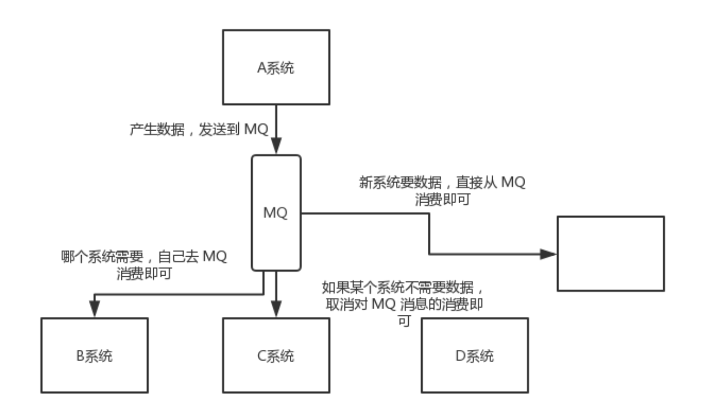
**总结**：通过使用 MQ，Pub/Sub 发布订阅消息模型，A 系统就跟其它系统彻底解耦了。

### 异步
再来看一个场景，A 系统接收一个请求，需要在自己本地写库，还需要在 BCD 三个系统写库，自己本地写库要 3ms，BCD 三个系统分别写库要 300ms、450ms、200ms。最终请求总延时是 3 + 300 + 450 + 200 = 953ms，接近 1s，用户感觉搞个什么东西，慢死了慢死了。用户通过浏览器发起请求，等待个 1s，这几乎是不可接受的。
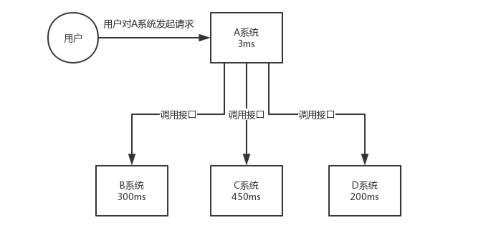
一般互联网类的企业，对于用户直接的操作，一般要求是每个请求都必须在 200 ms 以内完成，对用户几乎是无感知的。
如果**使用 MQ**，那么 A 系统连续发送 3 条消息到 MQ 队列中，假如耗时 5ms，A 系统从接受一个请求到返回响应给用户，总时长是 3 + 5 = 8ms，对于用户而言，其实感觉上就是点个按钮，8ms 以后就直接返回了。
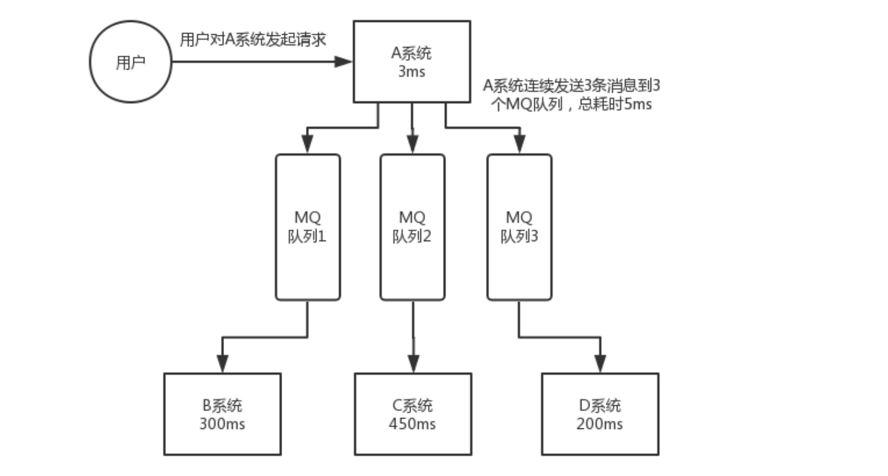

### 削峰
每天 0:00 到 12:00，A 系统风平浪静，每秒并发请求数量就 50 个。结果每次一到 12:00 ~ 13:00 ，每秒并发请求数量突然会暴增到 5k+ 条。但是系统是直接基于 MySQL 的，大量的请求涌入 MySQL，每秒钟对 MySQL 执行约 5k 条 SQL。
一般的 MySQL，扛到每秒 2k 个请求就差不多了，如果每秒请求到 5k 的话，可能就直接把 MySQL 给打死了，导致系统崩溃，用户也就没法再使用系统了。
但是高峰期一过，到了下午的时候，就成了低峰期，可能也就 1w 的用户同时在网站上操作，每秒中的请求数量可能也就 50 个请求，对整个系统几乎没有任何的压力。
 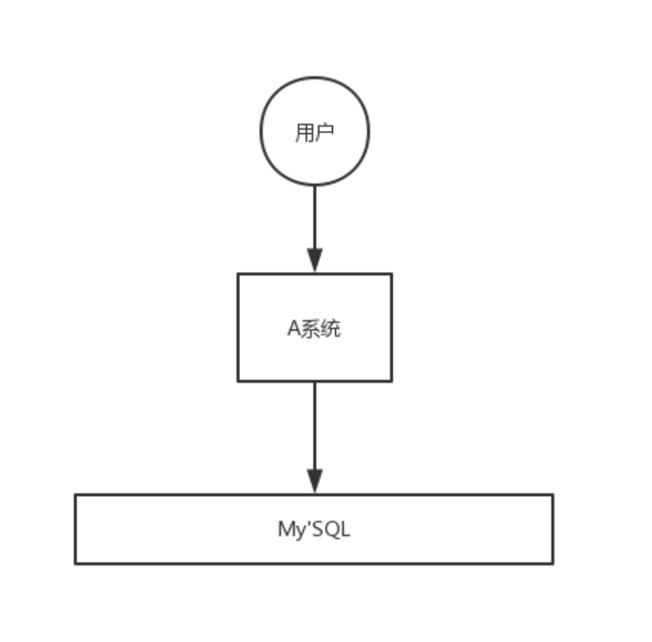
如果使用 MQ，每秒 5k 个请求写入 MQ，A 系统每秒钟最多处理 2k 个请求，因为 MySQL 每秒钟最多处理 2k 个。A 系统从 MQ 中慢慢拉取请求，每秒钟就拉取 2k 个请求，不要超过自己每秒能处理的最大请求数量就 ok，这样下来，哪怕是高峰期的时候，A 系统也绝对不会挂掉。而 MQ 每秒钟 5k 个请求进来，就 2k 个请求出去，结果就导致在中午高峰期（1 个小时），可能有几十万甚至几百万的请求积压在 MQ 中。
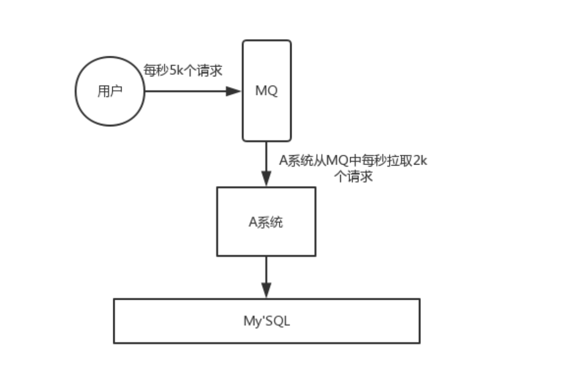
这个短暂的高峰期积压是 ok 的，因为高峰期过了之后，每秒钟就 50 个请求进 MQ，但是 A 系统依然会按照每秒 2k 个请求的速度在处理。所以说，只要高峰期一过，A 系统就会快速将积压的消息给解决掉。

# 消息队列有什么优缺点

## 面试官心理分析
既然你在系统中使用了消息队列，你是否了解这样做的优缺点呢？如果你从未考虑过这一点，盲目地引入消息队列，那么一旦出现问题，你是不是就会擅自离开，给公司留下麻烦？如果你没有考虑引入新技术可能带来的负面影响和风险，那么被面试官录用的可能就是那种会制造问题的候选人。担心的是，你可能会在岗位上挖坑，然后一年后跳槽，给公司带来长期隐患。

## 面试题剖析
优点上面已经说了，就是**在特殊场景下有其对应的好处**，**解耦**、**异步**、**削峰**。
缺点有以下几个：

- **系统可用性降低**
系统引入的外部依赖越多，越容易挂掉。本来你就是 A 系统调用 BCD 三个系统的接口就好了，人 ABCD 四个系统好好的，没啥问题，你偏加个 MQ 进来，万一 MQ 挂了咋整，MQ 一挂，整套系统崩溃的，你不就完了？如何保证消息队列的高可用，查看后续的高可用面试题
- **系统复杂度提高**
硬生生加个 MQ 进来，你怎么保证消息没有重复消费？怎么处理消息丢失的情况？怎么保证消息传递的顺序性？头大头大，问题一大堆，痛苦不已。
- **一致性问题**
A 系统处理完了直接返回成功了，人都以为你这个请求就成功了；但是问题是，要是 BCD 三个系统那里，BD 两个系统写库成功了，结果 C 系统写库失败了，咋整？你这数据就不一致了。

所以消息队列实际是一种非常复杂的架构，你引入它有很多好处，但是也得针对它带来的坏处做各种额外的技术方案和架构来规避掉， 做好之后，你会发现，妈呀，系统复杂度提升了一个数量级，也许是复杂了 10 倍。但是关键时刻，用，还是得用的。

# Kafka、RabbitMQ、RocketMQ 有什么优缺点？

## 面试官心理分析
既然你引入了消息队列（MQ），可能是某一种特定的消息队列，那么当时你有没有进行过相关调研呢？不要盲目地凭个人喜好或者头脑一热就选择了某种消息队列，比如 Kafka，甚至对业界流行的消息队列都没有做过调研。每种消息队列都有其优点和缺点，并没有绝对的优劣之分，关键是要根据具体场景来选择合适的消息队列，利用其优势，规避其劣势。如果招进团队的是一个不考虑技术选型的候选人，当领导交给他一个任务去设计系统时，他可能在技术选型上并没有充分考虑，最终选择的技术可能并不合适，也会留下隐患。

## 面试题剖析
| 特性 | RabbitMQ | RocketMQ | Kafka |
| --- | --- | --- | --- |
| 单机吞吐量 | 万级，比 RocketMQ、Kafka 低一个数量级 | 10 万级，支撑高吞吐 | 10 万级，高吞吐，一般配合大数据类的系统来进行实时数据计算、日志采集等场景 |
| topic 数量对吞吐量的影响 | 
 | topic 可以达到几百/几千的级别，吞吐量会有较小幅度的下降，这是 RocketMQ 的一大优势，在同等机器下，可以支撑大量的 topic | topic 从几十到几百个时候，吞吐量会大幅度下降，在同等机器下，Kafka 尽量保证 topic 数量不要过多，如果要支撑大规模的 topic，需要增加更多的机器资源 |
| 时效性 | 微秒级，这是 RabbitMQ 的一大特点，延迟最低 | ms 级 | 延迟在 ms 级以内 |
| 可用性 | 高，基于主从架构实现高可用 | 非常高，分布式架构 | 非常高，分布式，一个数据多个副本，少数机器宕机，不会丢失数据，不会导致不可用 |
| 消息可靠性 | 基本不丢 | 经过参数优化配置，可以做到 0 丢失 | 经过参数优化配置，可以做到 0 丢失 |
| 优劣势总结 | 基于 erlang 开发，并发能力很强，性能极好，延时很低 | 基于 MQ 功能较为完善，还是分布式的，良好的可伸缩性和高可用性 | 功能较为简单，主要支持简单的 MQ 功能，在大数据领域的实时计算以及日志采集被大规模使用 |
| 适用场景 | 需要可靠消息传递的业务场景，例如金融系统的支付、订单处理等。
需要高度灵活性的消息模型，例如消息路由、动态队列等。
需要与其他应用集成的场景，RabbitMQ提供了丰富的客户端库和协议支持。 | 高性能、高可用性的消息传递场景，例如实时数据分析、电商秒杀等。
需要强大的消息过滤和消息追踪功能的场景，例如广告投放、用户推送等。
需要分布式事务支持的场景，RocketMQ提供了分布式事务消息特性。 | 需要高吞吐量和低延迟的实时数据处理场景，例如用户行为日志分析、实时监控等。
需要保留大量历史数据并支持数据回溯的场景，例如大数据分析、数据仓库等。
需要构建事件驱动架构的场景，Kafka可以作为事件源和消息总线。 |

综上，各种对比之后，有如下建议：
现在很多公司都引入 MQ，一开始是 ActiveMQ，但是支持不很好，我们就不做推荐了，后来大家开始用 RabbitMQ，但是确实 erlang 语言阻止了大量的 Java 工程师去深入研究和掌控它，对公司而言，几乎处于不可控的状态，但是确实人家是开源的，比较稳定的支持，活跃度也高；
不过现在越来越多的公司都在用 **RocketMQ**，确实很不错，毕竟是阿里出品，目前 RocketMQ 已捐给 Apache，不过有些功能只有阿里商业版才有，对自己公司技术实力有绝对自信的，推荐用 RocketMQ，对 RocketMQ 不太了解的小伙伴，在可以点这个快速入门 [RocketMQ5.X教程](https://www.yuque.com/tulingzhouyu/db22bv/pcztmw6gdpmg3l83?singleDoc# 《🚛 RocketMQ5.x教程-从安装到实战到经典面试题》 密码：dwkq)。
所以**中小型公司**，技术实力较为一般，技术挑战不是特别高，用 RabbitMQ 是不错的选择；**大型公司**，基础架构研发实力较强，用 RocketMQ 是很好的选择。
如果是**大数据领域**的实时计算、日志采集等场景，用 Kafka 是业内标准的，绝对没问题，社区活跃度很高，绝对不会黄，何况几乎是全世界这个领域的事实性规范。

# 如何保证消息队列的高可用？

## 面试官心理分析
当涉及到 MQ 知识时，高可用性是一个必谈的话题。前述讲解了 MQ 可能导致系统不稳定，因此，无论何时使用了 MQ，接下来关于 MQ 的问题都将聚焦在如何解决这些缺陷上。
如果你盲目地只是使用了某个 MQ，从未考虑过各种问题，那么情况就很糟糕了。面试官会认为你只懂得简单应用技术，没有深思熟虑，这会给他留下不佳印象。这样的人，如果只是做一些薪资在 20k 以下的普通工作还凑合，但如果要从事薪资在 20k+ 的高级工程师工作，就会很艰难。如果让你设计系统，其中必然会存在许多风险，一旦发生问题，公司将遭受损失，整个团队将承担责任。

## 面试题剖析

### RabbitMQ
RabbitMQ 是比较有代表性的，因为是**基于主从**（非分布式）做高可用性的，我们就以 RabbitMQ 为例子讲解第一种 MQ 的高可用性怎么实现。
RabbitMQ 有三种模式：单机模式、普通集群模式、镜像集群模式。

#### 单机模式
单机模式，就是 Demo 级别的，一般就是你本地启动了玩玩儿的😄，没人生产用单机模式。

#### 普通集群模式（无高可用性）
普通集群模式，意思就是在多台机器上启动多个 RabbitMQ 实例，每个机器启动一个。你**创建的 queue，只会放在一个 RabbitMQ 实例上**，但是每个实例都同步 queue 的元数据（元数据可以认为是 queue 的一些配置信息，通过元数据，可以找到 queue 所在实例）。你消费的时候，实际上如果连接到了另外一个实例，那么那个实例会从 queue 所在实例上拉取数据过来。

 
这种方式确实很麻烦，也不怎么好，**没做到所谓的分布式**，就是个普通集群。因为这导致你要么消费者每次随机连接一个实例然后拉取数据，要么固定连接那个 queue 所在实例消费数据，前者有**数据拉取的开销**，后者导致**单实例性能瓶颈**。
而且如果那个放 queue 的实例宕机了，会导致接下来其他实例就无法从那个实例拉取，如果你**开启了消息持久化**，让 RabbitMQ 落地存储消息的话，**消息不一定会丢**，得等这个实例恢复了，然后才可以继续从这个 queue 拉取数据。
所以这个事儿就比较尴尬了，这就**没有什么所谓的高可用性**，**这方案主要是提高吞吐量的**，就是说让集群中多个节点来服务某个 queue 的读写操作。

#### 镜像集群模式（高可用性）
这种模式，才是所谓的 RabbitMQ 的高可用模式。跟普通集群模式不一样的是，在镜像集群模式下，你创建的 queue，无论元数据还是 queue 里的消息都会**存在于多个实例上**，就是说，每个 RabbitMQ 节点都有这个 queue 的一个**完整镜像**，包含 queue 的全部数据的意思。然后每次你写消息到 queue 的时候，都会自动把**消息同步**到多个实例的 queue 上。

 那么**如何开启这个镜像集群模式**呢？其实很简单，RabbitMQ 有很好的管理控制台，就是在后台新增一个策略，这个策略是**镜像集群模式的策略**，指定的时候是可以要求数据同步到所有节点的，也可以要求同步到指定数量的节点，再次创建 queue 的时候，应用这个策略，就会自动将数据同步到其他的节点上去了。
这样的话，好处在于，你任何一个机器宕机了，没事儿，其它机器（节点）还包含了这个 queue 的完整数据，别的 consumer 都可以到其它节点上去消费数据。坏处在于，第一，这个性能开销也太大了吧，消息需要同步到所有机器上，导致网络带宽压力和消耗很重！第二，这么玩儿，不是分布式的，就**没有扩展性可言**了，如果某个 queue 负载很重，你加机器，新增的机器也包含了这个 queue 的所有数据，并**没有办法线性扩展**你的 queue。你想，如果这个 queue 的数据量很大，大到这个机器上的容量无法容纳了，此时该怎么办呢？

### Kafka
Kafka 一个最基本的架构认识：由多个 broker 组成，每个 broker 是一个节点；你创建一个 topic，这个 topic 可以划分为多个 partition，每个 partition 可以存在于不同的 broker 上，每个 partition 就放一部分数据。
这就是**天然的分布式消息队列**，就是说一个 topic 的数据，是**分散放在多个机器上的，每个机器就放一部分数据**。
实际上 RabbmitMQ 之类的，并不是分布式消息队列，它就是传统的消息队列，只不过提供了一些集群、HA(High Availability, 高可用性) 的机制而已，因为无论怎么玩儿，RabbitMQ 一个 queue 的数据都是放在一个节点里的，镜像集群下，也是每个节点都放这个 queue 的完整数据。
Kafka 0.8 以前，是没有 HA 机制的，就是任何一个 broker 宕机了，那个 broker 上的 partition 就废了，没法写也没法读，没有什么高可用性可言。
比如说，我们假设创建了一个 topic，指定其 partition 数量是 3 个，分别在三台机器上。但是，如果第二台机器宕机了，会导致这个 topic 的 1/3 的数据就丢了，因此这个是做不到高可用的。

Kafka 0.8 以后，提供了 HA 机制，就是 replica（复制品） 副本机制。每个 partition 的数据都会同步到其它机器上，形成自己的多个 replica 副本。所有 replica 会选举一个 leader 出来，那么生产和消费都跟这个 leader 打交道，然后其他 replica 就是 follower。写的时候，leader 会负责把数据同步到所有 follower 上去，读的时候就直接读 leader 上的数据即可。只能读写 leader？很简单，**要是你可以随意读写每个 follower，那么就要 care 数据一致性的问题**，系统复杂度太高，很容易出问题。Kafka 会均匀地将一个 partition 的所有 replica 分布在不同的机器上，这样才可以提高容错性。

这么搞，就有所谓的**高可用性**了，因为如果某个 broker 宕机了，没事儿，那个 broker上面的 partition 在其他机器上都有副本的。如果这个宕机的 broker 上面有某个 partition 的 leader，那么此时会从 follower 中**重新选举**一个新的 leader 出来，大家继续读写那个新的 leader 即可。这就有所谓的高可用性了。
**写数据**的时候，生产者就写 leader，然后 leader 将数据落地写本地磁盘，接着其他 follower 自己主动从 leader 来 pull 数据。一旦所有 follower 同步好数据了，就会发送 ack 给 leader，leader 收到所有 follower 的 ack 之后，就会返回写成功的消息给生产者。（当然，这只是其中一种模式，还可以适当调整这个行为）
**消费**的时候，只会从 leader 去读，但是只有当一个消息已经被所有 follower 都同步成功返回 ack 的时候，这个消息才会被消费者读到。
看到这里，相信你大致明白了 Kafka 是如何保证高可用机制的了，对吧？不至于一无所知，现场还能给面试官画画图。要是遇上面试官确实是 Kafka 高手，深挖了问，那你只能说不好意思，太深入的你没研究过。

# 如何保证消息不被重复消费？

## 面试官心理分析
首先这道面试题也是消息队列中必问的一道面试题，本质上还是问大家使用消息队列如何保证幂等性，当然这个也是在架构设计中需要考虑的一个点。

## 面试题剖析
回答这个问题，首先你别听到重复消息这个事儿，就一无所知吧，你**先大概说一说可能会有哪些重复消费的问题**。
首先，比如 RabbitMQ、RocketMQ、Kafka，都有可能会出现消息重复消费的问题，正常。因为这问题通常不是 MQ 自己保证的，是由我们开发来保证的。挑一个 Kafka 来举个例子，说说怎么重复消费吧。
Kafka 实际上有个 offset 的概念，就是每个消息写进去，都有一个 offset，代表消息的序号，然后 consumer 消费了数据之后，**每隔一段时间**（定时定期），会把自己消费过的消息的 offset 提交一下，表示“我已经消费过了，下次我要是重启啥的，你就让我继续从上次消费到的 offset 来继续消费吧”。
但是凡事总有意外，比如我们之前生产经常遇到的，就是你有时候重启系统，看你怎么重启了，如果碰到点着急的，直接 kill 进程了，再重启。这会导致 consumer 有些消息处理了，但是没来得及提交 offset，尴尬了。重启之后，少数消息会再次消费一次。
举个栗子。
有这么个场景。数据 1/2/3 依次进入 kafka，kafka 会给这三条数据每条分配一个 offset，代表这条数据的序号，我们就假设分配的 offset 依次是 152/153/154。消费者从 kafka 去消费的时候，也是按照这个顺序去消费。假如当消费者消费了 offset=153 的这条数据，刚准备去提交 offset 到 zookeeper，此时消费者进程被重启了。那么此时消费过的数据 1/2 的 offset 并没有提交，kafka 也就不知道你已经消费了 offset=153 这条数据。那么重启之后，消费者会找 kafka 说，嘿，哥儿们，你给我接着把上次我消费到的那个地方后面的数据继续给我传递过来。由于之前的 offset 没有提交成功，那么数据 1/2 会再次传过来，如果此时消费者没有去重的话，那么就会导致重复消费。

 如果消费者干的事儿是拿一条数据就往数据库里写一条，会导致说，你可能就把数据 1/2 在数据库里插入了 2 次，那么数据就错啦。
其实重复消费不可怕，可怕的是你没考虑到重复消费之后，**怎么保证幂等性**。
举个例子吧。假设你有个系统，消费一条消息就往数据库里插入一条数据，要是你一个消息重复两次，你不就插入了两条，这数据不就错了？但是你要是消费到第二次的时候，自己判断一下是否已经消费过了，若是就直接扔了，这样不就保留了一条数据，从而保证了数据的正确性。
一条数据重复出现两次，数据库里就只有一条数据，这就保证了系统的幂等性。
幂等性，通俗点说，就一个数据，或者一个请求，给你重复来多次，你得确保对应的数据是不会改变的，**不能出错**。
所以第二个问题来了，怎么保证消息队列消费的幂等性？
其实还是得结合业务来思考，我这里给几个思路：

- 比如你拿个数据要写库，你先根据主键查一下，如果这数据都有了，你就别插入了，update 一下好吧。
- 比如你是写 Redis，那没问题了，反正每次都是 set，天然幂等性。
- 比如你不是上面两个场景，那做的稍微复杂一点，你需要让生产者发送每条数据的时候，里面加一个全局唯一的 id，类似订单 id 之类的东西，然后你这里消费到了之后，先根据这个 id 去比如 Redis 里查一下，之前消费过吗？如果没有消费过，你就处理，然后这个 id 写 Redis。如果消费过了，那你就别处理了，保证别重复处理相同的消息即可。
- 比如基于数据库的唯一键来保证重复数据不会重复插入多条。因为有唯一键约束了，重复数据插入只会报错，不会导致数据库中出现脏数据。


# 如何处理消息丢失的问题？

## 面试官心理分析
跟前面的两个问题一样，这个问题我们在架构设计的时候也要好好考虑，因为用 MQ 有个基本原则，就是**数据不能多一条，也不能少一条**

## 面试题剖析

### RabbitMQ
数据的丢失问题，可能出现在生产者、MQ、消费者中，接下来从 RabbitMQ 和 Kafka 分别分析一下

#### 生产者弄丢了数据
生产者将数据发送到 RabbitMQ 的时候，可能数据就在半路给搞丢了，因为网络问题啥的，都有可能。
此时可以选择用 RabbitMQ 提供的事务功能，就是生产者**发送数据之前**开启 RabbitMQ 事务channel.txSelect，然后发送消息，如果消息没有成功被 RabbitMQ 接收到，那么生产者会收到异常报错，此时就可以回滚事务channel.txRollback，然后重试发送消息；如果收到了消息，那么可以提交事务channel.txCommit。
```java
// 开启事务
channel.txSelect
try {
    // 这里发送消息
} catch (Exception e) {
    channel.txRollback

    // 这里再次重发这条消息
}

// 提交事务
channel.txCommit
```
但是问题是，RabbitMQ 事务机制（同步）一搞，基本上**吞吐量会下来，因为太耗性能**。
所以一般来说，如果你要确保说写 RabbitMQ 的消息别丢，可以开启 confirm 模式，在生产者那里设置开启 confirm 模式之后，你每次写的消息都会分配一个唯一的 id，然后如果写入了 RabbitMQ 中，RabbitMQ 会给你回传一个 ack 消息，告诉你说这个消息 ok 了。如果 RabbitMQ 没能处理这个消息，会回调你的一个 nack 接口，告诉你这个消息接收失败，你可以重试。而且你可以结合这个机制自己在内存里维护每个消息 id 的状态，如果超过一定时间还没接收到这个消息的回调，那么你可以重发。
事务机制和 confirm 机制最大的不同在于，**事务机制是同步的**，你提交一个事务之后会**阻塞**在那儿，但是 confirm 机制是**异步**的，你发送个消息之后就可以发送下一个消息，然后那个消息 RabbitMQ 接收了之后会异步回调你的一个接口通知你这个消息接收到了。
所以一般在生产者这块**避免数据丢失**，都是用 confirm 机制的。

#### RabbitMQ 弄丢了数据
就是 RabbitMQ 自己弄丢了数据，这个你必须**开启 RabbitMQ 的持久化**，就是消息写入之后会持久化到磁盘，哪怕是 RabbitMQ 自己挂了，**恢复之后会自动读取之前存储的数据**，一般数据不会丢。除非极其罕见的是，RabbitMQ 还没持久化，自己就挂了，**可能导致少量数据丢失**，但是这个概率较小。
设置持久化有**两个步骤**：

- 创建 queue 的时候将其设置为持久化
这样就可以保证 RabbitMQ 持久化 queue 的元数据，但是它是不会持久化 queue 里的数据的。
- 第二个是发送消息的时候将消息的 deliveryMode 设置为 2
就是将消息设置为持久化的，此时 RabbitMQ 就会将消息持久化到磁盘上去。

必须要同时设置这两个持久化才行，RabbitMQ 哪怕是挂了，再次重启，也会从磁盘上重启恢复 queue，恢复这个 queue 里的数据。
注意，哪怕是你给 RabbitMQ 开启了持久化机制，也有一种可能，就是这个消息写到了 RabbitMQ 中，但是还没来得及持久化到磁盘上，结果不巧，此时 RabbitMQ 挂了，就会导致内存里的一点点数据丢失。
所以，持久化可以跟生产者那边的 confirm 机制配合起来，只有消息被持久化到磁盘之后，才会通知生产者 ack 了，所以哪怕是在持久化到磁盘之前，RabbitMQ 挂了，数据丢了，生产者收不到 ack，你也是可以自己重发的。

#### 消费端弄丢了数据
RabbitMQ 如果丢失了数据，主要是因为你消费的时候，**刚消费到，还没处理，结果进程挂了**，比如重启了，那么就尴尬了，RabbitMQ 认为你都消费了，这数据就丢了。
这个时候得用 RabbitMQ 提供的 ack 机制，简单来说，就是你必须关闭 RabbitMQ 的自动 ack，可以通过一个 api 来调用就行，然后每次你自己代码里确保处理完的时候，再在程序里 ack 一把。这样的话，如果你还没处理完，不就没有 ack 了？那 RabbitMQ 就认为你还没处理完，这个时候 RabbitMQ 会把这个消费分配给别的 consumer 去处理，消息是不会丢的。


### Kafka

#### 消费端弄丢了数据
唯一可能导致消费者弄丢数据的情况，就是说，你消费到了这个消息，然后消费者那边**自动提交了 offset**，让 Kafka 以为你已经消费好了这个消息，但其实你才刚准备处理这个消息，你还没处理，你自己就挂了，此时这条消息就丢咯。
这不是跟 RabbitMQ 差不多吗，大家都知道 Kafka 会自动提交 offset，那么只要**关闭自动提交** offset，在处理完之后自己手动提交 offset，就可以保证数据不会丢。但是此时确实还是**可能会有重复消费**，比如你刚处理完，还没提交 offset，结果自己挂了，此时肯定会重复消费一次，自己保证幂等性就好了。
生产环境碰到的一个问题，就是说我们的 Kafka 消费者消费到了数据之后是写到一个内存的 queue 里先缓冲一下，结果有的时候，你刚把消息写入内存 queue，然后消费者会自动提交 offset。然后此时我们重启了系统，就会导致内存 queue 里还没来得及处理的数据就丢失了。

#### Kafka 弄丢了数据
这块比较常见的一个场景，就是 Kafka 某个 broker 宕机，然后重新选举 partition 的 leader。大家想想，要是此时其他的 follower 刚好还有些数据没有同步，结果此时 leader 挂了，然后选举某个 follower 成 leader 之后，不就少了一些数据？这就丢了一些数据啊。
所以此时一般是要求起码设置如下 4 个参数：

- 给 topic 设置 replication.factor 参数：这个值必须大于 1，要求每个 partition 必须有至少 2 个副本。
- 在 Kafka 服务端设置 min.insync.replicas 参数：这个值必须大于 1，这个是要求一个 leader 至少感知到有至少一个 follower 还跟自己保持联系，没掉队，这样才能确保 leader 挂了还有一个 follower 吧。
- 在 producer 端设置 acks=all：这个是要求每条数据，必须是**写入所有 replica 之后，才能认为是写成功了**。
- 在 producer 端设置 retries=MAX：这个是**要求一旦写入失败，就无限重试**，卡在这里了。

我们生产环境就是按照上述要求配置的，这样配置之后，至少在 Kafka broker 端就可以保证在 leader 所在 broker 发生故障，进行 leader 切换时，数据不会丢失。

#### 生产者会不会弄丢数据？
如果按照上述的思路设置了 acks=all，一定不会丢，要求是，你的 leader 接收到消息，所有的 follower 都同步到了消息之后，才认为本次写成功了。如果没满足这个条件，生产者会自动不断的重试，重试无限次。

# 如何保证消息的顺序性?

## 面试官心理分析
MQ 必考知识点了，主要是一些场景需要严格按照顺序来进行消费

## 面试题剖析
比如说你在某个网站注册了账号，然后加积分 10，为了兑换商品发文章加积分 20，再去兑换某个商品或者是服务扣减积分 30，那这整个过程是有严格的顺序性的，如果是先扣减积分是不是就会出现负积分的场景，这只是个简单的例子，大家还是要对顺序性以及如何保证消息顺序的方案有一定的了解。

### 先看看顺序会错乱的俩场景：

- **RabbitMQ**：一个 queue，多个 consumer。比如，生产者向 RabbitMQ 里发送了三条数据，顺序依次是 data1/data2/data3，压入的是 RabbitMQ 的一个内存队列。有三个消费者分别从 MQ 中消费这三条数据中的一条，结果消费者2先执行完操作，把 data2 存入数据库，然后是 data1/data3。这不明显乱了。


- **Kafka**：比如说我们建了一个 topic，有三个 partition。生产者在写的时候，其实可以指定一个 key，比如说我们指定了某个订单 id 作为 key，那么这个订单相关的数据，一定会被分发到同一个 partition 中去，而且这个 partition 中的数据一定是有顺序的。
消费者从 partition 中取出来数据的时候，也一定是有顺序的。到这里，顺序还是 ok 的，没有错乱。接着，我们在消费者里可能会搞**多个线程来并发处理消息**。因为如果消费者是单线程消费处理，而处理比较耗时的话，比如处理一条消息耗时几十 ms，那么 1 秒钟只能处理几十条消息，这吞吐量太低了。而多个线程并发跑的话，顺序可能就乱掉了。


### 解决方案

#### RabbitMQ
拆分多个 queue，每个 queue 一个 consumer，就是多一些 queue 而已，确实是麻烦点；或者就一个 queue 但是对应一个 consumer，然后这个consumer 内部用内存队列做排队，然后分发给底层不同的 worker 来处理。


#### Kafka

- 一个 topic，一个 partition，一个 consumer，内部单线程消费，单线程吞吐量太低，一般不会用这个。
- 写 N 个内存 queue，具有相同 key 的数据都到同一个内存 queue；然后对于 N 个线程，每个线程分别消费一个内存 queue 即可，这样就能保证顺序性。


# 为什么要用缓存？

## 面试官心理分析
同样的，我们在使用某项技术的时候，先要搞清楚为什么要用它，用它的好处是什么，同时会带来什么问题。

## 面试题剖析
用缓存，主要有两个用途：**高性能**、**高并发**。

## 高性能
假设这么个场景，你有个操作，一个请求过来，吭哧吭哧你各种乱七八糟操作 mysql，半天查出来一个结果，耗时 600ms。但是这个结果可能接下来几个小时都不会变了，或者变了也可以不用立即反馈给用户。那么此时咋办？
缓存啊，折腾 600ms 查出来的结果，扔缓存里，一个 key 对应一个 value，下次再有人查，别走 mysql 折腾 600ms 了，直接从缓存里，通过一个 key 查出来一个 value，2ms 搞定。性能提升 300 倍。
就是说对于一些需要复杂操作耗时查出来的结果，且确定后面不怎么变化，但是有很多读请求，那么直接将查询出来的结果放在缓存中，后面直接读缓存就好。

## 高并发
mysql 这么重的数据库，压根儿设计不是让你玩儿高并发的，虽然也可以玩儿，但是天然支持不好。mysql 单机支撑到 2000QPS 也开始容易报警了。
所以要是你有个系统，高峰期一秒钟过来的请求有 1万，那一个 mysql 单机绝对会死掉。你这个时候就只能上缓存，把很多数据放缓存，别放 mysql。缓存功能简单，说白了就是 key-value 式操作，单机支撑的并发量轻松一秒几万十几万，支撑高并发 so easy。单机承载并发量是 mysql 单机的几十倍。

## 用了缓存之后会有什么不良后果？

- 缓存与数据库双写不一致
- 缓存雪崩、缓存穿透
- 缓存并发竞争

# redis 的线程模型是什么？

## 面试官心理分析
这道面试有些面试官其实不会这么问，通常会问：为什么 redis 单线程却能支撑高并发？这里面就涉及到了 redis 的内部原理跟特点了。你要是这个都不知道，那后面玩儿 redis 的时候，出了问题岂不是什么都不知道？

## 面试题剖析

### redis 的线程模型
redis 内部使用文件事件处理器 file event handler，这个文件事件处理器是单线程的，所以 redis 才叫做单线程的模型。它采用 IO 多路复用机制同时监听多个 socket，将产生事件的 socket 压入内存队列中，事件分派器根据 socket 上的事件类型来选择对应的事件处理器进行处理。
文件事件处理器的结构包含 4 个部分：

- 多个 socket
- IO 多路复用程序
- 文件事件分派器
- 事件处理器（连接应答处理器、命令请求处理器、命令回复处理器）

多个 socket 可能会并发产生不同的操作，每个操作对应不同的文件事件，但是 IO 多路复用程序会监听多个 socket，会将产生事件的 socket 放入队列中排队，事件分派器每次从队列中取出一个 socket，根据 socket 的事件类型交给对应的事件处理器进行处理。
来看客户端与 redis 的一次通信过程：

## 
要明白，通信是通过 socket 来完成的，不懂的同学可以先去看一看 socket 网络编程。
首先，redis 服务端进程初始化的时候，会将 server socket 的 AE_READABLE 事件与连接应答处理器关联。
客户端 socket01 向 redis 进程的 server socket 请求建立连接，此时 server socket 会产生一个 AE_READABLE 事件，IO 多路复用程序监听到 server socket 产生的事件后，将该 socket 压入队列中。文件事件分派器从队列中获取 socket，交给**连接应答处理器**。连接应答处理器会创建一个能与客户端通信的 socket01，并将该 socket01 的 AE_READABLE 事件与命令请求处理器关联。
假设此时客户端发送了一个 set key value 请求，此时 redis 中的 socket01 会产生 AE_READABLE 事件，IO 多路复用程序将 socket01 压入队列，此时事件分派器从队列中获取到 socket01 产生的 AE_READABLE 事件，由于前面 socket01 的 AE_READABLE 事件已经与命令请求处理器关联，因此事件分派器将事件交给命令请求处理器来处理。命令请求处理器读取 socket01 的 key value 并在自己内存中完成 key value 的设置。操作完成后，它会将 socket01 的 AE_WRITABLE 事件与命令回复处理器关联。
如果此时客户端准备好接收返回结果了，那么 redis 中的 socket01 会产生一个 AE_WRITABLE 事件，同样压入队列中，事件分派器找到相关联的命令回复处理器，由命令回复处理器对 socket01 输入本次操作的一个结果，比如 ok，之后解除 socket01 的 AE_WRITABLE 事件与命令回复处理器的关联。

### 为啥 redis 单线程模型也能效率这么高？

- 纯内存操作。
- 核心是基于非阻塞的 IO 多路复用机制。
- C 语言实现，一般来说，C 语言实现的程序“距离”操作系统更近，执行速度相对会更快。
- 单线程反而避免了多线程的频繁上下文切换问题，预防了多线程可能产生的竞争问题。

# redis 都有哪些数据类型？

## 面试官心理分析
其实这道面试题，问的频率不是很高，通常是根据简历写的技术栈有关系，技术栈比较可能就会问问这个题，不过大家对基本的数据类型以及场景还是要掌握

## 面试题剖析
redis 主要有以下几种数据类型：

- string
- hash
- list
- set
- sorted set

### string
这是最简单的类型，就是普通的 set 和 get，做简单的 KV 缓存。
```
set k1 v1
```

### hash
这个是类似 map 的一种结构，这个一般就是可以将结构化的数据，比如一个对象（前提是**这个对象没嵌套其他的对象**）给缓存在 redis 里，然后每次读写缓存的时候，可以就操作 hash 里的**某个字段**。
```
hset person name bingo
hset person age 20
hset person id 1
hget person name
```
```
person = {
    "name": "bingo",
    "age": 20,
    "id": 1
}
```

### list
list 是有序列表，这个可以玩儿出很多花样。
比如可以通过 list 存储一些列表型的数据结构，类似粉丝列表、文章的评论列表之类的东西。
比如可以通过 lrange 命令，读取某个闭区间内的元素，可以基于 list 实现分页查询，这个是很棒的一个功能，基于 redis 实现简单的高性能分页，可以做类似微博那种下拉不断分页的东西，性能高，就一页一页走。
```
# 0开始位置，-1结束位置，结束位置为-1时，表示列表的最后一个位置，即查看所有。
lrange mylist 0 -1
```
比如可以搞个简单的消息队列，从 list 头怼进去，从 list 尾巴那里弄出来。
```
lpush mylist 1
lpush mylist 2
lpush mylist 3 4 5

# 1
rpop mylist
```

### set
set 是无序集合，自动去重。
直接基于 set 将系统里需要去重的数据扔进去，自动就给去重了，如果你需要对一些数据进行快速的全局去重，你当然也可以基于 jvm 内存里的 HashSet 进行去重，但是如果你的某个系统部署在多台机器上呢？得基于 redis 进行全局的 set 去重。
可以基于 set 玩儿交集、并集、差集的操作，比如交集吧，可以把两个人的粉丝列表整一个交集，看看俩人的共同好友是谁？对吧。
把两个大 V 的粉丝都放在两个 set 中，对两个 set 做交集。
```
#-------操作一个set-------
# 添加元素
sadd mySet 1

# 查看全部元素
smembers mySet

# 判断是否包含某个值
sismember mySet 3

# 删除某个/些元素
srem mySet 1
srem mySet 2 4

# 查看元素个数
scard mySet

# 随机删除一个元素
spop mySet

#-------操作多个set-------
# 将一个set的元素移动到另外一个set
smove yourSet mySet 2

# 求两set的交集
sinter yourSet mySet

# 求两set的并集
sunion yourSet mySet

# 求在yourSet中而不在mySet中的元素
sdiff yourSet mySet
```

### sorted set
sorted set 是排序的 set，去重但可以排序，写进去的时候给一个分数，自动根据分数排序。
```
zadd board 85 zhangsan
zadd board 72 lisi
zadd board 96 wangwu
zadd board 63 zhaoliu

# 获取排名前三的用户（默认是升序，所以需要 rev 改为降序）
zrevrange board 0 3

# 获取某用户的排名
zrank board zhaoliu
```

# redis 的过期策略都有哪些？

## 面试官心理分析
这道面试题是 redis 必需掌握的一道面试题，因为现在缓存的使用非常普遍，虽然内存的价格已经下来了，但是相比硬盘还是贵很多，因此内存空间的利用率非常的重要，

## 面试题剖析

### redis 过期策略
redis 过期策略是：**定期删除+惰性删除**。
所谓**定期删除**，指的是 redis 默认是每隔 100ms 就随机抽取一些设置了过期时间的 key，检查其是否过期，如果过期就删除。如果本轮检查的已过期 key 的数量，超过 5 个（20/4），也就是「已过期 key 的数量」占比「随机抽取 key 的数量」大于 25%，则继续重复步骤 1；如果已过期的 key 比例小于 25%，则停止继续删除过期 key，然后等待下一轮再检查。
假设 redis 里放了 10w 个 key，都设置了过期时间，你每隔几百毫秒，就检查 10w 个 key，那 redis 基本上就死了，cpu 负载会很高的，消耗在你的检查过期 key 上了。注意，这里可不是每隔 100ms 就遍历所有的设置过期时间的 key，那样就是一场性能上的**灾难**。实际上 redis 是每隔 100ms **随机抽取**一些 key 来检查和删除的。
但是问题是，定期删除可能会导致很多过期 key 到了时间并没有被删除掉，那咋整呢？所以就是惰性删除了。这就是说，在你获取某个 key 的时候，redis 会检查一下 ，这个 key 如果设置了过期时间那么是否过期了？如果过期了此时就会删除，不会给你返回任何东西。
获取 key 的时候，如果此时 key 已经过期，就删除，不会返回任何东西。
但是实际上这还是有问题的，如果定期删除漏掉了很多过期 key，然后你也没及时去查，也就没走惰性删除，此时会怎么样？如果大量过期 key 堆积在内存里，导致 redis 内存块耗尽了，咋整？
答案是：**走内存淘汰机制**。

### 内存淘汰机制
redis 内存淘汰机制有以下几个：

- noeviction: 当内存不足以容纳新写入数据时，新写入操作会报错，这个一般没人用吧，实在是太恶心了。
- **allkeys-lru**：当内存不足以容纳新写入数据时，在**键空间**中，移除最近最少使用的 key（这个是**最常用**的）。
- allkeys-random：当内存不足以容纳新写入数据时，在**键空间**中，随机移除某个 key，这个一般没人用吧，为啥要随机，肯定是把最近最少使用的 key 给干掉啊。
- volatile-lru：当内存不足以容纳新写入数据时，在**设置了过期时间的键空间**中，移除最近最少使用的 key（这个一般不太合适）。
- volatile-random：当内存不足以容纳新写入数据时，在**设置了过期时间的键空间**中，**随机移除**某个 key。
- volatile-ttl：当内存不足以容纳新写入数据时，在**设置了过期时间的键空间**中，有**更早过期时间**的 key 优先移除。

# 如何保证 redis 的高并发和高可用？

## 面试官心理分析
这个面试题也是 redis 的一个必考题，其实问这个问题，主要是考考你，redis 单机能承载多高并发？如果单机扛不住如何扩容扛更多的并发？redis 会不会挂？既然 redis 会挂那怎么保证 redis 是高可用的？
其实针对的都是项目中你肯定要考虑的一些问题，如果你没考虑过，那确实你对生产系统中的问题思考太少。

## 面试题剖析
如果你用 redis 缓存技术的话，肯定要考虑如何用 redis 来加多台机器，保证 redis 是高并发的，还有就是如何让 redis 保证自己不是挂掉以后就直接死掉了，即 redis 高可用。
redis 的高可用主要涉及到两部分

- redis 主从架构
- redis 基于哨兵实现高可用

### redis 主从架构
单机的 redis，能够承载的 QPS 大概就在上万到几万不等。对于缓存来说，一般都是用来支撑**读高并发**的。因此架构做成主从(master-slave)架构，一主多从，主负责写，并且将数据复制到其它的 slave 节点，从节点负责读。所有的**读请求全部走从节点**。这样也可以很轻松实现水平扩容，**支撑读高并发**。
 
redis replication -> 主从架构 -> 读写分离 -> 水平扩容支撑读高并发

#### redis replication 的核心机制

- redis 采用**异步方式**复制数据到 slave 节点，不过 redis2.8 开始，slave node 会周期性地确认自己每次复制的数据量；
- 一个 master node 是可以配置多个 slave node 的；
- slave node 也可以连接其他的 slave node；
- slave node 做复制的时候，不会 block master node 的正常工作；
- slave node 在做复制的时候，也不会 block 对自己的查询操作，它会用旧的数据集来提供服务；但是复制完成的时候，需要删除旧数据集，加载新数据集，这个时候就会暂停对外服务了；
- slave node 主要用来进行横向扩容，做读写分离，扩容的 slave node 可以提高读的吞吐量。

注意，如果采用了主从架构，那么建议必须**开启** master node 的持久化，不建议用 slave node 作为 master node 的数据热备，因为那样的话，如果你关掉 master 的持久化，可能在 master 宕机重启的时候数据是空的，然后可能一经过复制， slave node 的数据也丢了。
另外，master 的各种备份方案，也需要做。万一本地的所有文件丢失了，从备份中挑选一份 rdb 去恢复 master，这样才能**确保启动的时候，是有数据的**，即使采用了后续讲解的高可用机制，slave node 可以自动接管 master node，但也可能 sentinel 还没检测到 master failure，master node 就自动重启了，还是可能导致上面所有的 slave node 数据被清空。

#### redis 主从复制的核心原理
当启动一个 slave node 的时候，它会发送一个 PSYNC 命令给 master node。
如果这是 slave node 初次连接到 master node，那么会触发一次 full resynchronization 全量复制。此时 master 会启动一个后台线程，开始生成一份 RDB 快照文件，同时还会将从客户端 client 新收到的所有写命令缓存在内存中。RDB 文件生成完毕后， master 会将这个 RDB 发送给 slave，slave 会先**写入本地磁盘，然后再从本地磁盘加载到内存**中，接着 master 会将内存中缓存的写命令发送到 slave，slave 也会同步这些数据。slave node 如果跟 master node 有网络故障，断开了连接，会自动重连，连接之后 master node 仅会复制给 slave 部分缺少的数据。


##### 主从复制的断点续传
从 redis2.8 开始，就支持主从复制的断点续传，如果主从复制过程中，网络连接断掉了，那么可以接着上次复制的地方，继续复制下去，而不是从头开始复制一份。
master node 会在内存中维护一个 backlog，master 和 slave 都会保存一个 replica offset 还有一个 master run id，offset 就是保存在 backlog 中的。如果 master 和 slave 网络连接断掉了，slave 会让 master 从上次 replica offset 开始继续复制，如果没有找到对应的 offset，那么就会执行一次 resynchronization。
如果根据 host+ip 定位 master node，是不靠谱的，如果 master node 重启或者数据出现了变化，那么 slave node 应该根据不同的 run id 区分。

##### 无磁盘化复制
master 在内存中直接创建 RDB，然后发送给 slave，不会在自己本地落地磁盘了。只需要在配置文件中开启 repl-diskless-sync yes 即可。
```
repl-diskless-sync yes

# 等待 5s 后再开始复制，因为要等更多 slave 重新连接过来
repl-diskless-sync-delay 5
```

##### 过期 key 处理
slave 不会过期 key，只会等待 master 过期 key。如果 master 过期了一个 key，或者通过 LRU 淘汰了一个 key，那么会模拟一条 del 命令发送给 slave。

#### 复制的完整流程
slave node 启动时，会在自己本地保存 master node 的信息，包括 master node 的host和ip，但是复制流程没开始。
slave node 内部有个定时任务，每秒检查是否有新的 master node 要连接和复制，如果发现，就跟 master node 建立 socket 网络连接。然后 slave node 发送 ping 命令给 master node。如果 master 设置了 requirepass，那么 slave node 必须发送 masterauth 的口令过去进行认证。master node **第一次执行全量复制**，将所有数据发给 slave node。而在后续，master node 持续将写命令，异步复制给 slave node。


##### 全量复制

- master 执行 bgsave ，在本地生成一份 rdb 快照文件。
- master node 将 rdb 快照文件发送给 slave node，如果 rdb 复制时间超过 60秒（repl-timeout），那么 slave node 就会认为复制失败，可以适当调大这个参数(对于千兆网卡的机器，一般每秒传输 100MB，6G 文件，很可能超过 60s)
- master node 在生成 rdb 时，会将所有新的写命令缓存在内存中，在 slave node 保存了 rdb 之后，再将新的写命令复制给 slave node。
- 如果在复制期间，内存缓冲区持续消耗超过 64MB，或者一次性超过 256MB，那么停止复制，复制失败。

client-output-buffer-limit slave 256MB 64MB 60

- slave node 接收到 rdb 之后，清空自己的旧数据，然后重新加载 rdb 到自己的内存中，同时**基于旧的数据版本**对外提供服务。
- 如果 slave node 开启了 AOF，那么会立即执行 BGREWRITEAOF，重写 AOF。

##### 增量复制

- 如果全量复制过程中，master-slave 网络连接断掉，那么 slave 重新连接 master 时，会触发增量复制。
- master 直接从自己的 backlog 中获取部分丢失的数据，发送给 slave node，默认 backlog 就是 1MB。
- master 就是根据 slave 发送的 psync 中的 offset 来从 backlog 中获取数据的。

##### heartbeat
主从节点互相都会发送 heartbeat 信息。
master 默认每隔 10秒 发送一次 heartbeat，slave node 每隔 1秒 发送一个 heartbeat。

##### 异步复制
master 每次接收到写命令之后，先在内部写入数据，然后异步发送给 slave node。

#### redis 如何才能做到高可用
如果系统在 365 天内，有 99.99% 的时间，都是可以哗哗对外提供服务的，那么就说系统是高可用的。
一个 slave 挂掉了，是不会影响可用性的，还有其它的 slave 在提供相同数据下的相同的对外的查询服务。
但是，如果 master node 死掉了，会怎么样？没法写数据了，写缓存的时候，全部失效了。slave node 还有什么用呢，没有 master 给它们复制数据了，系统相当于不可用了。
redis 的高可用架构，叫做 failover **故障转移**，也可以叫做主备切换。
master node 在故障时，自动检测，并且将某个 slave node 自动切换为 master node 的过程，叫做主备切换。这个过程，实现了 redis 的主从架构下的高可用。
 

### Redis 哨兵集群实现高可用

#### 哨兵的介绍
sentinel，中文名是哨兵。哨兵是 redis 集群机构中非常重要的一个组件，主要有以下功能：

- 集群监控：负责监控 redis master 和 slave 进程是否正常工作。
- 消息通知：如果某个 redis 实例有故障，那么哨兵负责发送消息作为报警通知给管理员。
- 故障转移：如果 master node 挂掉了，会自动转移到 slave node 上。
- 配置中心：如果故障转移发生了，通知 client 客户端新的 master 地址。

哨兵用于实现 redis 集群的高可用，本身也是分布式的，作为一个哨兵集群去运行，互相协同工作。

- 故障转移时，判断一个 master node 是否宕机了，需要大部分的哨兵都同意才行，涉及到了分布式选举的问题。
- 即使部分哨兵节点挂掉了，哨兵集群还是能正常工作的，因为如果一个作为高可用机制重要组成部分的故障转移系统本身是单点的，那就很坑爹了。

#### 哨兵的核心知识

- 哨兵至少需要 3 个实例，来保证自己的健壮性。
- 哨兵 + redis 主从的部署架构，是**不保证数据零丢失**的，只能保证 redis 集群的高可用性。
- 对于哨兵 + redis 主从这种复杂的部署架构，尽量在测试环境和生产环境，都进行充足的测试和演练。

哨兵集群必须部署 2 个以上节点，如果哨兵集群仅仅部署了 2 个哨兵实例，quorum = 1。
```
+----+         +----+
| M1 |---------| R1 |
| S1 |         | S2 |
+----+         +----+
```
配置 quorum=1，如果 master 宕机， s1 和 s2 中只要有 1 个哨兵认为 master 宕机了，就可以进行切换，同时 s1 和 s2 会选举出一个哨兵来执行故障转移。但是同时这个时候，需要 majority，也就是大多数哨兵都是运行的。
```
2 个哨兵，majority=2
3 个哨兵，majority=2
4 个哨兵，majority=2
5 个哨兵，majority=3
...
```
如果此时仅仅是 M1 进程宕机了，哨兵 s1 正常运行，那么故障转移是 OK 的。但是如果是整个 M1 和 S1 运行的机器宕机了，那么哨兵只有 1 个，此时就没有 majority 来允许执行故障转移，虽然另外一台机器上还有一个 R1，但是故障转移不会执行。
经典的 3 节点哨兵集群是这样的：
```
+----+
       | M1 |
       | S1 |
       +----+
          |
+----+    |    +----+
| R2 |----+----| R3 |
| S2 |         | S3 |
+----+         +----+
```
配置 quorum=2，如果 M1 所在机器宕机了，那么三个哨兵还剩下 2 个，S2 和 S3 可以一致认为 master 宕机了，然后选举出一个来执行故障转移，同时 3 个哨兵的 majority 是 2，所以还剩下的 2 个哨兵运行着，就可以允许执行故障转移。

### redis 哨兵主备切换的数据丢失问题

#### 两种情况和导致数据丢失
主备切换的过程，可能会导致数据丢失：

- 异步复制导致的数据丢失

因为 master->slave 的复制是异步的，所以可能有部分数据还没复制到 slave，master 就宕机了，此时这部分数据就丢失了。


- 脑裂导致的数据丢失

脑裂，也就是说，某个 master 所在机器突然**脱离了正常的网络**，跟其他 slave 机器不能连接，但是实际上 master 还运行着。此时哨兵可能就会**认为** master 宕机了，然后开启选举，将其他 slave 切换成了 master。这个时候，集群里就会有两个 master ，也就是所谓的**脑裂**。
此时虽然某个 slave 被切换成了 master，但是可能 client 还没来得及切换到新的 master，还继续向旧 master 写数据。因此旧 master 再次恢复的时候，会被作为一个 slave 挂到新的 master 上去，自己的数据会清空，重新从新的 master 复制数据。而新的 master 并没有后来 client 写入的数据，因此，这部分数据也就丢失了。


#### 数据丢失问题的解决方案
进行如下配置：
```
min-slaves-to-write 1
min-slaves-max-lag 10
```
表示，要求至少有 1 个 slave，数据复制和同步的延迟不能超过 10 秒。
如果说一旦所有的 slave，数据复制和同步的延迟都超过了 10 秒钟，那么这个时候，master 就不会再接收任何请求了。

- 减少异步复制数据的丢失

有了 min-slaves-max-lag 这个配置，就可以确保说，一旦 slave 复制数据和 ack 延时太长，就认为可能 master 宕机后损失的数据太多了，那么就拒绝写请求，这样可以把 master 宕机时由于部分数据未同步到 slave 导致的数据丢失降低的可控范围内。

- 减少脑裂的数据丢失

如果一个 master 出现了脑裂，跟其他 slave 丢了连接，那么上面两个配置可以确保说，如果不能继续给指定数量的 slave 发送数据，而且 slave 超过 10 秒没有给自己 ack 消息，那么就直接拒绝客户端的写请求。因此在脑裂场景下，最多就丢失 10 秒的数据。

#### sdown 和 odown 转换机制

- sdown 是主观宕机，就一个哨兵如果自己觉得一个 master 宕机了，那么就是主观宕机
- odown 是客观宕机，如果 quorum 数量的哨兵都觉得一个 master 宕机了，那么就是客观宕机

sdown 达成的条件很简单，如果一个哨兵 ping 一个 master，超过了 is-master-down-after-milliseconds 指定的毫秒数之后，就主观认为 master 宕机了；如果一个哨兵在指定时间内，收到了 quorum 数量的其它哨兵也认为那个 master 是 sdown 的，那么就认为是 odown 了。

#### 哨兵集群的自动发现机制
哨兵互相之间的发现，是通过 redis 的 pub/sub 系统实现的，每个哨兵都会往 __sentinel__:hello 这个 channel 里发送一个消息，这时候所有其他哨兵都可以消费到这个消息，并感知到其他的哨兵的存在。
每隔两秒钟，每个哨兵都会往自己监控的某个 master+slaves 对应的 __sentinel__:hello channel 里**发送一个消息**，内容是自己的 host、ip 和 runid 还有对这个 master 的监控配置。
每个哨兵也会去**监听**自己监控的每个 master+slaves 对应的 __sentinel__:hello channel，然后去感知到同样在监听这个 master+slaves 的其他哨兵的存在。
每个哨兵还会跟其他哨兵交换对 master 的监控配置，互相进行监控配置的同步。

#### slave 配置的自动纠正
哨兵会负责自动纠正 slave 的一些配置，比如 slave 如果要成为潜在的 master 候选人，哨兵会确保 slave 复制现有 master 的数据；如果 slave 连接到了一个错误的 master 上，比如故障转移之后，那么哨兵会确保它们连接到正确的 master 上。

#### slave->master 选举算法
如果一个 master 被认为 odown 了，而且 majority 数量的哨兵都允许主备切换，那么某个哨兵就会执行主备切换操作，此时首先要选举一个 slave 来，会考虑 slave 的一些信息：

- 跟 master 断开连接的时长
- slave 优先级
- 复制 offset
- run id

如果一个 slave 跟 master 断开连接的时间已经超过了 down-after-milliseconds 的 10 倍，外加 master 宕机的时长，那么 slave 就被认为不适合选举为 master。
```
(down-after-milliseconds * 10) + milliseconds_since_master_is_in_SDOWN_state
```
接下来会对 slave 进行排序：

- 按照 slave 优先级进行排序，slave priority 越低，优先级就越高。
- 如果 slave priority 相同，那么看 replica offset，哪个 slave 复制了越多的数据，offset 越靠后，优先级就越高。
- 如果上面两个条件都相同，那么选择一个 run id 比较小的那个 slave。

#### quorum 和 majority
每次一个哨兵要做主备切换，首先需要 quorum 数量的哨兵认为 odown，然后选举出一个哨兵来做切换，这个哨兵还需要得到 majority 哨兵的授权，才能正式执行切换。
如果 quorum < majority，比如 5 个哨兵，majority 就是 3，quorum 设置为 2，那么就 3 个哨兵授权就可以执行切换。
但是如果 quorum >= majority，那么必须 quorum 数量的哨兵都授权，比如 5 个哨兵，quorum 是 5，那么必须 5 个哨兵都同意授权，才能执行切换。

#### configuration epoch
哨兵会对一套 redis master+slaves 进行监控，有相应的监控的配置。
执行切换的那个哨兵，会从要切换到的新 master（salve->master）那里得到一个 configuration epoch，这就是一个 version 号，每次切换的 version 号都必须是唯一的。
如果第一个选举出的哨兵切换失败了，那么其他哨兵，会等待 failover-timeout 时间，然后接替继续执行切换，此时会重新获取一个新的 configuration epoch，作为新的 version 号。

#### configuration 传播
哨兵完成切换之后，会在自己本地更新生成最新的 master 配置，然后同步给其他的哨兵，就是通过之前说的 pub/sub 消息机制。
这里之前的 version 号就很重要了，因为各种消息都是通过一个 channel 去发布和监听的，所以一个哨兵完成一次新的切换之后，新的 master 配置是跟着新的 version 号的。其他的哨兵都是根据版本号的大小来更新自己的 master 配置的。

# redis 的持久化有哪几种方式？

## 面试官心理分析
redis 如果仅仅只是将数据缓存在内存里面，如果 redis 宕机了再重启，内存里的数据就全部都弄丢了啊。你必须得用 redis 的持久化机制，将数据写入内存的同时，异步的慢慢的将数据写入磁盘文件里，进行持久化。
如果 redis 宕机重启，自动从磁盘上加载之前持久化的一些数据就可以了，也许会丢失少许数据，但是至少不会将所有数据都弄丢。
这个其实一样，针对的都是 redis 的生产环境可能遇到的一些问题，就是 redis 要是挂了再重启，内存里的数据不就全丢了？能不能重启的时候把数据给恢复了？

## 面试题剖析
持久化主要是做灾难恢复、数据恢复，也可以归类到高可用的一个环节中去，比如你 redis 整个挂了，然后 redis 就不可用了，你要做的事情就是让 redis 变得可用，尽快变得可用。
重启 redis，尽快让它对外提供服务，如果没做数据备份，这时候 redis 启动了，也不可用啊，数据都没了。
很可能说，大量的请求过来，缓存全部无法命中，在 redis 里根本找不到数据，这个时候就死定了，出现**缓存雪崩**问题。所有请求没有在 redis 命中，就会去 mysql 数据库这种数据源头中去找，一下子 mysql 承接高并发，然后就挂了...
如果你把 redis 持久化做好，备份和恢复方案做到企业级的程度，那么即使你的 redis 故障了，也可以通过备份数据，快速恢复，一旦恢复立即对外提供服务。

### redis 持久化的两种方式

- RDB：RDB 持久化机制，是对 redis 中的数据执行**周期性**的持久化。
- AOF：AOF 机制对每条写入命令作为日志，以 append-only 的模式写入一个日志文件中，在 redis 重启的时候，可以通过**回放** AOF 日志中的写入指令来重新构建整个数据集。

通过 RDB 或 AOF，都可以将 redis 内存中的数据给持久化到磁盘上面来，然后可以将这些数据备份到别的地方去，比如说阿里云等云服务。
如果 redis 挂了，服务器上的内存和磁盘上的数据都丢了，可以从云服务上拷贝回来之前的数据，放到指定的目录中，然后重新启动 redis，redis 就会自动根据持久化数据文件中的数据，去恢复内存中的数据，继续对外提供服务。
如果同时使用 RDB 和 AOF 两种持久化机制，那么在 redis 重启的时候，会使用 **AOF** 来重新构建数据，因为 AOF 中的**数据更加完整**。

#### RDB 优缺点

- RDB 会生成多个数据文件，每个数据文件都代表了某一个时刻中 redis 的数据，这种多个数据文件的方式，**非常适合做冷备**。
- RDB 对 redis 对外提供的读写服务，影响非常小，可以让 redis **保持高性能**，因为 redis 主进程只需要 fork 一个子进程，让子进程执行磁盘 IO 操作来进行 RDB 持久化即可。
- 相对于 AOF 持久化机制来说，直接基于 RDB 数据文件来重启和恢复 redis 进程，更加快速。
- 如果想要在 redis 故障时，尽可能少的丢失数据，那么 RDB 没有 AOF 好。一般来说，RDB 数据快照文件，都是每隔 5 分钟，或者更长时间生成一次，这个时候就得接受一旦 redis 进程宕机，那么会丢失最近 5 分钟的数据。
- RDB 每次在 fork 子进程来执行 RDB 快照数据文件生成的时候，如果数据文件特别大，可能会导致对客户端提供的服务暂停数毫秒，或者甚至数秒。

#### AOF 优缺点

- AOF 可以更好的保护数据不丢失，一般 AOF 会每隔 1 秒，通过一个后台线程执行一次fsync操作，最多丢失 1 秒钟的数据。
- AOF 日志文件以 append-only 模式写入，所以没有任何磁盘寻址的开销，写入性能非常高，而且文件不容易破损，即使文件尾部破损，也很容易修复。
- AOF 日志文件即使过大的时候，出现后台重写操作，也不会影响客户端的读写。因为在 rewrite log 的时候，会对其中的指令进行压缩，创建出一份需要恢复数据的最小日志出来。在创建新日志文件的时候，老的日志文件还是照常写入。当新的 merge 后的日志文件 ready 的时候，再交换新老日志文件即可。
- AOF 日志文件的命令通过非常可读的方式进行记录，这个特性非常**适合做灾难性的误删除的紧急恢复**。比如某人不小心用 flushall 命令清空了所有数据，只要这个时候后台 rewrite 还没有发生，那么就可以立即拷贝 AOF 文件，将最后一条 flushall 命令给删了，然后再将该 AOF 文件放回去，就可以通过恢复机制，自动恢复所有数据。
- 对于同一份数据来说，AOF 日志文件通常比 RDB 数据快照文件更大。
- AOF 开启后，支持的写 QPS 会比 RDB 支持的写 QPS 低，因为 AOF 一般会配置成每秒 fsync 一次日志文件，当然，每秒一次 fsync，性能也还是很高的。（如果实时写入，那么 QPS 会大降，redis 性能会大大降低）
- 以前 AOF 发生过 bug，就是通过 AOF 记录的日志，进行数据恢复的时候，没有恢复一模一样的数据出来。所以说，类似 AOF 这种较为复杂的基于命令日志 / merge / 回放的方式，比基于 RDB 每次持久化一份完整的数据快照文件的方式，更加脆弱一些，容易有 bug。不过 AOF 就是为了避免 rewrite 过程导致的 bug，因此每次 rewrite 并不是基于旧的指令日志进行 merge 的，而是**基于当时内存中的数据进行指令的重新构建**，这样健壮性会好很多。

### RDB 和 AOF 到底该如何选择

- 不要仅仅使用 RDB，因为那样会导致你丢失很多数据；
- 也不要仅仅使用 AOF，因为那样有两个问题：第一，你通过 AOF 做冷备，没有 RDB 做冷备来的恢复速度更快；第二，RDB 每次简单粗暴生成数据快照，更加健壮，可以避免 AOF 这种复杂的备份和恢复机制的 bug；
- redis 支持同时开启开启两种持久化方式，我们可以综合使用 AOF 和 RDB 两种持久化机制，用 AOF 来保证数据不丢失，作为数据恢复的第一选择; 用 RDB 来做不同程度的冷备，在 AOF 文件都丢失或损坏不可用的时候，还可以使用 RDB 来进行快速的数据恢复。

# 了解什么是 redis 的雪崩、穿透和击穿？

## 面试官心理分析
其实这是问到缓存必问的，因为缓存雪崩和穿透，是缓存最大的两个问题，要么不出现，一旦出现就是致命性的问题，所以面试官一定会问你。

## 面试题剖析

### 缓存雪崩
对于系统 A，假设每天高峰期每秒 5000 个请求，本来缓存在高峰期可以扛住每秒 4000 个请求，但是缓存机器意外发生了全盘宕机。缓存挂了，此时 1 秒 5000 个请求全部落数据库，数据库必然扛不住，它会报一下警，然后就挂了。此时，如果没有采用什么特别的方案来处理这个故障，DBA 很着急，重启数据库，但是数据库立马又被新的流量给打死了。
这就是缓存雪崩。

缓存雪崩的事前事中事后的解决方案如下。

- 事前：redis 高可用，主从+哨兵，redis cluster，避免全盘崩溃。
- 事中：本地 ehcache 缓存 + hystrix 限流&降级，避免 MySQL 被打死。
- 事后：redis 持久化，一旦重启，自动从磁盘上加载数据，快速恢复缓存数据。


用户发送一个请求，系统 A 收到请求后，先查本地 ehcache 缓存，如果没查到再查 redis。如果 ehcache 和 redis 都没有，再查数据库，将数据库中的结果，写入 ehcache 和 redis 中。
限流组件，可以设置每秒的请求，有多少能通过组件，剩余的未通过的请求，怎么办？**走降级**！可以返回一些默认的值，或者友情提示，或者空白的值。
好处：

- 数据库绝对不会死，限流组件确保了每秒只有多少个请求能通过。
- 只要数据库不死，就是说，对用户来说，2/5 的请求都是可以被处理的。
- 只要有 2/5 的请求可以被处理，就意味着你的系统没死，对用户来说，可能就是点击几次刷不出来页面，但是多点几次，就可以刷出来一次。

### 缓存穿透
对于系统A，假设一秒 5000 个请求，结果其中 4000 个请求是黑客发出的恶意攻击。
黑客发出的那 4000 个攻击，缓存中查不到，每次你去数据库里查，也查不到。
举个栗子。数据库 id 是从 1 开始的，结果黑客发过来的请求 id 全部都是负数。这样的话，缓存中不会有，请求每次都“**视缓存于无物**”，直接查询数据库。这种恶意攻击场景的缓存穿透就会直接把数据库给打死。

解决方式很简单，每次系统 A 从数据库中只要没查到，就写一个空值到缓存里去，比如 set -999 UNKNOWN。然后设置一个过期时间，这样的话，下次有相同的 key 来访问的时候，在缓存失效之前，都可以直接从缓存中取数据。

### 缓存击穿
缓存击穿，就是说某个 key 非常热点，访问非常频繁，处于集中式高并发访问的情况，当这个 key 在失效的瞬间，大量的请求就击穿了缓存，直接请求数据库，就像是在一道屏障上凿开了一个洞。
解决方式也很简单，可以将热点数据设置为永远不过期；或者基于 redis or zookeeper 实现互斥锁，等待第一个请求构建完缓存之后，再释放锁，进而其它请求才能通过该 key 访问数据。

# 如何保证缓存与数据库的双写一致性？

## 面试官心理分析
你只要用缓存，就可能会涉及到缓存与数据库双存储双写，你只要是双写，就一定会有数据一致性的问题，那么你如何解决一致性问题？

## 面试题剖析
一般来说，如果允许缓存可以稍微的跟数据库偶尔有不一致的情况，也就是系统**不是严格要求** “缓存+数据库” 必须保持一致，那就最好不要做这个方案，即：**读请求和写请求串行化**，串到一个**内存队列**里去。
串行化可以保证一定不会出现不一致的情况，但是它也会导致系统的吞吐量大幅度降低，用比正常情况下多几倍的机器去支撑线上的一个请求。

### 缓存分离模式
最经典的缓存+数据库读写的模式，就是缓存分离模式

- 读的时候，先读缓存，缓存没有的话，就读数据库，然后取出数据后放入缓存，同时返回响应。
- 更新的时候，**先更新数据库，然后再删除缓存**。

**为什么是删除缓存，而不是更新缓存？**
原因很简单，很多时候，在复杂点的缓存场景，缓存不单单是数据库中直接取出来的值。
比如可能更新了某个表的一个字段，然后其对应的缓存，是需要查询另外两个表的数据并进行运算，才能计算出缓存最新的值的。
另外更新缓存的代价有时候是很高的。是不是说，每次修改数据库的时候，都一定要将其对应的缓存更新一份？也许有的场景是这样，但是对于**比较复杂的缓存数据计算的场景**，就不是这样了。如果你频繁修改一个缓存涉及的多个表，缓存也频繁更新。但是问题在于，**这个缓存到底会不会被频繁访问到？**
举个栗子，一个缓存涉及的表的字段，在 1 分钟内就修改了 20 次，或者是 100 次，那么缓存更新 20 次、100 次；但是这个缓存在 1 分钟内只被读取了 1 次，有**大量的冷数据**。实际上，如果你只是删除缓存的话，那么在 1 分钟内，这个缓存不过就重新计算一次而已，开销大幅度降低。**用到缓存才去算缓存。**
其实删除缓存，而不是更新缓存，就是一个 lazy 计算的思想，不要每次都重新做复杂的计算，不管它会不会用到，而是让它到需要被使用的时候再重新计算。像 mybatis，hibernate，都有懒加载思想。查询一个部门，部门带了一个员工的 list，没有必要说每次查询部门，都里面的 1000 个员工的数据也同时查出来啊。80% 的情况，查这个部门，就只是要访问这个部门的信息就可以了。先查部门，同时要访问里面的员工，那么这个时候只有在你要访问里面的员工的时候，才会去数据库里面查询 1000 个员工。

### 最初级的缓存不一致问题及解决方案
问题：先更新数据库，再删除缓存。如果删除缓存失败了，那么会导致数据库中是新数据，缓存中是旧数据，数据就出现了不一致。

解决思路：先删除缓存，再更新数据库。如果数据库更新失败了，那么数据库中是旧数据，缓存中是空的，那么数据不会不一致。因为读的时候缓存没有，所以去读了数据库中的旧数据，然后更新到缓存中。

### 比较复杂的数据不一致问题分析
数据发生了变更，先删除了缓存，然后要去修改数据库，此时还没修改。一个请求过来，去读缓存，发现缓存空了，去查询数据库，**查到了修改前的旧数据**，放到了缓存中。随后数据变更的程序完成了数据库的修改。完了，数据库和缓存中的数据不一样了...

### 为什么上亿流量高并发场景下，缓存会出现这个问题？
只有在对一个数据在并发的进行读写的时候，才可能会出现这种问题。其实如果说你的并发量很低的话，特别是读并发很低，每天访问量就 1 万次，那么很少的情况下，会出现刚才描述的那种不一致的场景。但是问题是，如果每天的是上亿的流量，每秒并发读是几万，每秒只要有数据更新的请求，就**可能会出现上述的数据库+缓存不一致的情况**。

### 解决方案如下：
更新数据的时候，根据**数据的唯一标识**，将操作路由之后，发送到一个 jvm 内部队列中。读取数据的时候，如果发现数据不在缓存中，那么将重新读取数据+更新缓存的操作，根据唯一标识路由之后，也发送同一个 jvm 内部队列中。
一个队列对应一个工作线程，每个工作线程**串行**拿到对应的操作，然后一条一条的执行。这样的话，一个数据变更的操作，先删除缓存，然后再去更新数据库，但是还没完成更新。此时如果一个读请求过来，没有读到缓存，那么可以先将缓存更新的请求发送到队列中，此时会在队列中积压，然后同步等待缓存更新完成。
这里有一个**优化点**，一个队列中，其实**多个更新缓存请求串在一起是没意义的**，因此可以做过滤，如果发现队列中已经有一个更新缓存的请求了，那么就不用再放个更新请求操作进去了，直接等待前面的更新操作请求完成即可。
待那个队列对应的工作线程完成了上一个操作的数据库的修改之后，才会去执行下一个操作，也就是缓存更新的操作，此时会从数据库中读取最新的值，然后写入缓存中。
如果请求还在等待时间范围内，不断轮询发现可以取到值了，那么就直接返回；如果请求等待的时间超过一定时长，那么这一次直接从数据库中读取当前的旧值。
高并发的场景下，该解决方案要注意的问题：

- 读请求长时阻塞

由于读请求进行了非常轻度的异步化，所以一定要注意读超时的问题，每个读请求必须在超时时间范围内返回。
该解决方案，最大的风险点在于说，**可能数据更新很频繁**，导致队列中积压了大量更新操作在里面，然后**读请求会发生大量的超时**，最后导致大量的请求直接走数据库。务必通过一些模拟真实的测试，看看更新数据的频率是怎样的。
另外一点，因为一个队列中，可能会积压针对多个数据项的更新操作，因此需要根据自己的业务情况进行测试，可能需要**部署多个服务**，每个服务分摊一些数据的更新操作。如果一个内存队列里居然会挤压 100 个商品的库存修改操作，每隔库存修改操作要耗费 10ms 去完成，那么最后一个商品的读请求，可能等待 10 * 100 = 1000ms = 1s 后，才能得到数据，这个时候就导致**读请求的长时阻塞**。
一定要做根据实际业务系统的运行情况，去进行一些压力测试，和模拟线上环境，去看看最繁忙的时候，内存队列可能会挤压多少更新操作，可能会导致最后一个更新操作对应的读请求，会 hang 多少时间，如果读请求在 200ms 返回，如果你计算过后，哪怕是最繁忙的时候，积压 10 个更新操作，最多等待 200ms，那还可以的。
**如果一个内存队列中可能积压的更新操作特别多**，那么你就要**加机器**，让每个机器上部署的服务实例处理更少的数据，那么每个内存队列中积压的更新操作就会越少。
其实根据之前的项目经验，一般来说，数据的写频率是很低的，因此实际上正常来说，在队列中积压的更新操作应该是很少的。像这种针对读高并发、读缓存架构的项目，一般来说写请求是非常少的，每秒的 QPS 能到几百就不错了。
我们来**实际粗略测算一下**。
如果一秒有 500 的写操作，如果分成 5 个时间片，每 200ms 就 100 个写操作，放到 20 个内存队列中，每个内存队列，可能就积压 5 个写操作。每个写操作性能测试后，一般是在 20ms 左右就完成，那么针对每个内存队列的数据的读请求，也就最多 hang 一会儿，200ms 以内肯定能返回了。
经过刚才简单的测算，我们知道，单机支撑的写 QPS 在几百是没问题的，如果写 QPS 扩大了 10 倍，那么就扩容机器，扩容 10 倍的机器，每个机器 20 个队列。

- 读请求并发量过高

这里还必须做好压力测试，确保恰巧碰上上述情况的时候，还有一个风险，就是突然间大量读请求会在几十毫秒的延时 hang 在服务上，看服务能不能扛的住，需要多少机器才能扛住最大的极限情况的峰值。
但是因为并不是所有的数据都在同一时间更新，缓存也不会同一时间失效，所以每次可能也就是少数数据的缓存失效了，然后那些数据对应的读请求过来，并发量应该也不会特别大。

- 多服务实例部署的请求路由

可能这个服务部署了多个实例，那么必须**保证**说，执行数据更新操作，以及执行缓存更新操作的请求，都通过 Nginx 服务器**路由到相同的服务实例上**。
比如说，对同一个商品的读写请求，全部路由到同一台机器上。可以自己去做服务间的按照某个请求参数的 hash 路由，也可以用 Nginx 的 hash 路由功能等等。

- 热点商品的路由问题，导致请求的倾斜

万一某个商品的读写请求特别高，全部打到相同的机器的相同的队列里面去了，可能会造成某台机器的压力过大。就是说，因为只有在商品数据更新的时候才会清空缓存，然后才会导致读写并发，所以其实要根据业务系统去看，如果更新频率不是太高的话，这个问题的影响并不是特别大，但是的确可能某些机器的负载会高一些。

# 执行一条 select 语句，期间发生了什么？
学习 SQL 的时候，大家肯定第一个先学到的就是 select 查询语句了，比如下面这句查询语句：
```sql
// 在 product 表中，查询 id = 1 的记录
select * from product where id = 1;
```
但是有没有想过，**MySQL 执行一条 select 查询语句，在 MySQL 中期间发生了什么？**
带着这个问题，我们可以很好的了解 MySQL 内部的架构，所以这次就带大家拆解一下 MySQL 内部的结构，看看内部里的每一个“零件”具体是负责做什么的。

## [](https://xiaolincoding.com/mysql/base/how_select.html#mysql-%E6%89%A7%E8%A1%8C%E6%B5%81%E7%A8%8B%E6%98%AF%E6%80%8E%E6%A0%B7%E7%9A%84)MySQL 执行流程是怎样的？
先来一个上帝视角图，下面就是 MySQL 执行一条 SQL 查询语句的流程，也从图中可以看到 MySQL 内部架构里的各个功能模块。
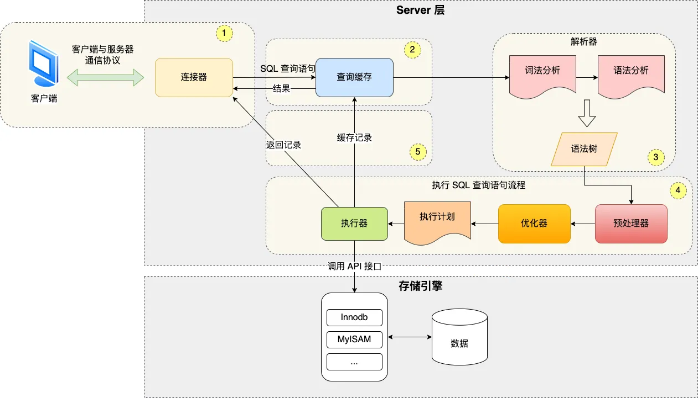
可以看到， MySQL 的架构共分为两层：**Server 层和存储引擎层**，

- **Server 层负责建立连接、分析和执行 SQL**。MySQL 大多数的核心功能模块都在这实现，主要包括连接器，查询缓存、解析器、预处理器、优化器、执行器等。另外，所有的内置函数（如日期、时间、数学和加密函数等）和所有跨存储引擎的功能（如存储过程、触发器、视图等。）都在 Server 层实现。
- **存储引擎层负责数据的存储和提取**。支持 InnoDB、MyISAM、Memory 等多个存储引擎，不同的存储引擎共用一个 Server 层。现在最常用的存储引擎是 InnoDB，从 MySQL 5.5 版本开始， InnoDB 成为了 MySQL 的默认存储引擎。我们常说的索引数据结构，就是由存储引擎层实现的，不同的存储引擎支持的索引类型也不相同，比如 InnoDB 支持索引类型是 B+树 ，且是默认使用，也就是说在数据表中创建的主键索引和二级索引默认使用的是 B+ 树索引。

好了，现在我们对 Server 层和存储引擎层有了一个简单认识，接下来，就详细说一条 SQL 查询语句的执行流程，依次看看每一个功能模块的作用。

## [](https://xiaolincoding.com/mysql/base/how_select.html#%E7%AC%AC%E4%B8%80%E6%AD%A5-%E8%BF%9E%E6%8E%A5%E5%99%A8)第一步：连接器
如果你在 Linux 操作系统里要使用 MySQL，那你第一步肯定是要先连接 MySQL 服务，然后才能执行 SQL 语句，普遍我们都是使用下面这条命令进行连接：
```shell
 -h 指定 MySQL 服务得 IP 地址，如果是连接本地的 MySQL服务，可以不用这个参数；
 -u 指定用户名，管理员角色名为 root；
 -p 指定密码，如果命令行中不填写密码（为了密码安全，建议不要在命令行写密码），就需要在交互对话里面输入密码
mysql -h$ip -u$user -p
```
连接的过程需要先经过 TCP 三次握手，因为 MySQL 是基于 TCP 协议进行传输的，如果 MySQL 服务并没有启动，则会收到如下的报错：
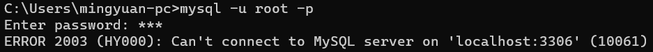
如果 MySQL 服务正常运行，完成 TCP 连接的建立后，连接器就要开始验证你的用户名和密码，如果用户名或密码不对，就收到一个"Access denied for user"的错误，然后客户端程序结束执行。
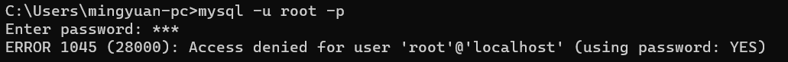
如果用户密码都没有问题，连接器就会获取该用户的权限，然后保存起来，后续该用户在此连接里的任何操作，都会基于连接开始时读到的权限进行权限逻辑的判断。
所以，如果一个用户已经建立了连接，即使管理员中途修改了该用户的权限，也不会影响已经存在连接的权限。修改完成后，只有再新建的连接才会使用新的权限设置。

### 如何查看 MySQL 服务被多少个客户端连接了？
如果你想知道当前 MySQL 服务被多少个客户端连接了，你可以执行 show processlist 命令进行查看。
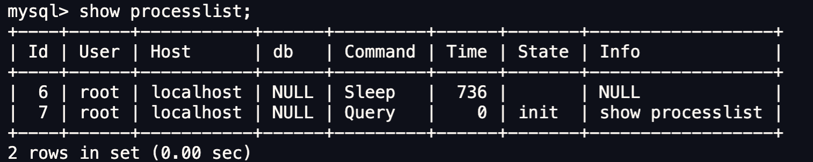
比如上图的显示结果，共有两个用户名为 root 的用户连接了 MySQL 服务，其中 id 为 6 的用户的 Command 列的状态为 Sleep ，这意味着该用户连接完 MySQL 服务就没有再执行过任何命令，也就是说这是一个空闲的连接，并且空闲的时长是 736 秒（ Time 列）。

### 空闲连接会一直占用着吗？
当然不是了，MySQL 定义了空闲连接的最大空闲时长，由 wait_timeout 参数控制的，默认值是 8 小时（28880秒），如果空闲连接超过了这个时间，连接器就会自动将它断开。
```sql
mysql> show variables like 'wait_timeout';
+---------------+-------+
| Variable_name | Value |
+---------------+-------+
| wait_timeout  | 28800 |
+---------------+-------+
1 row in set (0.00 sec)
```
当然，我们自己也可以手动断开空闲的连接，使用的是 kill connection + id 的命令。
```sql
mysql> kill connection + 6;
Query OK, 0 rows affected (0.00 sec)
```
一个处于空闲状态的连接被服务端主动断开后，这个客户端并不会马上知道，等到客户端在发起下一个请求的时候，才会收到这样的报错“ERROR 2013 (HY000): Lost connection to MySQL server during query”。

### MySQL 的连接数有限制吗？
MySQL 服务支持的最大连接数由 max_connections 参数控制，比如我的 MySQL 服务默认是 151 个,超过这个值，系统就会拒绝接下来的连接请求，并报错提示“Too many connections”。
```sql
mysql> show variables like 'max_connections';
+-----------------+-------+
| Variable_name   | Value |
+-----------------+-------+
| max_connections | 151   |
+-----------------+-------+
1 row in set (0.00 sec)
```
MySQL 的连接也跟 HTTP 一样，有短连接和长连接的概念，它们的区别如下：
```c
// 短连接
连接 mysql 服务（TCP 三次握手）
执行sql
断开 mysql 服务（TCP 四次挥手）

// 长连接
连接 mysql 服务（TCP 三次握手）
执行sql
执行sql
执行sql
....
断开 mysql 服务（TCP 四次挥手）
```
可以看到，使用长连接的好处就是可以减少建立连接和断开连接的过程，所以一般是推荐使用长连接。
但是，使用长连接后可能会占用内存增多，因为 MySQL 在执行查询过程中临时使用内存管理连接对象，这些连接对象资源只有在连接断开时才会释放。如果长连接累计很多，将导致 MySQL 服务占用内存太大，有可能会被系统强制杀掉，这样会发生 MySQL 服务异常重启的现象。

### 怎么解决长连接占用内存的问题？
有两种解决方式。
第一种，**定期断开长连接**。既然断开连接后就会释放连接占用的内存资源，那么我们可以定期断开长连接。
第二种，**客户端主动重置连接**。MySQL 5.7 版本实现了 mysql_reset_connection() 函数的接口，注意这是接口函数不是命令，那么当客户端执行了一个很大的操作后，在代码里调用 mysql_reset_connection 函数来重置连接，达到释放内存的效果。这个过程不需要重连和重新做权限验证，但是会将连接恢复到刚刚创建完时的状态。
至此，连接器的工作做完了，简单总结一下：

- 与客户端进行 TCP 三次握手建立连接；
- 校验客户端的用户名和密码，如果用户名或密码不对，则会报错；
- 如果用户名和密码都对了，会读取该用户的权限，然后后面的权限逻辑判断都基于此时读取到的权限；

## [](https://xiaolincoding.com/mysql/base/how_select.html#%E7%AC%AC%E4%BA%8C%E6%AD%A5-%E6%9F%A5%E8%AF%A2%E7%BC%93%E5%AD%98)第二步：查询缓存
连接器得工作完成后，客户端就可以向 MySQL 服务发送 SQL 语句了，MySQL 服务收到 SQL 语句后，就会解析出 SQL 语句的第一个字段，看看是什么类型的语句。
如果 SQL 是查询语句（select 语句），MySQL 就会先去查询缓存（ Query Cache ）里查找缓存数据，看看之前有没有执行过这一条命令，这个查询缓存是以 key-value 形式保存在内存中的，key 为 SQL 查询语句，value 为 SQL 语句查询的结果。
如果查询的语句命中查询缓存，那么就会直接返回 value 给客户端。如果查询的语句没有命中查询缓存中，那么就要往下继续执行，等执行完后，查询的结果就会被存入查询缓存中。
这么看，查询缓存还挺有用，但是其实**查询缓存挺鸡肋**的。
对于更新比较频繁的表，查询缓存的命中率很低的，因为只要一个表有更新操作，那么这个表的查询缓存就会被清空。如果刚缓存了一个查询结果很大的数据，还没被使用的时候，刚好这个表有更新操作，查询缓冲就被清空了，相当于缓存了个寂寞。
所以，MySQL 8.0 版本直接将查询缓存删掉了，也就是说 MySQL 8.0 开始，执行一条 SQL 查询语句，不会再走到查询缓存这个阶段了。
对于 MySQL 8.0 之前的版本，如果想关闭查询缓存，我们可以通过将参数 query_cache_type 设置成 DEMAND。
**TIP**
这里说的查询缓存是 server 层的，也就是 MySQL 8.0 版本移除的是 server 层的查询缓存，并不是 Innodb 存储引擎中的 buffer pool，他们是**两个不同的组件**。

## [](https://xiaolincoding.com/mysql/base/how_select.html#%E7%AC%AC%E4%B8%89%E6%AD%A5-%E8%A7%A3%E6%9E%90-sql)第三步：解析 SQL
在正式执行 SQL 查询语句之前， MySQL 会先对 SQL 语句做解析，这个工作交由「解析器」来完成。

### [](https://xiaolincoding.com/mysql/base/how_select.html#%E8%A7%A3%E6%9E%90%E5%99%A8)解析器
解析器会做如下两件事情。
第一件事情，**词法分析**。MySQL 会根据你输入的字符串识别出关键字出来，例如，SQL语句 select username from userinfo，在分析之后，会得到4个Token，其中有2个Keyword，分别为select和from：

| 关键字 | 非关键字 | 关键字 | 非关键字 |
| --- | --- | --- | --- |
| select | username | from | userinfo |

第二件事情，**语法分析**。根据词法分析的结果，语法解析器会根据语法规则，判断你输入的这个 SQL 语句是否满足 MySQL 语法，如果没问题就会构建出 SQL 语法树，这样方便后面模块获取 SQL 类型、表名、字段名、 where 条件等等。
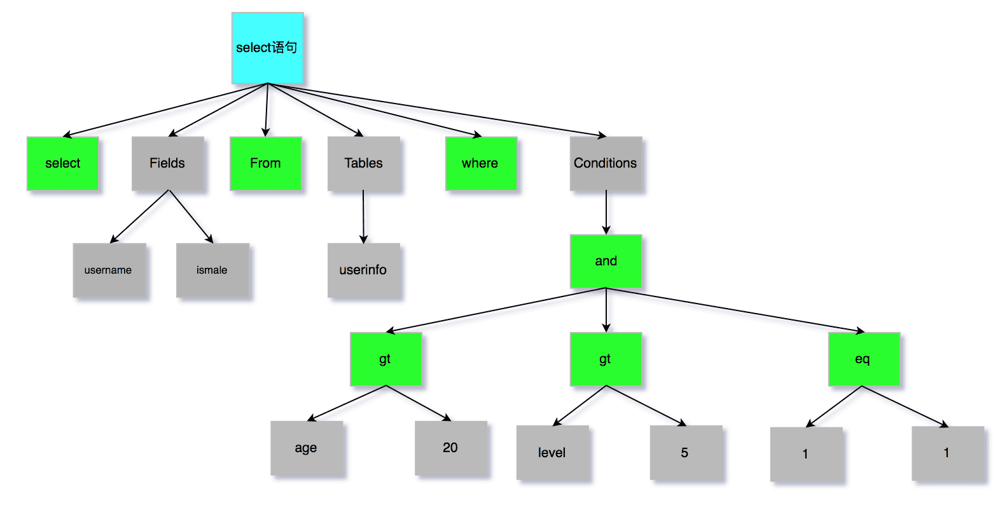
如果我们输入的 SQL 语句语法不对，就会在解析器这个阶段报错。比如，我下面这条查询语句，把 from 写成了 form，这时 MySQL 解析器就会给报错。
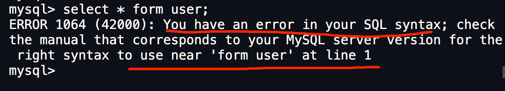
但是注意，表不存在或者字段不存在，并不是在解析器里做的，《MySQL 45 讲》说是在解析器做的，但是经过我和朋友看 MySQL 源码（5.7和8.0）得出结论是解析器只负责检查语法和构建语法树，但是不会去查表或者字段存不存在。
那到底谁来做检测表和字段是否存在的工作呢？别急，接下来就是了。

## [](https://xiaolincoding.com/mysql/base/how_select.html#%E7%AC%AC%E5%9B%9B%E6%AD%A5-%E6%89%A7%E8%A1%8C-sql)第四步：执行 SQL
经过解析器后，接着就要进入执行 SQL 查询语句的流程了，每条SELECT 查询语句流程主要可以分为下面这三个阶段：

- prepare 阶段，也就是预处理阶段；
- optimize 阶段，也就是优化阶段；
- execute 阶段，也就是执行阶段；

### [](https://xiaolincoding.com/mysql/base/how_select.html#%E9%A2%84%E5%A4%84%E7%90%86%E5%99%A8)预处理器
我们先来说说预处理阶段做了什么事情。

- 检查 SQL 查询语句中的表或者字段是否存在；
- 将 select * 中的 * 符号，扩展为表上的所有列；

下面这条查询语句，test 这张表是不存在的，这时 MySQL 就会在执行 SQL 查询语句的 prepare 阶段中报错。
```sql
mysql> select * from test;
ERROR 1146 (42S02): Table 'mysql.test' doesn't exist
```

### [](https://xiaolincoding.com/mysql/base/how_select.html#%E4%BC%98%E5%8C%96%E5%99%A8)优化器
经过预处理阶段后，还需要为 SQL 查询语句先制定一个执行计划，这个工作交由「优化器」来完成的。
**优化器主要负责将 SQL 查询语句的执行方案确定下来**，比如在表里面有多个索引的时候，优化器会基于查询成本的考虑，来决定选择使用哪个索引。
当然，我们本次的查询语句（select * from product where id = 1）很简单，就是选择使用主键索引。
要想知道优化器选择了哪个索引，我们可以在查询语句最前面加个 explain 命令，这样就会输出这条 SQL 语句的执行计划，然后执行计划中的 key 就表示执行过程中使用了哪个索引。

### [](https://xiaolincoding.com/mysql/base/how_select.html#%E6%89%A7%E8%A1%8C%E5%99%A8)执行器
经历完优化器后，就确定了执行方案，接下来 MySQL 就真正开始执行语句了，这个工作是由「执行器」完成的。在执行的过程中，执行器就会和存储引擎交互了，交互是以记录为单位的。

## 总结
执行一条 SQL 查询语句，期间发生了什么？

- 连接器：建立连接，管理连接、校验用户身份；
- 查询缓存：查询语句如果命中查询缓存则直接返回，否则继续往下执行。MySQL 8.0 已删除该模块；
- 解析 SQL，通过解析器对 SQL 查询语句进行词法分析、语法分析，然后构建语法树，方便后续模块读取表名、字段、语句类型；
- 执行 SQL：执行 SQL 共有三个阶段：
   - 预处理阶段：检查表或字段是否存在；将 select * 中的 * 符号扩展为表上的所有列。
   - 优化阶段：基于查询成本的考虑， 选择查询成本最小的执行计划；
   - 执行阶段：根据执行计划执行 SQL 查询语句，从存储引擎读取记录，返回给客户端；

怎么样？现在再看这张图，是不是很清晰了。

# MySQL 一行记录是怎么存储的？
之前有小伙伴说在面试过程中被问到：是否知道 MySQL 的 null 值是怎么存放的？
其实如果大家知道 MySQL 一行记录的存储结构，那么这个问题对你没什么难度。
如果你不知道也没关系，这次我跟大家聊聊 **MySQL 一行记录是怎么存储的？**
知道了这个之后，除了能应解锁前面这道面试题，你还会解锁这些面试题：

- MySQL 的 NULL 值会占用空间吗？
- MySQL 怎么知道 varchar(n) 实际占用数据的大小？
- varchar(n) 中 n 最大取值为多少？
- 行溢出后，MySQL 是怎么处理的？

这些问题看似毫不相干，其实都是在围绕「 MySQL 一行记录的存储结构」这一个知识点，所以攻破了这个知识点后，这些问题就引刃而解了。
好了，话不多说，发车！

## [](https://xiaolincoding.com/mysql/base/row_format.html#mysql-%E7%9A%84%E6%95%B0%E6%8D%AE%E5%AD%98%E6%94%BE%E5%9C%A8%E5%93%AA%E4%B8%AA%E6%96%87%E4%BB%B6)MySQL 的数据存放在哪个文件？
大家都知道 MySQL 的数据都是保存在磁盘的，那具体是保存在哪个文件呢？
MySQL 存储的行为是由存储引擎实现的，MySQL 支持多种存储引擎，不同的存储引擎保存的文件自然也不同。
InnoDB 是我们常用的存储引擎，也是 MySQL 默认的存储引擎。所以，本文主要以 InnoDB 存储引擎展开讨论。
先来看看 MySQL 数据库的文件存放在哪个目录？
```sql
mysql> SHOW VARIABLES LIKE 'datadir';
+---------------+-----------------+
| Variable_name | Value           |
+---------------+-----------------+
| datadir       | /var/lib/mysql/ |
+---------------+-----------------+
1 row in set (0.00 sec)
```
我们每创建一个 database（数据库） 都会在 /var/lib/mysql/ 目录里面创建一个以 database 为名的目录，然后保存表结构和表数据的文件都会存放在这个目录里。
比如，我这里有一个名为 my_test 的 database，该 database 里有一张名为 t_order 数据库表。

然后，我们进入 /var/lib/mysql/my_test 目录，看看里面有什么文件？
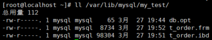
可以看到，共有三个文件，这三个文件分别代表着：

- db.opt，用来存储当前数据库的默认字符集和字符校验规则。
- t_order.frm ，t_order 的**表结构**会保存在这个文件。在 MySQL 中建立一张表都会生成一个.frm 文件，该文件是用来保存每个表的元数据信息的，主要包含表结构定义。
- t_order.ibd，t_order 的**表数据**会保存在这个文件。表数据既可以存在共享表空间文件（文件名：ibdata1）里，也可以存放在独占表空间文件（文件名：表名字.ibd）。这个行为是由参数 innodb_file_per_table 控制的，若设置了参数 innodb_file_per_table 为 1，则会将存储的数据、索引等信息单独存储在一个独占表空间，从 MySQL 5.6.6 版本开始，它的默认值就是 1 了，因此从这个版本之后， MySQL 中每一张表的数据都存放在一个独立的 .ibd 文件。

好了，现在我们知道了一张数据库表的数据是保存在「 表名字.ibd 」的文件里的，这个文件也称为独占表空间文件。

### [](https://xiaolincoding.com/mysql/base/row_format.html#%E8%A1%A8%E7%A9%BA%E9%97%B4%E6%96%87%E4%BB%B6%E7%9A%84%E7%BB%93%E6%9E%84%E6%98%AF%E6%80%8E%E4%B9%88%E6%A0%B7%E7%9A%84)表空间文件的结构是怎么样的？
**表空间由段（segment）、区（extent）、页（page）、行（row）组成**，InnoDB存储引擎的逻辑存储结构大致如下图：
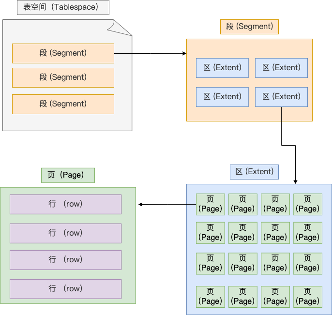
下面我们从下往上一个个看看。

#### [](https://xiaolincoding.com/mysql/base/row_format.html#_1%E3%80%81%E8%A1%8C-row)1、行（row）
数据库表中的记录都是按行（row）进行存放的，每行记录根据不同的行格式，有不同的存储结构。
后面我们详细介绍 InnoDB 存储引擎的行格式，也是本文重点介绍的内容。

#### [](https://xiaolincoding.com/mysql/base/row_format.html#_2%E3%80%81%E9%A1%B5-page)2、页（page）
记录是按照行来存储的，但是数据库的读取并不以「行」为单位，否则一次读取（也就是一次 I/O 操作）只能处理一行数据，效率会非常低。
因此，**InnoDB 的数据是按「页」为单位来读写的**，也就是说，当需要读一条记录的时候，并不是将这个行记录从磁盘读出来，而是以页为单位，将其整体读入内存。
**默认每个页的大小为 16KB**，也就是最多能保证 16KB 的连续存储空间。
页是 InnoDB 存储引擎磁盘管理的最小单元，意味着数据库每次读写都是以 16KB 为单位的，一次最少从磁盘中读取 16K 的内容到内存中，一次最少把内存中的 16K 内容刷新到磁盘中。

#### [](https://xiaolincoding.com/mysql/base/row_format.html#_3%E3%80%81%E5%8C%BA-extent)3、区（extent）
我们知道 InnoDB 存储引擎是用 B+ 树来组织数据的。
B+ 树中每一层都是通过双向链表连接起来的，如果是以页为单位来分配存储空间，那么链表中相邻的两个页之间的物理位置并不是连续的，可能离得非常远，那么磁盘查询时就会有大量的随机I/O，随机 I/O 是非常慢的。
解决这个问题也很简单，就是让链表中相邻的页的物理位置也相邻，这样就可以使用顺序 I/O 了，那么在范围查询（扫描叶子节点）的时候性能就会很高。
那具体怎么解决呢？
**在表中数据量大的时候，为某个索引分配空间的时候就不再按照页为单位分配了，而是按照区（extent）为单位分配。每个区的大小为 1MB，对于 16KB 的页来说，连续的 64 个页会被划为一个区，这样就使得链表中相邻的页的物理位置也相邻，就能使用顺序 I/O 了**。

#### [](https://xiaolincoding.com/mysql/base/row_format.html#_4%E3%80%81%E6%AE%B5-segment)4、段（segment）
表空间是由各个段（segment）组成的，段是由多个区（extent）组成的。段一般分为数据段、索引段和回滚段等。

- 索引段：存放 B + 树的非叶子节点的区的集合；
- 数据段：存放 B + 树的叶子节点的区的集合；
- 回滚段：存放的是回滚数据的区的集合；

好了，终于说完表空间的结构了。接下来，就具体讲一下 InnoDB 的行格式了。
之所以要绕一大圈才讲行记录的格式，主要是想让大家知道行记录是存储在哪个文件，以及行记录在这个表空间文件中的哪个区域，有一个从上往下切入的视角，这样理解起来不会觉得很抽象。

## InnoDB 行格式有哪些？
行格式（row_format），就是一条记录的存储结构。
InnoDB 提供了 4 种行格式，分别是 **Redundant**、**Compact**、**Dynamic**和 **Compressed** 行格式。

- Redundant 是很古老的行格式了， MySQL 5.0 版本之前用的行格式，现在基本没人用了。
- 由于 Redundant 不是一种紧凑的行格式，所以 MySQL 5.0 之后引入了 Compact 行记录存储方式，Compact 是一种紧凑的行格式，设计的初衷就是为了让一个数据页中可以存放更多的行记录，从 MySQL 5.1 版本之后，行格式默认设置成 Compact。
- Dynamic 和 Compressed 两个都是紧凑的行格式，它们的行格式都和 Compact 差不多，因为都是基于 Compact 改进一点东西。从 MySQL5.7 版本之后，**默认使用 Dynamic 行格式**。

Redundant 行格式我这里就不讲了，因为现在基本没人用了，这次重点介绍 Compact 行格式，因为 Dynamic 和 Compressed 这两个行格式跟 Compact 非常像。
所以，弄懂了 Compact 行格式，之后你们在去了解其他行格式，很快也能看懂。

## [](https://xiaolincoding.com/mysql/base/row_format.html#compact-%E8%A1%8C%E6%A0%BC%E5%BC%8F%E9%95%BF%E4%BB%80%E4%B9%88%E6%A0%B7)COMPACT 行格式长什么样？
先跟 Compact 行格式混个脸熟，它长这样：
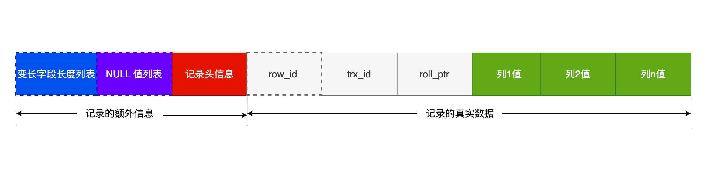
可以看到，一条完整的记录分为「记录的额外信息」和「记录的真实数据」两个部分。
接下里，分别详细说下。

### [](https://xiaolincoding.com/mysql/base/row_format.html#%E8%AE%B0%E5%BD%95%E7%9A%84%E9%A2%9D%E5%A4%96%E4%BF%A1%E6%81%AF)记录的额外信息
记录的额外信息包含 3 个部分：变长字段长度列表、NULL 值列表、记录头信息。

#### [](https://xiaolincoding.com/mysql/base/row_format.html#_1-%E5%8F%98%E9%95%BF%E5%AD%97%E6%AE%B5%E9%95%BF%E5%BA%A6%E5%88%97%E8%A1%A8)1. 变长字段长度列表
varchar(n) 和 char(n) 的区别是什么，相信大家都非常清楚，char 是定长的，varchar 是变长的，变长字段实际存储的数据的长度（大小）不固定的。
所以，在存储数据的时候，也要把数据占用的大小存起来，存到「变长字段长度列表」里面，读取数据的时候才能根据这个「变长字段长度列表」去读取对应长度的数据。其他 TEXT、BLOB 等变长字段也是这么实现的。
为了展示「变长字段长度列表」具体是怎么保存「变长字段的真实数据占用的字节数」，我们先创建这样一张表，字符集是 ascii（所以每一个字符占用的 1 字节），行格式是 Compact，t_user 表中 name 和 phone 字段都是变长字段：
```sql
CREATE TABLE `t_user` (
  `id` int(11) NOT NULL,
  `name` VARCHAR(20) DEFAULT NULL,
  `phone` VARCHAR(20) DEFAULT NULL,
  `age` int(11) DEFAULT NULL,
  PRIMARY KEY (`id`) USING BTREE
) ENGINE = InnoDB DEFAULT CHARACTER SET =   ROW_FORMAT = COMPACT;
```
现在 t_user 表里有这三条记录：

接下来，我们看看看看这三条记录的行格式中的 「变长字段长度列表」是怎样存储的。
先来看第一条记录：

- name 列的值为 a，真实数据占用的字节数是 1 字节，十六进制 0x01；
- phone 列的值为 123，真实数据占用的字节数是 3 字节，十六进制 0x03；
- age 列和 id 列不是变长字段，所以这里不用管。

这些变长字段的真实数据占用的字节数会按照列的顺序**逆序存放**（等下会说为什么要这么设计），所以「变长字段长度列表」里的内容是「 03 01」，而不是 「01 03」。
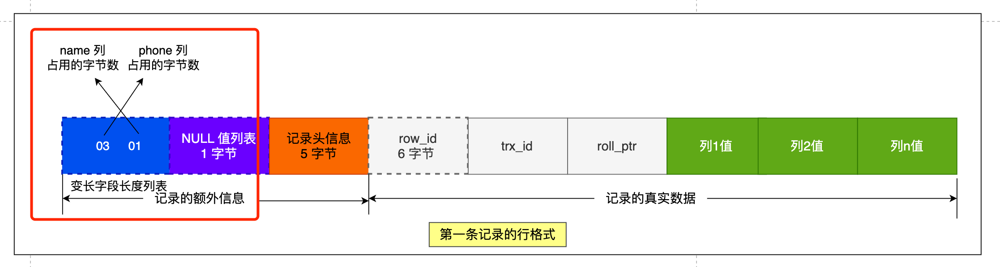
同样的道理，我们也可以得出**第二条记录**的行格式中，「变长字段长度列表」里的内容是「 04 02」，如下图：
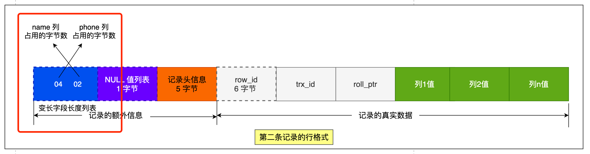
**第三条记录**中 phone 列的值是 NULL，**NULL 是不会存放在行格式中记录的真实数据部分里的**，所以「变长字段长度列表」里不需要保存值为 NULL 的变长字段的长度。
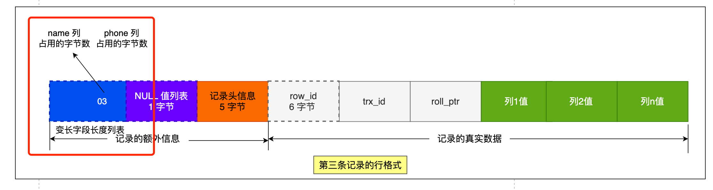
**为什么「变长字段长度列表」的信息要按照逆序存放？**
主要是因为「记录头信息」中指向下一个记录的指针，指向的是下一条记录的「记录头信息」和「真实数据」之间的位置，这样的好处是向左读就是记录头信息，向右读就是真实数据，比较方便。简单而言就是向中间靠拢。这样可以**使得位置靠前的记录的真实数据和数据对应的字段长度信息可以同时在一个 CPU Cache Line 中，这样就可以提高 CPU Cache 的命中率**。
同样的道理， NULL 值列表的信息也需要逆序存放。
**每个数据库表的行格式都有「变长字段字节数列表」吗？**
其实变长字段字节数列表不是必须的。
**当数据表没有变长字段的时候，比如全部都是 int 类型的字段，这时候表里的行格式就不会有「变长字段长度列表」了**，因为没必要，不如去掉以节省空间。
所以「变长字段长度列表」只出现在数据表有变长字段的时候。

#### [](https://xiaolincoding.com/mysql/base/row_format.html#_2-null-%E5%80%BC%E5%88%97%E8%A1%A8)2. NULL 值列表
表中的某些列可能会存储 NULL 值，如果把这些 NULL 值都放到记录的真实数据中会比较浪费空间，所以 Compact 行格式把这些值为 NULL 的列存储到 NULL值列表中。
如果存在允许 NULL 值的列，则每个列对应一个二进制位（bit），二进制位按照列的顺序逆序排列。

- 二进制位的值为1时，代表该列的值为NULL。
- 二进制位的值为0时，代表该列的值不为NULL。

另外，NULL 值列表必须用整数个字节的位表示（1字节8位），如果使用的二进制位个数不足整数个字节，则在字节的高位补 0。
还是以 t_user 表的这三条记录作为例子：
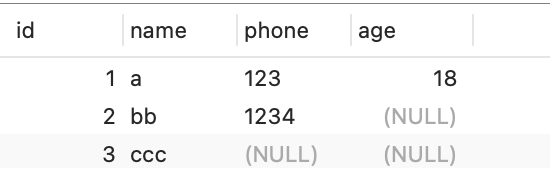
接下来，我们看看看看这三条记录的行格式中的 NULL 值列表是怎样存储的。
先来看**第一条记录**，第一条记录所有列都有值，不存在 NULL 值，所以用二进制来表示是酱紫的：
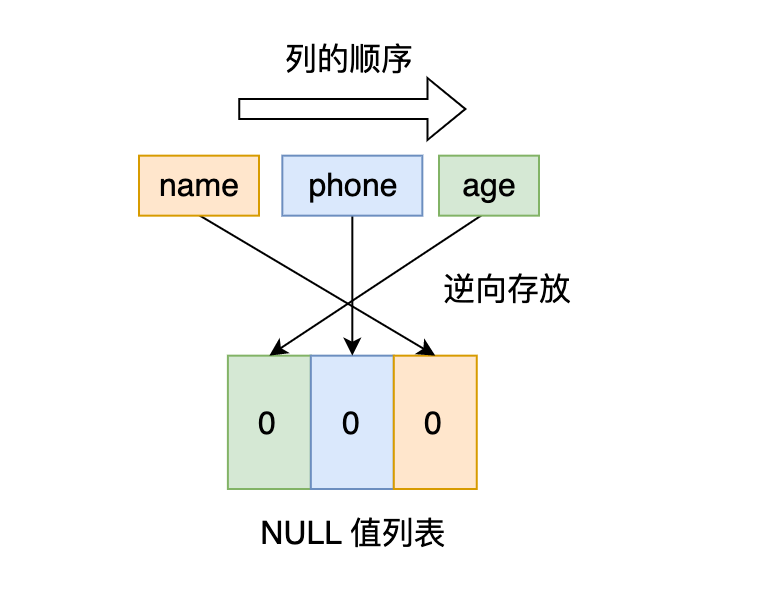
但是 InnoDB 是用整数字节的二进制位来表示 NULL 值列表的，现在不足 8 位，所以要在高位补 0，最终用二进制来表示是酱紫的：
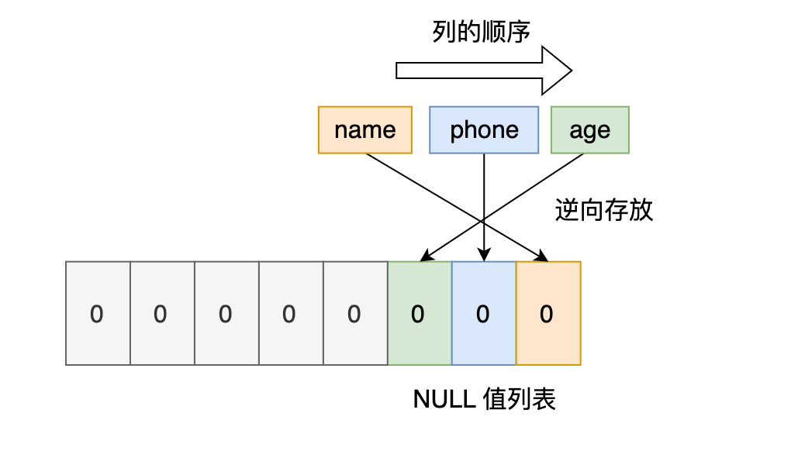
所以，对于第一条数据，NULL 值列表用十六进制表示是 0x00。
接下来看**第二条记录**，第二条记录 age 列是 NULL 值，所以，对于第二条数据，NULL值列表用十六进制表示是 0x04。
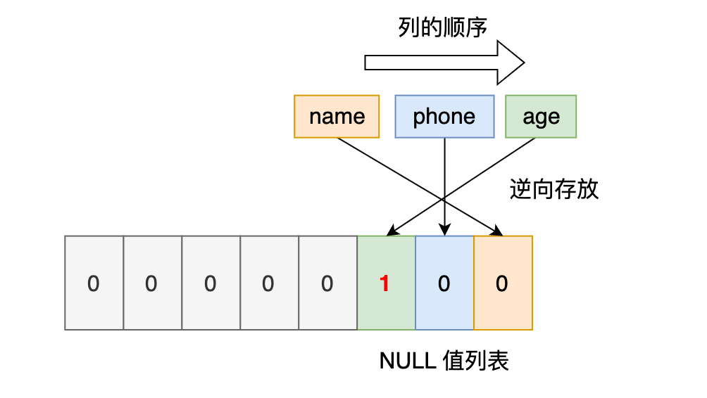
最后**第三条记录**，第三条记录 phone 列 和 age 列是 NULL 值，所以，对于第三条数据，NULL 值列表用十六进制表示是 0x06。
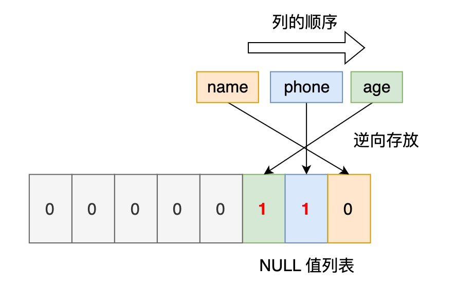
我们把三条记录的 NULL 值列表都填充完毕后，它们的行格式是这样的：
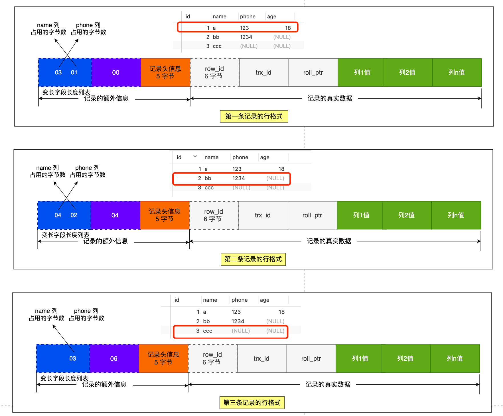
**每个数据库表的行格式都有「NULL 值列表」吗？**
NULL 值列表也不是必须的。
**当数据表的字段都定义成 NOT NULL 的时候，这时候表里的行格式就不会有 NULL 值列表了**。
所以在设计数据库表的时候，通常都是建议将字段设置为 NOT NULL，这样可以至少节省 1 字节的空间（NULL 值列表至少占用 1 字节空间）。
**「NULL 值列表」是固定 1 字节空间吗？如果这样的话，一条记录有 9 个字段值都是 NULL，这时候怎么表示？**
「NULL 值列表」的空间不是固定 1 字节的。
当一条记录有 9 个字段值都是 NULL，那么就会创建 2 字节空间的「NULL 值列表」，以此类推。

#### [](https://xiaolincoding.com/mysql/base/row_format.html#_3-%E8%AE%B0%E5%BD%95%E5%A4%B4%E4%BF%A1%E6%81%AF)3. 记录头信息
记录头信息中包含的内容很多，我就不一一列举了，这里说几个比较重要的：

- delete_mask ：标识此条数据是否被删除。从这里可以知道，我们执行 detele 删除记录的时候，并不会真正的删除记录，只是将这个记录的 delete_mask 标记为 1。
- next_record：下一条记录的位置。从这里可以知道，记录与记录之间是通过链表组织的。在前面我也提到了，指向的是下一条记录的「记录头信息」和「真实数据」之间的位置，这样的好处是向左读就是记录头信息，向右读就是真实数据，比较方便。
- record_type：表示当前记录的类型，0表示普通记录，1表示B+树非叶子节点记录，2表示最小记录，3表示最大记录

### [](https://xiaolincoding.com/mysql/base/row_format.html#%E8%AE%B0%E5%BD%95%E7%9A%84%E7%9C%9F%E5%AE%9E%E6%95%B0%E6%8D%AE)记录的真实数据
记录真实数据部分除了我们定义的字段，还有三个隐藏字段，分别为：row_id、trx_id、roll_pointer，我们来看下这三个字段是什么。
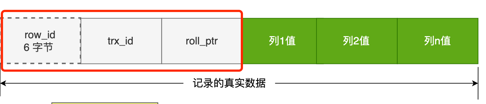

- row_id

如果我们建表的时候指定了主键或者唯一约束列，那么就没有 row_id 隐藏字段了。如果既没有指定主键，又没有唯一约束，那么 InnoDB 就会为记录添加 row_id 隐藏字段。row_id不是必需的，占用 6 个字节。

- trx_id

事务id，表示这个数据是由哪个事务生成的。 trx_id是必需的，占用 6 个字节。

- roll_pointer

这条记录上一个版本的指针。roll_pointer 是必需的，占用 7 个字节。

## [](https://xiaolincoding.com/mysql/base/row_format.html#varchar-n-%E4%B8%AD-n-%E6%9C%80%E5%A4%A7%E5%8F%96%E5%80%BC%E4%B8%BA%E5%A4%9A%E5%B0%91)varchar(n) 中 n 最大取值为多少？
我们要清楚一点，**MySQL 规定除了 TEXT、BLOBs 这种大对象类型之外，其他所有的列（不包括隐藏列和记录头信息）占用的字节长度加起来不能超过 65535 个字节**。
也就是说，一行记录除了 TEXT、BLOBs 类型的列，限制最大为 65535 字节，注意是一行的总长度，不是一列。
知道了这个前提之后，我们再来看看这个问题：「varchar(n) 中 n 最大取值为多少？」
varchar(n) 字段类型的 n 代表的是最多存储的字符数量，并不是字节大小哦。
要算 varchar(n) 最大能允许存储的字节数，还要看数据库表的字符集，因为字符集代表着，1个字符要占用多少字节，比如 ascii 字符集， 1 个字符占用 1 字节，那么 varchar(100) 意味着最大能允许存储 100 字节的数据。

### [](https://xiaolincoding.com/mysql/base/row_format.html#%E5%8D%95%E5%AD%97%E6%AE%B5%E7%9A%84%E6%83%85%E5%86%B5)单字段的情况
前面我们知道了，一行记录最大只能存储 65535 字节的数据。
那假设数据库表只有一个 varchar(n) 类型的列且字符集是 ascii，在这种情况下， varchar(n) 中 n 最大取值是 65535 吗？
不着急说结论，我们先来做个实验验证一下。
我们定义一个 varchar(65535) 类型的字段，字符集为 ascii 的数据库表。
```sql
CREATE TABLE test ( 
`name` VARCHAR(65535)  NULL
) ENGINE = InnoDB DEFAULT CHARACTER SET = ascii ROW_FORMAT = COMPACT;
```
看能不能成功创建一张表：
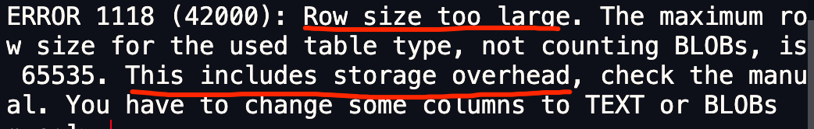
可以看到，创建失败了。
从报错信息就可以知道**一行数据的最大字节数是 65535（不包含 TEXT、BLOBs 这种大对象类型），其中包含了 storage overhead**。
问题来了，这个 storage overhead 是什么呢？其实就是「变长字段长度列表」和 「NULL 值列表」，也就是说**一行数据的最大字节数 65535，其实是包含「变长字段长度列表」和 「NULL 值列表」所占用的字节数的**。所以， 我们在算 varchar(n) 中 n 最大值时，需要减去 storage overhead 占用的字节数。
这是因为我们存储字段类型为 varchar(n) 的数据时，其实分成了三个部分来存储：

- 真实数据
- 真实数据占用的字节数
- NULL 标识，如果不允许为NULL，这部分不需要

**本次案例中，「NULL 值列表」所占用的字节数是多少？**
前面我创建表的时候，字段是允许为 NULL 的，所以**会用 1 字节来表示「NULL 值列表」**。
**本次案例中，「变长字段长度列表」所占用的字节数是多少？**
「变长字段长度列表」所占用的字节数 = 所有「变长字段长度」占用的字节数之和。
所以，我们要先知道每个变长字段的「变长字段长度」需要用多少字节表示？具体情况分为：

- 条件一：如果变长字段允许存储的最大字节数小于等于 255 字节，就会用 1 字节表示「变长字段长度」；
- 条件二：如果变长字段允许存储的最大字节数大于 255 字节，就会用 2 字节表示「变长字段长度」；

我们这里字段类型是 varchar(65535) ，字符集是 ascii，所以代表着变长字段允许存储的最大字节数是 65535，符合条件二，所以会用 2 字节来表示「变长字段长度」。
**因为我们这个案例是只有 1 个变长字段，所以「变长字段长度列表」= 1 个「变长字段长度」占用的字节数，也就是 2 字节**。
因为我们在算 varchar(n) 中 n 最大值时，需要减去 「变长字段长度列表」和 「NULL 值列表」所占用的字节数的。所以，**在数据库表只有一个 varchar(n) 字段且字符集是 ascii 的情况下，varchar(n) 中 n 最大值 = 65535 - 2 - 1 = 65532**。
我们先来测试看看 varchar(65533) 是否可行？
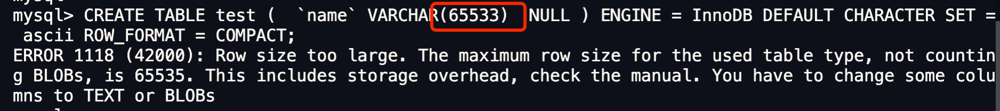
可以看到，还是不行，接下来看看 varchar(65532) 是否可行？
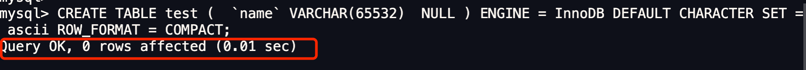
可以看到，创建成功了。说明我们的推论是正确的，在算 varchar(n) 中 n 最大值时，需要减去 「变长字段长度列表」和 「NULL 值列表」所占用的字节数的。
当然，我上面这个例子是针对字符集为 ascii 情况，如果采用的是 UTF-8，varchar(n) 最多能存储的数据计算方式就不一样了：

- 在 UTF-8 字符集下，一个字符最多需要三个字节，varchar(n) 的 n 最大取值就是 65532/3 = 21844。

上面所说的只是针对于一个字段的计算方式。

### [](https://xiaolincoding.com/mysql/base/row_format.html#%E5%A4%9A%E5%AD%97%E6%AE%B5%E7%9A%84%E6%83%85%E5%86%B5)多字段的情况
**如果有多个字段的话，要保证所有字段的长度 + 变长字段字节数列表所占用的字节数 + NULL值列表所占用的字节数 <= 65535**。

## [](https://xiaolincoding.com/mysql/base/row_format.html#%E8%A1%8C%E6%BA%A2%E5%87%BA%E5%90%8E-mysql-%E6%98%AF%E6%80%8E%E4%B9%88%E5%A4%84%E7%90%86%E7%9A%84)行溢出后，MySQL 是怎么处理的？
MySQL 中磁盘和内存交互的基本单位是页，一个页的大小一般是 16KB，也就是 16384字节，而一个 varchar(n) 类型的列最多可以存储 65532字节，一些大对象如 TEXT、BLOB 可能存储更多的数据，这时一个页可能就存不了一条记录。这个时候就会**发生行溢出，多的数据就会存到另外的「溢出页」中**。
如果一个数据页存不了一条记录，InnoDB 存储引擎会自动将溢出的数据存放到「溢出页」中。在一般情况下，InnoDB 的数据都是存放在 「数据页」中。但是当发生行溢出时，溢出的数据会存放到「溢出页」中。
当发生行溢出时，在记录的真实数据处只会保存该列的一部分数据，而把剩余的数据放在「溢出页」中，然后真实数据处用 20 字节存储指向溢出页的地址，从而可以找到剩余数据所在的页。大致如下图所示。
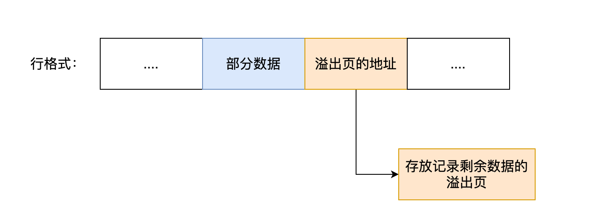
上面这个是 Compact 行格式在发生行溢出后的处理。
Compressed 和 Dynamic 这两个行格式和 Compact 非常类似，主要的区别在于处理行溢出数据时有些区别。
这两种格式采用完全的行溢出方式，记录的真实数据处不会存储该列的一部分数据，只存储 20 个字节的指针来指向溢出页。而实际的数据都存储在溢出页中，看起来就像下面这样：
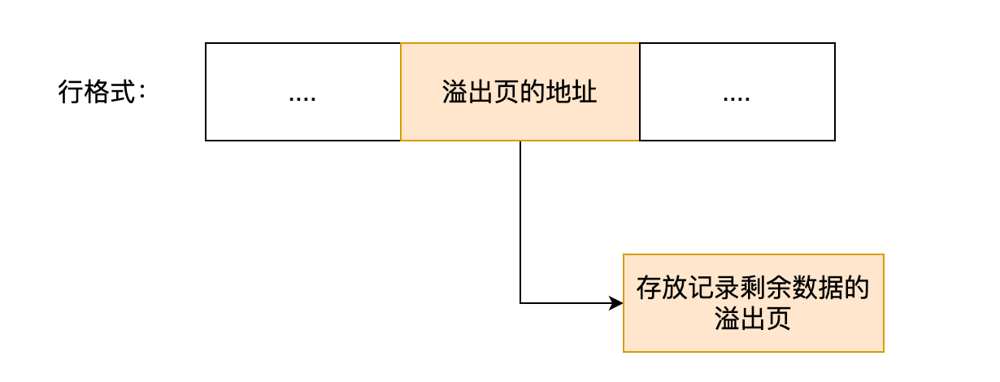

## [](https://xiaolincoding.com/mysql/base/row_format.html#%E6%80%BB%E7%BB%93)总结

### MySQL 的 NULL 值是怎么存放的？
MySQL 的 Compact 行格式中会用「NULL值列表」来标记值为 NULL 的列，NULL 值并不会存储在行格式中的真实数据部分。
NULL值列表会占用 1 字节空间，当表中所有字段都定义成 NOT NULL，行格式中就不会有 NULL值列表，这样可节省 1 字节的空间。

### MySQL 怎么知道 varchar(n) 实际占用数据的大小？
MySQL 的 Compact 行格式中会用「变长字段长度列表」存储变长字段实际占用的数据大小。

### varchar(n) 中 n 最大取值为多少？
一行记录最大能存储 65535 字节的数据，但是这个是包含「变长字段字节数列表所占用的字节数」和「NULL值列表所占用的字节数」。所以， 我们在算 varchar(n) 中 n 最大值时，需要减去这两个列表所占用的字节数。
如果一张表只有一个 varchar(n) 字段，且允许为 NULL，字符集为 ascii。varchar(n) 中 n 最大取值为 65532。
计算公式：65535 - 变长字段字节数列表所占用的字节数 - NULL值列表所占用的字节数 = 65535 - 2 - 1 = 65532。
如果有多个字段的话，要保证所有字段的长度 + 变长字段字节数列表所占用的字节数 + NULL值列表所占用的字节数 <= 65535。

### 行溢出后，MySQL 是怎么处理的？
如果一个数据页存不了一条记录，InnoDB 存储引擎会自动将溢出的数据存放到「溢出页」中。
Compact 行格式针对行溢出的处理是这样的：当发生行溢出时，在记录的真实数据处只会保存该列的一部分数据，而把剩余的数据放在「溢出页」中，然后真实数据处用 20 字节存储指向溢出页的地址，从而可以找到剩余数据所在的页。
Compressed 和 Dynamic 这两种格式采用完全的行溢出方式，记录的真实数据处不会存储该列的一部分数据，只存储 20 个字节的指针来指向溢出页。而实际的数据都存储在溢出页中。

# 最左前缀原则一定需要最左列吗？
最近在整理 mysql 知识点的时候，发现一个有意思的最左前缀问题，话不多说直接上代码：
创建了一张数据库表，表里的字段只有主键索引（id）和联合索引（a，b，c）
```sql
drop TABLE t;
CREATE TABLE `t` (
    `id` INT NOT NULL AUTO_INCREMENT,
    `a` INT NOT NULL,
    `b` INT NOT NULL,
    `c` INT NOT NULL,
    PRIMARY KEY (`id`) USING BTREE,
    KEY `abc` (`a`, `b`, `c`)
) ENGINE=INNODB DEFAULT CHARSET=utf8mb4 COLLATE=utf8mb4_general_ci;

INSERT INTO `t` (`a`, `b`, `c`) VALUES (1, 2, 3);
INSERT INTO `t` (`a`, `b`, `c`) VALUES (4, 5, 6);
INSERT INTO `t` (`a`, `b`, `c`) VALUES (7, 8, 9);
INSERT INTO `t` (`a`, `b`, `c`) VALUES (10, 11, 12);
INSERT INTO `t` (`a`, `b`, `c`) VALUES (13, 14, 15);
INSERT INTO `t` (`a`, `b`, `c`) VALUES (16, 17, 18);
INSERT INTO `t` (`a`, `b`, `c`) VALUES (19, 20, 21);
INSERT INTO `t` (`a`, `b`, `c`) VALUES (22, 23, 24);
INSERT INTO `t` (`a`, `b`, `c`) VALUES (25, 26, 27);
INSERT INTO `t` (`a`, `b`, `c`) VALUES (28, 29, 30);
INSERT INTO `t` (`a`, `b`, `c`) VALUES (31, 32, 33);
INSERT INTO `t` (`a`, `b`, `c`) VALUES (34, 35, 36);
INSERT INTO `t` (`a`, `b`, `c`) VALUES (37, 38, 39);
INSERT INTO `t` (`a`, `b`, `c`) VALUES (40, 41, 42);
INSERT INTO `t` (`a`, `b`, `c`) VALUES (43, 44, 45);
INSERT INTO `t` (`a`, `b`, `c`) VALUES (46, 47, 48);
INSERT INTO `t` (`a`, `b`, `c`) VALUES (49, 50, 51);
INSERT INTO `t` (`a`, `b`, `c`) VALUES (52, 53, 54);
INSERT INTO `t` (`a`, `b`, `c`) VALUES (55, 56, 57);
INSERT INTO `t` (`a`, `b`, `c`) VALUES (58, 59, 60);
```
执行以下 SQL 语句：
```sql
EXPLAIN
select * from t where c = 3;
```
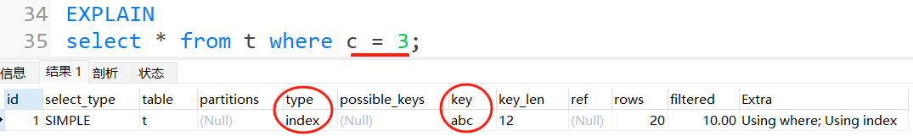
这条 SQL 竟然走了索引扫描，WHY？**where c 这个条件并不符合联合索引的最左匹配原则，怎么就查询的时候走了索引呢？**
经过一番测试，发现添加了一个字段之后就变成全表扫描了，WHY？SQL 如下：
```sql
ALTER TABLE t ADD COLUMN d INT NOT NULL;

EXPLAIN
select * from t where c = 3;
```
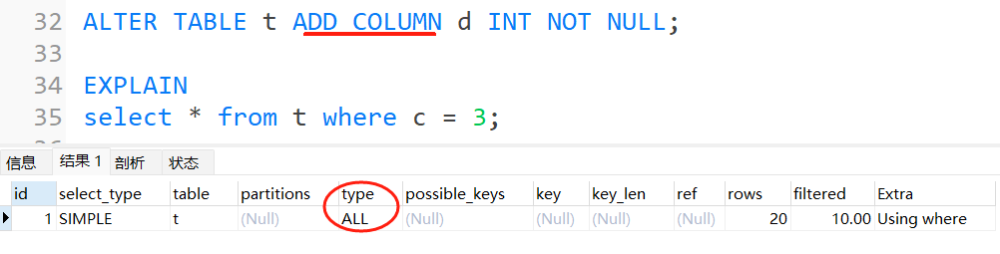
经过一番测试，有了个猜测。不过先跟大家解释下**什么是最左匹配原则？因为涉及到这个知识点。**
比如这个数据库表创建了（a，b，c）这个联合索引，要能使其生效必须保证 where 条件里最左边是 a 字段，比如以下这几种情况：

- where a = 0;
- where a = 0 and b = 0;
- where a = 0 and c = 0;
- where a = 0 and b = 0 and c = 0;
- where a = 0 and c = 0 and b = 0;

而如果 where 条件里最左边的字段不是 a 时，就无法使用到联合索引，比如以下这种情况，就是不符合最左匹配规则：

- where b = 0;
- where c = 0;
- where b = 0 and c =0;
- where c = 0 and b = 0;

知道了联合索引的最左匹配原则后，再来看看第一个问题。
_为什么  select * from t where c = 0; 这条不符合联合索引的最左匹配原则的查询语句走了索引查询呢？_
应该是因为这个 SQL 可以使用覆盖索引。
因为这张表的字段没有「非索引」字段，所以 select * 相当于 select id,a,b,c，然后**这个查询的内容和条件 都在联合索引树里，因为联合索引树的叶子节点包含「索引列+主键」，所以查联合索引树就能查到全部结果了，这个就是覆盖索引。**
但是执行计划里的 type 是 index，这代表着是通过全扫描联合索引树的方式查询到数据的，这是因为 where c 并不符合联合索引最左匹配原则。
那么，如果写了个符合最左原则的 select 语句，那么 type 就是 ref，这个效率就比 index 全扫描要高一些。
那为什么选择全扫描联合索引树，而不扫描全表（聚集索引树）呢？
因为联合索引树的记录比要小的多，而且这个 select * 不用执行回表操作，所以直接遍历联合索引树要比遍历聚集索引树要小的多，因此 MySQL 选择了全扫描联合索引树。
再来回答第二个问题。
_为什么表加了非索引字段，执行同样的查询语句后，会变成全表扫描呢？_
加了其他字段后无法使用覆盖索引了。
select * from t where c = 0; 查询的内容就不能在联合索引树里找到了，而且条件也不符合最左匹配原则，这样既不能覆盖索引也不能执行回表操作，所以这时只能通过扫描全表来查询到所有的数据。

# MySQL 日志文件
日志是mysql数据库的重要组成部分，记录着数据库运行期间各种状态信息。常见的日志有以下集中：
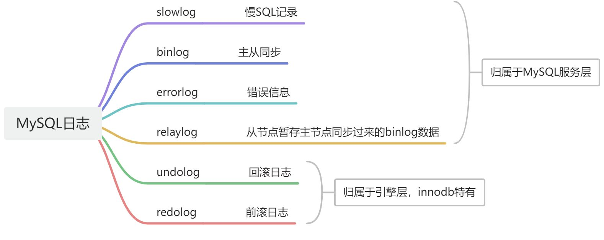
作为开发，我们重点需要关注的是二进制日志(binlog)和事务日志(包括redo log和undolog)，本文接下来会详细介绍这三种日志。

## binlog
binlog 用于记录数据库执行的写操作(不包括查询)信息，以二进制的形式保存在磁盘中。binlog 是mysql 的逻辑日志，并且由 Server 层进行记录，使用任何存储引擎的 mysql 数据库都会记录 binlog 日志。
binlog 是通过追加的方式进行写入的，可以通过 max_binlog_size 参数设置每个 binlog 文件的大小，当文件大小达到给定值之后，会生成新的文件来保存日志。

### tips
逻辑日志：可以简单理解为记录的就是sql语句。
物理日志：因为 mysql 数据最终是保存在数据页中的，物理日志记录的就是数据页变更。

### 使用场景
在实际应用中，binlog 的主要使用场景有两个，分别是**主从复制**和**数据恢复**。

1. **主从复制**：在Master端开启 binlog，然后将 binlog 发送到各个 Slave 端，Slave 端重放 binlog 从而达到主从数据一致。
2. **数据恢复**：通过使用 mysqlbinlog 工具来恢复数据。

### 刷盘机制
对于 InnoDB 存储引擎而言，只有在事务提交时才会记录 binlog，那么 binlog 什么时候才会将内存中的数据刷到磁盘呢？其实 mysql 是通过 sync_binlog 参数控制 binlog 的刷盘时机，取值范围是0-N：

- 0：不去强制要求，由系统自行判断何时写入磁盘；
- 1：每次 commit 的时候都要将 binlog 写入磁盘；
- N：每N个事务，才会将 binlog 写入磁盘。

### 存储格式
binlog日志有三种格式，分别为STATMENT、ROW和MIXED。

- STATMENT：基于SQL语句的复制，每一条会修改数据的sql语句会记录到binlog中。 
   - 优点：不需要记录每一行的变化，减少了binlog日志量，节约了IO, 从而提高了性能；
   -  缺点：在某些情况下会导致主从数据不一致，比如执行sysdate()、sleep()等。
- ROW：基于行的复制，不记录每条sql语句的上下文信息，仅需记录哪条数据被修改了。
   -  优点：不会出现某些特定情况下的存储过程、或function、或trigger的调用和触发无法被正确复制的问题； 
   - 缺点：会产生大量的日志，尤其是alter table的时候会让日志暴涨
- MIXED：基于 STATMENT 和 ROW 两种模式的混合复制，一般的复制使用STATEMENT模式保存binlog，对于STATEMENT模式无法复制的操作使用ROW模式保存binlog

## redo log

### 为什么需要redo log
我们都知道，事务的四大特性里面有一个是**持久性**，具体来说就是**只要事务提交成功，那么对数据库做的修改就被永久保存下来了，不可能因为任何原因再回到原来的状态**。那么mysql是如何保证持久性的呢？最简单的做法是在每次事务提交的时候，将该事务涉及修改的数据页全部刷新到磁盘中。但是这么做会有严重的性能问题，主要体现在两个方面：

1. 因为Innodb是以页为单位进行磁盘交互的，而一个事务很可能只修改一个数据页里面的几个字节，这个时候将完整的数据页刷到磁盘的话，太浪费资源了！
2. 一个事务可能涉及修改多个数据页，并且这些数据页在物理上并不连续，使用随机IO写入性能太差！

因此mysql设计了redo log，**具体来说就是只记录事务对数据页做了哪些修改**，这样就能完美地解决性能问题了(相对而言文件更小并且是顺序IO)。

### redo log基本概念
redo log包括两部分：一个是内存中的日志缓冲(redo log buffer)，另一个是磁盘上的日志文件(redo log file)。mysql每执行一条DML语句，先将记录写入redo log buffer，后续某个时间点再一次性将多个操作记录写到redo log file。这种**先写日志，再写磁盘**的技术就是MySQL里经常说到的WAL(Write-Ahead Logging) 技术。
在计算机操作系统中，用户空间(user space)下的缓冲区数据一般情况下是无法直接写入磁盘的，中间必须经过操作系统内核空间(kernel space)缓冲区(OS Buffer)。因此，redo log buffer写入redo log file实际上是先写入OS Buffer，然后再通过系统调用fsync()将其刷到redo log file中，过程如下： 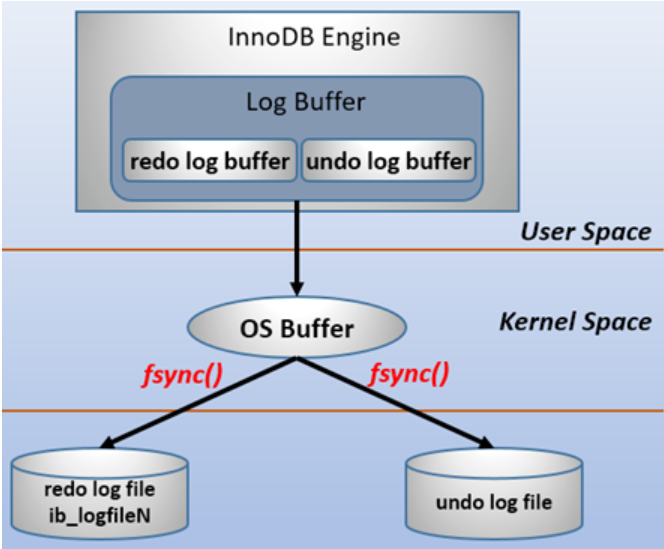
mysql支持三种将redo log buffer写入redo log file的时机，可以通过innodb_flush_log_at_trx_commit参数配置，各参数值含义如下：

- 0（延迟写）：事务提交时不会将redo log buffer中日志写入到os buffer，而是每秒写入os buffer并调用fsync()写入到redo log file中。也就是说设置为0时是(大约)每秒刷新写入到磁盘中的，当系统崩溃，会丢失1秒钟的数据。
- 1（实时写，实时刷）：事务每次提交都会将redo log buffer中的日志写入os buffer并调用fsync()刷到redo log file中。这种方式即使系统崩溃也不会丢失任何数据，但是因为每次提交都写入磁盘，IO的性能较差。
- N（实时写，延迟刷）：每次提交都仅写入到os buffer，然后是每秒调用fsync()将os buffer中的日志写入到redo log file。

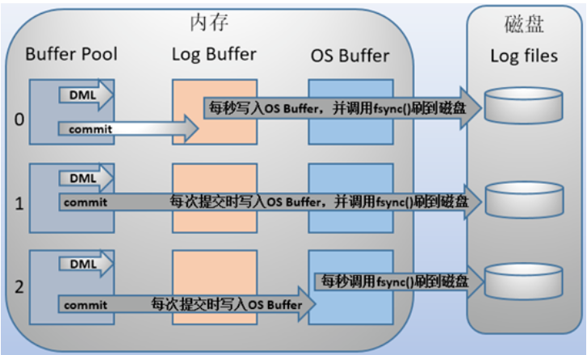

### redo log记录形式
前面说过，redo log实际上记录数据页的变更，而这种变更记录是没必要全部保存，因此redo log实现上采用了大小固定，循环写入的方式，当写到结尾时，会回到开头循环写日志。如下图： 
同时我们很容易得知，**在innodb中，既有redo log需要刷盘，还有数据页也需要刷盘，redo log存在的意义主要就是降低对数据页刷盘的要求**。在上图中，write pos表示redo log当前记录的LSN(逻辑序列号)位置，check point表示**数据页更改记录**刷盘后对应redo log所处的LSN(逻辑序列号)位置。write pos到check point之间的部分是redo log空着的部分，用于记录新的记录；check point到write pos之间是redo log待落盘的数据页更改记录。当write pos追上check point时，会先推动check point向前移动，空出位置再记录新的日志。
启动innodb的时候，不管上次是正常关闭还是异常关闭，总是会进行恢复操作。因为redo log记录的是数据页的物理变化，因此恢复的时候速度比逻辑日志(如binlog)要快很多。 重启innodb时，首先会检查磁盘中数据页的LSN，如果数据页的LSN小于日志中的LSN，则会从checkpoint开始恢复。 还有一种情况，在宕机前正处于checkpoint的刷盘过程，且数据页的刷盘进度超过了日志页的刷盘进度，此时会出现数据页中记录的LSN大于日志中的LSN，这时超出日志进度的部分将不会重做，因为这本身就表示已经做过的事情，无需再重做。

### redo log与binlog区别
| 
 | redo log | binlog |
| --- | --- | --- |
| 文件大小 | redo log的大小是固定的。 | binlog可通过配置参数max_binlog_size设置每个binlog文件的大小。 |
| 实现方式 | redo log是InnoDB引擎层实现的，并不是所有引擎都有。 | binlog是Server层实现的，所有引擎都可以使用 binlog日志 |
| 记录方式 | redo log 采用循环写的方式记录，当写到结尾时，会回到开头循环写日志。 | binlog 通过追加的方式记录，当文件大小大于给定值后，后续的日志会记录到新的文件上 |
| 适用场景 | redo log适用于崩溃恢复(crash-safe) | binlog适用于主从复制和数据恢复 |

由binlog和redo log的区别可知：binlog日志只用于归档，只依靠binlog是没有crash-safe能力的。但只有redo log也不行，因为redo log是InnoDB特有的，且日志上的记录落盘后会被覆盖掉。因此需要binlog和redo log二者同时记录，才能保证当数据库发生宕机重启时，数据不会丢失。

## undo log
数据库事务四大特性中有一个是**原子性**，具体来说就是 **原子性是指对数据库的一系列操作，要么全部成功，要么全部失败，不可能出现部分成功的情况**。实际上，**原子性**底层就是通过undo log实现的。undo log主要记录了数据的逻辑变化，比如一条INSERT语句，对应一条DELETE的undo log，对于每个UPDATE语句，对应一条相反的UPDATE的undo log，这样在发生错误时，就能回滚到事务之前的数据状态。同时， undo log 也是 MVCC(多版本并发控制)实现的关键。

# update 在什么情况下行锁会升级表锁
最近发现还有许多小伙伴对行锁升级表锁的场景不太了解，本文就以最简单的方式帮助大家拿下这道面试题。
其实导致锁升级的情况只有一种，那就是**没有使用索引更新数据，**why？
我们细化一下：
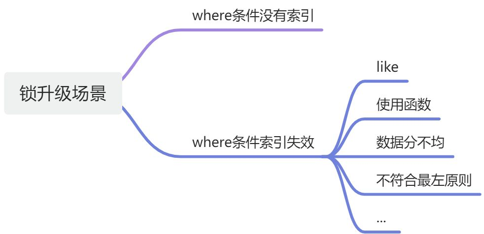
光说不练假把式，实战起来(针对 RR 隔离级别)：
```sql
drop TABLE t;
CREATE TABLE `t` (
    `id` INT NOT NULL AUTO_INCREMENT,
    `a` INT NOT NULL,
    `b` INT NOT NULL,
    `c` INT NOT NULL,
    PRIMARY KEY (`id`) USING BTREE
) ENGINE=INNODB DEFAULT CHARSET=utf8mb4 COLLATE=utf8mb4_general_ci;

--添加a字段索引
alter table t add index index_a(`a`);

INSERT INTO `t` (`a`, `b`, `c`) VALUES (1, 1, 1);
INSERT INTO `t` (`a`, `b`, `c`) VALUES (2, 2, 2);
INSERT INTO `t` (`a`, `b`, `c`) VALUES (3, 3, 3);

--SQL准备
--设置事务隔离级别 READ-UNCOMMITTED, READ-COMMITTED, REPEATABLE-READ, SERIALIZABLE
SELECT @@tx_isolation;
set tx_isolation = 'REPEATABLE-READ';
set tx_isolation = 'READ-COMMITTED';

--事务控制
begin;
rollback;
commit;
```
1.未使用索引行锁升级为表锁
```sql
--事务1，使用非索引字段更新数据，执行完成不提交事务。
begin;
update t set b = b + 1 where c = 1;

--事务2，使用索引字段，非索引字段更新，均被阻塞。
begin;
update t set b = b + 1 where a = 2;

update t set b = b + 1 where c = 2;

--需要注意每次测试完成之后都需要执行rollback;或commit; 避免影响后续测试。
```
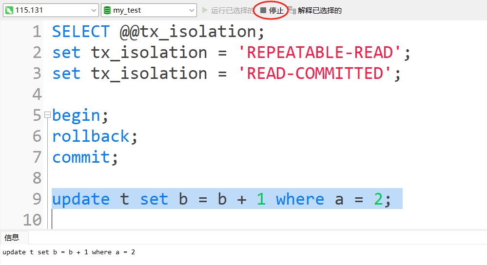
2.索引失效升级为表锁
```sql
--2.1.使用函数
--事务1，执行不提交事务
begin;
update t set b = b + 1 where trim(a) = 1;

--事务2，使用索引字段，非索引字段更新，均被阻塞。
begin;
update t set b = b + 1 where a = 2;

update t set b = b + 1 where c = 2;

--2.2.模糊查询百分号在前
--事务1，执行不提交事务
update t set b = b + 1 where a like '%1';

--事务2，使用索引字段，非索引字段更新，均被阻塞。
begin;
update t set b = b + 1 where a = 2;

update t set b = b + 1 where c = 2;
```
经过上述的测试验证了 update 更新数据时，如果未使用索引字段，又或者使用的索引字段失效了，会导致行锁升级为表锁。
实质上我们现在可以得到一些启示：我们将 update 语句转换为对应的 select 语句，然后查看执行计划就会发现升级为表锁的 update 语句检索数据的方式都是全表扫描，因此我们可以通过查看执行计划来排查 update 语句锁升级的问题。
最后给大家留一个问题，自行测试下其他隔离级别下 update 的锁升级情况是怎么样？

# 为什么阿里不推荐使用外键？

大家在学习数据库的过程中一定都接触过外键这个概念，并且在各种课后习题中外键还是一个非常重要的考察内容，但是在实际的企业开发过程中，你会发现有些公司允许使用外键，有些公司不允许使用外键，各持己见，为什么出现这种情况呢？
首先我们搞清楚什么外键
```sql
CREATE TABLE `student` (
  `id` bigint(20) unsigned NOT NULL AUTO_INCREMENT COMMENT '学生id',
  `name` varchar(256)  NOT NULL COMMENT '学生姓名',
   PRIMARY KEY (`id`)
) ENGINE=InnoDB DEFAULT CHARSET=utf8mb4 COMMENT='学生表';

CREATE TABLE `score` (
  `id` bigint(20) unsigned NOT NULL AUTO_INCREMENT COMMENT '成绩 id',
  `student_id` bigint(20) unsigned NOT NULL COMMENT '学生id',
  `score` int(20) unsigned NOT NULL COMMENT '分数'
  PRIMARY KEY (`id`),
  KEY `student_id` (`student_id`),
  CONSTRAINT `fk_student_id` FOREIGN KEY (`student_id`) REFERENCES `student` (`id`)
) ENGINE=InnoDB DEFAULT CHARSET=utf8mb4 COMMENT='成绩表';
```
如上，我们通过** foreign key ... references ... **来定义外键，将当前表的字段关联到另一张表的某个字段。
外键和主键一样，都是一种约束，外键约束也称为引用约束或引用完整性约束
通俗来说：

1. 成绩表插入数据时，student_id 必须是学生表已存在的 id
2. 学生表删除/更新数据时，会自动删除/更新成绩表中引用 student.id 的数据

我们在回过来，为什么阿里禁止使用外键？
从实际场景出发，如果添加了外键会是什么情况，数据库每次添加数据都需要去检查外键约束，看关联表是否已经存在数据，硬性保持数据的一致性，这样会造成非常打的性能损耗，而且在高并发的场景下，可能会出现更新风暴的风险。
**更新风暴：**在高并发环境下，多个客户端同时对数据库进行大量的更新操作，存在锁竞争问题甚至死锁，从而导致数据库性能急剧下降或完全崩溃。
另外，当数据量非常大的时候，常见手段是分库分表，但外键通常难以跨越不同数据库来建立联系，数据的一致性更难维护。
因此，外键与级联并不适合分布式、高并发集群，但单机低并发业务可以考虑使用外键保证一致性和完整性。

# 有哪些方式优化慢 SQL？
慢 SQL 的优化，主要从两个方面考虑，SQL 语句本身的优化，以及数据库设计的优化。

## 避免不必要的列
SQL 查询的时候，应该只查询需要的列，而不要包含额外的列，像select * 这种写法应该尽量避免。

## 分页优化
在数据量比较大，分页比较深的情况下，需要考虑分页的优化。
```sql
select * from table where type = 2 and level = 9 order by id asc limit 100000,10;
```

- **延迟关联**

先通过 where 条件提取出主键，在将该表与原数据表关联，通过主键 id 提取数据行，而不是通过原来的二级索引提取数据行
```sql
select a.* from table a, 
 (select id from table where type = 2 and level = 9 order by id asc limit 100000,10 ) b
 where a.id = b.id;
```

- **id偏移量**

偏移量就是找到 limit 第一个参数对应的主键值，根据这个主键值再去过滤并 limit
```sql
select * from table where id >
  (select * from table where type = 2 and level = 9 order by id asc limit 190);
```

## 索引优化
合理地设计和使用索引，是优化慢 SQL 的利器。

- **利用覆盖索引**

InnoDB 使用二级索引查询数据时会回表，但是如果索引的叶节点中已经包含要查询的字段，那它没有必要再回表查询了，这就叫覆盖索引，还有一个简单的理解查询列都是索引列。
```sql
select b from test where a ='上海';
```
```sql
alter table test add index idx_a_b (a, b);
```

- **避免使用 or 查询**

在 MySQL 5.0 之前的版本要尽量避免使用 or 查询，可以使用 union 或者子查询来替代，因为早期的 MySQL 版本使用 or 查询可能会导致索引失效，高版本引入了索引合并，解决了这个问题，不过建议大家在实际使用中还是规范写法，能不用就少用。

- **避免使用 != 或者 <> 操作符**

SQL 中，不等于操作符会导致查询引擎放弃查询索引，引起全表扫描，即使比较的字段上有索引
解决方法：通过把不等于操作符改成 or，可以使用索引，避免全表扫描
```sql
id <> 'aaa' ===> id > 'aaa' or id < 'aaa'
```

- **适当使用前缀索引**

适当地使用前缀索引，可以降低索引的空间占用，提高索引的查询效率。
比如，邮箱的后缀都是固定的“@xxx.com”，那么类似这种后面几位为固定值的字段就非常适合定义为前缀索引
```sql
alter table test add index idx_email_prefix (email(6));
```
需要注意的是，前缀索引也存在缺点，MySQL 无法利用前缀索引做 order by 和 group by 操作，也无法作为覆盖索引。

- **避免列上函数运算**

要避免在列字段上进行算术运算或其他表达式运算，否则可能会导致存储引擎无法正确使用索引，从而影响了查询的效率。
```sql
select * from test where id + 1 = 50;
select * from test where month(updateTime) = 7;
```

- **正确使用联合索引**

使用联合索引的时候，注意最左匹配原则。

## JOIN 优化

- **优化子查询**

尽量使用 Join 语句来替代子查询，因为子查询是嵌套查询，而嵌套查询会新创建一张临时表，而临时表的创建与销毁会占用一定的系统资源以及花费一定的时间，同时对于返回结果集比较大的子查询，其对查询性能的影响更大

- **小表驱动大表**

关联查询的时候要拿小表去驱动大表，因为关联的时候，MySQL 内部会遍历驱动表，再去连接被驱动表。
```sql
 select name from 小表 left join 大表;
```

- **适当增加冗余字段**

增加冗余字段可以减少大量的连表查询，因为多张表的连表查询性能很低，所有可以适当的增加冗余字段，以减少多张表的关联查询，这是以空间换时间的优化策略

- **避免使用 JOIN 关联太多的表**

《阿里巴巴 Java 开发手册》规定不要 join 超过三张表，第一 join 太多降低查询的速度，第二 join 的 buffer 会占用更多的内存。

## 排序优化

- **利用索引扫描做排序**

MySQL 有两种方式生成有序结果：一是对结果集进行排序的操作，二是按照索引顺序扫描得出的结果，索引是排好序的数据结构，自然是有序的。
但是如果索引不能覆盖查询所需列（覆盖索引），就会每扫描一条记录回表查询一次（逐个获取），这个读操作是随机 IO，通常会比顺序全表扫描还慢，有时会直接放弃使用索引转为全表扫描。
因此，在设计索引时，尽可能使用同一个索引既满足排序又用于查找行。
```sql
-- 索引(a,b,c)
select b, c from test where a like 'aa%' order by b,c;
```
只有当索引的列顺序和 ORDER BY 子句的顺序完全一致，并且所有列的排序方向都一样时，才能够使用索引来对结果做排序。

## UNION 优化

- **条件下推**

MySQL 处理 union 的策略是先创建临时表，然后将各个查询结果填充到临时表中最后再来做查询，很多优化策略在 union 查询中都会失效，因为它无法利用索引。
所以需要将 where、limit 等子句下推到 union 的各个子查询中，以便优化器可以充分利用这些条件进行优化。
此外，除非确实需要服务器去重，一定要使用 union all，如果不加 all 关键字，MySQL 会给临时表加上 distinct 选项，这会导致对整个临时表做唯一性检查，代价很高。

## 总结
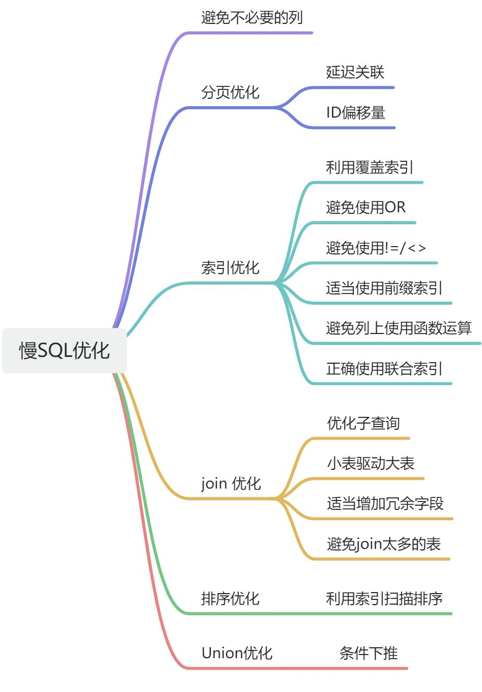


> 原文: <https://www.yuque.com/tulingzhouyu/db22bv/gdggs5asoyhqku5n>