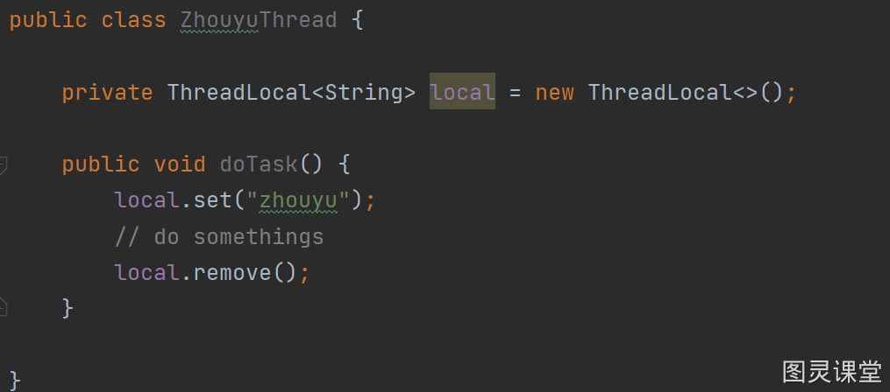
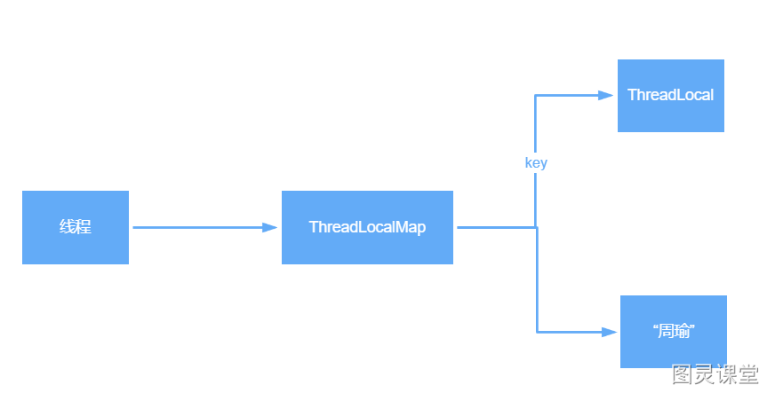
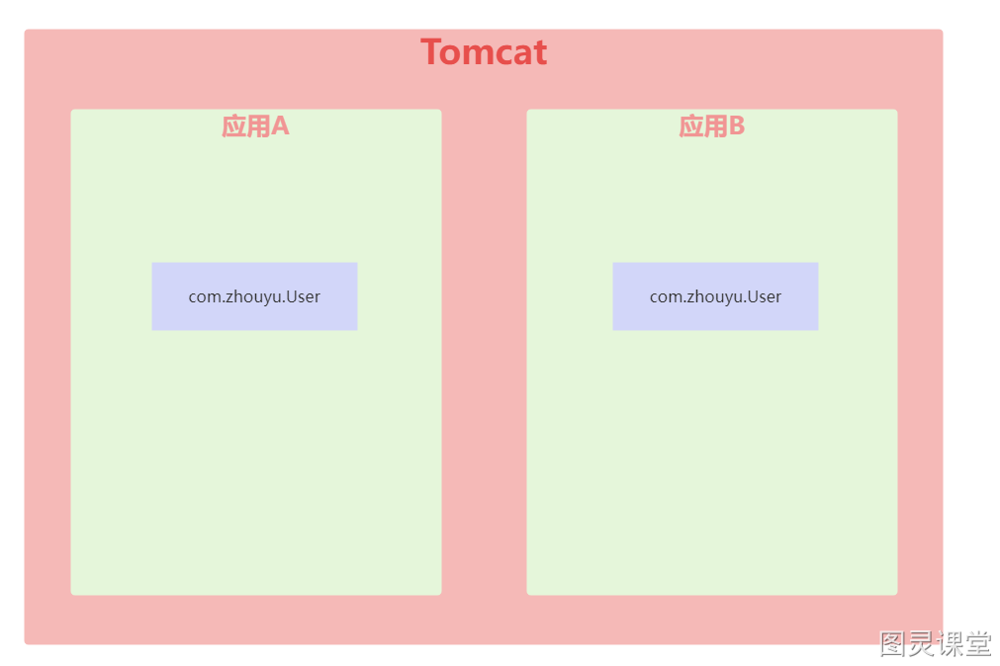
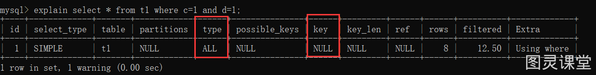
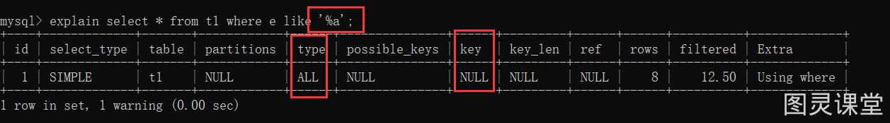

# 金三银四精选面试题系列


## Java中有哪几种方式来创建线程执行任务？
> 薪资：10k-15k
> 岗位：初级开发工程师


### 1. 继承Thread类
```java
/**
 * 作者：周瑜大都督
 */
public class ZhouyuThread extends Thread{


    public static void main(String[] args) {
        ZhouyuThread thread = new ZhouyuThread();
        thread.start();
    }

    @Override
    public void run() {
        System.out.println("hello zhouyu");
    }


}
```


**总结：重写的是run()方法，而不是start()方法，但是占用了继承的名额，Java中的类是单继承的。**

> 讲到单继承，我们应该注意，ava中的接口是可以多继承的


### 2. 实现Runnable接口
```java
/**
 * 作者：周瑜大都督
 */
public class ZhouyuThread implements Runnable{
    
    public static void main(String[] args) {
        Thread thread = new Thread(new ZhouyuThread());
        thread.start();
    }

    public void run() {
        System.out.println("hello zhouyu");
    }
    
}
```

**总结：实现Runnable接口，实现run()方法，使用依然要用到Thread，这种方式更常用**

有时候，我们会直接使用匿名内部类的方式或者Lambda表达式的方式：
```java
/**
 * 作者：周瑜大都督
 */
public class ZhouyuThread {

    public static void main(String[] args) {
        Thread thread = new Thread(new Runnable() {
            public void run() {
                System.out.println("hello zhouyu");
            }
        });
        thread.start();
    }
    
}
```

```java
public class ZhouyuThread {

    public static void main(String[] args) {
        Thread thread = new Thread(() -> System.out.println("hello zhouyu"));
        thread.start();
    }

}
```


### 3. 实现Callable接口
```java
/**
 * 作者：周瑜大都督
 */
public class ZhouyuThread implements Callable<String> {

    public static void main(String[] args) throws ExecutionException, InterruptedException {
        FutureTask<String> futureTask = new FutureTask<>(new ZhouyuThread());
        Thread thread = new Thread(futureTask);
        thread.start();
        String result = futureTask.get();
        System.out.println(result);
    }

    public String call() {
        return "hello zhouyu";
    }

}
```

**总结：实现Callable接口，实现call()方法，得使用Thread+FutureTask配合，这种方式支持拿到异步执行任务的结果**


### 4. 利用线程池来创建线程

```java
/**
 * 作者：周瑜大都督
 */
public class ZhouyuThread implements Runnable {

    public static void main(String[] args) throws ExecutionException, InterruptedException {
        ExecutorService executorService = Executors.newFixedThreadPool(10);
        executorService.execute(new ZhouyuThread());
    }

    public void run() {
        System.out.println("hello zhouyu");
    }

}
```

**总结：实现Callable接口或者Runnable接口都可以，由ExecutorService来创建线程**

> 注意，工作中不建议使用Executors来创建线程池


### 总结
以上几种方式，底层都是基于Runnable。


## 为什么不建议使用Executors来创建线程池？
> 薪资：10k-20k
> 岗位：中级开发工程师


### 1. FixedThreadPool
当我们使用Executors创建FixedThreadPool时，对应的构造方法为：
```java
public static ExecutorService newFixedThreadPool(int nThreads) {
	return new ThreadPoolExecutor(nThreads, nThreads,
								  0L, TimeUnit.MILLISECONDS,
								  new LinkedBlockingQueue<Runnable>());
}
```
发现创建的队列为LinkedBlockingQueue，是一个无界阻塞队列，如果使用该线程池执行任务，如果任务过多就会不断的添加到队列中，任务越多占用的内存就越多，最终可能耗尽内存，导致OOM。


### 2. SingleThreadExecutor
当我们使用Executors创建SingleThreadExecutor时，对应的构造方法为：
```java
public static ExecutorService newSingleThreadExecutor() {
        return new FinalizableDelegatedExecutorService
            (new ThreadPoolExecutor(1, 1,
                                    0L, TimeUnit.MILLISECONDS,
                                    new LinkedBlockingQueue<Runnable>()));
    }
```
也是LinkedBlockingQueue，所以同样可能会耗尽内存。

### 总结
除开有可能造成OOM之外，我们使用Executors来创建线程池也不能自定义线程的名字，不利于排查问题，所以建议直接使用ThreadPoolExecutor来定义线程池，这样可以灵活控制。


## 线程池有哪几种状态？每种状态分别表示什么？
> 薪资：10k-15k
> 岗位：初级开发工程师


### 1. RUNNING
> Accept new tasks and process queued tasks

表示线程池正常运行，既能接受新任务，也会正常处理队列中的任务

### 2. SHUTDOWN
> Don't accept new tasks, but process queued tasks

当调用线程池的shutdown()方法时，线程池就进入SHUTDOWN状态，表示线程池处于正在关闭状态，此状态下**线程池不会接受新任务**，但是会**继续把队列中的任务处理完**

### 3. STOP
> Don't accept new tasks, don't process queued tasks, and interrupt in-progress tasks

当调用线程池的shutdownnow()方法时，线程池就进入STOP状态，表示线程池处于正在停止状态，此状态下**线程池既不会接受新任务了**，也**不会处理队列中的任务**，并且正在运行的线程也会被中断

### 4. TIDYING
> All tasks have terminated, workerCount is zero, the thread transitioning to state TIDYING will run the terminated() hook method

线程池中没有线程在运行后，线程池的状态就会自动变为TIDYING，并且会调用terminated()，该方法是空方法，留给程序员进行扩展。

### 5. TERMINATED
> terminated() has completed

terminated()方法执行完之后，线程池状态就会变为TERMINATED


## Sychronized和ReentrantLock有哪些不同点？
> 薪资：15k-20k
> 岗位：中高级开发工程师


| sychronized | ReentrantLock |
| --- | --- |
| Java中的一个关键字 | JDK提供的一个类 |
| 自动加锁与释放锁 | 需要手动加锁与释放锁 |
| JVM层面的锁 | API层面的锁 |
| 非公平锁 | 公平锁或非公平锁 |
| 锁的是对象，锁信息保存在对象头中 | int类型的state标识来标识锁的状态 |
| 底层有锁升级过程 | 没有锁升级过程 |


## 你的应用突然出现了OOM异常，你会如何排查？
> 薪资：15k-25k
> 岗位：高级开发工程师

**对于还在正常运行的系统：**

1. 可以使用**jmap**来查看JVM中各个区域的使用情况
2. 可以通过**jstack**来查看线程的运行情况，比如哪些线程阻塞、是否出现了死锁
3. 可以通过**jstat**命令来查看垃圾回收的情况，特别是fullgc，如果发现fullgc比较频繁，那么就得进行调优了
4. 通过各个命令的结果，或者**jvisualvm**等工具来进行分析
5. 首先，初步猜测频繁发送fullgc的原因，如果频繁发生fullgc但是又一直没有出现内存溢出，那么表示fullgc实际上是回收了很多对象了，所以这些对象最好能在younggc过程中就直接回收掉，避免这些对象进入到老年代，对于这种情况，就要考虑这些存活时间不长的对象是不是比较大，导致年轻代放不下，直接进入到了老年代，尝试加大年轻代的大小，如果改完之后，fullgc减少，则证明修改有效
6. 同时，还可以找到占用CPU最多的线程，定位到具体的方法，优化这个方法的执行，看是否能避免某些对象的创建，从而节省内存

**对于已经发生了OOM的系统：**

1. 一般生产系统中都会设置当系统发生了OOM时，生成当时的dump文件（-XX:+HeapDumpOnOutOfMemoryError -XX:HeapDumpPath=/usr/local/base）
2. 我们可以利用jsisualvm等工具来分析dump文件
3. 根据dump文件找到异常的实例对象，和异常的线程（占用CPU高），定位到具体的代码
4. 然后再进行详细的分析和调试

**总之，调优不是一蹴而就的，需要分析、推理、实践、总结、再分析，最终定位到具体的问题**


## ThreadLocal有哪些应用场景？它底层是如何实现的？
> 薪资：15k-25k
> 岗位：高级开发工程师


1. ThreadLocal是Java中所提供的线程本地存储机制，可以利用该机制将数据**缓存在某个线程内部**，该线程可以在任意时刻、任意方法中获取缓存的数据
2. ThreadLocal底层是通过ThreadLocalMap来实现的，每个Thread对象（注意不是ThreadLocal对象）中都存在一个ThreadLocalMap，Map的key为ThreadLocal对象，Map的value为需要缓存的值
3. 如果在线程池中使用ThreadLocal会造成内存泄漏，因为当ThreadLocal对象使用完之后，应该要把设置的key，value，也就是Entry对象进行回收，但线程池中的线程不会回收，而线程对象是通过强引用指向ThreadLocalMap，ThreadLocalMap也是通过强引用指向Entry对象，线程不被回收，Entry对象也就不会被回收，从而出现内存泄漏，解决办法是，在使用了ThreadLocal对象之后，手动调用ThreadLocal的remove方法，手动清楚Entry对象
4. ThreadLocal经典的应用场景就是连接管理（一个线程持有一个连接，该连接对象可以在不同的方法之间进行传递，线程之间不共享同一个连接）




## ReentrantLock分为公平锁和非公平锁，那底层分别是如何实现的？
> 薪资：15k-25k
> 岗位：高级开发工程师


首先不管是公平锁和非公平锁，它们的底层实现都会使用AQS来进行排队，它们的区别在于线程在使用lock()方法加锁时：

1. 如果是公平锁，会先检查AQS队列中是否存在线程在排队，如果有线程在排队，则当前线程也进行排队
2. 如果是非公平锁，则不会去检查是否有线程在排队，而是直接竞争锁。

**公平锁的底层执行流程：**

**非公平锁的底层执行流程：**

                                                   
另外，不管是公平锁还是非公平锁，一旦没竞争到锁，都会进行排队，当锁释放时，都是唤醒排在最前面的线程，所以非公平锁只是体现在了线程加锁阶段，而没有体现在线程被唤醒阶段，**ReentrantLock是可重入锁，不管是公平锁还是非公平锁都是可重入的。**


## Sychronized的锁升级过程是怎样的?
> 薪资：15k-25k
> 岗位：高级开发工程师


1. 偏向锁：在锁对象的对象头中记录一下当前获取到该锁的线程ID，该线程下次如果又来获取该锁就可以直接获取到了，也就是支持**锁重入**
2. 轻量级锁：由偏向锁升级而来，当一个线程获取到锁后，此时这把锁是偏向锁，此时如果有第二个线程来**竞争**锁，偏向锁就会升级为轻量级锁，之所以叫轻量级锁，是为了和重量级锁区分开来，轻量级锁底层是通过自旋来实现的，并不会阻塞线程
3. 如果**自旋次数过多**仍然没有获取到锁，则会升级为**重量级锁**，重量级锁会导致线程阻塞
4. 自旋锁：自旋锁就是线程在获取锁的过程中，不会去阻塞线程，也就无所谓唤醒线程，**阻塞和唤醒这两个步骤都是需要操作系统去进行的**，比较消耗时间，自旋锁是线程通过CAS获取预期的一个标记，如果没有获取到，则继续循环获取，如果获取到了则表示获取到了锁，这个过程线程一直在运行中，相对而言没有使用太多的操作系统资源，比较轻量。

## Tomcat中为什么要使用自定义类加载器?
> 薪资：10k-20k
> 岗位：中级开发工程师


一个Tomcat中可以部署多个应用，而每个应用中都存在很多类，并且各个应用中的类是独立的，全类名是可以相同的，比如一个订单系统中可能存在com.zhouyu.User类，一个库存系统中可能也存在com.zhouyu.User类，一个Tomcat，不管内部部署了多少应用，Tomcat启动之后就是一个Java进程，也就是一个JVM，所以如果Tomcat中只存在一个类加载器，比如默认的AppClassLoader，那么就只能加载一个com.zhouyu.User类，这是有问题的，而在Tomcat中，会为部署的每个应用都生成一个类加载器实例，名字叫做WebAppClassLoader，这样Tomcat中每个应用就可以使用自己的类加载器去加载自己的类，从而达到应用之间的类隔离，不出现冲突。另外Tomcat还利用自定义加载器实现了热加载功能。



## Mysql中九种索引失效场景分析
> 薪资：15k-25k
> 岗位：高级开发工程师


表数据：
```java
CREATE TABLE `t1` (
  a int primary key,
  b int ,
  c int ,
  d int ,
  e varchar(20)
) ENGINE=InnoDB ;


insert into t1 values(4,3,1,1,'d');
insert into t1 values(1,1,1,1,'a');
insert into t1 values(8,8,8,8,'h');
insert into t1 values(2,2,2,2,'b');
insert into t1 values(5,2,3,5,'e');
insert into t1 values(3,3,2,2,'c');
insert into t1 values(7,4,5,5,'g');
insert into t1 values(6,6,4,4,'f');
```

索引情况：

a字段是主键，对应主键索引，bcd三个字段组成一个联合索引，e字段一个索引

### 1. 不符合最左匹配原则


去掉b=1的条件就不符合最左匹配原则了，导致所有失效


### 2. 不正确的Like查询
不用like能走索引：

正常使用like：

不正确使用like：



### 3. 对索引列进行了计算或使用了函数


### 4. 索引列进行了类型转换

e字段的类型是vachar，下面这个sql需要把e字段中的字符转换成数字，会导致索引失效


### 5. <>不等于导致索引失效

b=1可以走索引，b<>1就不能走索引


### 6. order by导致索引失效

就算利用索引，但是由于是select * 所以需要回表，而且回表成本比较高，所以不会走索引。


如果是select b就需要回表了，就会选择走索引


### 7. 使用or导致索引失效


### 8. select * 导致索引失效


### 9. 范围查询数据量过多导致索引失效
新增一些数据：
```java
insert into t1 values(10,3,1,1,'d');
insert into t1 values(20,1,1,1,'a');
insert into t1 values(15,8,8,8,'h');
insert into t1 values(18,2,2,2,'b');
insert into t1 values(14,2,3,5,'e');
insert into t1 values(13,3,2,2,'c');
insert into t1 values(17,4,5,5,'g');
insert into t1 values(22,6,4,4,'f');
```


## SpringBoot的四种Handler类型
> 薪资：15k-20k
> 岗位：中高级开发工程师


### 1、@Controller+@RequestMapping

```java
@RestController
public class ZhouyuController {

    @GetMapping("/test")
    public String test() {
        return "zhouyu";
    }
    
}
```


### 2、Controller接口
```java
/**
 * 作者：周瑜大都督
 */
@Component("/beanNameController")
public class ZhouyuBeanNameController implements Controller {
    @Override
    public ModelAndView handleRequest(HttpServletRequest request, HttpServletResponse response) throws Exception {
        response.getWriter().println("ZhouyuBeanNameController");
        return null;
    }
}
```

### 3、HttpRequestHandler
```java
/**
 * 作者：周瑜大都督
 */
@Component("/beanNameHandler")
public class ZhouyuBeanNameHandler implements HttpRequestHandler {
    @Override
    public void handleRequest(HttpServletRequest request, HttpServletResponse response) throws IOException {
        response.getWriter().println("ZhouyuBeanNameHandler");
    }
}
```

### 4、RouterFunction
```java
@SpringBootApplication
public class MyApplication {

    @Bean
    public RouterFunction<ServerResponse> routerFunction(){
        return route()
                .GET("/getUserName", request -> ServerResponse.ok().body("zhouyu"))
                .GET("/getUserAge", request -> ServerResponse.ok().body("88"))
                .build();
    }

    public static void main(String[] args) {
        SpringApplication.run(MyApplication.class);
    }

}
```


> 原文: <https://www.yuque.com/tulingzhouyu/db22bv/flw8f2o5v1g2p5nk>