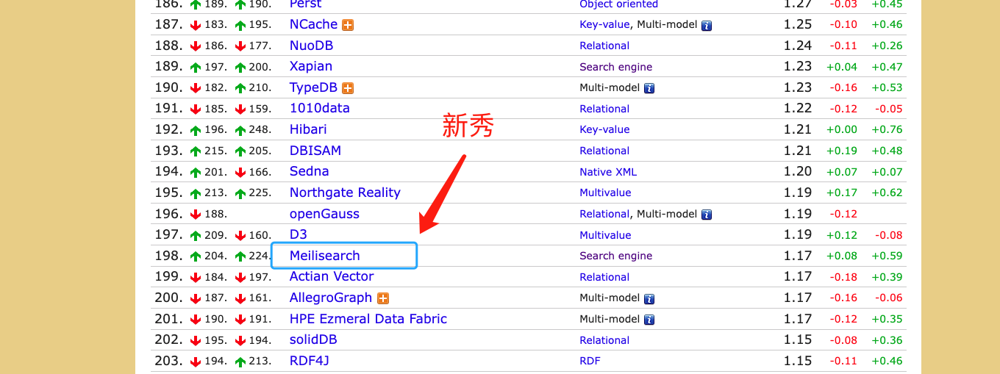
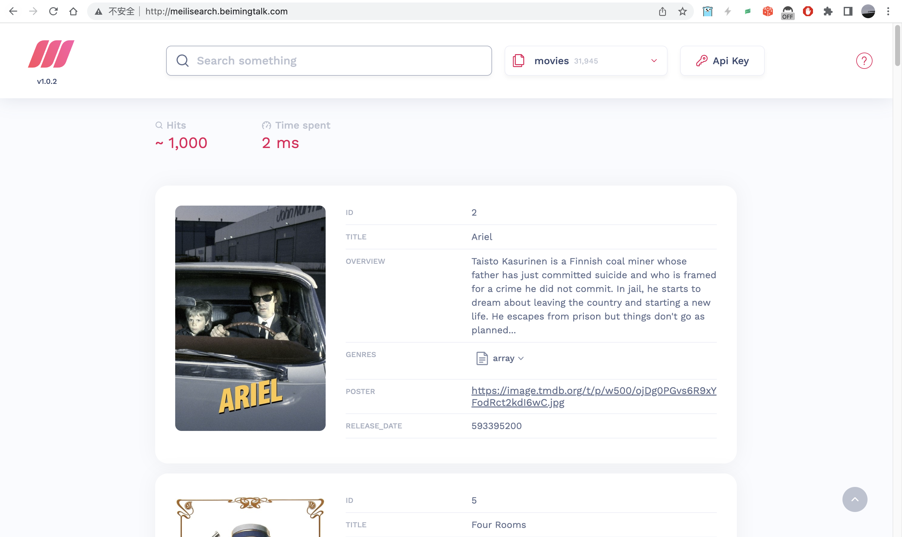

# ES代替品：轻量级搜索引擎MeiliSearch


> 谈到搜索引擎，可能大家最先想到的是Elasicsearch。Elasticsearch是一个分布式、高扩展、高实时的搜索与数据分析引擎，能够在大量的数据中搜索、分析和探索需要的数据。


数据库排名：[https://db-engines.com/en/ranking](https://db-engines.com/en/ranking)




## 痛点

虽然Elasticsearch足够灵活强大、扩展性和实时性也较好。但是对于中小型项目来说，Elasticsearch还是显得有些庞大，对硬件设备的要求也较高。那么，在要求不是很高的情况下，我们可以考虑另一种搜索引擎方案：MeiliSearch。

MeiliSearch是一个功能强大、快速、开源、易于使用和部署的搜索引擎，并且MeiliSearch的搜索和索引都是高度可定制的，提供开箱即用的功能属性，如错字容忍、过滤器和同义词。而最重要的一点是，它【支持中文搜索】，而不需要添加额外的配置。


## 特性

它具有以下特点：

-  快速： MeiliSearch旨在提供快速的搜索速度。使用MeiliSearch，用户可以在毫秒级别内获取查询结果，即使在大数据集上也是如此。 
-  精度高： MeiliSearch采用先进的算法来确保搜索结果的准确性。它支持拼写修正、同义词替换、近义词搜索等功能，这些功能可以大大提高搜索结果的质量。 
-  可定制性强： MeiliSearch具有灵活的API，可以轻松集成到任何应用程序中。它还支持自定义排名、字段权重和搜索范围等功能。 
-  易于使用： MeiliSearch的安装和设置过程非常简单，并且它提供了易于使用的Web界面和CLI工具，使用户可以轻松管理和监控搜索引擎。 


### 快速

在官方网站上提供了一些性能比较数据和基准测试结果，这些测试结果显示MeiliSearch在处理大型数据集时速度非常快，可以在毫秒级别内返回查询结果。

例如，在官方提供的基准测试中，使用`MeiliSearch`处理`10`万个文档时，平均搜索时间为`1.47`毫秒，而使用`Elasticsearch`搜索同样的数据集时，平均搜索时间为`44.1`毫秒。这表明，`MeiliSearch`在速度方面比其他一些搜索引擎更快，并且可以在大规模数据集上实现高效搜索。


### 高精度搜索

MeiliSearch的第二个特点是高精度搜索。为了实现这个特点，MeiliSearch使用了多种算法和技术，包括：

-  拼写纠正：当用户拼写单词错误时，MeiliSearch可以自动检测并纠正拼写错误，从而提供更准确的搜索结果。 
-  同义词替换：MeiliSearch支持同义词替换，当用户输入一个词时，搜索引擎会将其替换为相关的同义词，从而扩展搜索范围并提供更准确的搜索结果。 
-  近义词搜索：MeiliSearch还支持近义词搜索，当用户输入一个词时，搜索引擎会在索引中查找相关的近义词，并将它们包含在搜索结果中。 

除了上述功能，MeiliSearch还支持模糊搜索、停用词过滤、基于短语和前缀的搜索等多种功能，这些功能可以大大提高搜索结果的质量和准确性。总之，MeiliSearch通过多种算法和技术来提高搜索结果的准确性和质量，使其成为一种高精度的搜索引擎。


### 可定制性强

MeiliSearch的第三个特点是可定制性强。它提供了灵活的API，使开发人员可以根据自己的需求自定义搜索引擎的各种功能和特性，包括：

-  自定义排名：开发人员可以根据自己的需求自定义搜索结果的排名方式，以确保最相关的结果在搜索结果列表中排名靠前。 
-  字段权重：开发人员可以指定搜索引擎在搜索过程中应该优先考虑哪些字段，以提高搜索结果的准确性。 
-  搜索范围：开发人员可以限制搜索的范围，例如只搜索特定的字段或文档类型，以提高搜索结果的质量。 

以下是一些示例：

假设我们有一个在线书店，我们想要实现一种搜索功能，可以搜索书名、作者、出版社等字段，并且希望搜索结果按照出版日期的先后顺序排列。我们可以使用MeiliSearch的API来实现这个功能，例如：

```java
import io.github.crew102.meilisearchjava.Client;
import io.github.crew102.meilisearchjava.Index;

public class MeiliSearchDemo {
    public static void main(String[] args) {
        // Create a MeiliSearch client object
        Client client = new Client("http://localhost:7700", "masterKey");
        
        // Get an index
        Index index = client.getIndex("books");
        
        // Define search parameters
        SearchParams params = new SearchParams()
            .setSort(Collections.singletonList("published_date"))
            .setAttributesToHighlight(Arrays.asList("title", "author", "publisher"))
            .setAttributesToRetrieve(Arrays.asList("title", "author", "publisher", "published_date"));
            
        // Perform search
        SearchResults<Book> results = index.search("Harry Potter", Book.class, params);
        
        // Print search results
        for (SearchResult<Book> hit : results.getHits()) {
            Book book = hit.getResult();
            System.out.println(book.getTitle() + " by " + book.getAuthor() + " published by " + book.getPublisher() + " on " + book.getPublishedDate());
        }
    }
}
```

在上面的示例中，我们首先创建了一个MeiliSearch客户端对象，然后定义了一些搜索参数，例如按照出版日期排序、高亮显示标题、作者和出版商等。接下来，我们使用MeiliSearch的search方法来执行搜索，并遍历搜索结果以打印出书名、作者、出版社和出版日期等信息。


### 支持多语言搜索

MeiliSearch的第五个特点是支持多语言搜索。这意味着MeiliSearch能够搜索多种语言的文本，并且可以正确处理每种语言的语法和语义。这种功能对于需要支持全球用户的应用程序非常有用，例如国际化的电子商务平台、跨语言的新闻网站等。

MeiliSearch支持的语言非常多，包括但不限于英语、中文、日语、韩语、法语、德语、西班牙语、意大利语、荷兰语、葡萄牙语、俄语、阿拉伯语、希伯来语等等。MeiliSearch能够支持如此多种语言的搜索，主要得益于其内置的各种语言处理工具，例如分词器、词干提取器、同义词扩展器、语义分析器等等。


## 部署安装

> 环境：ubuntu
部署方式：Docker
编排工具：DockerCompose


配置信息:

```yaml
version: '3'

services:
  meilisearch:
    image: getmeili/meilisearch:latest
    container_name: meilisearch
    restart: always
    environment:
      MEILI_HTTP_ADDR: 0.0.0.0:7700
      #  MEILI_MASTER_KEY: meilisearchmasterkey
    ports:
      - 7700:7700
    volumes:
      - meilisearch_data:/data.ms

volumes:
  meilisearch_data:
```

- 执行安装命令

```
docker-compose -f meilisearch_compose.yaml stop docker-compose
```

- 下载测试数据

```
测试数据地址：https://docs.meilisearch.com/movies.json
```

- 导入测试数据

```
curl  -X POST 'http://localhost:7700/indexes/movies/documents?primaryKey=id'   -H 'Content-Type: application/json'   --data-binary @movies.json
```


### 效果查看




## 总结

总的来说，对于数据量不是很大的中小型企业来说（几百万到几千万的数据），都可以使用 MeiliSearch 搜索引擎。同时，它的使用场景基本可以覆盖当前主流的平台和技术，如管理后台搜索、小程序搜索等场景中。是一款真正轻量级安装部署、搜索速度快到极致，名副其实的轻量级且美丽搜索引擎。

‘


> 原文: <https://www.yuque.com/tulingzhouyu/db22bv/umueacgcmg5gvwpn>