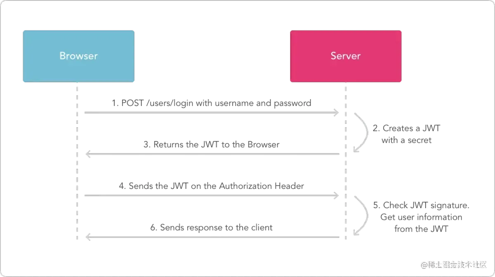

# JWT原理分析 & 避坑指南


# 为什么会有JWT的出现？
首先不得不提到一个知识叫做**跨域身份验证**，JWT的出现就是为了更好的解决这个问题，但是在没有JWT的时候，我们一般怎么做呢？一般使用Cookie和Session，流程大体如下所示：

1. 用户向服务端发送用户名和密码进行验证
2. 服务端验证之后，相关数据（如用户角色、登录时间等信息）会保存在当前的Session中
3. 服务端向用户返回一个唯一的session_id，同时在响应请求中设置cookie，属性名为jessionid
4. 客户端收到之后会保存jessionid，再次请求的时候，会在header中设置，服务端可以从请求头中获取
5. 服务端验证获取到的sessionid是否存在，即可验证是否是同一用户

使用Cookie和Session这种模式最大的问题之一就是它不支持横向扩展，**也就是不支持分布式架构**，如果当前只有一台服务器，那就没什么问题，但是在当下的时代，一台服务器往往是不够的，现在绝大多数都是服务器集群。如果是服务器集群，那么在负载均衡的时候就不能保证每次都发送到同一台服务器上，这样的话也就不能验证用户的身份了，但是这对用户是不友好的，用户是感知不到自己的请求发送到了别的服务器上的。
所以这个时候就提出来了让session落库，当一个请求发过来之后，验证服务从数据库去验证用户身份，这样就能让各个服务器正确的验证用户身份信息，但是这样做，依赖性太强，如果这个session数据库挂了，那么整个认证系统都会崩溃。

# JWT的面世
因为Cookie和Session的局限性，所有有人提出只让客户端存储数据，服务端不保存任何会话数据，每个请求都被发送回服务器，JWT就出现了。
下面放一张JWT官网的一张图，描述的是JWT的认证过程，可以先看看这张图，有个印象：

下面简单讲讲JWT的概念：
JWT是Json Web Token的缩写，它将用户信息加密到Token中，服务器不保存任何的用户信息。服务器通过使用保存的密钥验证Token的正确性，只要正确就通过验证。
上面可能很难理解，把它日常化一下就是在没有网络的年代，部门A要申请部门B的某个机器使用权，部门A肯定要先老大打报告，写申请，最后老大签字同意，部门A再拿着这个带有老大签字的这个申请报告去找部门B，部门B才能同意部门A使用，这就是JWT的流程。

## JWT的数据结构
JWT总共包含了三个部分：**Header头部、Payload负载、Signature签名。这三部分共同生成Token，三部分之间用“.”做分割**。

### JWT 头部
JWT的头部是一个描述JWT元数据的JSON对象，如下所示：
```json
{
  "alg": "HS256",
  "typ": "JWT"
}
```
其中的alg：表示的是签名使用的算法，默认为HMAC SHA256（写为HS256），typ：表示的是令牌的类型，JWT的令牌统一写为JWT。
这样的一个Json数据，还需要使用Base64 URL算法将其转为字符串保存。

### JWT 负载
负载部分就是JWT的主体内容，同样的也是一个Json对象，它包含了需要传递的数据，但是不能传递敏感数据，因为这部分数据别人也是可以拿到并且解密的。
JWT指定有七个默认字段供选择：

1. iss：发行人
2. exp：到期时间
3. sub：主题
4. aud：用户
5. nbf：在此之前不可用
6. iat：发布时间
7. jti：JWT ID 用于标识该 JWT

除了默认字段外，我们还可以自定义字段，如下所示：
同样，这部分数据依然是使用Base 64 URL算法转换为字符串加密。

### JWT 签名
签名部分是对上面两部分的数据签名，通过指定的算法（在JWT头部指定的算法）生成哈希来确保数据不会被篡改。
一般流程如下：

1. 在服务器中保存了一个密码（secret），这个密码仅仅保存在服务器中，不对用户开放。
2. 使用JWT头部指定的签名算法以及服务器中保存的密码（secret）来生成对应的签名
3. 在计算出签名之后，JWT头、负载、签名，三部分组成一个字符串，每个部分以“.”进行分割，构成JWT对象

## JWT的认证流程

1. 客户端发送信息给服务端，让其进行验证
2. 服务端验证成功后，返回给客户端一个JWT
3. 客户端将JWT保存在`Cookie`或放入`HTTP`请求的**Header Authorization字段**中（推荐放在这）
4. 此后客户端请求的时候都带着JWT去请求服务端，服务端对JWT再进行验证

# JWT的缺陷

1. JWT最大的缺陷就是服务器不会保存会话状态，所以使用期间不能取消令牌或者更改令牌的权限，一旦JWT签发，在有效期内将会一直有效。
2. 由于JWT不加密，所以JWT不能用来传递敏感数据
3. 它有着更大的空间占用
4. 很难应对过期的数据，由于无法废除掉已经颁布的令牌，在令牌过期之前，只能忍受过期的数据

### 总结

- 在Web应用中，不能把JWT当作Session使用，绝大多数情况下，传统的cookie-session机制工作得更好
- JWT适合一次性的命令认证，颁发一个有效期极短的JWT，即使暴露了危险也很小，由于每次操作都会生成新的JWT，因此也没必要保存JWT，真正实现无状态。


> 原文: <https://www.yuque.com/tulingzhouyu/db22bv/ms1gpvnvnnxci5zx>