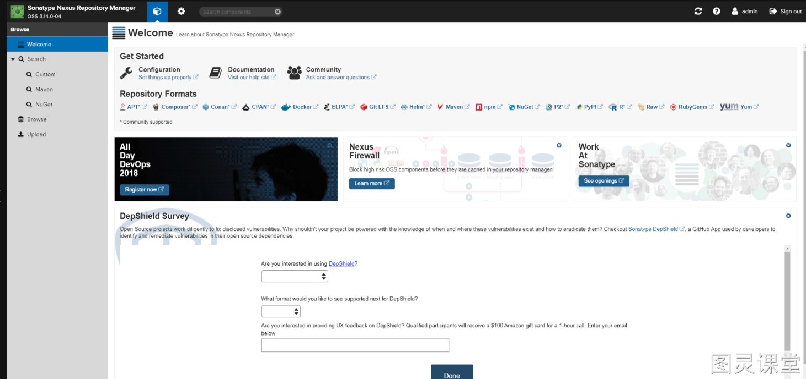
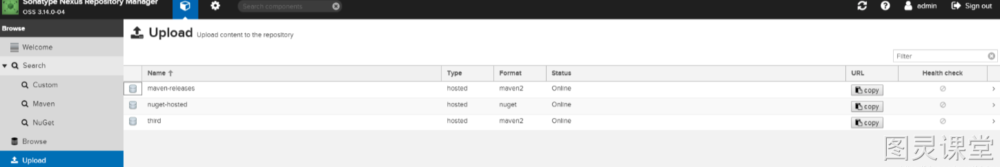
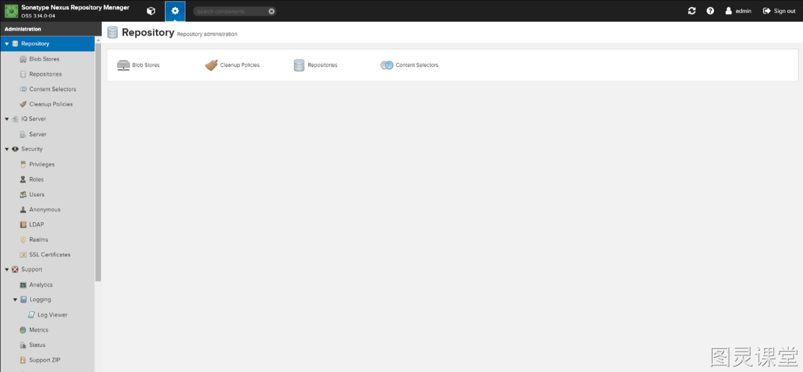
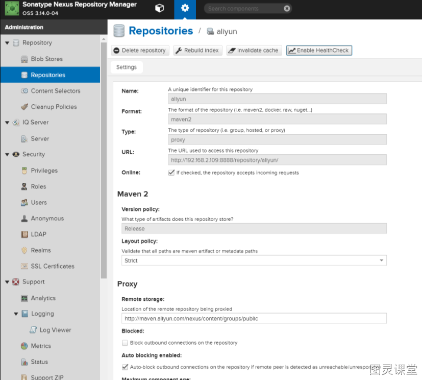
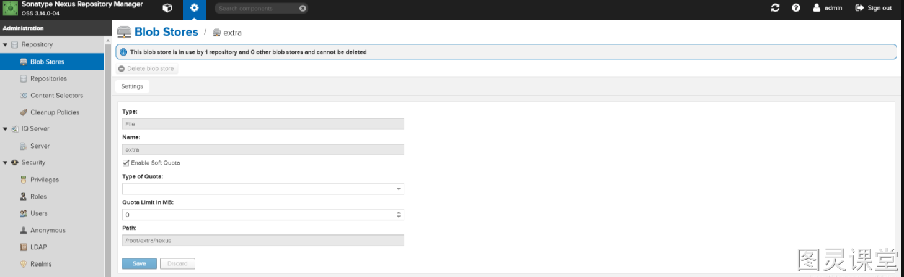
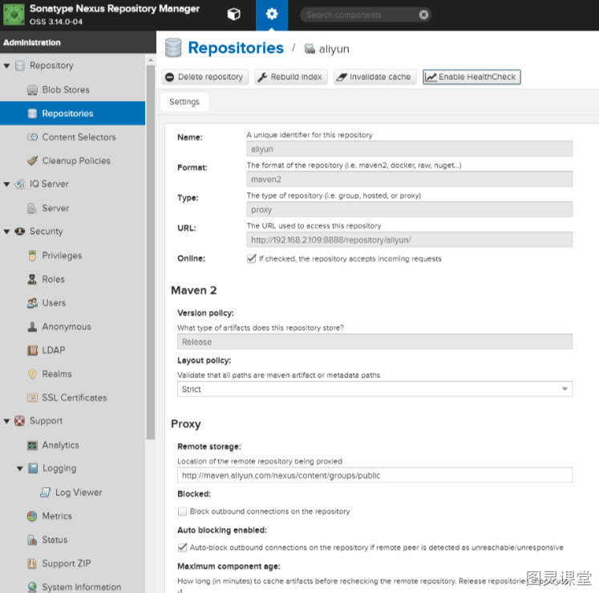
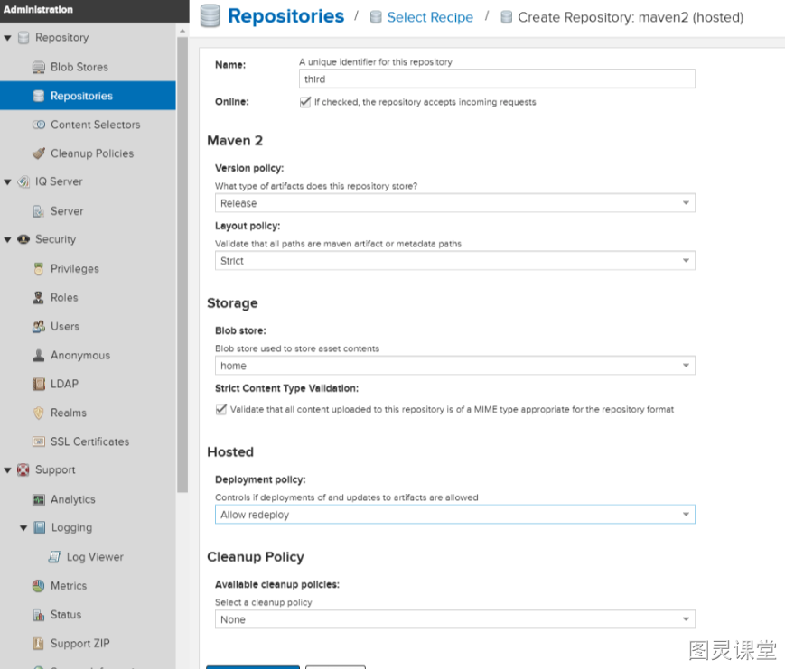
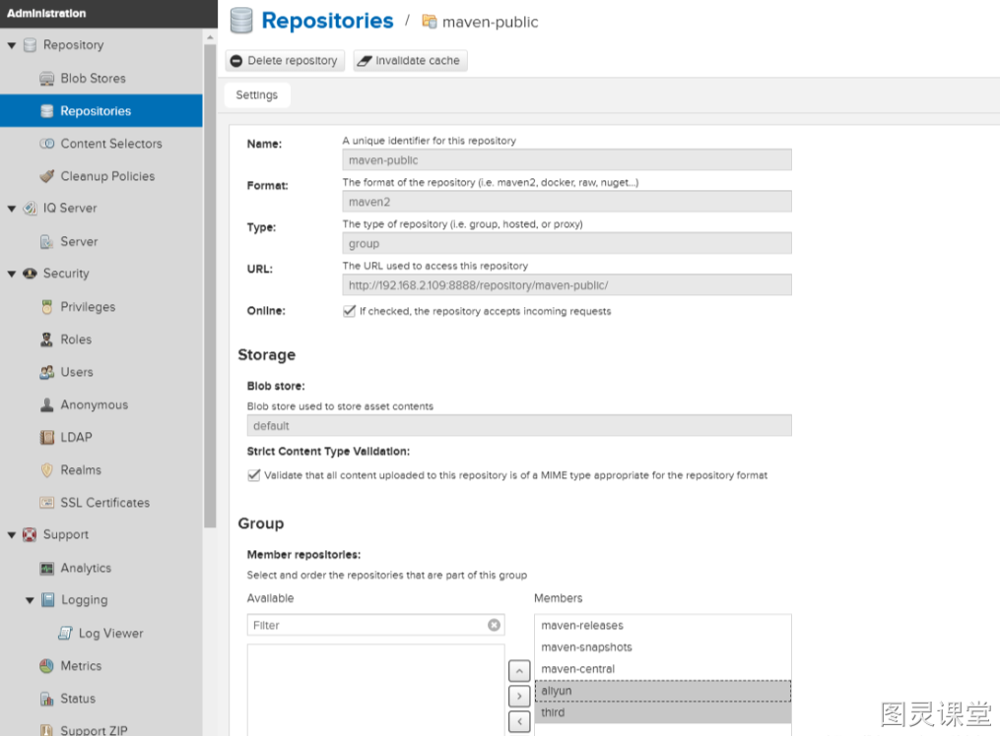
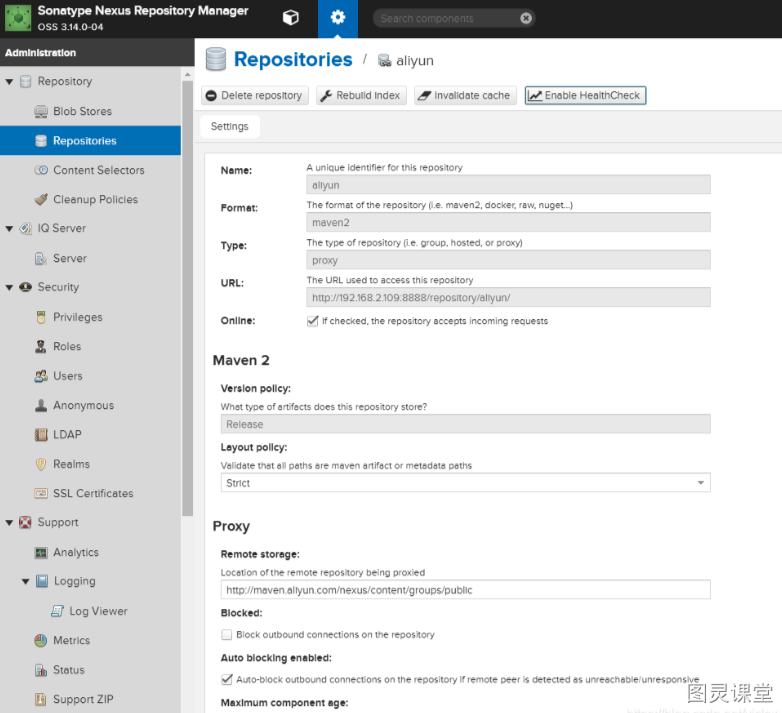

# Java私有仓库Nexus搭建


## 为什么需要搭建私有仓库？
1、有些公司都不提供外网给项目组人员，因此就不能使用maven访问远程的仓库地址，所以很有必要在局域网里找一台有外网权限的机器，搭建nexus私服，然后开发人员连到这台私服上，这样的话就可以通过这台搭建了nexus私服的电脑访问maven的远程仓库。而且自己maven私服更容易维护，由于在内网，公司的开发人员从maven私服迁出jar到本地仓库更快。
2、当需要上传第三方或者自己的jar到maven仓库时，就需要私服了。

## 如何部署和使用？

- 操作系统：Ubuntu18 （虚拟机和云服务器均可）
- Maven版本：apache-maven-3.6.0 （下载地址：[https://archive.apache.org/dist/maven/maven-3/3.6.0/binaries/](https://archive.apache.org/dist/maven/maven-3/3.6.0/binaries/)）
- Nexus版本：nexus-3.58.0 (下载地址：[https://www.sonatype.com/products/sonatype-nexus-oss-download](https://www.sonatype.com/products/sonatype-nexus-oss-download))

### 配置Maven
将下载好的maven和nexus上传到服务器上（建议软件都安装在/usr/local目录下），下面解压maven
```sql
tar -zxvf apache-maven-3.6.0-bin.tar.gz
```
配置环境变量
```sql
vim /etc/profile
```
在最末尾加上
```sql
# maven
MAVEN_HOME=/usr/local/apache-maven-3.6.0
export MAVEN_HOME
export PATH=${PATH}:${MAVEN_HOME}/bin
```
然后再使用下面命令使配置生效
```sql
source /etc/profile
```
查看是否生效
```sql
mvn -v
```

### 部署Nexus
解压Nexus
```bash
tar -zxvf nexus-3.58.0-04-unix.tar.gz
```
启动
```
cd /usr/local/nexus-3.58.0-04/bin
./nexus start
```
默认端口：`8081`
默认账号密码:`admin/admin123`

#### 修改默认端口
新版本的Nexus的配置文件是在Nexus根目录的`/etc`下的`nexus-default.properties`要修改Nexus的端口，就修改配置文件中的`application-port`，然后重启Nexus服务。

## Nexus简单功能介绍


### 搜索功能
这个就是类似Maven仓库上的搜索功能，就是从私服上查找是否有哪些包。
> **注意：**在Search这级是支持模糊搜索的


### 浏览


### 上传
顾名思义就是上传jar包到私服中，可以选择其中一个hosted仓库。通过页面直接上传的方式只是上传了jar包，若这个jar通过Maven依赖了其他jar，那其他项目在下载这个jar时无法取得它的依赖。所以，除非这个jar没有任何依赖，否则还是推荐通过命令行或者IDE的方式上传jar包，这样才会把pom一并上传。


### 服务器管理和配置
看到这选项是要进行登录的，在右上角点击“Sign In”的登录按钮，输入admin/admin123，登录成功之后，即可看到此功能，如图所示：


### 仓库

#### Blob Stores
文件存储的地方，创建一个目录的话，对应文件系统的一个目录。



#### Repositories
仓库分为三种：Proxy、hosted、group

##### Proxy
这里就是代理的意思，代理中央Maven仓库，当PC访问中央库的时候，先通过Proxy下载到Nexus仓库，然后再从Nexus仓库下载到PC本地。
这样的优势只要其中一个人从中央库下来了，以后大家都是从Nexus私服上进行下来，私服一般部署在内网，这样大大节约的宽带。
创建Proxy的具体步骤：

1. 点击左上角的“Create Repositories”按钮
2. 选择要创建的类型
3. 填写详细信息

Name：就是为代理起个名字，我取名为“aliyun” Remote Storage: 代理的地址，Maven的地址为: [https://repo1.maven.org/maven2/](https://repo1.maven.org/maven2/)，但Maven官方的代理访问速度太慢了，使用阿里云的Maven代理更好，[http://maven.aliyun.com/nexus/content/groups/public](http://maven.aliyun.com/nexus/content/groups/public) Blob Store: 选择代理下载包的存放路径，我选择的是之前创建的一个。


#### Hosted
Hosted是宿主机的意思，用于将第三方的Jar或者我们自己的jar放到私服上。Hosted有三种方式，Releases、SNAPSHOT、Mixed

- Releases: 一般是已经发布的Jar包
- Snapshot: 未发布的版本
- Mixed：混合的

Hosted的创建和Proxy类似，类型需选择maven2(hosted)。注意：Deployment Pollcy，我们需要把策略改成“Allow redeploy”，以允许重复发布覆盖同版本的jar包。


#### **Group**
能把多个仓库合成一个仓库来使用，把上几步创建的代理仓库和宿主仓库都加入到“maven-public”仓库组中：


#### Security
包含用户、角色、权限的配置。

#### Support
包含日志及数据分析。

#### System
包含API（Nexus这个API文档貌似是用swagger做的）、邮件服务器，设置调度任务等。

## Maven结合Nexus配置私有仓库

### 配置Maven的settings.xml
在idea、eclipse等IDE中配置好maven的settings文件路径后，在mirrors标签中增加一个mirror
```
<mirror>
    <id>nexus-aliyun</id>
    <mirrorOf>*</mirrorOf>
    <name>Nexus aliyun</name>
    <url>http://你的IP:你的端口/repository/aliyun/</url>
</mirror>
```
url中填入之前在Nexus中自己创建的代理中央仓库


### 配置项目中的pom.xml
在pom文件中增加一个repository，注意id和name需和代理中央仓库的Name一致。
```
<repositories>
	<repository>
		<id>aliyun</id>
		<name>aliyun</name>
		<url>http://192.168.2.109:8888/repository/aliyun/</url>
		<snapshots>
			<enabled>true</enabled>
		</snapshots>
		<releases>
			<enabled>true</enabled>
		</releases>
	</repository>
</repositories>
```
上面的配置方法选择其中一种即可。
如此一来，项目在下载jar包时会从私服的代理中央仓库中获取，如果代理仓库没有该jar，就会去代理仓库配置的远程仓库中下载到私服中，再从私服下载到项目本地。


> 原文: <https://www.yuque.com/tulingzhouyu/db22bv/ul3651zx68pm67dq>