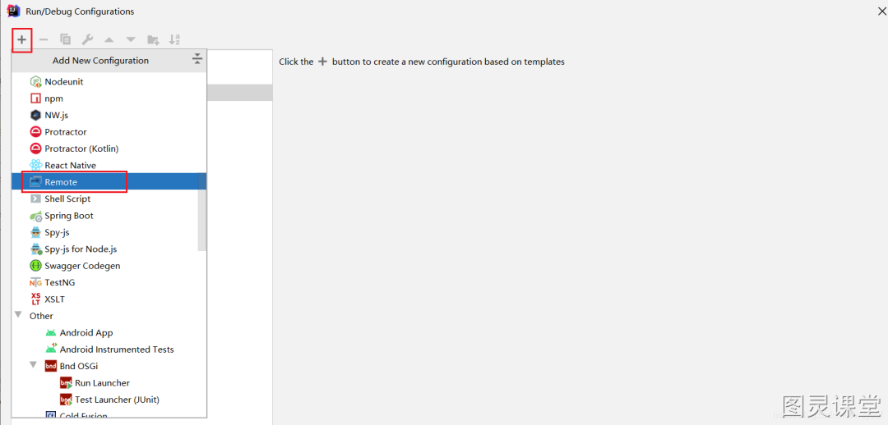
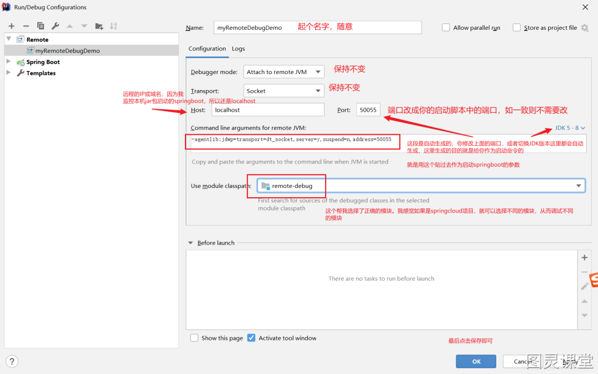
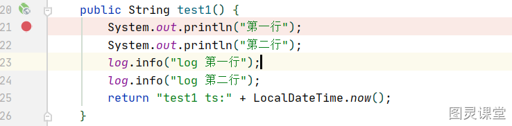
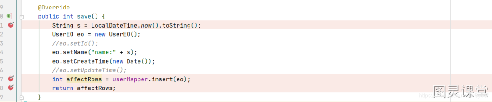
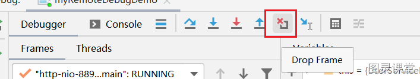

# 使用 IDEA 远程 Debug 调试


### 背景
有时候我们需要进行远程的debug，本文研究如何进行远程debug，以及使用 IDEA 远程debug的过程中的细节。看完可以解决你的一些疑惑。

### 配置
远程debug的服务，以springboot微服务为例(springcloud的应该差不多，我没研究过)。首先，启动springboot需要加上特定的参数。

#### IDEA设置
高低版本的 IDEA 的设置可能界面有点不一样，我用2020.1.1的。大致上差不多，自行摸索。
IDEA打开远程启动的springboot应用程序所对应的
1.选择 Edit Configuration


注意：注意端口别被占用。后续这个端口是用来跟远程的java进程通信的。
可以注意到：切换不同的jdk版本，生成的脚本不一样
选择 `jdk1.4`，则为
```bash
-Xdebug -Xrunjdwp:transport=dt_socket,server=y,suspend=n,address=50055
```
这就是你为什么搜其他博客，会有这种配置的原因，其实这个配置也是可行的。但更准确应该按照下面jdk5-8的配置
选择`jdk 5-8`，则为
```bash
-agentlib:jdwp=transport=dt_socket,server=y,suspend=n,address=50055
```
选择`jdk9`以上，则为
```bash
-agentlib:jdwp=transport=dt_socket,server=y,suspend=n,address=*:50055
```
据说因为jdk9变得安全了，远程调试只允许本地，如果要远程，则需要在端口前配置`*`

#### 启动脚本改造
使用第一步得到的 Command line arguments for remote JVM 即可，即`-agentlib:jdwp=transport=dt_socket,server=y,suspend=n,address=50055`
改造后的启动脚本如下:
```bash
nohup java \
-agentlib:jdwp=transport=dt_socket,server=y,suspend=n,address=50055 \
-jar remote-debug-0.0.1-SNAPSHOT.jar &
```
注意在windows中用 ^ 来进行换行，例如:
```bash
java ^
-agentlib:jdwp=transport=dt_socket,server=y,suspend=n,address=50055 ^
-jar remote-debug-0.0.1-SNAPSHOT.jar
```
说明：

1. 端口可随意自己定，未被占用的都行，但是要和IDEA里的remote中设置的端口一致！其他参数照抄。详细的参数解释可以参照附录或自己搜
2. `remote-debug-0.0.1-SNAPSHOT.jar `改成给你自己的 jar 包名字
3. 我给的脚本是后台运行的，如不需要后台运行，自行去掉 nohup 和 &
4. 启动springboot，启动IDEA里的

### 

### 细节

#### 细节1：停在本地断点，关闭程序后会继续执行吗?
如果远程调试在自己的断点处停下来了，此时关闭IDEA中的项目停止运行，则还会继续运行执行完剩下的逻辑吗？会的，这点比较不容易记住
以下面的代码为例，在第一行停住了。然后IDEA中停掉，发现停掉之后控制台还是打印了剩下的日志。


#### 细节2：jar包代码和本地不一致会怎么样？
IDEA 里的代码如果不和jar包的一致，会怎么样。
结论：要保证和远程启动的代码一致。
否则你debug的时候的行数会对不上。报错抛异常倒是不会。像这种还是能对得上行数的
比如你调试test1方法，test2方法在test1下面，在test2里加代码，这样并不影响test1中的行号，这种是可以在调试的时候准确反应行号的

#### 细节3：日志打印在哪里？
日志不会打印在IDEA的控制台上。即System.out 以及 log.info 还是打印在远程的。
```java
@GetMapping("/test1")
public String test1() {
    System.out.println("第一行");
    System.out.println("第二行");
    log.info("log 第一行");
    log.info("log 第二行");
    return "ok";
}
```

#### 细节4：调试时其他人会不会卡住？
远程调试的时候，打了断点，停住后会不会导致页面的请求卡住。
比如你使用远程调试，别的QA在测试这个页面，结果他们看到的结果是怎么样的？会卡住吗？会的，已经实际遇到过这种情况了。

#### 细节5：本地代码修复bug远程调用的时候
如果在远程调试过程自己发现了bug，本地改好后重新启动IDEA里的项目，再到页面调用一次，能修复吗？不能，运行的还是远程部署的jar中的代码
这个直接击碎了远程页面点一点触发本地代码进行debug的梦想。如果可以的话那调试代码就方便太多。

#### 细节6：这个不算远程调试的问题，是dropframe的问题，放在这里一起讲了
关于drop frame的问题，如果drop frame了重新进行调试，会不会插入2条记录？
如图 userMapper.insert(eo) ，本方法没有使用 @Transactional 修饰，mapper方法执行过后事务会被立即提交，则库表里多了一行记录，如果drop frame后，再次进行调试，再次执行这代码，于是又插入了一条记录。

如果加上 @Transational 就不会有两条记录了，`dropframe`的时候事务没被提交，再次执行该插入代码也不会插入2条。

##### 关于什么是drop frame


#### 细节7：跟上面一样，是dropframe问题
如果把上述插入数据库的逻辑，换成调用远程的接口，在dropframe后，再次执行相同的代码，会不会导致远程接口被执行了2次？会的。

### 总结
好像感觉远程调试的用处也不是那么大，不能作为长期使用的调试工具。只能作为临时调试的手段。难点有几个：

- 难保证本地代码和远程一致，而且你也很难判断是否一致
- 通过远程调试发现了bug，但是又不能立即修复后继续调试，只能修复后部署后继续远程调试


> 原文: <https://www.yuque.com/tulingzhouyu/db22bv/vn7vhycdiffiva47>