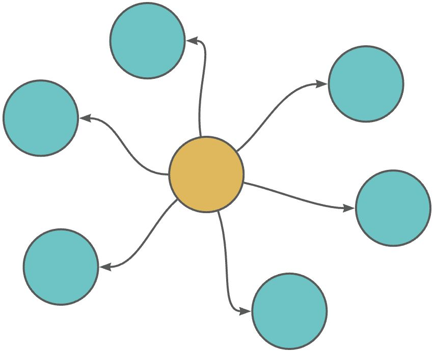
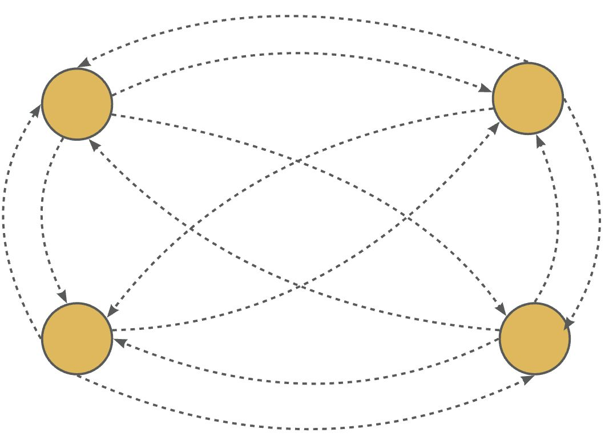
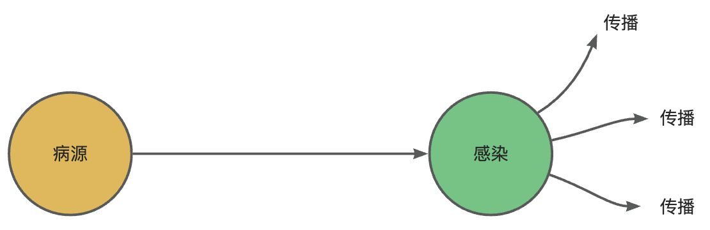
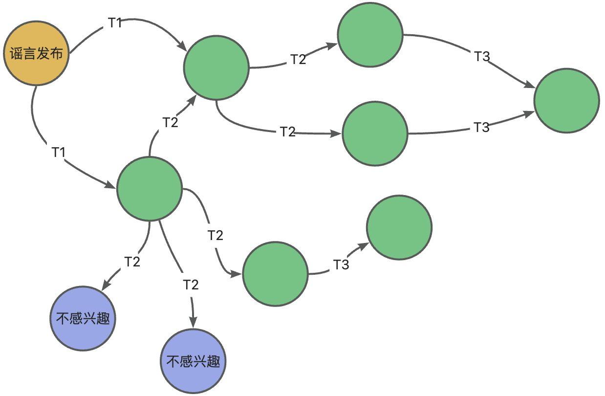
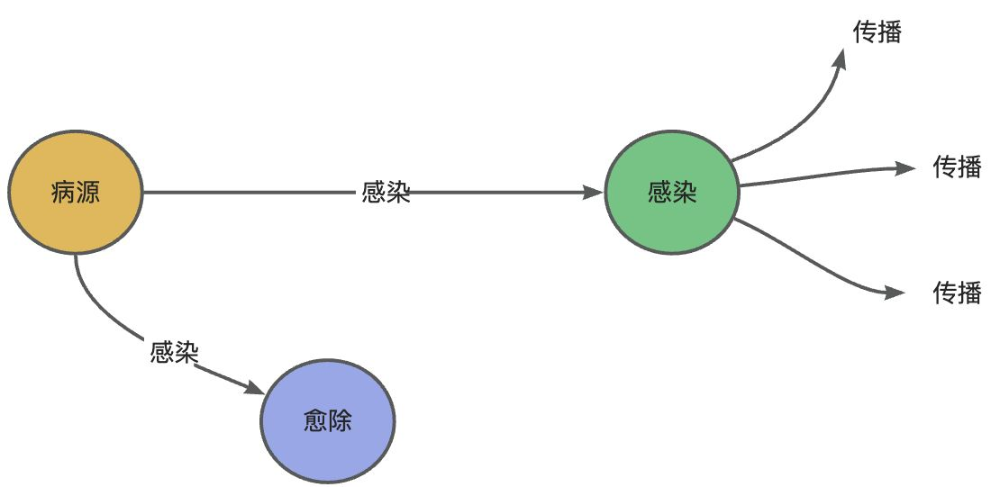
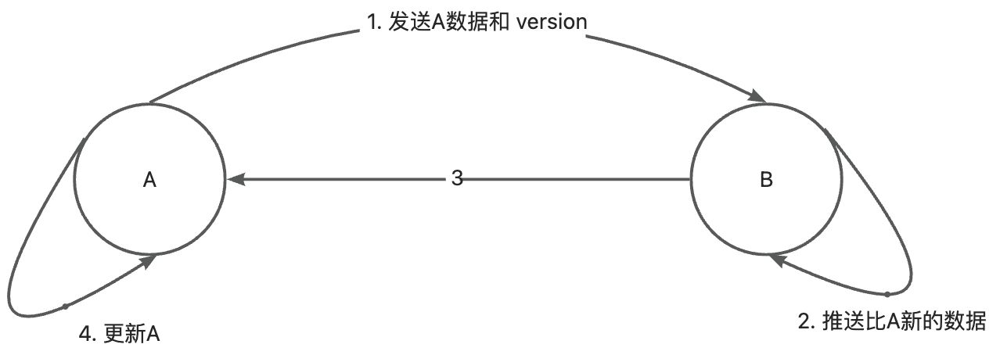
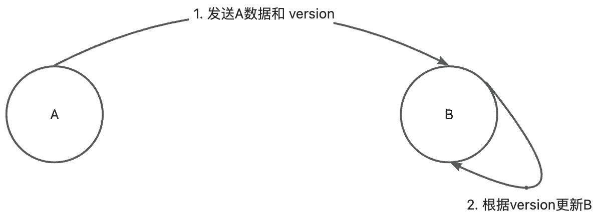

# 分布式协议Gossip

Gossip Protocol也叫Epidemic Protocol（流行病协议），还有其他名称，如**流言算法、疫情传播算法**等。
该协议的发布最早是在1987年8月温哥华举行的第六届ACM分布式计算原理的学术会议上，该论文介绍了几种用于分发更新并推动副本实现一致性的随机算法。该算法非常简单，几乎不需要底层通信系统的保证，但它们可以确保每次更新的效果最终都能体现在所有副本中。通过在随机化步骤中选择适当的分布来调整算法的成本和性能。该算法与流行病非常相似，流行病学文献有助于理解其行为。

### 六度分隔理论
Gossip Protocol是基于**六度分隔理论（Six Degrees of Separation）哲学**的体现，简单的来说，一个人通过6个中间人可以认识世界任何人，数学公式如下：

即复杂度，为每个人的朋友圈数量，为人际宽度。
1506 ＝11,390,625,000,000（约11.4万亿）
意思为每个人朋友圈数量为150人，当人际宽度为6时，大约可以容纳11.4万亿人的体量。
基于[六度分隔理论](https://link.juejin.cn?target=https%3A%2F%2Fbaike.baidu.com%2Fitem%2F%25E5%2585%25AD%25E5%25BA%25A6%25E5%2588%2586%25E9%259A%2594%25E7%2590%2586%25E8%25AE%25BA%2F1086996%3Ffr%3Daladdin)得知，任何信息的传播其实非常迅速，而且网络交互次数不会很多。比如Facebook在2016年2月4号做了一个实验：研究了当时已注册的15.9亿使用者资料，发现这个神奇数字的“网络直径”是4.57，翻成白话文意味着每个人与其他人间隔为4.57人。

### 实现机制
在《Epidemic Algorithms for Replicated Database Maintenance》论文中主要论述了直接邮寄（direct mail）、反熵传播（anti-entropy）、谣言传播（rumor mongering）三种机制来实现数据更新。
Gossip协议主要是通过反熵传播（anti-entropy）、谣言传播（rumor mongering）实现的。

#### 直接邮寄

每个节点更新都会立即从其变更节点邮寄通知到所有其他节点。

| 机制 | 时间复杂度 | 网络流量 | 优点 | 缺点 |
| --- | --- | --- | --- | --- |
| 直接邮寄（direct mail） | O(n)，n为节点数 | 1_m_n，m为更新消息数，n为节点数 | 更新效率高 | 不完全可靠，存在信息传递丢失风险 |

对于**直接邮寄（direct mail）** 这种方式，主要是当节点有数据更新便开始遍历节点池，遍历发送其他所有节点消息来通知自身节点数据的更新情况，实现算法较为简单。由于是一次性遍历通知，在遇到网络通信故障、节点宕机之后恢复等现实情况时没有办法容错和补偿，这是较为致命性的地方，因此极端情况下它是无法保证分布式环境下各节点数据一致性的。

#### 反熵传播

每个节点都会定期随机选择节点池中的一些节点，通过交换数据内容来解决两者之间的任何差异。如上图T1、T2、T3表示不同时间点各节点通知周边节点数据交互的示例。

反熵传播（anti-entropy）中的节点只有两种状态，病原（Suspective）和感染（Infective），因此称作**SI模型**，一般叫做**简易流行病（simple epidemics）** 。
反熵传播（anti-entropy）的消息数量非常庞大，且无限制；通常只用于新加入节点的数据初始化。

| 机制 | 时间复杂度 | 网络流量 | 优点 | 缺点 |
| --- | --- | --- | --- | --- |
| 反熵（anti-entropy） | O(log2n)，n为节点数 | O((m*n)t)，n为节点数，m为更新消息数，t为周期数 | 1.可靠 
2.定时重复
3.可容错 | 1.消息冗余
2.消息延迟 
3.网络流量耗费较多 |

对于**反熵（anti-entropy）** 这种方式，和**直接邮寄（direct mail）相比的最大特点就是解决了消息丢失无法补偿容错导致的数据无法保持一致的致命问题**。它通过单点的定时随机通知周边节点进行数据交互的方式保持各节点之间数据的一致性。这里需要注意的是，一致性的保持是在节点数据变更后一段时间内通过节点间的数据交互逐渐完成的最终一致，并且由于每个节点都定期广播数据到周边随机的一部分节点，因此在数据交互上是存在冗余和延迟的。

**反熵**
**反熵（anti-entropy）** 这个词汇比较陌生，之所以定义成这样是因为 entropy 是指混乱程度（disorder），而在这种模式下可以消除不同节点中数据的 disorder，因此 anti-entropy 就是 anti-disorder（反混乱），它可以提高系统中节点之间的相似性。

**熵**是源于一个热力学概念，后来延伸概念可以特指**一个系统不受外部干扰时往内部最稳定状态发展的特性**，也就是某个领域范围内特定的守恒状态。在当前我们论述的问题中，是要**通过较少的网络流量在较短的时间内实现不同节点之间的信息更新一致**，因此这个问题就是一个分布式一致性的**熵**概念，一般定义向好的方向为正，不向好的方向为负，那么**反熵**这里我理解为就是网络流量较多、时间较长的不向好的定义或实现。

**校验和**
定期的消息广播能够弥补**直接邮寄（direct mail）** 中数据不一致的致命缺点，但是也是具有副作用的，它在一定情况下会产生大量的消息冗余，即已更新的节点无论当前数据是否保持一致，每次收到广播通知都要进行数据检查和对比，这是性能和网络流量的浪费，因此数据节点要实现文件数据校验和功能来避免该问题的性能开销。

#### 谣言传播

这里先以**谣言传播**方式来讲解分布式节点数据交互如下：

- 所有的节点在最开始没有产生数据变更时都假设是**未知状态**，它是不知道任何谣言信息的
- 当节点收到其他节点更新数据通知时，相当于听到了一条**谣言**，并将其视为**热门**开始传播给周边节点
- 当某个节点**谣言**盛行时，它会定期随机选择其他节点，并确保另一个节点知道
- 当某个节点发现周边节点都知道这个**谣言**时，该节点将停止将该谣言视为**热点**，并保留更新，而不会进一步传播

谣言传播周期可能比反熵周期更频繁，因为它们在每个站点所需要的资源更少，但是有可能更新不会到达所有站点。

谣言传播（rumor mongering）中的节点状态有Suspective(病原)、Infective(感染)、Removed(愈除)，因此称作**SIR模型**，一般叫做**复杂流行病（complex epidemics）** 。

- 消息生产节点即为Suspective(病原)状态
- 消息接收节点即为Infective(感染)状态，会进行消息传播
- 节点接收消息后即为Removed(愈除)状态，不再进行传播

消息只包含最新更新数据，消息在某个时间点之后会被标记为Removed(愈除)状态，并且不再被传播，通常用于节点间数据增量同步。

| 机制 | 时间复杂度 | 网络流量 | 优点 | 缺点 |
| --- | --- | --- | --- | --- |
| 谣言传播（rumor mongering） | O(log2n)，n为总节点数 | O((m*n)t)，n为节点数(递减)，m为更新消息数，t为周期数 | 1.可靠 
2.定时重复
3.可容错 | 1.消息冗余
2.消息延迟 
3.网络流量耗费较多 |

### 通信模式

#### 拉 PULL

- ① A仅将数据 key, version 推送给 B
- ② B 将本地比 A 新的数据（Key, value, version）推送给 A
- ③ 回传 B 数据给 A
- ④ A 更新本地

#### 推 PUSH

- ① 节点 A 将数据 (key,value,version) 及对应的版本号推送给 B 节点
- ② B 节点更新 A 中比自己新的数据

#### 推拉(PUSH/PULL)

- ① A仅将数据 key, version 推送给 B
- ② B 将本地比 A 新的数据（Key, value, version）推送给 A
- ③ 回传 B 数据给 A
- ④ A 更新本地
- ⑤ 推送比 B 新的数据
- ⑥ 更新 B

#### 通信次数对比
| 模式 | 次数 |
| --- | --- |
| 推（push） | 1 |
| 拉（pull） | 2 |
| 推拉（push&pull） | 3 |

#### 复杂度分析
对于一个节点数为n的网络来说，假设每个周期p内，新感染的节点都能再感染至少一个新节点，那么感染节点数与周期规律如下

| 周期 | 新感染数 | 总感染数 |
| --- | --- | --- |
| p1 | 1 | 2 |
| p2 | 2 | 4 |
| p3 | 4 | 8 |
| p4 | 8 | 16 |
| pN | 2n-1 | 2n |

**时间复杂度**
那么Gossip协议将变成一个二叉树查找，经过**log2(n)** 个周期之后，感染全网，时间开销是**O(log2(n))** 。
**消息复杂度**
由于每个周期，每个节点都会至少发出一次消息，因此，消息复杂度是 **O(N2)** 。这里也可以理解为是网络交互或网络通信消耗的空间复杂度。
以上Gossip 理论上最优的收敛速度，但是在实际情况中，最优的收敛速度是很难达到的。

#### 实现对比
由于反熵传播中是以固定的概率传播冗余数据来实现节点间数据最终一致的，因此数据交互方式拉（pull）、推（push）、推拉（push&pull）三种实现对性能有所影响。

假设每个节点在每个周期被感染的概率都是固定的 ，每个个节点接收数据更新i周期仍再次接收冗余数据的概率为pi，这里将再次接收更新数据的无效冗余操作称之为复发，之后在i+1周期后复发的概率为pi+1；假设节点总数为n，那么

- **拉模式（Pull）复发概率**

根据拉模式（Pull）特点，每次都要进行数据推送，由其他节点对比返回后决定是否更新，其他被感染节点数据因此每个节点都有可能在下一个周期产生复发现象
- **推模式（Push）** 复发概率

根据推模式（Push）特点，每次推送后会记录，因此会推送节点会递减
- **推拉模式（Push&Pull）** 复发概率
可参考**拉模式（Pull）**

#### 总结
📍 从消息复杂度来看，Push(1次) < Pull（2次） < Pull&Push（3次）
📍 从时间复杂度来看，Pull > Push
📍 从算法实现上来看，无论是基于何种模式进行数据交互，**Gossip**都是基于**平方概率**计算进行最终一致性收敛的
📍 从运行效果上来看，**推拉模式（Push/Pull）** 最好，理论上一个周期内可以使两个节点完全一致，收敛速度也是最快的，消息通信损耗也是最多的。

### 总结
Gossip是一个**去中心化**的分布式协议，数据通过节点像病毒一样逐个传播，整体传播速度非常快，很像现在全球蔓延的新冠病毒（2019-nCoV）。
Gossip的信息传播和扩散通常需要由**种子节点**发起。整个传播过程可能需要一定的时间，由于不能保证某个时刻所有节点都收到消息，但是理论上最终所有节点都会收到消息，因此它是**最终一致性协议**。
Gossip是一个**多主协议**，所有写操作可以由不同节点发起，并且同步给其他副本。Gossip内组成的网络节点都是**对等节点**，是非结构化网络。

#### 优点

- **可扩展性**
允许节点的任意增加和减少，新增节点的状态最终会与其他节点一致
- **分布式容错**
任意节点的宕机和重启都不会影响 Gossip 消息的传播，具有天然的分布式系统容错特性
- **去中心化**
无需中心节点，所有节点都是对等的，任意节点无需知道整个网络状况，只要网络连通，任意节点可把消息散播到全网
- **最终一致性**
消息会以一传十、十传百的指数级速度在网络中传播，因此系统状态的不一致可以在很快的时间内收敛到一致，消息传播速度达到了**logN**
- **通俗易懂** 算法简单，容易理解，实现成本低

#### 缺点

- **消息延迟** 节点随机向少数几个节点发送消息，消息最终是通过多个轮次的散播而到达全网，不可避免的造成消息延迟
- **消息冗余** 节点定期随机选择周围节点发送消息，而收到消息的节点也会重复该步骤；不可避免的引起同一节点消息多次接收，增加消息处理压力，一般通过**文件校验和、缓存节点列表**等方式来进行优化减少数据对比带来的性能损耗

基于以上优缺点分析，Gossip协议满足**CAP**分布式理论中基于**AP**场景的数据最终一致性处理，常见应用有：P2P网络通信、Apache Cassandra、Redis Cluster、Consul等，还有Apache Gossip框架的开源实现供Gossip协议的学习。

> 原文: <https://www.yuque.com/tulingzhouyu/db22bv/wpogs3206ta8ff72>