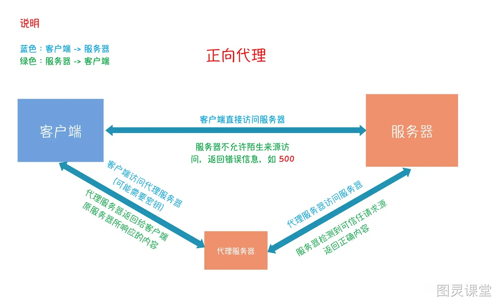

# 什么是正向代理与反向代理？

### 什么是代理？

### 
代理是一种网络服务模式，它充当客户端和目标服务器之间的中介。在代理服务器的模型中，客户端不直接与目标服务器通信，而是将请求发送到代理服务器，然后代理服务器将请求转发给目标服务器。目标服务器的响应也通过代理服务器返回给客户端。
代理的主要作用包括：

1. 访问控制：代理可以控制对特定资源的访问，实施安全策略。
2. 性能优化：代理可以缓存常见请求的结果，减少服务器负载，加快响应速度。
3. 匿名性：代理可以隐藏客户端的真实身份，提供一定程度的匿名性。
4. 内容过滤：代理可以过滤请求和响应，例如屏蔽不良网站或数据。
5. 监控：代理可以监控网络流量，记录访问日志。

### 什么是反向代理？

### 
反向代理（Reverse Proxy）是代理服务器的另一种形式，它位于客户端与服务器之间，但是客户端通常不知道反向代理的存在。在这种模型中，客户端发起的请求首先到达反向代理服务器，然后反向代理服务器将请求转发到后端的一组服务器之一。服务器的响应再通过反向代理返回给客户端。
反向代理的主要作用包括：

1. 负载均衡：将请求分发到多个后端服务器，平衡负载。
2. 故障转移：在后端服务器发生故障时，自动将流量切换到健康的服务器。
3. SSL终端：处理SSL加密和解密，减轻后端服务器的负担。
4. 缓存静态内容：缓存不经常变化的内容，提高响应速度。
5. 访问控制：控制对后端服务器的访问。
6. 隐藏服务器细节：不向客户端暴露后端服务器的具体信息。

### 反向代理就是负载均衡吗？
虽然反向代理可以执行负载均衡的任务，但它们并不完全相同。负载均衡是一种将工作量（如网络流量）平均分配到多个服务器上的概念，以优化资源使用、最大化吞吐量、最小化响应时间，并避免过载任何单一服务器。
反向代理通常包含负载均衡的功能，但它提供更多额外的功能，如SSL终端、缓存、访问控制等。因此，可以说反向代理是一种多功能的网络服务，它包含了负载均衡的功能，但不限于此。

 

> 原文: <https://www.yuque.com/tulingzhouyu/db22bv/hgk6g3318873t3yy>