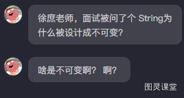

# 短视频

String为什么被设计成不可变？   啥是不可变？  啊？           

今天一个小伙伴去面试被问到这个问题结果一脸懵逼。 我想说如果这种基础的问题都不知道那真的劝你们先准备好再去不要浪费机会， 现在的环境机会丢一个就少一个。
哈喽大家好我是徐庶，需要面试的小伙伴可以再评论区扣666领取我给你们准备的面试资料， 我来给大家普及下这个问题。

首先为什么说String是不可变呢？  有同学说我给他赋值不就变了吗？  这里的不可变啊。。指的是  String变量指向内存的值不可变，说白了， String是对象，值是通过一个final修饰的char[],是不能改的！  要改只能重新new 一个String。  举个例子， 将Hello赋给一个String类型变量，  然后 再追加World字符串， 实际上是创建了一个新的字符串对象 "Hello World"，然后将 变量指向这个新对象。原始的 "Hello" 字符串对象仍然存在于内存中，直到垃圾回收器将其回收。
```java
String str = "Hello";
str += " World";  // 这里实际上创建了一个新的 String 对象 "Hello World"
```
 
那String为什么要设计成这种宁愿指向一个新的内存 也不肯改变原值呢？ ：
原因有几点： 
1. 保证安全性：
由于String是不可变的，它们的值在创建后就不会发生变化。 可以防止恶意代码篡改。

2. 保证线程安全：
由于String是不可变的，  当多个线程共享同一个字符串时  因为持有的是String的引用地址，所以可以保证可重复读。

3. 保证性能：
 Java 中的字符串常量池机制依赖于字符串的不可变性。这样做可以节省内存，因为相同内容的字符串只需存储一个副本。每次创建一个新的字符串字面量时，都会先检查池中是否已经存在，如果存在则直接返回该引用，这样就避免重复创建相同的字符串对象。  


 看完视频如果对你有帮助记得三连支持哦， 下期见！


> 原文: <https://www.yuque.com/tulingzhouyu/db22bv/dmi0befubgtft22n>