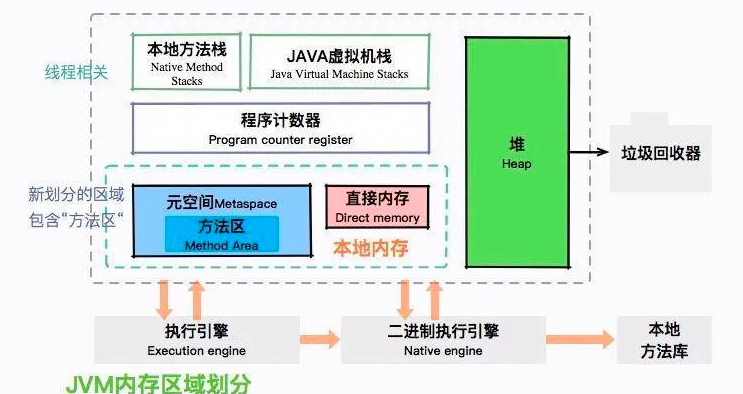
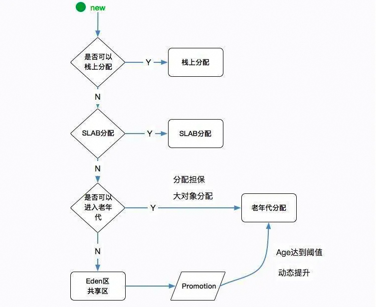
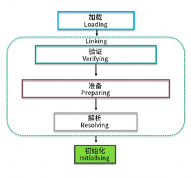
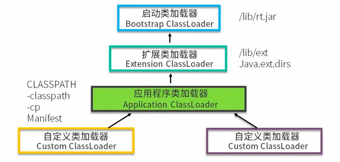
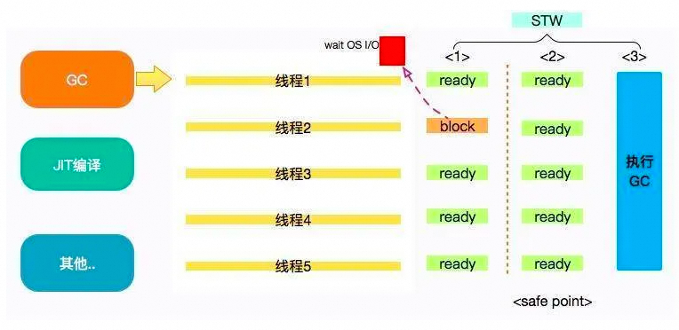
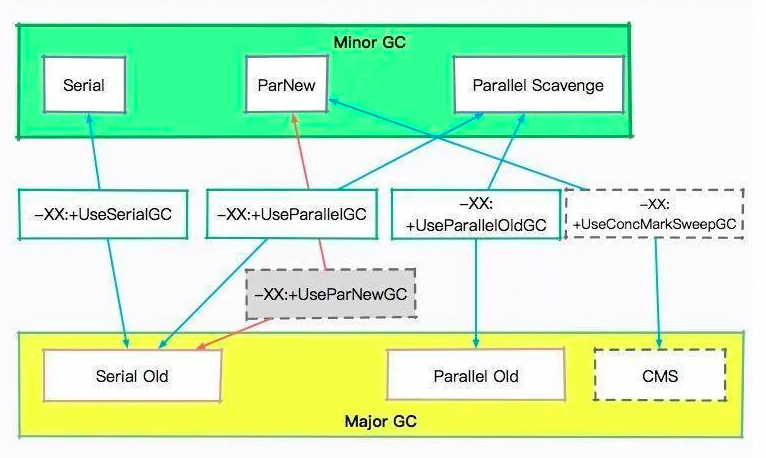
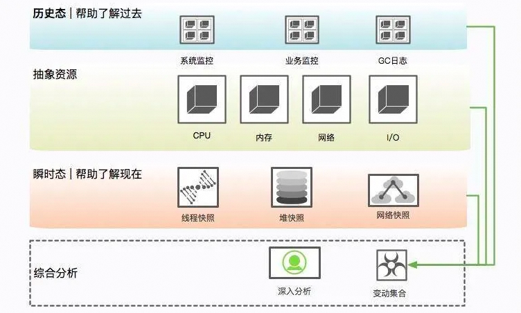
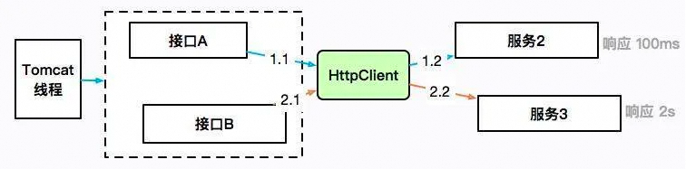

# JVM篇

JVM内存划分

**1、JVM运行时数据区域**
堆、方法区（元空间）、虚拟机栈、本地方法栈、程序计数器。

Heap(堆)：
对象的实例以及数组的内存都是要在堆上进行分配的，堆是线程共享的一块区域，用来存放对象实例，也是垃圾回收（GC）的主要区域；开启逃逸分析后，某些未逃逸的对象可以通过标量替换的方式在栈中分配。
堆细分：新生代、老年代，对于新生代又分为：**Eden区**和**Surviver1**和**Surviver2区**。
方法区：
对于JVM的方法区也可以称之为永久区，它储存的是已经被java虚拟机加载的类信息、常量、静态变量；Jdk1.8以后取消了方法区这个概念，称之为元空间（MetaSpace）；
当应用中的 Java 类过多时，比如 **Spring 等一些使用动态代理的框架生成了很多类**，如果占用空间超出了我们的设定值，就会发生**元空间溢出。**
虚拟机栈：
虚拟机栈**是线程私有的**，他的生命周期和线程的生命周期是一致的。里面装的是一个一个的**栈帧**，每一个方法在执行的时候都会创建一个栈帧，栈帧中用来存放（**局部变量表、操作数栈 、动态链接 、返回地址**）；在Java虚拟机规范中，对此区域规定了两种异常状况：如果线程请求的栈深度大于虚拟机所允许的深度，将会抛出**StackOverflowError**异常；如果虚拟机栈动态扩展时无法申请到足够的内存，就会抛出**OutOfMemoryError**异常。

- **局部变量表：**局部变量表是一组变量值存储空间，用来存放方法参数、方法内部定义的局部变量。底层是变量槽（variable slot）
- **操作数栈：**是用来记录一个方法在执行的过程中，字节码指令向操作数栈中进行入栈和出栈的过程。大小在编译的时候已经确定了，当一个方法刚开始执行的时候，操作数栈中是空发的，在方法执行的过程中会有各种字节码指令往操作数栈中入栈和出栈。
- **动态链接：**因为字节码文件中有很多符号的引用，这些符号引用一部分会在类加载的解析阶段或第一次使用的时候转化成直接引用，这种称为静态解析；另一部分会在运行期间转化为直接引用，称为动态链接。
- **返回地址（returnAddress）**：类型（指向了一条字节码指令的地址）**JIT即时编译器（Just In Time Compiler），简称 JIT 编译器: **为了提高热点代码的执行效率，在运行时，虚拟机将会把这些代码编译成与本地平台相关的机器码，并进行各种层次的优化，比如锁粗化等。

本地方法栈：
本地方法栈和虚拟机栈类似，不同的是虚拟机栈服务的是Java方法，而本地方法栈服务的是Native方法。在HotSpot虚拟机实现中是把本地方法栈和虚拟机栈合二为一的，同理它也会抛出StackOverflowError和OOM异常。
PC程序计数器：
PC，指的是存放下一条指令的位置的一个指针。它是一块较小的内存空间，且是线程私有的。由于线程的切换，CPU在执行的过程中，需要记住原线程的下一条指令的位置，所以每一个线程都需要有自己的PC。

**2、堆内存分配策略**


- 对象优先分配在Eden区，如果Eden区没有足够的空间进行分配时，虚拟机执行一次MinorGC。而那些无需回收的存活对象，将会进到 Survivor 的 From 区（From 区内存不足时，直接进入 Old 区）。
- 大对象直接进入老年代（需要大量连续内存空间的对象）。这样做的目的是避免在Eden区和两个Survivor区之间发生大量的内存拷贝（新生代采用复制算法收集内存）。
- 长期存活的对象进入老年代。虚拟机为每个对象定义了一个年龄（Age Count）计数器，如果对象经过了1次Minor GC那么对象会进入Survivor区，之后每经过一次Minor GC那么对象的年龄加1，直到达到阀值（默认15次），对象进入老年区。（**动态对象年龄判定：**程序从年龄最小的对象开始累加，如果累加的对象大小，大于幸存区的一半，则将当前的对象 age 作为新的阈值，年龄大于此阈值的对象则直接进入老年代）。
- 每次进行Minor GC或者大对象直接进入老年区时，JVM会计算所需空间大小如小于老年区的剩余值大小，则进行一次**Full GC**。


**3、创建一个对象的步骤**
**步骤：类加载检查、分配内存、初始化零值、设置对象头、执行init方法**
**①类加载检查：**
虚拟机遇到 new 指令时，⾸先去检查是否能在常量池中定位到这个类的符号引⽤，并且检查这个符号引⽤代表的类是否已被加载过、解析和初始化过。如果没有，那必须先执⾏相应的类加载过程。
**②分配内存：**
在类加载检查通过后，接下来虚拟机将为新⽣对象分配内存，分配⽅式有 “指针碰撞” 和 “空闲列表” 两种，选择那种分配⽅式由 Java 堆是否规整决定，⽽Java堆是否规整⼜由所采⽤的垃圾收集器是否带有压缩整理功能决定。
**③初始化零值：**
内存分配完成后，虚拟机需要将分配到的内存空间都初始化为零值，这⼀步操作保证了对象的实例字段在 Java 代码中可以不赋初始值就直接使⽤，程序能访问到这些字段的数据类型所对应的零值。
**④设置对象头：**
初始化零值完成之后，虚拟机要对对象进⾏必要的设置，例如这个对象是那个类的实例、如何才能找到类的元数据信息、对象的哈希吗、对象的 GC 分代年龄等信息。这些信息存放在对象头中。另外，根据虚拟机当前运⾏状态的不同，如是否启⽤偏向锁等，对象头会有不同的设置⽅式。
**⑤执⾏ init ⽅法：**
从虚拟机的视⻆来看，⼀个新的对象已经产⽣了，但从Java 程序的视⻆来看， ⽅法还没有执⾏，所有的字段都还为零。所以⼀般来说（除循环依赖），执⾏ new 指令之后会接着执⾏ ⽅法，这样⼀个真正可⽤的对象才算产⽣出来。

**4、对象引用**
普通的对象引用关系就是**强引用**。
**软引用**用于维护一些可有可无的对象。只有在内存不足时，系统则会回收软引用对象，如果回收了软引用对象之后仍然没有足够的内存，才会抛出内存溢出异常。
**弱引用**对象相比软引用来说，要更加无用一些，它拥有更短的生命周期，当 JVM 进行垃圾回收时，无论内存是否充足，都会回收被弱引用关联的对象。
**虚引用**是一种形同虚设的引用，在现实场景中用的不是很多，它主要用来跟踪对象被垃圾回收的活动。
JVM类加载过程
**过程：加载、验证、准备、解析、初始化**

**加载阶段：**
1.通过一个类的全限定名来获取定义此类的二进制字节流。
2.将这个字节流所代表的静态存储结构转化为方法区的运行时数据结构。
3.在Java堆中生成一个代表这个类的java.lang.class对象，作为方法区这些数据的访问入口。
**验证阶段：**
1.文件格式验证（是否符合Class文件格式的规范，并且能被当前版本的虚拟机处理）
2.元数据验证（对字节码描述的信息进行语意分析，以保证其描述的信息符合Java语言规范要求）
3.字节码验证（保证被校验类的方法在运行时不会做出危害虚拟机安全的行为）
4.符号引用验证（虚拟机将符号引用转化为直接引用时，解析阶段中发生）
**准备阶段：**
准备阶段是正式为类变量分配内存并设置类变量初始值的阶段。将对象初始化为“零”值
**解析阶段：**
解析阶段时虚拟机将常量池内的符号引用替换为直接引用的过程。
**字符串常量池：**堆上，默认class文件的静态常量池
**运行时常量池：**在方法区，属于元空间
**初始化阶段：**
初始化阶段时加载过程的最后一步，而这一阶段也是真正意义上开始执行类中定义的Java程序代码。

**1、双亲委派机制**
每⼀个类都有⼀个对应它的类加载器。系统中的 ClassLoder 在协同⼯作的时候会默认使⽤ 双亲委派模型 。即在类加载的时候，系统会⾸先判断当前类是否被加载过。已经被加载的类会直接返回，否则才会尝试加载。加载的时候，⾸先会把该请求委派该⽗类加载器的 loadClass() 处理，因此所有的请求最终都应该传送到顶层的启动类加载器 BootstrapClassLoader 中。当⽗类加载器⽆法处理时，才由⾃⼰来处理。当⽗类加载器为null时，会使⽤启动类加载器 BootstrapClassLoader 作为⽗类加载器。

**使用好处：**
此机制保证JDK核心类的优先加载；使得Java程序的稳定运⾏，可以避免类的重复加载，也保证了 Java 的核⼼ API 不被篡改。如果不⽤没有使⽤双亲委派模型，⽽是每个类加载器加载⾃⼰的话就会出现⼀些问题，⽐如我们编写⼀个称为 java.lang.Object 类的话，那么程序运⾏的时候，系统就会出现多个不同的Object 类。
**破坏双亲委派机制：**

- 可以⾃⼰定义⼀个类加载器，重写loadClass方法；
- Tomcat 可以加载自己目录下的 class 文件，并不会传递给父类的加载器；
- Java 的 SPI，发起者 BootstrapClassLoader 已经是最上层了，它直接获取了 AppClassLoader 进行驱动加载，和双亲委派是相反的。


**2、tomcat的类加载机制**
**步骤：**

1. 先在本地cache查找该类是否已经加载过，看看 Tomcat 有没有加载过这个类。
2. 如果Tomcat 没有加载过这个类，则从系统类加载器的cache中查找是否加载过。
3. 如果没有加载过这个类，尝试用ExtClassLoader类加载器类加载，重点来了，这里并没有首先使用 AppClassLoader 来加载类。这个Tomcat 的 WebAPPClassLoader 违背了双亲委派机制，直接使用了 ExtClassLoader来加载类。这里注意 ExtClassLoader 双亲委派依然有效，ExtClassLoader 就会使用 Bootstrap ClassLoader 来对类进行加载，保证了 Jre 里面的核心类不会被重复加载。比如在 Web 中加载一个 Object 类。WebAppClassLoader → ExtClassLoader → Bootstrap ClassLoader，这个加载链，就保证了 Object 不会被重复加载。
4. 如果 BoostrapClassLoader，没有加载成功，就会调用自己的 findClass 方法由自己来对类进行加载，findClass 加载类的地址是自己本 web 应用下的 class。
5. 加载依然失败，才使用 AppClassLoader 继续加载。
6. 都没有加载成功的话，抛出异常。

总结一下以上步骤，WebAppClassLoader 加载类的时候，故意打破了JVM 双亲委派机制，绕开了 AppClassLoader，直接先使用 ExtClassLoader 来加载类。
JVM垃圾回收

**1、存活算法和两次标记过程**
**引用计数法：**
给对象添加一个引用计数器，每当由一个地方引用它时，计数器值就加1；当引用失效时，计数器值就减1；任何时刻计数器为0的对象就是不可能再被使用的。
优点：实现简单，判定效率也很高
缺点：他很难解决对象之间相互循环引用的问题，基本上被抛弃
**可达性分析法：**
通过一系列的成为“GC Roots”(活动线程相关的各种引用，虚拟机栈帧引用，静态变量引用，JNI引用)的对象作为起始点，从这些节点ReferenceChains开始向下搜索，搜索所走过的路径成为引用链，当一个对象到GC ROOTS没有任何引用链相连时，则证明此对象时不可用的；
**两次标记过程：**
对象被回收之前，该对象的finalize()方法会被调用；两次标记，即第一次标记不在“关系网”中的对象。第二次的话就要先判断该对象有没有实现finalize()方法了，如果没有实现就直接判断该对象可回收；如果实现了就会先放在一个队列中，并由虚拟机建立的一个低优先级的线程去执行它，随后就会进行第二次的小规模标记，在这次被标记的对象就会真正的被回收了。

**2、垃圾回收算法**
**垃圾回收算法：**复制算法、标记清除、标记整理、分代收集
**复制算法：(young)**
将内存分为⼤⼩相同的两块，每次使⽤其中的⼀块。当这⼀块的内存使⽤完后，就将还存活的对象复制到另⼀块去，然后再把使⽤的空间⼀次清理掉。这样就使每次的内存回收都是对内存区间的⼀半进⾏回收；
优点：实现简单，内存效率高，不易产生碎片
缺点：内存压缩了一半，倘若存活对象多，Copying 算法的效率会大大降低
**标记清除：(cms)**
标记出所有需要回收的对象，在标记完成后统⼀回收所有被标记的对象
缺点：效率低，标记清除后会产⽣⼤量不连续的碎⽚，需要预留空间给分配阶段的浮动垃圾
**标记整理：(old)**
标记过程仍然与“标记-清除”算法⼀样，再让所有存活的对象向⼀端移动，然后直接清理掉端边界以外的内存；解决了产生大量不连续碎片问题
**分代收集：**
根据各个年代的特点选择合适的垃圾收集算法。
新生代采用复制算法，新生代每次垃圾回收都要回收大部分对象，存活对象较少，即要复制的操作比较少，一般将新生代划分为一块较大的 Eden 空间和两个较小的 Survivor 空间(From Space, To Space)，每次使用Eden 空间和其中的一块 Survivor 空间，当进行回收时，将该两块空间中还存活的对象复制到另一块 Survivor 空间中。
老年代的对象存活⼏率是⽐较⾼的，⽽且没有额外的空间对它进⾏分配担保，所以我们必须选择“标记-清除”或“标记-整理”算法进⾏垃圾收集。
Safepoint 当发生 GC 时，用户线程必须全部停下来，才可以进行垃圾回收，这个状态我们可以认为 JVM 是安全的（safe），整个堆的状态是稳定的。如果在 GC 前，有线程迟迟进入不了 safepoint，那么整个 JVM 都在等待这个阻塞的线程，造成了整体 GC 的时间变长。

MinorGC、MajorGC、FullGC
**MinorGC** 在年轻代空间不足的时候发生，
**MajorGC** 指的是老年代的 GC，出现 MajorGC 一般经常伴有 MinorGC。
**FullGC** 1、当老年代无法再分配内存的时候；2、元空间不足的时候；3、显示调用 System.gc 的时候。另外，像 CMS 一类的垃圾回收器，在 MinorGC 出现 promotion failure 的时候也会发生 FullGC。
**对象优先在 Eden 区分配**
大多数情况下，对象在新生代 Eden 区分配，当 Eden 区空间不够时，发起 Minor GC。
**大对象直接进入老年代**
大对象是指需要连续内存空间的对象，比如很长的字符串以及数组。老年代直接分配的目的是避免在 Eden 区和 Survivor 区之间出现大量内存复制。
**长期存活的对象进入老年代**
虚拟机给每个对象定义了年龄计数器，对象在 Eden 区出生之后，如果经过一次 Minor GC 之后，将进入 Survivor 区，同时对象年龄变为 1，增加到一定阈值时则进入老年代（阈值默认为 15）
**动态对象年龄判定**
为了能更好地适应不同程序的内存状况，虚拟机并不总是要求对象的年龄必须达到阈值才能进入老年代。如果在 Survivor 区中相同年龄的所有对象的空间总和大于 Survivor 区空间的一半，则年龄大于或等于该年龄的对象直接进入老年代。
**空间分配担保**
在发生 Minor GC 之前，虚拟机会先检查老年代最大可用的连续空间是否大于新生代所有对象的空间总和，如果这个条件成立，那么 Minor GC 可以确保是安全的。如果不成立则进行 Full GC。

**3、垃圾收集器**

JDK3：Serial Parnew 关注效率
**Serial：**
Serial 是一个单线程的收集器，它不但只会使用一个 CPU 或一条线程去完成垃圾收集工作，并且在进行垃圾收集的同时，必须暂停其他所有的工作线程，直到垃圾收集结束。适合用于客户端垃圾收集器。
**Parnew：**
ParNew 垃圾收集器其实是 Serial 收集器的多线程版本，也使用复制算法，除了使用多线程进行垃圾收集之外，其余的行为和 Serial 收集器完全一样，ParNew 垃圾收集器在垃圾收集过程中同样也要暂停所有其他的工作线程。
JDK5：parallel Scavenge+（Serial old/parallel old）关注吞吐量
**parallel Scavenge：(关注吞吐量)**
Parallel Scavenge收集器关注点是吞吐量（⾼效率的利⽤CPU）。CMS等垃圾收集器的关注点更多的是⽤户线程的停顿时间（提⾼⽤户体验）；高吞吐量可以最高效率地利用 CPU 时间，尽快地完成程序的运算任务，主要适用于在后台运算而不需要太多交互的任务。
**Serial old：**
Serial收集器的⽼年代版本，它同样是⼀个单线程收集器，使用标记-整理算法。主要有两个用途：

- 在 JDK1.5 之前版本中与新生代的 Parallel Scavenge 收集器搭配使用。
- 作为年老代中使用 CMS 收集器的后备垃圾收集方案。

**parallel old：**
Parallel Scavenge收集器的⽼年代版本。使⽤多线程和“标记-整理”算法。
JDK8-CMS：（关注最短垃圾回收停顿时间）
CMS收集器是一种年老代垃圾收集器，其最主要目标是获取最短垃圾回收停顿时间，和其他年老代使用标记-整理算法不同，它使用多线程的标记-清除算法。最短的垃圾收集停顿时间可以为交互比较高的程序提高用户体验。CMS 工作机制相比其他的垃圾收集器来说更复杂，整个过程分为以下 4 个阶段：
**初始标记：**只是标记一下 GC Roots 能直接关联的对象，速度很快，STW。
**并发标记：**进行 ReferenceChains跟踪的过程，和用户线程一起工作，不需要暂停工作线程。
**重新标记：**为了修正在并发标记期间，因用户程序继续运行而导致标记产生变动的那一部分对象的标记记录，STW。
**并发清除：**清除 GC Roots 不可达对象，和用户线程一起工作，不需要暂停工作线程。
由于耗时最长的并发标记和并发清除过程中，垃圾收集线程可以和用户现在一起并发工作，所以总体上来看CMS 收集器的内存回收和用户线程是一起并发地执行。
**优点：**并发收集、低停顿
**缺点：**对CPU资源敏感；⽆法处理浮动垃圾；使⽤“标记清除”算法，会导致⼤量空间碎⽚产⽣。
JDK9-G1：（精准控制停顿时间，避免垃圾碎片）
是⼀款⾯向服务器的垃圾收集器,主要针对配备多颗处理器及⼤容量内存的机器.以极⾼概率满⾜GC停顿时间要求的同时,还具备⾼吞吐量性能特征；相比与 CMS 收集器，G1 收集器两个最突出的改进是：
【1】基于标记-整理算法，不产生内存碎片。
【2】可以非常精确控制停顿时间，在不牺牲吞吐量前提下，实现低停顿垃圾回收。
G1 收集器避免全区域垃圾收集，它把堆内存划分为大小固定的几个独立区域，并且跟踪这些区域的垃圾收集进度，同时在后台维护一个优先级列表，每次根据所允许的收集时间，优先回收垃圾最多的区域。区域划分和优先级区域回收机制，确保 G1 收集器可以在有限时间获得最高的垃圾收集效率。

- 初始标记：Stop The World，仅使用一条初始标记线程对GC Roots关联的对象进行标记；
- 并发标记：使用一条标记线程与用户线程并发执行。此过程进行可达性分析，速度很慢；
- 最终标记：Stop The World，使用多条标记线程并发执行；
- 筛选回收：回收废弃对象，此时也要 Stop The World，并使用多条筛选回收线程并发执行；

JDK11-ZGC:（在不关注容量的情况获取最小停顿时间5TB/10ms）
着色笔技术：加快标记过程
读屏障：解决GC和应用之间并发导致的STW问题

- 支持 TB 级堆内存（最大 4T， JDK13 最大16TB）
- 最大 GC 停顿 10ms
- 对吞吐量影响最大，不超过 15%


**4、配置垃圾收集器**

- 首先是内存大小问题，基本上每一个内存区域我都会设置一个上限，来避免溢出问题，比如元空间。
- 通常，堆空间我会设置成操作系统的 2/3，超过 8GB 的堆，优先选用 G1。
- 然后我会对 JVM 进行初步优化，比如根据老年代的对象提升速度，来调整年轻代和老年代之间的比例。
- 依据系统容量、访问延迟、吞吐量等进行专项优化，我们的服务是高并发的，对 STW 的时间敏感。
- 我会通过记录详细的 GC 日志，来找到这个瓶颈点，借用 GCeasy 这样的日志分析工具，定位问题。


**5、JVM性能调优**
对应进程的JVM状态以定位问题和解决问题并作出相应的优化
**常用命令：**jps、jinfo、jstat、jstack、jmap
**jps：查看java进程及相关信息**
jps -l 输出jar包路径，类全名jps -m 输出main参数jps -v 输出JVM参数
**jinfo：查看JVM参数**
jinfo 11666jinfo -flags 11666Xmx、Xms、Xmn、MetaspaceSize
**jstat：查看JVM运行时的状态信息，包括内存状态、垃圾回收**

```
jstat [option] LVMID [interval] [count]其中LVMID是进程id，interval是打印间隔时间（毫秒），count是打印次数（默认一直打印）  option参数解释：-gc 垃圾回收堆的行为统计-gccapacity 各个垃圾回收代容量(young,old,perm)和他们相应的空间统计-gcutil 垃圾回收统计概述-gcnew 新生代行为统计-gcold 年老代和永生代行为统计
```
**jstack：查看JVM线程快照，jstack命令可以定位线程出现长时间卡顿的原因，例如死锁，死循环**
```
jstack [-l] <pid> (连接运行中的进程)  option参数解释：-F 当使用jstack <pid>无响应时，强制输出线程堆栈。-m 同时输出java和本地堆栈(混合模式)-l 额外显示锁信息
```
**jmap：可以用来查看内存信息(配合jhat使用)**
```
jmap [option] <pid> (连接正在执行的进程)option参数解释：-heap 打印java heap摘要-dump:<dump-options> 生成java堆的dump文件
```


**6、JDK新特性**
**JDK8**
支持 Lamda 表达式、集合的 stream 操作、提升HashMap性能
**JDK9**

```
//Stream API中iterate方法的新重载方法，可以指定什么时候结束迭代IntStream.iterate(1, i -> i < 100, i -> i + 1).forEach(System.out::println);
```
默认G1垃圾回收器
**JDK10**
其重点在于通过完全GC并行来改善G1最坏情况的等待时间。
**JDK11**
ZGC (并发回收的策略) 4TB
用于 Lambda 参数的局部变量语法
**JDK12**
Shenandoah GC (GC 算法)停顿时间和堆的大小没有任何关系，并行关注停顿响应时间。
**JDK13**
增加ZGC以将未使用的堆内存返回给操作系统，16TB
**JDK14**
删除cms垃圾回收器、弃用ParallelScavenge+SerialOldGC垃圾回收算法组合。
将ZGC垃圾回收器应用到macOS和windows平台。
线上故障排查

**1、硬件故障排查**
如果一个实例发生了问题，根据情况选择，要不要着急去重启。如果出现的CPU、内存飙高或者日志里出现了OOM异常。
**第一步是隔离**，第二步是**保留现场**，第三步才是**问题排查**。
**隔离**
就是把你的这台机器从请求列表里摘除，比如把 nginx 相关的权重设成零。
**现场保留**
**瞬时态和历史态**

查看比如 CPU、系统内存等，通过历史状态可以体现一个趋势性问题，而这些信息的获取一般依靠监控系统的协作。 
**保留信息**
**（1）系统当前网络连接**
```
ss -antp > $DUMP_DIR/ss.dump 2>&1
```
使用 ss 命令而不是 netstat 的原因，是因为 netstat 在网络连接非常多的情况下，执行非常缓慢。
后续的处理，可通过查看各种网络连接状态的梳理，来排查 TIME_WAIT 或者 CLOSE_WAIT，或者其他连接过高的问题，非常有用。
**（2）网络状态统计**
```
netstat -s > $DUMP_DIR/netstat-s.dump 2>&1
```
它能够按照各个协议进行统计输出，对把握当时整个网络状态，有非常大的作用。
```
sar -n DEV 1 2 > $DUMP_DIR/sar-traffic.dump 2>&1
```
在一些速度非常高的模块上，比如 Redis、Kafka，就经常发生跑满网卡的情况。表现形式就是网络通信非常缓慢。
**（3）进程资源**
```
lsof -p $PID > $DUMP_DIR/lsof-$PID.dump
```
通过查看进程，能看到打开了哪些文件，可以以进程的维度来查看整个资源的使用情况，包括每条网络连接、每个打开的文件句柄。同时，也可以很容易的看到连接到了哪些服务器、使用了哪些资源。这个命令在资源非常多的情况下，输出稍慢，请耐心等待。
**（4）CPU 资源**
```
mpstat > $DUMP_DIR/mpstat.dump 2>&1vmstat 1 3 > $DUMP_DIR/vmstat.dump 2>&1sar -p ALL  > $DUMP_DIR/sar-cpu.dump  2>&1uptime > $DUMP_DIR/uptime.dump 2>&1
```
主要用于输出当前系统的 CPU 和负载，便于事后排查。
**（5）I/O 资源**
```
iostat -x > $DUMP_DIR/iostat.dump 2>&1
```
一般，以计算为主的服务节点，I/O 资源会比较正常，但有时也会发生问题，比如日志输出过多，或者磁盘问题等。此命令可以输出每块磁盘的基本性能信息，用来排查 I/O 问题。在第 8 课时介绍的 GC 日志分磁盘问题，就可以使用这个命令去发现。
**（6）内存问题**
```
free -h > $DUMP_DIR/free.dump 2>&1
```
free 命令能够大体展现操作系统的内存概况，这是故障排查中一个非常重要的点，比如 SWAP 影响了 GC，SLAB 区挤占了 JVM 的内存。
**（7）其他全局**
```
ps -ef > $DUMP_DIR/ps.dump 2>&1dmesg > $DUMP_DIR/dmesg.dump 2>&1sysctl -a > $DUMP_DIR/sysctl.dump 2>&1
```
dmesg 是许多静悄悄死掉的服务留下的最后一点线索。当然，ps 作为执行频率最高的一个命令，由于内核的配置参数，会对系统和 JVM 产生影响，所以我们也输出了一份。
**（8）进程快照，最后的遗言（jinfo）**
```
${JDK_BIN}jinfo $PID > $DUMP_DIR/jinfo.dump 2>&1
```
此命令将输出 Java 的基本进程信息，包括环境变量和参数配置，可以查看是否因为一些错误的配置造成了 JVM 问题。
**（9）dump 堆信息**
```
${JDK_BIN}jstat -gcutil $PID > $DUMP_DIR/jstat-gcutil.dump 2>&1${JDK_BIN}jstat -gccapacity $PID > $DUMP_DIR/jstat-gccapacity.dump 2>&1
```
jstat 将输出当前的 gc 信息。一般，基本能大体看出一个端倪，如果不能，可将借助 jmap 来进行分析。
**（10）堆信息**
```
${JDK_BIN}jmap $PID > $DUMP_DIR/jmap.dump 2>&1${JDK_BIN}jmap -heap $PID > $DUMP_DIR/jmap-heap.dump 2>&1${JDK_BIN}jmap -histo $PID > $DUMP_DIR/jmap-histo.dump 2>&1${JDK_BIN}jmap -dump:format=b,file=$DUMP_DIR/heap.bin $PID > /dev/null  2>&1
```
jmap 将会得到当前 Java 进程的 dump 信息。如上所示，其实最有用的就是第 4 个命令，但是前面三个能够让你初步对系统概况进行大体判断。因为，第 4 个命令产生的文件，一般都非常的大。而且，需要下载下来，导入 MAT 这样的工具进行深入分析，才能获取结果。这是分析内存泄漏一个必经的过程。
**（11）JVM 执行栈**
```
${JDK_BIN}jstack $PID > $DUMP_DIR/jstack.dump 2>&1
```
jstack 将会获取当时的执行栈。一般会多次取值，我们这里取一次即可。这些信息非常有用，能够还原 Java 进程中的线程情况。
```
top -Hp $PID -b -n 1 -c >  $DUMP_DIR/top-$PID.dump 2>&1
```
为了能够得到更加精细的信息，我们使用 top 命令，来获取进程中所有线程的 CPU 信息，这样，就可以看到资源到底耗费在什么地方了。
**（12）高级替补**
```
kill -3 $PID
```
有时候，jstack 并不能够运行，有很多原因，比如 Java 进程几乎不响应了等之类的情况。我们会尝试向进程发送 kill -3 信号，这个信号将会打印 jstack 的 trace 信息到日志文件中，是 jstack 的一个替补方案。
```
gcore -o $DUMP_DIR/core $PID
```
对于 jmap 无法执行的问题，也有替补，那就是 GDB 组件中的 gcore，将会生成一个 core 文件。我们可以使用如下的命令去生成 dump：
```
${JDK_BIN}jhsdb jmap --exe ${JDK}java  --core $DUMP_DIR/core --binaryheap
```
**内存泄漏的现象**
稍微提一下 jmap 命令，它在 9 版本里被干掉了，取而代之的是 jhsdb，你可以像下面的命令一样使用。
```
jhsdb jmap  --heap --pid  37340jhsdb jmap  --pid  37288jhsdb jmap  --histo --pid  37340jhsdb jmap  --binaryheap --pid  37340
```
一般内存溢出，表现形式就是 Old 区的占用持续上升，即使经过了多轮 GC 也没有明显改善。比如ThreadLocal里面的GC Roots，内存泄漏的根本就是，这些对象并没有切断和 GC Roots 的关系，可通过一些工具，能够看到它们的联系。

**2、报表异常 | JVM调优**
有一个报表系统，频繁发生内存溢出，在高峰期间使用时，还会频繁的发生拒绝服务，由于大多数使用者是管理员角色，所以很快就反馈到研发这里。
业务场景是由于有些结果集的字段不是太全，因此需要对结果集合进行循环，并通过 HttpClient 调用其他服务的接口进行数据填充。使用 Guava 做了 JVM 内缓存，但是响应时间依然很长。
初步排查，JVM 的资源太少。接口 A 每次进行报表计算时，都要涉及几百兆的内存，而且在内存里驻留很长时间，有些计算又非常耗 CPU，特别的“吃”资源。而我们分配给 JVM 的内存只有 3 GB，在多人访问这些接口的时候，内存就不够用了，进而发生了 OOM。在这种情况下，没办法，只有升级机器。把机器配置升级到 4C8G，给 JVM 分配 6GB 的内存，这样 OOM 问题就消失了。但随之而来的是频繁的 GC 问题和超长的 GC 时间，平均 GC 时间竟然有 5 秒多。
进一步，由于报表系统和高并发系统不太一样，它的对象，存活时长大得多，并不能仅仅通过增加年轻代来解决；而且，如果增加了年轻代，那么必然减少了老年代的大小，由于 CMS 的碎片和浮动垃圾问题，我们可用的空间就更少了。虽然服务能够满足目前的需求，但还有一些不太确定的风险。
第一，了解到程序中有很多缓存数据和静态统计数据，为了减少 MinorGC 的次数，通过分析 GC 日志打印的对象年龄分布，把 MaxTenuringThreshold 参数调整到了 3（特殊场景特殊的配置）。这个参数是让年轻代的这些对象，赶紧回到老年代去，不要老呆在年轻代里。
第二，我们的 GC 时间比较长，就一块开了参数 CMSScavengeBeforeRemark，使得在 CMS remark 前，先执行一次 Minor GC 将新生代清掉。同时配合上个参数，其效果还是比较好的，一方面，对象很快晋升到了老年代，另一方面，年轻代的对象在这种情况下是有限的，在整个 MajorGC 中占的时间也有限。
第三，由于缓存的使用，有大量的弱引用，拿一次长达 10 秒的 GC 来说。我们发现在 GC 日志里，处理 weak refs 的时间较长，达到了 4.5 秒。这里可以加入参数 ParallelRefProcEnabled 来并行处理Reference，以加快处理速度，缩短耗时。
优化之后，效果不错，但并不是特别明显。经过评估，针对高峰时期的情况进行调研，我们决定再次提升机器性能，改用 8core16g 的机器。但是，这带来另外一个问题。
**高性能的机器带来了非常大的服务吞吐量**，通过 jstat 进行监控，能够看到年轻代的分配速率明显提高，但随之而来的 MinorGC 时长却变的不可控，有时候会超过 1 秒。累积的请求造成了更加严重的后果。
这是由于堆空间明显加大造成的回收时间加长。为了获取较小的停顿时间，我们在堆上改用了 G1 垃圾回收器，把它的目标设定在 200ms。G1 是一款非常优秀的垃圾收集器，不仅适合堆内存大的应用，同时也简化了调优的工作。通过主要的参数初始和最大堆空间、以及最大容忍的 GC 暂停目标，就能得到不错的性能。修改之后，虽然 GC 更加频繁了一些，但是停顿时间都比较小，应用的运行较为平滑。
到目前为止，也只是勉强顶住了已有的业务，但是，这时候领导层面又发力，要求报表系统可以支持未来两年业务10到100倍的增长，并保持其可用性，但是这个“千疮百孔”的报表系统，稍微一压测，就宕机，那如何应对十倍百倍的压力呢 ? 硬件即使可以做到动态扩容，但是毕竟也有极限。
使用 MAT 分析堆快照，发现很多地方可以通过代码优化，那些占用内存特别多的对象：
1、select * 全量排查，只允许获取必须的数据；
2、报表系统中cache实际的命中率并不高，将Guava 的 Cache 引用级别改成弱引用（WeakKeys）；
3、限制报表导入文件大小，同时拆分用户超大范围查询导出请求。
每一步操作都使得JVM使用变得更加可用，一系列优化以后，机器相同压测数据性能提升了数倍。

**3、大屏异常 | JUC调优**
有些数据需要使用 HttpClient 来获取进行补全。提供数据的服务提供商有的响应时间可能会很长，也有可能会造成服务整体的阻塞。

接口 A 通过 HttpClient 访问服务 2，响应 100ms 后返回；接口 B 访问服务 3，耗时 2 秒。HttpClient 本身是有一个最大连接数限制的，如果服务 3 迟迟不返回，就会造成 HttpClient 的连接数达到上限，**概括来讲，就是同一服务，由于一个耗时非常长的接口，进而引起了整体的服务不可用。**
这个时候，通过 jstack 打印栈信息，会发现大多数竟然阻塞在了接口 A 上，而不是耗时更长的接口 B，这个现象起初十分具有迷惑性，不过经过分析后，我们猜想其实是因为接口 A 的速度比较快，在问题发生点进入了更多的请求，它们全部都阻塞住的同时被打印出来了。
为了验证这个问题，我搭建了一个demo 工程，模拟了两个使用同一个 HttpClient 的接口。fast 接口用来访问百度，很快就能返回；slow 接口访问谷歌，由于众所周知的原因，会阻塞直到超时，大约 10 s。利用ab对两个接口进行压测，同时使用 jstack 工具 dump 堆栈。首先使用 jps 命令找到进程号，然后把结果重定向到文件（可以参考 10271.jstack 文件）。
过滤一下 nio 关键字，可以查看 tomcat 相关的线程，足足有 200 个，这和 Spring Boot 默认的 maxThreads 个数不谋而合。更要命的是，有大多数线程，都处于 BLOCKED 状态，说明线程等待资源超时。通过grep fast | wc -l 分析，确实200个中有150个都是blocked的fast的进程。
问题找到了，解决方式就顺利成章了。
1、fast和slow争抢连接资源，通过线程池限流或者熔断处理
2、有时候slow的线程也不是一直slow，所以就得加入监控
3、使用带countdownLaunch对线程的执行顺序逻辑进行控制

**4、接口延迟 | SWAP调优**
有一个关于服务的某个实例，经常发生服务卡顿。由于服务的并发量是比较高的，每多停顿 1 秒钟，几万用户的请求就会感到延迟。
我们统计、类比了此服务其他实例的 CPU、内存、网络、I/O 资源，区别并不是很大，所以一度怀疑是机器硬件的问题。
接下来我们对比了节点的 GC 日志，发现无论是 Minor GC，还是 Major GC，这个节点所花费的时间，都比其他实例长得多。
通过仔细观察，我们发现在 GC 发生的时候，vmstat 的 si、so 飙升的非常严重，这和其他实例有着明显的不同。
使用 free 命令再次确认，发现 SWAP 分区，使用的比例非常高，引起的具体原因是什么呢？
更详细的操作系统内存分布，从 /proc/meminfo 文件中可以看到具体的逻辑内存块大小，有多达 40 项的内存信息，这些信息都可以通过遍历 /proc 目录的一些文件获取。我们注意到 slabtop 命令显示的有一些异常，dentry（目录高速缓冲）占用非常高。
问题最终定位到是由于某个运维工程师删除日志时，定时执行了一句命令：
find / | grep "xxx.log"
他是想找一个叫做 要被删除 的日志文件，看看在哪台服务器上，结果，这些老服务器由于文件太多，扫描后这些文件信息都缓存到了 slab 区上。而服务器开了 swap，操作系统发现物理内存占满后，并没有立即释放 cache，导致每次 GC 都要和硬盘打一次交道。
**解决方式就是关闭 SWAP 分区。**
swap 是很多性能场景的万恶之源，建议禁用。在高并发 SWAP 绝对能让你体验到它魔鬼性的一面：进程倒是死不了了，但 GC 时间长的却让人无法忍受。

**5、内存溢出 | Cache调优**
有一次线上遇到故障，重新启动后，使用 jstat 命令，发现 Old 区一直在增长。我使用 jmap 命令，导出了一份线上堆栈，然后使用 MAT 进行分析，通过对 GC Roots 的分析，发现了一个非常大的 HashMap 对象，这个原本是其他同事做缓存用的，但是做了一个无界缓存，没有设置超时时间或者 LRU 策略，在使用上又没有重写key类对象的hashcode和equals方法，对象无法取出也直接造成了堆内存占用一直上升，后来，将这个缓存改成 guava 的 Cache，并设置了弱引用，故障就消失了。
关于文件处理器的应用，在读取或者写入一些文件之后，由于发生了一些异常，close 方法又没有放在 finally块里面，造成了文件句柄的泄漏。由于文件处理十分频繁，产生了严重的内存泄漏问题。
内存溢出是一个结果，而内存泄漏是一个原因。内存溢出的原因有内存空间不足、配置错误等因素。一些错误的编程方式，不再被使用的对象、没有被回收、没有及时切断与 GC Roots 的联系，这就是内存泄漏。
举个例子，有团队使用了 HashMap 做缓存，但是并没有设置超时时间或者 LRU 策略，造成了放入 Map 对象的数据越来越多，而产生了内存泄漏。
再来看一个经常发生的内存泄漏的例子，也是由于 HashMap 产生的。代码如下，由于没有重写 Key 类的 hashCode 和 equals 方法，造成了放入 HashMap 的所有对象都无法被取出来，它们和外界失联了。所以下面的代码结果是 null。
```
//leak exampleimport java.util.HashMap;import java.util.Map;public class HashMapLeakDemo {    public static class Key {        String title;    public Key(String title) {        this.title = title;    }}public static void main(String[] args) {    Map<Key, Integer> map = new HashMap<>();    map.put(new Key("1"), 1);    map.put(new Key("2"), 2);    map.put(new Key("3"), 2);    Integer integer = map.get(new Key("2"));    System.out.println(integer);    }}
```
即使提供了 equals 方法和 hashCode 方法，也要非常小心，尽量避免使用自定义的对象作为 Key。
再看一个例子，关于文件处理器的应用，在读取或者写入一些文件之后，由于发生了一些异常，close 方法又没有放在 finally 块里面，造成了文件句柄的泄漏。由于文件处理十分频繁，产生了严重的内存泄漏问题。
**6、CPU飙高 | 死循环**
我们有个线上应用，单节点在运行一段时间后，CPU 的使用会飙升，一旦飙升，一般怀疑某个业务逻辑的计算量太大，或者是触发了死循环（比如著名的 HashMap 高并发引起的死循环），但排查到最后其实是 GC 的问题。 
（1）使用 top 命令，查找到使用 CPU 最多的某个进程，记录它的 pid。使用 Shift + P 快捷键可以按 CPU 的使用率进行排序。
```
top
```
（2）再次使用 top 命令，加 -H 参数，查看某个进程中使用 CPU 最多的某个线程，记录线程的 ID。
```
top -Hp $pid
```
（3）使用 printf 函数，将十进制的 tid 转化成十六进制。
```
printf %x $tid
```
（4）使用 jstack 命令，查看 Java 进程的线程栈。
```
jstack $pid >$pid.log
```
（5）使用 less 命令查看生成的文件，并查找刚才转化的十六进制 tid，找到发生问题的线程上下文。
```
less $pid.log
```
我们在 jstack 日志搜关键字DEAD，以及中找到了 CPU 使用最多的几个线程id。
可以看到问题发生的根源，是我们的堆已经满了，但是又没有发生 OOM，于是 GC 进程就一直在那里回收，回收的效果又非常一般，造成 CPU 升高应用假死。接下来的具体问题排查，就需要把内存 dump 一份下来，使用 MAT 等工具分析具体原因了。


> 原文: <https://www.yuque.com/tulingzhouyu/db22bv/gu4keuyemo2sfi71>