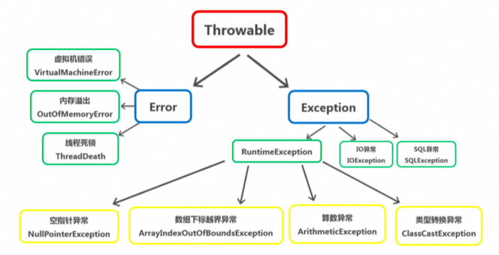
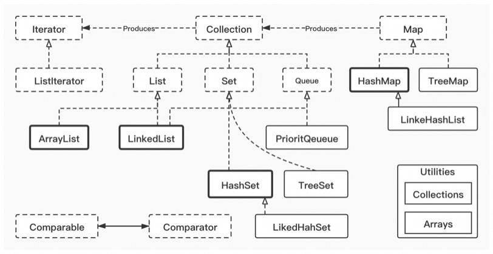
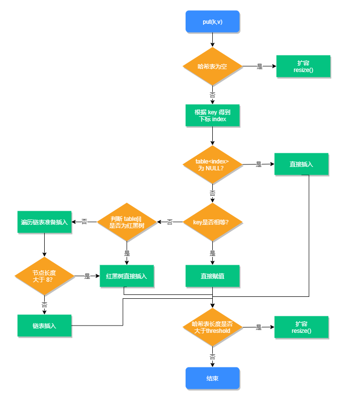
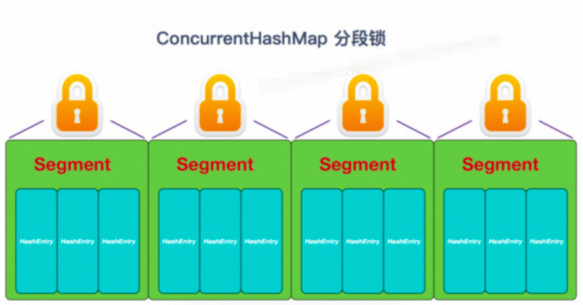
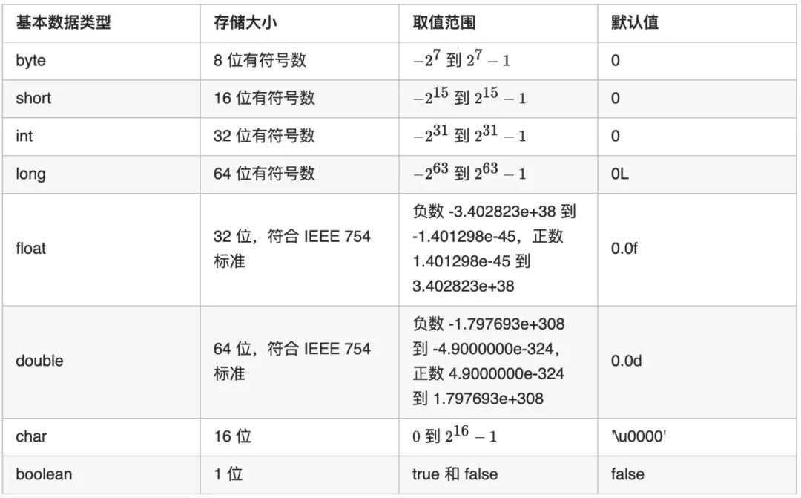
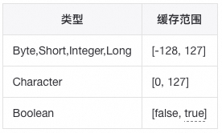

# Java基础篇

Java基础

**面向对象三大特性**
**特性：**封装、继承、多态；
**封装：**对抽象的事物抽象化成一个对象，并对其对象的属性私有化，同时提供一些能被外界访问属性的方法；
**继承：**子类扩展新的数据域或功能，并复用父类的属性与功能，单继承，多实现；
**多态：**通过继承（多个⼦类对同⼀⽅法的重写）、也可以通过接⼝（实现接⼝并覆盖接⼝）；

#### 1、Java与C++区别
不同点：c++支持多继承，并且有指针的概念，由程序员自己管理内存；Java是单继承，可以用接口实现多继承，Java不提供指针来直接访问内存，程序内存更加安全，并且Java有JVM⾃动内存管理机制，不需要程序员⼿动释放⽆⽤内存。

#### 2、多态实现原理
多态的底层实现是动态绑定，即在运行时才把方法调用与方法实现关联起来。
**静态绑定与动态绑定：**
一种是在编译期确定，被称为静态分派，比如方法的重载；
一种是在运行时确定，被称为动态分派，比如方法的覆盖（重写）和接口的实现。
**多态的实现**
虚拟机栈中会存放当前方法调用的栈帧（局部变量表、操作栈、动态连接、返回地址）。多态的实现过程，就是方法调用动态分派的过程，如果子类覆盖了父类的方法，则在多态调用中，动态绑定过程会首先确定实际类型是子类，从而先搜索到子类中的方法。这个过程便是方法覆盖的本质。

#### 3、static和final关键字
**static：**可以修饰属性、方法
**static修饰属性：**
类级别属性，所有对象共享一份，随着类的加载而加载（只加载一次），先于对象的创建；可以使用类名直接调用。
**static修饰方法：**
随着类的加载而加载；可以使用类名直接调用；静态方法中，只能调用静态的成员，不可用this；
**final：**关键字主要⽤在三个地⽅：变量、⽅法、类。
**final修饰变量：**
如果是基本数据类型的变量，则其数值一旦在初始化之后便不能更改；
如果是引⽤类型的变量，则在对其初始化之后便不能再让其指向另⼀个对象。
**final修饰方法：**
把⽅法锁定，以防任何继承类修改它的含义（重写）；类中所有的private⽅法都隐式地指定为final。
**final修饰类：**
final修饰类时，表明这个类不能被继承。final类中的所有成员⽅法都会被隐式地指定为final⽅法。
一个类不能被继承，除了final关键字之外，还有可以私有化构造器。（内部类无效）

#### 4、抽象类和接口
**抽象类：**包含抽象方法的类，即使用abstract修饰的类；抽象类只能被继承，所以不能使用final修饰，抽象类不能被实例化；
**接口：**接口是一个抽象类型，是抽象方法的集合，接口支持多继承，接口中定义的方法，默认是public abstract修饰的抽象方法；
**相同点：**
①抽象类和接口都不能被实例化；
②抽象类和接口都可以定义抽象方法，子类/实现类必须覆写这些抽象方法；
**不同点：**
①抽象类有构造方法，接口没有构造方法；
③抽象类可以包含普通方法，接口中只能是public abstract修饰抽象方法（Java8之后可以）；
③抽象类只能单继承，接口可以多继承；
④抽象类可以定义各种类型的成员变量，接口中只能是public static final修饰的静态常量；
**抽象类的使用场景：**
既想约束子类具有共同的行为（但不在乎其如何实现），又想拥有缺省的方法，又能拥有实例变量；
**接口的应用场景：**
约束多个实现类具有统一的行为，但是不在乎每个实现类如何具体实现；实现类中各个功能之间可能没有任何联系；

#### 5、泛型以及泛型擦除
参考：https://blog.csdn.net/baoyinwang/article/details/107341997
**泛型：**
泛型的本质是参数化类型。这种参数类型可以用在类、接口和方法的创建中，分别称为泛型类、泛型接口和泛型方法。
**泛型擦除：**
Java的泛型是伪泛型，使用泛型的时候加上类型参数，在编译器编译生成的字节码的时候会去掉，这个过程成为类型擦除。
如List等类型，在编译之后都会变成List。JVM看到的只是List，而由泛型附加的类型信息对JVM来说是不可见的。
可以通过反射添加其它类型元素。

#### 6、反射原理以及使用场景
**Java反射：**
是指在运行状态中，对于任意一个类都能够知道这个类所有的属性和方法；并且都能够调用它的任意一个方法；
**反射原理：**
反射首先是能够获取到Java中的反射类的字节码，然后将字节码中的方法，变量，构造函数等映射成相应的Method、Filed、Constructor等类。
如何得到Class的实例:
```
1.类名.class(就是一份字节码)2.Class.forName(String className);根据一个类的全限定名来构建Class对象3.每一个对象多有getClass()方法:obj.getClass();返回对象的真实类型
```
使用场景：

- **开发通用框架**-反射最重要的用途就是开发各种通用框架。很多框架（比如 Spring）都是配置化的（比如通过XML文件配置JavaBean、Filter等），为了保证框架的通用性，需要根据配置文件运行时动态加载不同的对象或类，调用不同的方法。
- **动态代理**-在切面编程（AOP）中，需要拦截特定的方法，通常，会选择动态代理方式。这时，就需要反射技术来实现了。JDK：spring默认动态代理，需要实现接口；CGLIB：通过asm框架序列化字节流，可配置，性能差；
- **自定义注解**-注解本身仅仅是起到标记作用，它需要利用反射机制，根据注解标记去调用注解解释器，执行行为。

#### 7、Java异常体系

Throwable是Java语言中所有错误或异常的超类。下一层分为Error 和Exception。
**Error：**
是指java运行时系统的内部错误和资源耗尽错误。应用程序不会抛出该类对象。如果出现了这样的错误，除了告知用户，剩下的就是尽力使程序安全的终止。
**Exception包含：RuntimeException、CheckedException；**
编程错误可以分成三类：语法错误、逻辑错误和运行错误。
**语法错误**（也称编译错误）是在编译过程中出现的错误，由编译器检查发现语法错误。
**逻辑错误**指程序的执行结果与预期不符，可以通过调试定位并发现错误的原因。
**运行错误**是引起程序非正常终端的错误，需要通过异常处理的方式处理运行错误。
**RuntimeException：**运行时异常，程序应该从逻辑角度尽可能避免这类异常的发生。
如NullPointerException、ClassCastException ；
**CheckedException：**受检异常，程序使用trycatch进行捕捉处理；
如IOException、SQLException、NotFoundException；

**数据结构**


#### 1、ArrayList和LinkedList
**ArrayList：**
底层基于数组实现，支持对元素进行快速随机访问，适合随机查找和遍历，不适合插入和删除。（提一句实际上）
默认初始大小为10，当数组容量不够时，会触发扩容机制（扩大到当前的1.5倍），需要将原来数组的数据复制到新的数组中；当从ArrayList的中间位置插入或者删除元素时，需要对数组进行复制、移动、代价比较高。
**LinkedList：**
底层基于双向链表实现，适合数据的动态插入和删除；
内部提供了List接口中没有定义的方法，用于操作表头和表尾元素，可以当作堆栈、队列和双向队列使用。（比如jdk官方推荐使用基于linkedList的Deque进行堆栈操作）
**ArrayList与LinkedList区别：**
都是线程不安全的，ArrayList适用于查找的场景，LinkedList适用于增加、删除多的场景。
**实现线程安全：**
可以使用原生的Vector，或者是Collections.synchronizedList(List list)函数返回一个线程安全的ArrayList集合。
建议使用concurrent并发包下的**CopyOnWriteArrayList**的。
①**Vector:**底层通过synchronize修饰保证线程安全，效率较差。
②**CopyOnWriteArrayList**：写时加锁，使用了一种叫**写时复制**的方法；读操作是可以不用加锁的。

#### 2、List遍历快速和安全失败
**①普通for循环遍历List删除指定元素**
```
for(int i=0; i < list.size(); i++){   if(list.get(i) == 5)        list.remove(i);}
```
**② 迭代遍历,用list.remove(i)方法删除元素**
```
Iterator<Integer> it = list.iterator();while(it.hasNext()){    Integer value = it.next();    if(value == 5){        list.remove(value);    }}
```
**③foreach遍历List删除元素**
```
for(Integer i:list){    if(i==3) list.remove(i);}
```
**fail—fast：**快速失败
当异常产生时，直接抛出异常，程序终止。
fail-fast主要是体现在当我们在遍历集合元素的时候，经常会使用迭代器，但在迭代器遍历元素的过程中，如果集合的结构（modCount）被改变的话，就会抛出异常ConcurrentModificationException，防止继续遍历。这就是所谓的快速失败机制。
**fail—safe：**安全失败
采用安全失败机制的集合容器，在遍历时不是直接在集合内容上访问的，而是先复制原有集合内容，在拷贝的集合上进行遍历。由于在遍历过程中对原集合所作的修改并不能被迭代器检测到，所以不会触发ConcurrentModificationException。
缺点：基于拷贝内容的优点是避免了ConcurrentModificationException，但同样地，迭代器并不能访问到修改后的内容，即：迭代器遍历的是开始遍历那一刻拿到的集合拷贝，在遍历期间原集合发生的修改迭代器是不知道的。
场景：java.util.concurrent包下的容器都是安全失败，可以在多线程下并发使用，并发修改。

#### 3、详细介绍HashMap
**角度：**数据结构+扩容情况+put查找的详细过程+哈希函数+容量为什么始终都是2^N，JDK1.7与1.8的区别。
参考：https://www.jianshu.com/p/9fe4cb316c05
**数据结构：**
HashMap在底层数据结构上采用了数组＋链表＋红黑树，通过散列映射来存储键值对数据。
**扩容情况：**
默认的负载因子是0.75，如果数组中已经存储的元素个数大于数组长度的75%，将会引发扩容操作。
【1】创建一个长度为原来数组长度**两倍的新数组**。
【2】1.7采用Entry的重新hash运算，1.8采用高于运算。
put操作步骤： 


1、判断数组是否为空，为空进行初始化;
2、不为空，则计算 key的hash值，通过(n - 1) & hash计算应当存放在数组中的下标 index;
3、查看table[index] 是否存在数据，没有数据就构造一个Node节点存放在 table[index] 中；
4、存在数据，说明发生了hash冲突(存在二个节点key的hash值一样), 继续判断key是否相等，相等，用新的value替换原数据；
5、若不相等，判断当前节点类型是不是树型节点，如果是树型节点，创造树型节点插入红黑树中；
6、若不是红黑树，创建普通Node加入链表中；判断链表长度是否大于8，大于则将链表转换为红黑树；
7、插入完成之后判断当前节点数是否大于阈值，若大于，则扩容为原数组的二倍；
**哈希函数：**
通过hash函数（优质因子31循环累加）先拿到key的hashcode，是一个32位的值，然后让hashcode的高16位和低16位进行异或操作。该函数也称为扰动函数，做到尽可能降低hash碰撞，通过尾插法进行插入。
**容量为什么始终都是2^N：**
先做对数组的⻓度取模运算，得到的余数才能⽤来要存放的位置也就是对应的数组下标。这个数组下标的计算⽅法是“ (n - 1) & hash ”。（n代表数组⻓度）。方便数组的扩容和增删改时的取模。
**JDK1.7与1.8的区别：**
JDK1.7 HashMap：
底层是 **数组和链表** 结合在⼀起使⽤也就是链表散列。如果相同的话，直接覆盖，不相同就通过拉链法解决冲突。扩容翻转时顺序不一致使用头插法会产生死循环，导致cpu100%
JDK1.8 HashMap：
底层数据结构上采用了**数组＋链表＋红黑树**；当链表⻓度⼤于阈值（默认为 8-泊松分布），数组的⻓度大于 64时，链表将转化为红⿊树，以减少搜索时间。（解决了tomcat臭名昭著的url参数dos攻击问题）

#### 4、ConcurrentHashMap 
可以通过**ConcurrentHashMap**和**Hashtable**来实现线程安全；Hashtable 是原始API类，通过synchronize同步修饰，效率低下；ConcurrentHashMap通过分段锁实现，效率较比Hashtable要好。
**ConcurrentHashMap的底层实现：**
**JDK1.7的ConcurrentHashMap**底层采⽤ 分段的数组+链表 实现；采用 **分段锁**（Sagment） 对整个桶数组进⾏了分割分段(Segment默认16个)，每⼀把锁只锁容器其中⼀部分数据，多线程访问容器⾥不同数据段的数据，就不会存在锁竞争，提⾼并发访问率。

**JDK1.8的 ConcurrentHashMap**采⽤的数据结构跟HashMap1.8的结构⼀样，数组+链表/红⿊树；摒弃了Segment的概念，⽽是直接⽤ Node 数组+链表+红⿊树的数据结构来实现，通过并发控制**synchronized**和**CAS**来操作保证线程的安全。

#### 5、序列化和反序列化
序列化的意思就是将对象的状态转化成字节流，以后可以通过这些值再生成相同状态的对象。对象序列化是对象持久化的一种实现方法，它是将对象的属性和方法转化为一种序列化的形式用于存储和传输。反序列化就是根据这些保存的信息重建对象的过程。
**序列化：**将java对象转化为字节序列的过程。
**反序列化：**将字节序列转化为java对象的过程。 
**优点：**
a、实现了数据的持久化，通过序列化可以把数据永久地保存到硬盘上（通常存放在文件里）Redis的RDB
b、利用序列化实现远程通信，即在网络上传送对象的字节序列。Google的protoBuf。
**反序列化失败的场景：**
序列化ID：serialVersionUID不一致的时候，导致反序列化失败。

#### 6、String
String使用**数组**存储内容，数组使用**final**修饰，因此String定义的字符串的值也是**不可变的。**
StringBuffer对方法加了同步锁，线程安全，效率略低于StringBuilder。

**设计模式与原则**

#### 1、单例模式
某个类只能生成一个实例，该实例全局访问，例如Spring容器里一级缓存里的单例池。
**优点：**
**唯一访问：**如生成唯一序列化的场景、或者spring默认的bean类型。
**提高性能：**频繁实例化创建销毁或者耗时耗资源的场景，如连接池、线程池。
**缺点：**
不适合有状态且需变更的；
**实现方式：**
**饿汉式：**线程安全速度快；
**懒汉式：**双重检测锁，第一次减少锁的开销、第二次防止重复、volatile防止重排序导致实例化未完成；
**静态内部类：**线程安全利用率高；
**枚举：**effictiveJAVA推荐，反射也无法破坏；

#### 2、工厂模式
定义一个用于创建产品的接口，由子类决定生产何种产品。
**优点：**解耦：提供参数即可获取产品，通过配置文件可以不修改代码增加具体产品。
**缺点：**每增加一个产品就得新增一个产品类。

#### 3、抽象工厂模式
提供一个接口，用于创建相关或者依赖对象的家族，并由此进行约束。
**优点：**可以在类的内部对产品族进行约束。
**缺点：**假如产品族中需要增加一个新的产品，则几乎所有的工厂类都需要进行修改。
面试题

**构造方法**
构造方法可以被重载，只有当类中没有显性声明任何构造方法时，才会有默认构造方法。
构造方法没有返回值，构造方法的作用是创建新对象。

**初始化块**
静态初始化块的优先级最高，会最先执行，在非静态初始化块之前执行。
静态初始化块会在类第一次被加载时最先执行，因此在main方法之前。

**This**
关键字this代表当前对象的引用。当前对象指的是调用类中的属性或方法的对象。
关键字this不可以在静态方法中使用。静态方法不依赖于类的具体对象的引用。

**重写和重载的区别**
重载指在同一个类中定义多个方法，这些方法名称相同，签名不同。
重写指在子类中的方法的名称和签名都和父类相同，使用override注解。

**Object类方法**
**toString**默认是个指针，一般需要重写；
**equals**比较对象是否相同，默认和==功能一致；
**hashCode**散列码，equals则hashCode相同，所以重写equals必须重写hashCode；
**finalize**用于垃圾回收之前做的遗嘱，默认空，子类需重写；
**clone**深拷贝，类需实现cloneable的接口；
**getClass**反射获取对象元数据，包括类名、方法；
**notify、wait**用于线程通知和唤醒；

**基本数据类型和包装类**




> 原文: <https://www.yuque.com/tulingzhouyu/db22bv/eivhfmeh91kchwio>