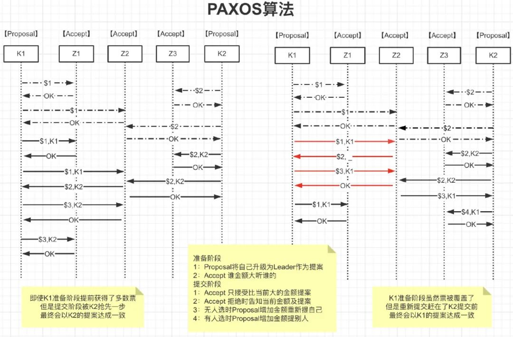
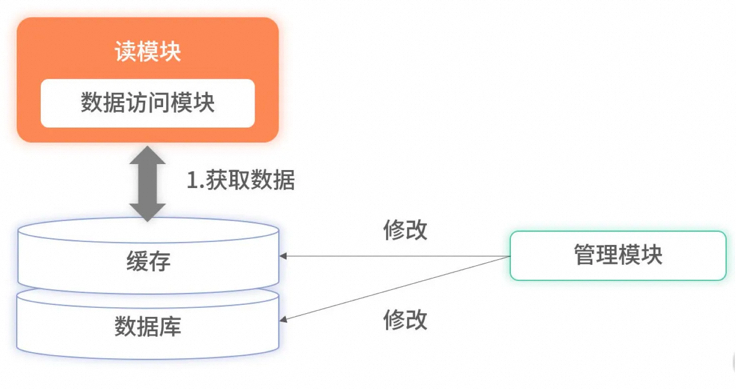
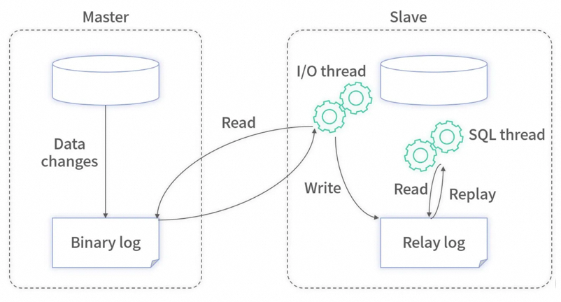
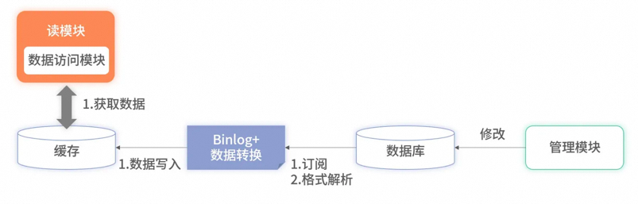
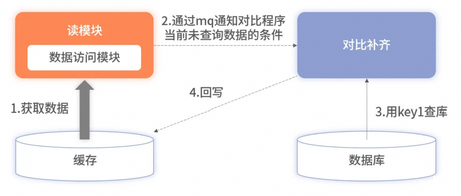
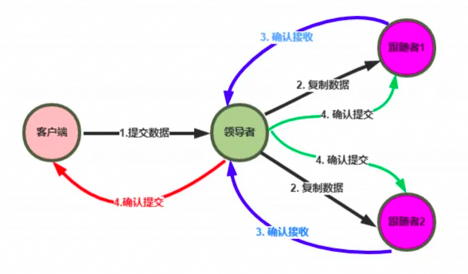
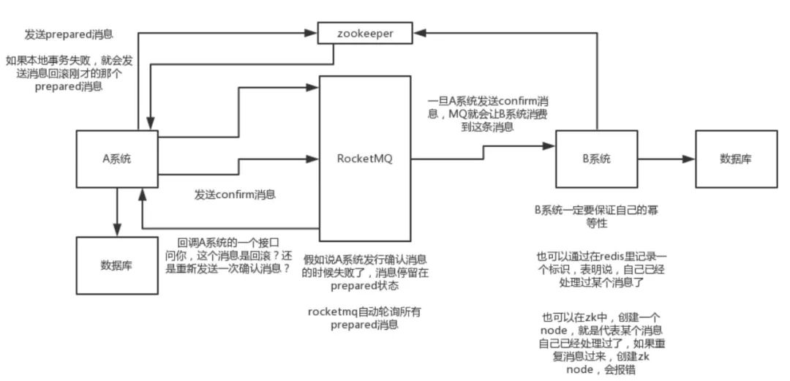

# 分布式篇

分布式系统是一个硬件或软件组件分布在不同的网络计算机上，彼此之间仅仅通过消息传递进行通信和协调的系统。
发展历程

- 入口级负载均衡
   - 网关负载均衡
   - 客户端负载均衡
- 单应用架构
   - 应用服务和数据服务分离
   - 应用服务集群
   - 应用服务中心化SAAS
- 数据库主备读写分离
   - 全文搜索引擎加快数据统计
   - 缓存集群缓解数据库读压力
   - 分布式消息中间件缓解数据库写压力
   - 数据库水平拆分适应微服务
   - 数据库垂直拆分解决慢查询
- 划分上下文拆分微服务
   - 服务注册发现（Eureka、Nacos）
   - 配置动态更新（Config、Apollo）
   - 业务灰度发布（Gateway、Feign）
   - 统一安全认证（Gateway、Auth）
   - 服务降级限流（Hystrix、Sentinel）
   - 接口检查监控（Actuator、Prometheus）
   - 服务全链路追踪（Sleuth、Zipkin）

CAP

- **一致性**（2PC、3PC、Paxos、Raft）
   - 强一致性：**数据库一致性**，牺牲了性能
   - **ACID：**原子性、一致性、隔离性、持久性
   - 弱一致性：**数据库和缓存，延迟双删、重试**
   - 单调读一致性：**缓存一致性**，ID或者IP哈希
   - 最终一致性：**边缘业务**，消息队列
- **可用性**（多级缓存、读写分离）
   - **BASE** 基本可用：限流导致响应速度慢、降级导致用户体验差
   - Basically Availabe 基本可用 
   - Soft state 软状态
   - Eventual Consistency 最终一致性
- 分区容忍性（一致性Hash解决扩缩容问题）

一致性

**XA方案**
**2PC**协议：两阶段提交协议，P是指**准备**阶段，C是指**提交**阶段

- 准备阶段：询问是否可以开始，写Undo、Redo日志，收到响应；
- 提交阶段：执行Redo日志进行Commit，执行Undo日志进行Rollback；

**3PC**协议：将提交阶段分为**CanCommit、PreCommit、DoCommit**三个阶段
**CanCommit**：发送canCommit请求，并开始等待；
**PreCommit**：收到全部Yes，写Undo、Redo日志。超时或者No，则中断；
**DoCommit**：执行Redo日志进行**Commit**，执行Undo日志进行**Rollback；**
区别是第二步，参与者**自身增加了超时，如果失败可以及时释放资源。**

**Paxos算法**
如何在一个发生异常的分布式系统中，快速且正确地在集群内部对某个数据的值达成一致。
参与者（例如Kafka）的一致性可以由协调者（例如Zookeeper）来保证，协调者的一致性就只能由Paxos保证了
Paxos算法中的角色：

- **Client：**客户端、例如，对分布式文件服务器中文件的写请求。
- **Proposer**：提案发起者，根据Accept返回选择最大N对应的V，发送[N+1,V]
- **Acceptor**：决策者，Accept以后会拒绝小于N的提案，并把自己的[N,V]返回给Proposer
- **Learners**：最终决策的学习者、学习者充当该协议的复制因素
```
//算法约束P1:一个Acceptor必须接受它收到的第一个提案。//考虑到半数以上才作数，一个Accpter得接受多个相同v的提案P2a:如果某个v的提案被accept，那么被Acceptor接受编号更高的提案必须也是vP2b:如果某个v的提案被accept，那么从Proposal提出编号更高的提案必须也是v//如何确保v的提案Accpter被选定后，Proposal都能提出编号更高的提案呢针对任意的[Mid,Vid]，有半数以上的Accepter集合S，满足以下二选一：S中接受的提案都大于Mid  S中接受的提案若小于Mid，编号最大的那个值为Vid
```

面试题：如何保证Paxos算法活性
假设存在这样一种极端情况，有两个Proposer依次提出了一系列编号递增的提案，导致最终陷入死循环，没有value被选定：

- **通过选取主Proposer**，规定只有主Proposer才能提出议案。只要主Proposer和过半的Acceptor能够正常网络通信，主Proposer提出一个编号更高的提案，该提案终将会被批准；
- 每个Proposer发送提交提案的时间设置为**一段时间内随机**，保证不会一直死循环；


**Raft算法**
Raft 是一种为了管理复制日志的一致性算法
Raft使用**心跳机制**来触发选举。当server启动时，初始状态都是**follower**。每一个server都有一个定时器，超时时间为election timeout（**一般为150-300ms**），如果某server**没有超时的情况**下收到来自领导者或者候选者的任何消息，**定时器重启**，如果超时，它就**开始一次选举**。
**Leader异常**：异常期间Follower会超时选举，完成后Leader比较彼此步长
**Follower异常**：恢复后直接同步至Leader当前状态
**多个Candidate**：选举时失败，失败后超时继续选举

**数据库和Redis的一致性**
全量缓存保证高效读取

所有数据都存储在缓存里，读服务在查询时不会再降级到数据库里，所有的请求都完全依赖缓存。此时，因降级到数据库导致的毛刺问题就解决了。但全量缓存并**没有解决更新时的分布式事务**问题，反而把问题放大了。因为全量缓存**对数据更新要求更加严格**，要求所有数据库**已有数据和实时更新**的数据必须完全同步至缓存，不能有遗漏。对于此问题，一种有效的方案是采用**订阅数据库的 Binlog **实现数据同步。

现在很多开源工具（如阿里的 Canal等）可以模拟主从复制的协议。通过模拟协议读取主数据库的 Binlog 文件，从而获取主库的所有变更。对于这些变更，它们开放了各种接口供业务服务获取数据。

将 Binlog 的中间件挂载至目标数据库上，就可以**实时获取该数据库的所有变更数据**。对这些变更数据解析后，便可**直接写入缓存里**。优点还有：

- 大幅提升了读取的速度，降低了延迟；
- Binlog 的主从复制是基于 **ACK** 机制， 解决了分布式事务的问题；如果同步缓存失败了，被消费的 Binlog 不会被确认，下一次会重复消费，数据最终会写入缓存中；

**缺点**不可避免：1、增加复杂度 2、消耗缓存资源 3、需要筛选和压缩数据 4、极端情况数据丢失；

可以通过异步校准方案进行补齐，但是会损耗数据库性能。但是此方案会隐藏中间件使用错误的细节，线上环境前期更重要的是记录日志排查再做后续优化，不能本末倒置。
可用性

**心跳检测**
以**固定的频率**向其他节点汇报当前节点状态的方式。收到心跳，说明网络和节点的状态是健康的。心跳汇报时，一般会携带一些附加的**状态、元数据，以便管理**。
**周期检测心跳机制**：超时未返回
**累计失效检测机制**：重试超次数

**多机房实时热备**

两套缓存集群可以分别部署到不同城市的机房。读服务也相应地部署到不同城市或不同分区。在承接请求时，不同机房或分区的读服务只依赖同样属性的缓存集群。此方案有两个好处。

1. **提升了性能**。读服务不要分层，读服务要尽可能地和缓存数据源靠近。
2. **增加了可用**。当单机房出现故障时，可以秒级将所有流量都切换至存活的机房或分区。

此方案虽然带来了性能和可用性的提升，但代价是资源成本的上升。
分区容错性
分布式系统对于错误包容的能力
通过限流、降级、兜底、重试、负载均衡等方式增强系统的健壮性

**日志复制**


1. **Leader**把指令添加到日志中，发起 RPC 给其他的服务器，让他们复制这条信息；
2. **Leader**会不断的重试，直到所有的 Follower响应了ACK并复制了所有的日志条目；
3. 通知所有的**Follower**提交，同时Leader该表这条日志的状态，并返回给客户端；


**主备（Master-Slave）**
主机宕机时，备机接管主机的一切工作，主机恢复正常后，以自动（热备）或手动（冷备）方式将服务切换到主机上运行，**Mysql**和**Redis**中常用。
MySQL之间数据复制的基础是**二进制日志文件**（binary log fifile）。它的数据库中所有操作都会以“事件”的方式记录在二进制日志中，其他数据库作为slave通过一个**I/O线程与主服务器保持通信**，并**监控**master的二进制日志文件的变化，如果发现master二进制日志文件发生变化，则会把变化复制到自己的**中继日志**中，然后slave的一个SQL线程会把相关的“事件”执行到自己的数据库中，以此实现从数据库和主数据库的**一致性**，也就实现了**主从复制。**

**互备（Active-Active）**
指两台主机同时运行各自的服务工作且**相互监测**情况。在数据库高可用部分，常见的互备是**MM**模式。MM模式即**Multi-Master**模式，指一个系统存在多个master，每个master都具有**read-write**能力，会根据**时间戳或业务逻辑**合并版本。

**集群（Cluster）模式**
是指有多个节点在运行，同时可以通过主控节点**分担服务**请求。如Zookeeper。集群模式需要解决主控节点**本身的高可用**问题，一般采用主备模式。
分布式事务

**XA方案**
两阶段提交 | 三阶段提交

- 准备阶段的资源锁定，存在性能问题，严重时会造成死锁问题；
- 提交事务请求后，出现网络异常，部分数据收到并执行，会造成一致性问；


**TCC方案**
Try Confirm Cancel / 短事务

- **Try** 阶段：这个阶段说的是对各个服务的资源做检测以及对资源进行**锁定或者预留；**
- **Confirm** 阶段：这个阶段说的是在各个服务中**执行实际的操作；**
- **Cancel **阶段：如果任何一个服务的业务方法执行出错，那么就需要**进行补偿**/回滚；


**Saga方案**
事务性补偿 / 长事务

- 流程长、流程多、调用第三方业务


**本地消息表（eBay）**

**MQ最终一致性**

比如阿里的 RocketMQ 就支持消息事务（核心：**双端确认，重试幂**等）

1. A(订单) 系统先发送一个 **prepared** 消息到 mq，prepared 消息发送失败则取消操作不执行了；
2. 发送成功后，那么执行本地事务，执行成功和和失败发送**确认和回滚**消息到mq；
3. 如果发送了确认消息，那么此时 B**(仓储)** 系统会接收到确认消息，然后执行本地的事务；
4. mq 会自动**定时轮询**所有 prepared 消息回调的接口，确认事务执行状态；
5. B 的事务失败后自动**不断重试**直到成功，达到一定次数后发送报警由人工来手工回滚和补偿；


**最大努力通知方案（订单 -> 积分）**

1. 系统 A 本地事务执行完之后，发送个消息到 MQ；
2. 这里会有个专门消费 MQ 的**最大努力通知服务**，接着调用系统 B 的接口；
3. 要是系统 B 执行失败了，就定时尝试重新调用系统 B，反复 N 次，最后还是不行就放弃；

你找一个严格**资金**要求绝对不能错的场景，你可以说你是用的 **TCC 方案**；
如果是一般的分布式事务场景，例如积分数据，可以用可靠消息**最终一致性方案。**
如果分布式场景**允许不一致**，可以使用最大努力通知方案。
面试题
**分布式Session实现方案**

- 基于JWT的Token，数据从cache或者数据库中获取；
- 基于Tomcat的Redis，简单配置conf文件；
- 基于Spring的Redis，支持SpringCloud和Springboot；


> 原文: <https://www.yuque.com/tulingzhouyu/db22bv/trxy9wdwidr0mw62>